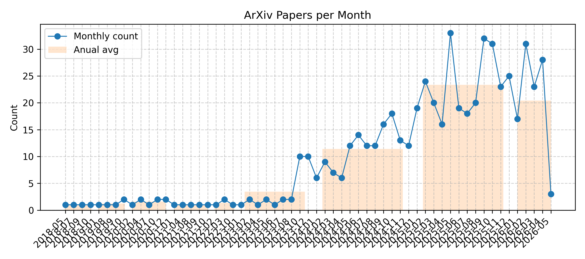

[![Contributors][contributors-shield]][contributors-url]
[![Forks][forks-shield]][forks-url]
[![Stargazers][stars-shield]][stars-url]
[![Issues][issues-shield]][issues-url]

For more carefully curated articles, you can refer to this [repository](https://github.com/bansky-cl/Mobile_NPU_LLM_Papers).

## Updated on 2026.02.07

## mobile_npu_llm

|Date|Title|label|Abstract|PDF|Code|
|---|---|---|---|---|---|
|**2025-12-17**|**Accelerating Mobile Language Model via Speculative Decoding and NPU-Coordinated Execution**|cs.CL| 

Full Abstract
Performing Retrieval-Augmented Generation (RAG) directly on mobile devices is promising for data privacy and responsiveness but is hindered by the architectural constraints of mobile NPUs. Specifically, current hardware struggles with the variable workloads intrinsic to RAG: the transition between processing extensive contexts and generating tokens incurs significant overhead due to static graph constraints, while the memory-bound generation phase leaves computational resources underutilized.   In this work, we propose a holistic acceleration framework sd.npu, designed to maximize NPU efficiency for on-device RAG ecosystem. To address the latency caused by NPU graph switching during phase transitions, we introduce a pipelined execution strategy. This approach masks the overhead of model reconfiguration by parallelizing the loading of decoding graphs with the computation of partitioned context chunks (chunked prefill), thereby ensuring continuous execution flow. Furthermore, to mitigate low hardware utilization during the decoding phase, we develop an NPU-centric speculative decoding mechanism. By calibrating generation distributions and extending draft sequences, our method effectively converts idle NPU cycles into valid token throughput. Experiments on commercial smartphones show that our framework significantly outperforms existing baselines, delivering 1.06$\times$--3.81$\times$ speedups and 1.07$\times$--4.71$\times$ energy savings across various RAG tasks.
|[2510.15312v4](http://arxiv.org/abs/2510.15312v4)| null|
|**2025-09-27**|**Scaling LLM Test-Time Compute with Mobile NPU on Smartphones**|cs.DC, cs.AI| 

Full Abstract
Deploying Large Language Models (LLMs) on mobile devices faces the challenge of insufficient performance in smaller models and excessive resource consumption in larger ones. This paper highlights that mobile Neural Processing Units (NPUs) have underutilized computational resources, particularly their matrix multiplication units, during typical LLM inference. To leverage this wasted compute capacity, we propose applying parallel test-time scaling techniques on mobile NPUs to enhance the performance of smaller LLMs. However, this approach confronts inherent NPU challenges, including inadequate hardware support for fine-grained quantization and low efficiency in general-purpose computations. To overcome these, we introduce two key techniques: a hardware-aware tile quantization scheme that aligns group quantization with NPU memory access patterns, and efficient LUT-based replacements for complex operations such as Softmax and dequantization. We design and implement an end-to-end inference system that leverages the NPU's compute capability to support test-time scaling on Qualcomm Snapdragon platforms. Experiments show our approach brings significant speedups: up to 19.0 for mixed-precision GEMM and 2.2 for Softmax. More importantly, we demonstrate that smaller models using test-time scaling can match or exceed the accuracy of larger models, achieving a new performance-cost Pareto frontier.
|[2509.23324v1](http://arxiv.org/abs/2509.23324v1)| null|
|**2024-12-15**|**Fast On-device LLM Inference with NPUs**|cs.AI| 

Full Abstract
On-device inference for Large Language Models (LLMs), driven by increasing privacy concerns and advancements of mobile-sized models, has gained significant interest. However, even mobile-sized LLMs (e.g., Gemma-2B) encounter unacceptably high inference latency, often bottlenecked by the prefill stage in tasks like screen UI understanding.   We present llm.npu, the first LLM inference system utilizing on-device Neural Processing Unit (NPU) offloading to reduce prefill latency. llm.npu enhances NPU offloading efficiency by re-constructing the prompt and model in three levels: (1) At prompt level, it divides variable-length prompts into multiple fixed-sized chunks while maintaining data dependencies; (2) At tensor level, it identifies and extracts significant outliers to run on the CPU/GPU in parallel with minimal overhead; (3) At block level, it schedules Transformer blocks in an out-of-order manner to the CPU/GPU and NPU based on their hardware affinity and sensitivity to accuracy. Compared to competitive baselines, llm.npu achieves 22.4x faster prefill speed and 30.7$\times$ energy savings on average, and up to 32.8x speedup in an end-to-end real-world application. For the first time, llm.npu achieves more than 1,000 tokens/sec prefilling for a billion-sized model.
|[2407.05858v2](http://arxiv.org/abs/2407.05858v2)| null|

(<a href=#Updated-on-20260207>back to top</a>)

## mobile_optimization

|Date|Title|label|Abstract|PDF|Code|
|---|---|---|---|---|---|
|**2026-01-24**|**Clustering-driven Memory Compression for On-device Large Language Models**|cs.CL, cs.AI, cs.LG| 

Full Abstract
Large language models (LLMs) often rely on user-specific memories distilled from past interactions to enable personalized generation. A common practice is to concatenate these memories with the input prompt, but this approach quickly exhausts the limited context available in on-device LLMs. Compressing memories by averaging can mitigate context growth, yet it frequently harms performance due to semantic conflicts across heterogeneous memories. In this work, we introduce a clustering-based memory compression strategy that balances context efficiency and personalization quality. Our method groups memories by similarity and merges them within clusters prior to concatenation, thereby preserving coherence while reducing redundancy. Experiments demonstrate that our approach substantially lowers the number of memory tokens while outperforming baseline strategies such as naive averaging or direct concatenation. Furthermore, for a fixed context budget, clustering-driven merging yields more compact memory representations and consistently enhances generation quality.
|[2601.17443v1](http://arxiv.org/abs/2601.17443v1)| null|
|**2026-01-13**|**AgenticTCAD: A LLM-based Multi-Agent Framework for Automated TCAD Code Generation and Device Optimization**|cs.SE, cs.AI| 

Full Abstract
With the continued scaling of advanced technology nodes, the design-technology co-optimization (DTCO) paradigm has become increasingly critical, rendering efficient device design and optimization essential. In the domain of TCAD simulation, however, the scarcity of open-source resources hinders language models from generating valid TCAD code. To overcome this limitation, we construct an open-source TCAD dataset curated by experts and fine-tune a domain-specific model for TCAD code generation. Building on this foundation, we propose AgenticTCAD, a natural language - driven multi-agent framework that enables end-to-end automated device design and optimization. Validation on a 2 nm nanosheet FET (NS-FET) design shows that AgenticTCAD achieves the International Roadmap for Devices and Systems (IRDS)-2024 device specifications within 4.2 hours, whereas human experts required 7.1 days with commercial tools.
|[2512.23742v2](http://arxiv.org/abs/2512.23742v2)| null|
|**2025-12-06**|**Optimizing LLMs Using Quantization for Mobile Execution**|cs.LG| 

Full Abstract
Large Language Models (LLMs) offer powerful capabilities, but their significant size and computational requirements hinder deployment on resource-constrained mobile devices. This paper investigates Post-Training Quantization (PTQ) for compressing LLMs for mobile execution. We apply 4-bit PTQ using the BitsAndBytes library with the Hugging Face Transformers framework to Meta's Llama 3.2 3B model. The quantized model is converted to GGUF format using llama.cpp tools for optimized mobile inference. The PTQ workflow achieves a 68.66% reduction in model size through 4-bit quantization, enabling the Llama 3.2 3B model to run efficiently on an Android device. Qualitative validation shows that the 4-bit quantized model can perform inference tasks successfully. We demonstrate the feasibility of running the quantized GGUF model on an Android device using the Termux environment and the Ollama framework. PTQ, especially at 4-bit precision combined with mobile-optimized formats like GGUF, provides a practical pathway for deploying capable LLMs on mobile devices, balancing model size and performance.
|[2512.06490v1](http://arxiv.org/abs/2512.06490v1)| null|
|**2025-11-27**|**TinyLLM: Evaluation and Optimization of Small Language Models for Agentic Tasks on Edge Devices**|cs.LG| 

Full Abstract
This paper investigates the effectiveness of small language models (SLMs) for agentic tasks (function/tool/API calling) with a focus on running agents on edge devices without reliance on cloud infrastructure. We evaluate SLMs using the Berkeley Function Calling Leaderboard (BFCL) framework and describe parameter-driven optimization strategies that include supervised fine-tuning (SFT), parameter-efficient fine-tuning (PEFT), reinforcement learning (RL)-based optimization, preference alignment via Direct Preference Optimization (DPO), and hybrid methods. We report results for models including TinyAgent, TinyLlama, Qwen, and xLAM across BFCL categories (simple, multiple, parallel, parallel-multiple, and relevance detection), both in live and non-live settings, and in multi-turn evaluations. We additionally detail a DPO training pipeline constructed from AgentBank data (e.g., ALFRED), including our conversion of SFT data to chosen-rejected pairs using TinyLlama responses as rejected outputs and manual validation. Our results demonstrate clear accuracy differences across model scales where medium-sized models (1-3B parameters) significantly outperform ultra-compact models (<1B parameters), achieving up to 65.74% overall accuracy, and 55.62% multi-turn accuracy with hybrid optimization. This study highlights the importance of hybrid optimization strategies that enable small language models to deliver accurate, efficient, and stable agentic AI on edge devices, making privacy-preserving, low-latency autonomous agents practical beyond the cloud.
|[2511.22138v1](http://arxiv.org/abs/2511.22138v1)| null|
|**2025-11-25**|**ELUTQ: Efficient LUT-Aware Quantization for Deploying Large Language Models on Edge Devices**|cs.LG| 

Full Abstract
Weight quantization effectively reduces memory consumption and enables the deployment of large language models on CPU-based edge devices, yet existing hardware-friendly methods often rely on uniform quantization, which suffers from poor weight-distribution fitting and high dequantization overhead under low-bit settings. In this paper, we propose ELUTQ, an efficient quantization framework featuring a novel quantization format termed Hierarchical Linear Quantization (HLQ). HLQ is designed to better capture the statistical characteristics of weights without increasing the computational cost of bit-serial LUT-based GEMM operations, thereby eliminating dequantization overhead. HLQ is orthogonal to existing quantization algorithms. For the LLaMA3.1-8B model, when combined with post-training quantization, HLQ improves uniform quantization by achieving approximately 8 percent perplexity reduction at 3-bit precision and 85 percent perplexity reduction at 2-bit precision. When combined with efficient finetuning techniques, HLQ further improves model accuracy. We also integrate a disk-offload technique into ELUTQ, enabling it to complete the quantization of LLaMA3.1-70B using only 64 GB of CPU memory and 48 GB of VRAM, significantly reducing the hardware requirements for large-scale model quantization. To enable efficient deployment on edge devices, ELUTQ provides high-performance CPU kernels to support end-to-end inference. Under a 4-thread configuration with batch size 1, our 2-bit quantized LLaMA2-7B model achieves a throughput of more than 25 tokens per second on an Apple M2 chip. All the code is available at https://github.com/Nkniexin/ELUTQ.
|[2510.19482v2](http://arxiv.org/abs/2510.19482v2)| null|
|**2025-12-17**|**Accelerating Mobile Language Model via Speculative Decoding and NPU-Coordinated Execution**|cs.CL| 

Full Abstract
Performing Retrieval-Augmented Generation (RAG) directly on mobile devices is promising for data privacy and responsiveness but is hindered by the architectural constraints of mobile NPUs. Specifically, current hardware struggles with the variable workloads intrinsic to RAG: the transition between processing extensive contexts and generating tokens incurs significant overhead due to static graph constraints, while the memory-bound generation phase leaves computational resources underutilized.   In this work, we propose a holistic acceleration framework sd.npu, designed to maximize NPU efficiency for on-device RAG ecosystem. To address the latency caused by NPU graph switching during phase transitions, we introduce a pipelined execution strategy. This approach masks the overhead of model reconfiguration by parallelizing the loading of decoding graphs with the computation of partitioned context chunks (chunked prefill), thereby ensuring continuous execution flow. Furthermore, to mitigate low hardware utilization during the decoding phase, we develop an NPU-centric speculative decoding mechanism. By calibrating generation distributions and extending draft sequences, our method effectively converts idle NPU cycles into valid token throughput. Experiments on commercial smartphones show that our framework significantly outperforms existing baselines, delivering 1.06$\times$--3.81$\times$ speedups and 1.07$\times$--4.71$\times$ energy savings across various RAG tasks.
|[2510.15312v4](http://arxiv.org/abs/2510.15312v4)| null|
|**2025-10-25**|**Hierarchical Optimization via LLM-Guided Objective Evolution for Mobility-on-Demand Systems**|cs.AI| 

Full Abstract
Online ride-hailing platforms aim to deliver efficient mobility-on-demand services, often facing challenges in balancing dynamic and spatially heterogeneous supply and demand. Existing methods typically fall into two categories: reinforcement learning (RL) approaches, which suffer from data inefficiency, oversimplified modeling of real-world dynamics, and difficulty enforcing operational constraints; or decomposed online optimization methods, which rely on manually designed high-level objectives that lack awareness of low-level routing dynamics. To address this issue, we propose a novel hybrid framework that integrates large language model (LLM) with mathematical optimization in a dynamic hierarchical system: (1) it is training-free, removing the need for large-scale interaction data as in RL, and (2) it leverages LLM to bridge cognitive limitations caused by problem decomposition by adaptively generating high-level objectives. Within this framework, LLM serves as a meta-optimizer, producing semantic heuristics that guide a low-level optimizer responsible for constraint enforcement and real-time decision execution. These heuristics are refined through a closed-loop evolutionary process, driven by harmony search, which iteratively adapts the LLM prompts based on feasibility and performance feedback from the optimization layer. Extensive experiments based on scenarios derived from both the New York and Chicago taxi datasets demonstrate the effectiveness of our approach, achieving an average improvement of 16% compared to state-of-the-art baselines.
|[2510.10644v2](http://arxiv.org/abs/2510.10644v2)| null|
|**2025-10-10**|**CAFL-L: Constraint-Aware Federated Learning with Lagrangian Dual Optimization for On-Device Language Models**|cs.LG, cs.CL, cs.DC| 

Full Abstract
We introduce Constraint-Aware Federated Learning with Lagrangian Dual Optimization (CAFL-L), a principled extension of FedAvg that explicitly incorporates device-level resource constraints including energy, communication, memory, and thermal budgets. CAFL-L employs Lagrangian dual optimization to dynamically adapt training hyperparameters -- freezing depth, local steps, batch size, and communication compression -- while preserving training stability through token-budget preservation via gradient accumulation. Experiments on a character-level language model demonstrate that CAFL-L achieves superior constraint satisfaction compared to standard FedAvg (reducing memory usage by 20% and communication by 95%) while maintaining competitive validation performance, making it practical for deployment on resource-constrained edge devices.
|[2510.03298v2](http://arxiv.org/abs/2510.03298v2)| null|
|**2025-09-29**|**End-to-End On-Device Quantization-Aware Training for LLMs at Inference Cost**|cs.LG, cs.AI| 

Full Abstract
Quantization is an effective technique to reduce the deployment cost of large language models (LLMs), and post-training quantization (PTQ) has been widely studied due to its efficiency. However, existing PTQ methods are limited by their inability to fine-tune model parameters and often suffer significant accuracy loss in low-bit scenarios. Quantization-aware training (QAT) provides a more principled solution, but its reliance on backpropagation incurs prohibitive memory costs, limiting its practicality for LLM deployment. To address these challenges, we propose ZeroQAT, a zeroth-order optimization-based QAT framework that supports both weight and activation quantization. ZeroQAT leverages forward-only gradient estimation to eliminate backpropagation, substantially reducing computational and memory overhead while retaining the benefits of end-to-end optimization. We further introduce a lightweight variant of ZeroQAT for quantized fine-tuning, which freezes and pre-quantizes most parameters to further cut memory usage. Experiments show that ZeroQAT consistently outperforms representative PTQ and QAT baselines while requiring significantly less memory. For example, ZeroQAT enables fine-tuning of a 13B model at extremely low bit-widths (e.g., 2-4 bits) on a single 8GB GPU, and even allows fine-tuning a 6.7B model on a OnePlus 12 smartphone, demonstrating its practicality for end-to-end QAT on resource-limited edge devices.
|[2509.00031v2](http://arxiv.org/abs/2509.00031v2)| null|
|**2025-06-24**|**MNN-AECS: Energy Optimization for LLM Decoding on Mobile Devices via Adaptive Core Selection**|cs.OS, cs.AI, cs.PF, cs.SE| 

Full Abstract
As the demand for on-device Large Language Model (LLM) inference grows, energy efficiency has become a major concern, especially for battery-limited mobile devices. Our analysis shows that the memory-bound LLM decode phase dominates energy use, and yet most existing works focus on accelerating the prefill phase, neglecting energy concerns. We introduce Adaptive Energy-Centric Core Selection (AECS) and integrate it into MNN to create the energy-efficient version, MNN-AECS, the first engine-level system solution without requiring root access or OS modifications for energy-efficient LLM decoding. MNN-AECS is designed to reduce LLM decoding energy while keeping decode speed within an acceptable slowdown threshold by dynamically selecting low-power CPU cores. MNN-AECS is evaluated across 5 Android and 2 iOS devices on 5 popular LLMs of various sizes. Compared to original MNN, MNN-AECS cuts down energy use by 23% without slowdown averaged over all 7 devices and 4 datasets. Against other engines, including llama.cpp, executorch, mllm, and MediaPipe, MNN-AECS delivers 39% to 78% energy saving and 12% to 363% speedup on average.
|[2506.19884v1](http://arxiv.org/abs/2506.19884v1)| null|
|**2025-06-16**|**TensorSLM: Energy-efficient Embedding Compression of Sub-billion Parameter Language Models on Low-end Devices**|cs.CL, cs.LG, math.NA| 

Full Abstract
Small Language Models (SLMs, or on-device LMs) have significantly fewer parameters than Large Language Models (LLMs). They are typically deployed on low-end devices, like mobile phones and single-board computers. Unlike LLMs, which rely on increasing model size for better generalisation, SLMs designed for edge applications are expected to have adaptivity to the deployment environments and energy efficiency given the device battery life constraints, which are not addressed in datacenter-deployed LLMs. This paper addresses these two requirements by proposing a training-free token embedding compression approach using Tensor-Train Decomposition (TTD). Each pre-trained token embedding vector is converted into a lower-dimensional Matrix Product State (MPS). We comprehensively evaluate the extracted low-rank structures across compression ratio, language task performance, latency, and energy consumption on a typical low-end device, i.e. Raspberry Pi. Taking the sub-billion parameter versions of GPT-2/Cerebres-GPT and OPT models as examples, our approach achieves a comparable language task performance to the original model with around $2.0\times$ embedding layer compression, while the energy consumption of a single query drops by half.
|[2506.13514v1](http://arxiv.org/abs/2506.13514v1)| null|
|**2025-05-12**|**LiteLMGuard: Seamless and Lightweight On-Device Prompt Filtering for Safeguarding Small Language Models against Quantization-induced Risks and Vulnerabilities**|cs.CR, cs.LG| 

Full Abstract
The growing adoption of Large Language Models (LLMs) has influenced the development of their lighter counterparts-Small Language Models (SLMs)-to enable on-device deployment across smartphones and edge devices. These SLMs offer enhanced privacy, reduced latency, server-free functionality, and improved user experience. However, due to resource constraints of on-device environment, SLMs undergo size optimization through compression techniques like quantization, which can inadvertently introduce fairness, ethical and privacy risks. Critically, quantized SLMs may respond to harmful queries directly, without requiring adversarial manipulation, raising significant safety and trust concerns.   To address this, we propose LiteLMGuard (LLMG), an on-device prompt guard that provides real-time, prompt-level defense for quantized SLMs. Additionally, our prompt guard is designed to be model-agnostic such that it can be seamlessly integrated with any SLM, operating independently of underlying architectures. Our LLMG formalizes prompt filtering as a deep learning (DL)-based prompt answerability classification task, leveraging semantic understanding to determine whether a query should be answered by any SLM. Using our curated dataset, Answerable-or-Not, we trained and fine-tuned several DL models and selected ELECTRA as the candidate, with 97.75% answerability classification accuracy.   Our safety effectiveness evaluations demonstrate that LLMG defends against over 87% of harmful prompts, including both direct instruction and jailbreak attack strategies. We further showcase its ability to mitigate the Open Knowledge Attacks, where compromised SLMs provide unsafe responses without adversarial prompting. In terms of prompt filtering effectiveness, LLMG achieves near state-of-the-art filtering accuracy of 94%, with an average latency of 135 ms, incurring negligible overhead for users.
|[2505.05619v2](http://arxiv.org/abs/2505.05619v2)| null|
|**2026-01-26**|**EntroLLM: Entropy Encoded Weight Compression for Efficient Large Language Model Inference on Edge Devices**|cs.LG| 

Full Abstract
Large Language Models (LLMs) achieve strong performance across tasks, but face storage and compute challenges on edge devices. We propose EntroLLM, a compression framework combining mixed quantization and entropy coding to reduce storage while preserving accuracy. We use a combination of unsigned and asymmetric quantization. Tensor-level quantization produces an entropy-reducing effect, increasing weight compressibility, and improving downstream Huffman encoding by $7\times$ (8-bit) and $11.3\times$ (4-bit) over state-of-the-art methods. Huffman coding further reduces memory bandwidth demands, while a parallel decoding strategy enables efficient weight retrieval with minimal latency. Experiments on edge-scale LLMs (smolLM-1.7B, phi3-mini-4k, mistral-7B) show up to $30\%$ storage savings over uint8 and $65\%$ over uint4 models, with $31.9-146.6\%$ faster inference on memory-limited devices like the NVIDIA JETSON P3450. EntroLLM requires no retraining and is compatible with existing post-training quantization pipelines, making it practical for edge LLM deployment.
|[2505.02380v4](http://arxiv.org/abs/2505.02380v4)| null|
|**2025-04-24**|**On-Device Qwen2.5: Efficient LLM Inference with Model Compression and Hardware Acceleration**|cs.AR, cs.LG| 

Full Abstract
Transformer-based Large Language Models (LLMs) have significantly advanced AI capabilities but pose considerable challenges for deployment on edge devices due to high computational demands, memory bandwidth constraints, and energy consumption. This paper addresses these challenges by presenting an efficient framework for deploying the Qwen2.5-0.5B model on the Xilinx Kria KV260 edge platform, a heterogeneous system integrating an ARM Cortex-A53 CPU with reconfigurable FPGA logic. Leveraging Activation-aware Weight Quantization (AWQ) with FPGA-accelerated execution pipelines, the proposed approach enhances both model compression rate and system throughput. Additionally, we propose a hybrid execution strategy that intelligently offloads compute-intensive operations to the FPGA while utilizing the CPU for lighter tasks, effectively balancing the computational workload and maximizing overall performance. Our framework achieves a model compression rate of 55.08% compared to the original model and produces output at a rate of 5.1 tokens per second, outperforming the baseline performance of 2.8 tokens per second.
|[2504.17376v1](http://arxiv.org/abs/2504.17376v1)| null|
|**2025-03-17**|**ROMA: a Read-Only-Memory-based Accelerator for QLoRA-based On-Device LLM**|cs.AR, cs.AI| 

Full Abstract
As large language models (LLMs) demonstrate powerful capabilities, deploying them on edge devices has become increasingly crucial, offering advantages in privacy and real-time interaction. QLoRA has emerged as the standard approach for on-device LLMs, leveraging quantized models to reduce memory and computational costs while utilizing LoRA for task-specific adaptability. In this work, we propose ROMA, a QLoRA accelerator with a hybrid storage architecture that uses ROM for quantized base models and SRAM for LoRA weights and KV cache. Our insight is that the quantized base model is stable and converged, making it well-suited for ROM storage. Meanwhile, LoRA modules offer the flexibility to adapt to new data without requiring updates to the base model. To further reduce the area cost of ROM, we introduce a novel B-ROM design and integrate it with the compute unit to form a fused cell for efficient use of chip resources. ROMA can effectively store both a 4-bit 3B and a 2-bit 8B LLaMA model entirely on-chip, achieving a notable generation speed exceeding 20,000 tokens/s without requiring external memory.
|[2503.12988v1](http://arxiv.org/abs/2503.12988v1)| null|
|**2025-05-29**|**GSQ-Tuning: Group-Shared Exponents Integer in Fully Quantized Training for LLMs On-Device Fine-tuning**|cs.LG, cs.AI, cs.CL| 

Full Abstract
Large Language Models (LLMs) fine-tuning technologies have achieved remarkable results. However, traditional LLM fine-tuning approaches face significant challenges: they require large Floating Point (FP) computation, raising privacy concerns when handling sensitive data, and are impractical for resource-constrained edge devices. While Parameter-Efficient Fine-Tuning (PEFT) techniques reduce trainable parameters, their reliance on floating-point arithmetic creates fundamental incompatibilities with edge hardware. In this work, we introduce a novel framework for on-device LLM fine-tuning that eliminates the need for floating-point operations in both inference and training, named GSQ-Tuning. At its core is the Group-Shared Exponents Integer format, which efficiently represents model parameters in integer format using shared exponents among parameter groups. When combined with LoRA-like adapters, this enables fully integer-based fine-tuning that is both memory and compute efficient. We demonstrate that our approach achieves accuracy comparable to BF16-based fine-tuning while significantly reducing 1.85x memory usage. Moreover, compared to FP8, our method can reduce 5x power consumption and 11x chip area with same performance, making large-scale model adaptation feasible on edge devices.
|[2502.12913v3](http://arxiv.org/abs/2502.12913v3)| null|
|**2025-10-04**|**Characterizing Mobile SoC for Accelerating Heterogeneous LLM Inference**|cs.DC, cs.AI, cs.LG| 

Full Abstract
With the rapid advancement of artificial intelligence technologies such as ChatGPT, AI agents, and video generation, contemporary mobile systems have begun integrating these AI capabilities on local devices to enhance privacy and reduce response latency. To meet the computational demands of AI tasks, current mobile SoCs are equipped with diverse AI accelerators, including GPUs and Neural Processing Units (NPUs). However, there has not been a comprehensive characterization of these heterogeneous processors, and existing designs typically only leverage a single AI accelerator for LLM inference, leading to suboptimal use of computational resources and memory bandwidth.   In this paper, we first summarize key performance characteristics of heterogeneous processors, SoC memory bandwidth, etc. Drawing on these observations, we propose different heterogeneous parallel mechanisms to fully exploit both GPU and NPU computational power and memory bandwidth. We further design a fast synchronization mechanism between heterogeneous processors that leverages the unified memory architecture. By employing these techniques, we present HeteroInfer, the fastest LLM inference engine in mobile devices which supports GPU-NPU heterogeneous execution. Evaluation shows that HeteroInfer delivers a 1.34x to 6.02x end-to-end speedup over state-of-the-art GPU-only and NPU-only LLM engines, while maintaining negligible interference with other applications.
|[2501.14794v2](http://arxiv.org/abs/2501.14794v2)| null|
|**2025-01-13**|**FlexQuant: Elastic Quantization Framework for Locally Hosted LLM on Edge Devices**|cs.AI, cs.PF| 

Full Abstract
Deploying LLMs on edge devices presents serious technical challenges. Memory elasticity is crucial for edge devices with unified memory, where memory is shared and fluctuates dynamically. Existing solutions suffer from either poor transition granularity or high storage costs. We propose FlexQuant, a novel elasticity framework that generates an ensemble of quantized models, providing an elastic hosting solution with 15x granularity improvement and 10x storage reduction compared to SoTA methods. FlexQuant works with most quantization methods and creates a family of trade-off options under various storage limits through our pruning method. It brings great performance and flexibility to the edge deployment of LLMs.
|[2501.07139v1](http://arxiv.org/abs/2501.07139v1)| null|
|**2024-11-23**|**Less is More: Optimizing Function Calling for LLM Execution on Edge Devices**|cs.PF, cs.DC, cs.LG| 

Full Abstract
The advanced function-calling capabilities of foundation models open up new possibilities for deploying agents to perform complex API tasks. However, managing large amounts of data and interacting with numerous APIs makes function calling hardware-intensive and costly, especially on edge devices. Current Large Language Models (LLMs) struggle with function calling at the edge because they cannot handle complex inputs or manage multiple tools effectively. This results in low task-completion accuracy, increased delays, and higher power consumption. In this work, we introduce Less-is-More, a novel fine-tuning-free function-calling scheme for dynamic tool selection. Our approach is based on the key insight that selectively reducing the number of tools available to LLMs significantly improves their function-calling performance, execution time, and power efficiency on edge devices. Experimental results with state-of-the-art LLMs on edge hardware show agentic success rate improvements, with execution time reduced by up to 70% and power consumption by up to 40%.
|[2411.15399v1](http://arxiv.org/abs/2411.15399v1)| null|
|**2024-10-22**|**AMUSD: Asynchronous Multi-Device Speculative Decoding for LLM Acceleration**|cs.CL, cs.DC, cs.LG| 

Full Abstract
Large language models typically generate tokens autoregressively, using each token as input for the next. Recent work on Speculative Decoding has sought to accelerate this process by employing a smaller, faster draft model to more quickly generate candidate tokens. These candidates are then verified in parallel by the larger (original) verify model, resulting in overall speedup compared to using the larger model by itself in an autoregressive fashion. In this work, we introduce AMUSD (Asynchronous Multi-device Speculative Decoding), a system that further accelerates generation by decoupling the draft and verify phases into a continuous, asynchronous approach. Unlike conventional speculative decoding, where only one model (draft or verify) performs token generation at a time, AMUSD enables both models to perform predictions independently on separate devices (e.g., GPUs). We evaluate our approach over multiple datasets and show that AMUSD achieves an average 29% improvement over speculative decoding and up to 1.96$\times$ speedup over conventional autoregressive decoding, while achieving identical output quality. Our system is open-source and available at https://github.com/BradMcDanel/AMUSD/.
|[2410.17375v1](http://arxiv.org/abs/2410.17375v1)| null|
|**2025-01-09**|**PalmBench: A Comprehensive Benchmark of Compressed Large Language Models on Mobile Platforms**|cs.LG, cs.AI| 

Full Abstract
Deploying large language models (LLMs) locally on mobile devices is advantageous in scenarios where transmitting data to remote cloud servers is either undesirable due to privacy concerns or impractical due to network connection. Recent advancements (MLC, 2023a; Gerganov, 2023) have facilitated the local deployment of LLMs. However, local deployment also presents challenges, particularly in balancing quality (generative performance), latency, and throughput within the hardware constraints of mobile devices. In this paper, we introduce our lightweight, all-in-one automated benchmarking framework that allows users to evaluate LLMs on mobile devices. We provide a comprehensive benchmark of various popular LLMs with different quantization configurations (both weights and activations) across multiple mobile platforms with varying hardware capabilities. Unlike traditional benchmarks that assess full-scale models on high-end GPU clusters, we focus on evaluating resource efficiency (memory and power consumption) and harmful output for compressed models on mobile devices. Our key observations include i) differences in energy efficiency and throughput across mobile platforms; ii) the impact of quantization on memory usage, GPU execution time, and power consumption; and iii) accuracy and performance degradation of quantized models compared to their non-quantized counterparts; and iv) the frequency of hallucinations and toxic content generated by compressed LLMs on mobile devices.
|[2410.05315v2](http://arxiv.org/abs/2410.05315v2)| null|
|**2024-10-04**|**MobileQuant: Mobile-friendly Quantization for On-device Language Models**|cs.CL| 

Full Abstract
Large language models (LLMs) have revolutionized language processing, delivering outstanding results across multiple applications. However, deploying LLMs on edge devices poses several challenges with respect to memory, energy, and compute costs, limiting their widespread use in devices such as mobile phones. A promising solution is to reduce the number of bits used to represent weights and activations. While existing works have found partial success at quantizing LLMs to lower bitwidths, e.g. 4-bit weights, quantizing activations beyond 16 bits often leads to large computational overheads due to poor on-device quantization support, or a considerable accuracy drop. Yet, 8-bit activations are very attractive for on-device deployment as they would enable LLMs to fully exploit mobile-friendly hardware, e.g. Neural Processing Units (NPUs). In this work, we make a first attempt to facilitate the on-device deployment of LLMs using integer-only quantization. We first investigate the limitations of existing quantization methods for on-device deployment, with a special focus on activation quantization. We then address these limitations by introducing a simple post-training quantization method, named MobileQuant, that extends previous weight equivalent transformation works by jointly optimizing the weight transformation and activation range parameters in an end-to-end manner. MobileQuant demonstrates superior capabilities over existing methods by 1) achieving near-lossless quantization on a wide range of LLM benchmarks, 2) reducing latency and energy consumption by 20\%-50\% compared to current on-device quantization strategies, 3) requiring limited compute budget, 4) being compatible with mobile-friendly compute units, e.g. NPU.
|[2408.13933v2](http://arxiv.org/abs/2408.13933v2)| null|
|**2024-08-01**|**Designing Efficient LLM Accelerators for Edge Devices**|cs.AR, cs.LG| 

Full Abstract
The increase in open-source availability of Large Language Models (LLMs) has enabled users to deploy them on more and more resource-constrained edge devices to reduce reliance on network connections and provide more privacy. However, the high computation and memory demands of LLMs make their execution on resource-constrained edge devices challenging and inefficient. To address this issue, designing new and efficient edge accelerators for LLM inference is crucial. FPGA-based accelerators are ideal for LLM acceleration due to their reconfigurability, as they enable model-specific optimizations and higher performance per watt. However, creating and integrating FPGA-based accelerators for LLMs (particularly on edge devices) has proven challenging, mainly due to the limited hardware design flows for LLMs in existing FPGA platforms.   To tackle this issue, in this paper we first propose a new design platform, named SECDA-LLM, that utilizes the SECDA methodology to streamline the process of designing, integrating, and deploying efficient FPGA-based LLM accelerators for the llama.cpp inference framework. We then demonstrate, through a case study, the potential benefits of SECDA-LLM by creating a new MatMul accelerator that supports block floating point quantized operations for LLMs. Our initial accelerator design, deployed on the PYNQ-Z1 board, reduces latency 1.7 seconds per token or ~2 seconds per word) by 11x over the dual-core Arm NEON-based CPU execution for the TinyLlama model.
|[2408.00462v1](http://arxiv.org/abs/2408.00462v1)| null|
|**2024-06-22**|**EDGE-LLM: Enabling Efficient Large Language Model Adaptation on Edge Devices via Layerwise Unified Compression and Adaptive Layer Tuning and Voting**|cs.LG, cs.DC| 

Full Abstract
Efficient adaption of large language models (LLMs) on edge devices is essential for applications requiring continuous and privacy-preserving adaptation and inference. However, existing tuning techniques fall short because of the high computation and memory overheads. To this end, we introduce a computation- and memory-efficient LLM tuning framework, called Edge-LLM, to facilitate affordable and effective LLM adaptation on edge devices. Specifically, Edge-LLM features three core components: (1) a layer-wise unified compression (LUC) technique to reduce the computation overhead by generating layer-wise pruning sparsity and quantization bit-width policies, (2) an adaptive layer tuning and voting scheme to reduce the memory overhead by reducing the backpropagation depth, and (3) a complementary hardware scheduling strategy to handle the irregular computation patterns introduced by LUC and adaptive layer tuning, thereby achieving efficient computation and data movements. Extensive experiments demonstrate that Edge-LLM achieves a 2.92x speed up and a 4x memory overhead reduction as compared to vanilla tuning methods with comparable task accuracy. Our code is available at https://github.com/GATECH-EIC/Edge-LLM
|[2406.15758v1](http://arxiv.org/abs/2406.15758v1)| null|
|**2024-06-13**|**LLM-based Knowledge Pruning for Time Series Data Analytics on Edge-computing Devices**|cs.LG| 

Full Abstract
Limited by the scale and diversity of time series data, the neural networks trained on time series data often overfit and show unsatisfacotry performances. In comparison, large language models (LLMs) recently exhibit impressive generalization in diverse fields. Although massive LLM based approaches are proposed for time series tasks, these methods require to load the whole LLM in both training and reference. This high computational demands limit practical applications in resource-constrained settings, like edge-computing and IoT devices. To address this issue, we propose Knowledge Pruning (KP), a novel paradigm for time series learning in this paper. For a specific downstream task, we argue that the world knowledge learned by LLMs is much redundant and only the related knowledge termed as "pertinent knowledge" is useful. Unlike other methods, our KP targets to prune the redundant knowledge and only distill the pertinent knowledge into the target model. This reduces model size and computational costs significantly. Additionally, different from existing LLM based approaches, our KP does not require to load the LLM in the process of training and testing, further easing computational burdens. With our proposed KP, a lightweight network can effectively learn the pertinent knowledge, achieving satisfactory performances with a low computation cost. To verify the effectiveness of our KP, two fundamental tasks on edge-computing devices are investigated in our experiments, where eight diverse environments or benchmarks with different networks are used to verify the generalization of our KP. Through experiments, our KP demonstrates effective learning of pertinent knowledge, achieving notable performance improvements in regression (19.7% on average) and classification (up to 13.7%) tasks, showcasing state-of-the-art results.
|[2406.08765v1](http://arxiv.org/abs/2406.08765v1)| null|
|**2024-06-27**|**MobileLLM: Optimizing Sub-billion Parameter Language Models for On-Device Use Cases**|cs.LG, cs.AI, cs.CL| 

Full Abstract
This paper addresses the growing need for efficient large language models (LLMs) on mobile devices, driven by increasing cloud costs and latency concerns. We focus on designing top-quality LLMs with fewer than a billion parameters, a practical choice for mobile deployment. Contrary to prevailing belief emphasizing the pivotal role of data and parameter quantity in determining model quality, our investigation underscores the significance of model architecture for sub-billion scale LLMs. Leveraging deep and thin architectures, coupled with embedding sharing and grouped-query attention mechanisms, we establish a strong baseline network denoted as MobileLLM, which attains a remarkable 2.7%/4.3% accuracy boost over preceding 125M/350M state-of-the-art models. Additionally, we propose an immediate block-wise weight-sharing approach with no increase in model size and only marginal latency overhead. The resultant models, denoted as MobileLLM-LS, demonstrate a further accuracy enhancement of 0.7%/0.8% than MobileLLM 125M/350M. Moreover, MobileLLM model family shows significant improvements compared to previous sub-billion models on chat benchmarks, and demonstrates close correctness to LLaMA-v2 7B in API calling tasks, highlighting the capability of small models for common on-device use cases.
|[2402.14905v2](http://arxiv.org/abs/2402.14905v2)| null|
|**2023-12-19**|**A Performance Evaluation of a Quantized Large Language Model on Various Smartphones**|cs.LG, cs.AI, cs.PF| 

Full Abstract
This paper explores the feasibility and performance of on-device large language model (LLM) inference on various Apple iPhone models. Amidst the rapid evolution of generative AI, on-device LLMs offer solutions to privacy, security, and connectivity challenges inherent in cloud-based models. Leveraging existing literature on running multi-billion parameter LLMs on resource-limited devices, our study examines the thermal effects and interaction speeds of a high-performing LLM across different smartphone generations. We present real-world performance results, providing insights into on-device inference capabilities.
|[2312.12472v1](http://arxiv.org/abs/2312.12472v1)| null|
|**2023-10-06**|**Quantized Transformer Language Model Implementations on Edge Devices**|cs.CL, cs.AR| 

Full Abstract
Large-scale transformer-based models like the Bidirectional Encoder Representations from Transformers (BERT) are widely used for Natural Language Processing (NLP) applications, wherein these models are initially pre-trained with a large corpus with millions of parameters and then fine-tuned for a downstream NLP task. One of the major limitations of these large-scale models is that they cannot be deployed on resource-constrained devices due to their large model size and increased inference latency. In order to overcome these limitations, such large-scale models can be converted to an optimized FlatBuffer format, tailored for deployment on resource-constrained edge devices. Herein, we evaluate the performance of such FlatBuffer transformed MobileBERT models on three different edge devices, fine-tuned for Reputation analysis of English language tweets in the RepLab 2013 dataset. In addition, this study encompassed an evaluation of the deployed models, wherein their latency, performance, and resource efficiency were meticulously assessed. Our experiment results show that, compared to the original BERT large model, the converted and quantized MobileBERT models have 160$\times$ smaller footprints for a 4.1% drop in accuracy while analyzing at least one tweet per second on edge devices. Furthermore, our study highlights the privacy-preserving aspect of TinyML systems as all data is processed locally within a serverless environment.
|[2310.03971v1](http://arxiv.org/abs/2310.03971v1)| null|
|**2024-08-07**|**CA-LoRA: Adapting Existing LoRA for Compressed LLMs to Enable Efficient Multi-Tasking on Personal Devices**|cs.CL| 

Full Abstract
Recently, there has been a demand to deploy Large Language Models (LLMs) on personal devices such as laptops and smartphones. These LLMs have different model variants when handling different tasks. However, personal devices have limited resources and require reduced storage overhead. To address this, there are two key methods available: the first is model compression, which compresses LLMs into smaller sizes; the second is LoRA, which can transfer an LLM to other tasks with very few parameters, avoiding the storage of multiple model variants in multi-task scenarios by only preserving LoRAs. However, our experiments show that directly combining these two methods yields sub-optimal performance. Considering that the open-source community has already contributed many LoRAs to LLMs, we propose to adapt these existing LoRAs from the LLMs to their compressed version and introduce a Compression-Aware LoRA (CA-LoRA) framework. We incorporate knowledge inheritance and recovery strategies to recover the lost knowledge caused by model compression. Experiment results demonstrate that CA-LoRA outperforms the vanilla LoRA methods applied to a compressed LLM and achieves comparable performance to the non-compressed LLM with existing LoRA modules. The source code of CA-LoRA is available at https://github.com/thunlp/CA-LoRA.
|[2307.07705v3](http://arxiv.org/abs/2307.07705v3)| null|
|**2020-11-30**|**Extreme Model Compression for On-device Natural Language Understanding**|cs.CL, cs.AI, cs.LG| 

Full Abstract
In this paper, we propose and experiment with techniques for extreme compression of neural natural language understanding (NLU) models, making them suitable for execution on resource-constrained devices. We propose a task-aware, end-to-end compression approach that performs word-embedding compression jointly with NLU task learning. We show our results on a large-scale, commercial NLU system trained on a varied set of intents with huge vocabulary sizes. Our approach outperforms a range of baselines and achieves a compression rate of 97.4% with less than 3.7% degradation in predictive performance. Our analysis indicates that the signal from the downstream task is important for effective compression with minimal degradation in performance.
|[2012.00124v1](http://arxiv.org/abs/2012.00124v1)| null|
|**2018-09-27**|**Adaptive Pruning of Neural Language Models for Mobile Devices**|cs.CL, cs.LG| 

Full Abstract
Neural language models (NLMs) exist in an accuracy-efficiency tradeoff space where better perplexity typically comes at the cost of greater computation complexity. In a software keyboard application on mobile devices, this translates into higher power consumption and shorter battery life. This paper represents the first attempt, to our knowledge, in exploring accuracy-efficiency tradeoffs for NLMs. Building on quasi-recurrent neural networks (QRNNs), we apply pruning techniques to provide a "knob" to select different operating points. In addition, we propose a simple technique to recover some perplexity using a negligible amount of memory. Our empirical evaluations consider both perplexity as well as energy consumption on a Raspberry Pi, where we demonstrate which methods provide the best perplexity-power consumption operating point. At one operating point, one of the techniques is able to provide energy savings of 40% over the state of the art with only a 17% relative increase in perplexity.
|[1809.10282v1](http://arxiv.org/abs/1809.10282v1)| null|

(<a href=#Updated-on-20260207>back to top</a>)

## edge_inference

|Date|Title|label|Abstract|PDF|Code|
|---|---|---|---|---|---|
|**2025-12-12**|**CHIME: Chiplet-based Heterogeneous Near-Memory Acceleration for Edge Multimodal LLM Inference**|cs.AR, cs.LG| 

Full Abstract
The proliferation of large language models (LLMs) is accelerating the integration of multimodal assistants into edge devices, where inference is executed under stringent latency and energy constraints, often exacerbated by intermittent connectivity. These challenges become particularly acute in the context of multimodal LLMs (MLLMs), as high-dimensional visual inputs are transformed into extensive token sequences, thereby inflating the key-value (KV) cache and imposing substantial data movement overheads to the LLM backbone. To address these issues, we present CHIME, a chiplet-based heterogeneous near-memory acceleration for edge MLLMs inference. CHIME leverages the complementary strengths of integrated monolithic 3D (M3D) DRAM and RRAM chiplets: DRAM supplies low-latency bandwidth for attention, while RRAM offers dense, non-volatile storage for weights. This heterogeneous hardware is orchestrated by a co-designed mapping framework that executes fused kernels near data, minimizing cross-chiplet traffic to maximize effective bandwidth. On FastVLM (0.6B/1.7B) and MobileVLM (1.7B/3B), CHIME achieves up to 54x speedup and up to 246x better energy efficiency per inference as compared to the edge GPU NVIDIA Jetson Orin NX. It sustains 116.5-266.5 token/J compared to Jetson's 0.7-1.1 token/J. Furthermore, it delivers up to 69.2x higher throughput than the state-of-the-art PIM accelerator FACIL. Compared to the M3D DRAM-only design, CHIME's heterogeneous memory further improves energy efficiency by 7% and performance by 2.4x.
|[2601.19908v1](http://arxiv.org/abs/2601.19908v1)| null|
|**2026-01-16**|**HALO: Semantic-Aware Distributed LLM Inference in Lossy Edge Network**|cs.DC, cs.AI, cs.NI| 

Full Abstract
The deployment of large language models' (LLMs) inference at the edge can facilitate prompt service responsiveness while protecting user privacy. However, it is critically challenged by the resource constraints of a single edge node. Distributed inference has emerged to aggregate and leverage computational resources across multiple devices. Yet, existing methods typically require strict synchronization, which is often infeasible due to the unreliable network conditions. In this paper, we propose HALO, a novel framework that can boost the distributed LLM inference in lossy edge network. The core idea is to enable a relaxed yet effective synchronization by strategically allocating less critical neuron groups to unstable devices, thus avoiding the excessive waiting time incurred by delayed packets. HALO introduces three key mechanisms: (1) a semantic-aware predictor to assess the significance of neuron groups prior to activation. (2) a parallel execution scheme of neuron group loading during the model inference. (3) a load-balancing scheduler that efficiently orchestrates multiple devices with heterogeneous resources. Experimental results from a Raspberry Pi cluster demonstrate that HALO achieves a 3.41x end-to-end speedup for LLaMA-series LLMs under unreliable network conditions. It maintains performance comparable to optimal conditions and significantly outperforms the state-of-the-art in various scenarios.
|[2601.11676v1](http://arxiv.org/abs/2601.11676v1)| null|
|**2025-12-29**|**Splitwise: Collaborative Edge-Cloud Inference for LLMs via Lyapunov-Assisted DRL**|cs.LG, cs.AI, cs.DC, cs.ET, cs.NI| 

Full Abstract
Deploying large language models (LLMs) on edge devices is challenging due to their limited memory and power resources. Cloud-only inference reduces device burden but introduces high latency and cost. Static edge-cloud partitions optimize a single metric and struggle when bandwidth fluctuates. We propose Splitwise, a novel Lyapunov-assisted deep reinforcement learning (DRL) framework for fine-grained, adaptive partitioning of LLMs across edge and cloud environments. Splitwise decomposes transformer layers into attention heads and feed-forward sub-blocks, exposing more partition choices than layer-wise schemes. A hierarchical DRL policy, guided by Lyapunov optimization, jointly minimizes latency, energy consumption, and accuracy degradation while guaranteeing queue stability under stochastic workloads and variable network bandwidth. Splitwise also guarantees robustness via partition checkpoints with exponential backoff recovery in case of communication failures. Experiments on Jetson Orin NX, Galaxy S23, and Raspberry Pi 5 with GPT-2 (1.5B), LLaMA-7B, and LLaMA-13B show that Splitwise reduces end-to-end latency by 1.4x-2.8x and cuts energy consumption by up to 41% compared with existing partitioners. It lowers the 95th-percentile latency by 53-61% relative to cloud-only execution, while maintaining accuracy and modest memory requirements.
|[2512.23310v1](http://arxiv.org/abs/2512.23310v1)| null|
|**2026-01-29**|**HybridFlow: Resource-Adaptive Subtask Routing for Efficient Edge-Cloud LLM Inference**|cs.DC| 

Full Abstract
Edge-cloud collaborative inference is becoming a practical necessity for LLM-powered edge devices: on-device models often cannot afford the required reasoning capability, while cloud-only inference could be prohibitively costly and slow under strict latency and token/API budgets. However, existing edge-cloud collaboration methods often route per query or fixed steps simply based-on the estimated difficulty. Such coarse and static heuristics overlook subtask dependencies, missing opportunities for parallel execution and budget-adaptive routing. To this end, we propose \textbf{HybridFlow}, a resource-adaptive edge-cloud inference framework that (i) builds a dependency-aware DAG for each query and executes newly unlocked subtasks in parallel, reducing end-to-end latency; (ii) routes each subtask online to the edge or cloud via a learned benefit--cost utility model that dynamically trades accuracy gains against token/API and latency budgets, thereby reducing unnecessary cloud usage while preserving reasoning quality. Across GPQA, MMLU-Pro, AIME24, and LiveBench-Reasoning, HybridFlow improves the cost-accuracy trade-off, reducing latency and cloud API usage while maintaining competitive accuracy against strong structured reasoning baselines.
|[2512.22137v4](http://arxiv.org/abs/2512.22137v4)| null|
|**2025-12-26**|**LIME:Accelerating Collaborative Lossless LLM Inference on Memory-Constrained Edge Devices**|cs.DC| 

Full Abstract
Large language models (LLMs) have emerged as a powerful foundation for intelligent reasoning and decision-making, demonstrating substantial impact across a wide range of domains and applications. However, their massive parameter scales and substantial resource demands pose critical challenges for efficient inference on edge devices. These devices are inherently constrained by limited computational power and memory capacity, while bandwidth bottlenecks at the network edge further restrict distributed deployment and real-time responsiveness. Although existing research has explored lightweight optimization techniques to mitigate memory limitations, such approaches often incur significant degradation in model accuracy and performance. To address these challenges, we propose LIME, a collaborative system that enables lossless inference for large models across multiple memory-constrained edge devices under limited network bandwidth. LIME employs an interleaved pipeline parallelism in conjunction with model offloading to dynamically balance computation and communication. Furthermore, a fine-grained offline allocation scheduler and online memory adaptation strategy are introduced to enhance the device's computing and storage resources while minimizing inference latency. Extensive experiments demonstrate that LIME, deployed on four heterogeneous Nvidia Jetson edge devices for LLaMA3.3-70B-Instruct model inference, achieves 1.7$\times$ and 3.7$\times$ speedups over state-of-the-art baselines under sporadic and bursty request patterns respectively, without compromising model accuracy.
|[2512.21835v1](http://arxiv.org/abs/2512.21835v1)| null|
|**2025-12-23**|**ActionFlow: A Pipelined Action Acceleration for Vision Language Models on Edge**|cs.AI, cs.RO| 

Full Abstract
Vision-Language-Action (VLA) models have emerged as a unified paradigm for robotic perception and control, enabling emergent generalization and long-horizon task execution. However, their deployment in dynamic, real-world environments is severely hin dered by high inference latency. While smooth robotic interaction requires control frequencies of 20 to 30 Hz, current VLA models typi cally operate at only 3-5 Hz on edge devices due to the memory bound nature of autoregressive decoding. Existing optimizations often require extensive retraining or compromise model accuracy. To bridge this gap, we introduce ActionFlow, a system-level inference framework tailored for resource-constrained edge plat forms. At the core of ActionFlow is a Cross-Request Pipelin ing strategy, a novel scheduler that redefines VLA inference as a macro-pipeline of micro-requests. The strategy intelligently batches memory-bound Decode phases with compute-bound Prefill phases across continuous time steps to maximize hardware utilization. Furthermore, to support this scheduling, we propose a Cross Request State Packed Forward operator and a Unified KV Ring Buffer, which fuse fragmented memory operations into efficient dense computations. Experimental results demonstrate that ActionFlow achieves a 2.55x improvement in FPS on the OpenVLA-7B model without retraining, enabling real-time dy namic manipulation on edge hardware. Our work is available at https://anonymous.4open.science/r/ActionFlow-1D47.
|[2512.20276v1](http://arxiv.org/abs/2512.20276v1)| null|
|**2025-12-06**|**Vec-LUT: Vector Table Lookup for Parallel Ultra-Low-Bit LLM Inference on Edge Devices**|cs.DC, cs.AI| 

Full Abstract
Large language models (LLMs) are increasingly deployed on edge devices. To meet strict resource constraints, real-world deployment has pushed LLM quantization from 8-bit to 4-bit, 2-bit, and now 1.58-bit. Combined with lookup table (LUT)-based inference, CPUs run these ultra-low-bit LLMs even faster than NPUs, opening new opportunities for ubiquitous on-device intelligence.   However, this paper identifies that LUT-based inference underutilizes memory bandwidth during parallel inference, which is required for prefilling, test-time scaling, and other multi-token scenarios. The root cause is the scalar LUT paradigm, which performs repetitive and non-contiguous memory accesses for each token.   To solve the issue, we propose vector LUT, a new lookup paradigm that constructs a unified LUT across parallel tokens, and performs a single $1 \rightarrow N$ lookup per index. To realize it efficiently, we further introduce (1) Vector LUT-Centric Tensor Layout, and (2) Cache-Aware Streamed Lookup techniques. Evaluations on 5 edge devices across 3 LLMs show that Vec-LUT outperforms state-of-the-art baselines by up to $4.2\times$. Our implementation is integrated into llama.cpp. The code is available at https://github.com/Cipherxzc/vlut.cpp.
|[2512.06443v1](http://arxiv.org/abs/2512.06443v1)| null|
|**2025-11-01**|**Toward Sustainability-Aware LLM Inference on Edge Clusters**|cs.DC| 

Full Abstract
Large language models (LLMs) require substantial computational resources, leading to significant carbon emissions and operational costs. Although training is energy-intensive, the long-term environmental burden arises from inference, amplified by the massive global query volume. Cloud-based inference offers scalability but suffers from latency and bandwidth constraints due to centralized processing and continuous data transfer. Edge clusters instead can mitigate these limitations by enabling localized execution, yet they face trade-offs between performance, energy efficiency, and device constraints. This short paper presents a sustainability-aware LLM inference for edge clusters comprising NVIDIA Jetson Orin NX (8GB) and Nvidia Ada 2000 (16GB) devices. It aims to balance inference latency and carbon footprint through carbon- and latency-aware routing strategies, guided by empirical benchmarking of energy consumption and execution time across diverse prompts and batch (i.e., group of prompts) configurations. We compared baseline greedy strategies to carbon-aware and latency-aware strategies in prompt routing to specific hardware based on benchmarking information. Experimental evaluation shows that a batch size of four prompts achieves a trade-off between throughput, energy efficiency, while larger batches risk GPU memory saturation.
|[2512.04088v1](http://arxiv.org/abs/2512.04088v1)| null|
|**2025-11-27**|**PRISM: Privacy-Aware Routing for Adaptive Cloud-Edge LLM Inference via Semantic Sketch Collaboration**|cs.CR, cs.CL| 

Full Abstract
Large Language Models (LLMs) demonstrate impressive capabilities in natural language understanding and generation, but incur high communication overhead and privacy risks in cloud deployments, while facing compute and memory constraints when confined to edge devices. Cloud-edge inference has emerged as a promising paradigm for improving privacy in LLM services by retaining sensitive computations on local devices. However, existing cloud-edge inference approaches apply uniform privacy protection without considering input sensitivity, resulting in unnecessary perturbation and degraded utility even for non-sensitive tokens. To address this limitation, we propose Privacy-aware Routing for Inference with Semantic Modulation (PRISM), a context-aware framework that dynamically balances privacy and inference quality. PRISM executes in four stages: (1) the edge device profiles entity-level sensitivity; (2) a soft gating module on the edge selects an execution mode - cloud, edge, or collaboration; (3) for collaborative paths, the edge applies adaptive two-layer local differential privacy based on entity risks; and (4) the cloud LLM generates a semantic sketch from the perturbed prompt, which is then refined by the edge-side small language model (SLM) using local context. Our results show that PRISM consistently achieves superior privacy-utility trade-offs across various scenarios, reducing energy consumption and latency to 40-50% of baseline methods such as Uniform and Selective LDP, while maintaining high output quality under strong privacy constraints. These findings are validated through comprehensive evaluations involving realistic prompts, actual energy measurements, and heterogeneous cloud-edge model deployments.
|[2511.22788v1](http://arxiv.org/abs/2511.22788v1)| null|
|**2025-12-09**|**Edge Deployment of Small Language Models, a comprehensive comparison of CPU, GPU and NPU backends**|cs.PF, cs.AI| 

Full Abstract
Edge computing processes data where it is generated, enabling faster decisions, lower bandwidth usage, and improved privacy. However, edge devices typically operate under strict constraints on processing power, memory, and energy consumption, making them unsuitable for large language models (LLMs). Fortunately, Small Language Models (SLMs) offer lightweight alternatives that bring AI inference to resource-constrained environments by significantly reducing computational cost while remaining suitable for specialization and customization. In this scenario, selecting the hardware platform that best balances performance and efficiency for SLM inference is challenging due to strict resource limitations. To address this issue, this study evaluates the inference performance and energy efficiency of commercial CPUs (Intel and ARM), GPUs (NVIDIA), and NPUs (RaiderChip) for running SLMs. GPUs, the usual platform of choice, are compared against commercial NPUs and recent multi-core CPUs. While NPUs leverage custom hardware designs optimized for computation, modern CPUs increasingly incorporate dedicated features targeting language-model workloads. Using a common execution framework and a suite of state-of-the-art SLMs, we analyze both maximum achievable performance and processing and energy efficiency across commercial solutions available for each platform. The results indicate that specialized backends outperform general-purpose CPUs, with NPUs achieving the highest performance by a wide margin. Bandwidth normalization proves essential for fair cross-architecture comparisons. Although low-power ARM processors deliver competitive results when energy usage is considered, metrics that combine performance and power (such as EDP) again highlight NPUs as the dominant architecture. These findings show that designs optimized for both efficiency and performance offer a clear advantage for edge workloads.
|[2511.22334v2](http://arxiv.org/abs/2511.22334v2)| null|
|**2025-11-29**|**EQ-Negotiator: Dynamic Emotional Personas Empower Small Language Models for Edge-Deployable Credit Negotiation**|cs.CL| 

Full Abstract
The deployment of large language models (LLMs) in automated negotiation has set a high performance benchmark, but their computational cost and data privacy requirements render them unsuitable for many privacy-sensitive, on-device applications such as mobile assistants, embodied AI agents or private client interactions. While small language models (SLMs) offer a practical alternative, they suffer from a significant performance gap compared to LLMs in playing emotionally charged complex personas, especially for credit negotiation. This paper introduces EQ-Negotiator, a novel framework that bridges this capability gap using emotional personas. Its core is a reasoning system that integrates game theory with a Hidden Markov Model(HMM) to learn and track debtor emotional states online, without pre-training. This allows EQ-Negotiator to equip SLMs with the strategic intelligence to counter manipulation while de-escalating conflict and upholding ethical standards. Through extensive agent-to-agent simulations across diverse credit negotiation scenarios, including adversarial debtor strategies like cheating, threatening, and playing the victim, we show that a 7B parameter language model with EQ-Negotiator achieves better debt recovery and negotiation efficiency than baseline LLMs more than 10 times its size. This work advances persona modeling from descriptive character profiles to dynamic emotional architectures that operate within privacy constraints. Besides, this paper establishes that strategic emotional intelligence, not raw model scale, is the critical factor for success in automated negotiation, paving the way for effective, ethical, and privacy-preserving AI negotiators that can operate on the edge.
|[2511.03370v2](http://arxiv.org/abs/2511.03370v2)| null|
|**2025-11-04**|**Federated Attention: A Distributed Paradigm for Collaborative LLM Inference over Edge Networks**|cs.DC, cs.AI, cs.LG| 

Full Abstract
Large language models (LLMs) are proliferating rapidly at the edge, delivering intelligent capabilities across diverse application scenarios. However, their practical deployment in collaborative scenarios confronts fundamental challenges: privacy vulnerabilities, communication overhead, and computational bottlenecks. To address these, we propose Federated Attention (FedAttn), which integrates the federated paradigm into the self-attention mechanism, creating a new distributed LLM inference framework that simultaneously achieves privacy protection, communication efficiency, and computational efficiency. FedAttn enables participants to perform local self-attention over their own token representations while periodically exchanging and aggregating Key-Value (KV) matrices across multiple Transformer blocks, collaboratively generating LLM responses without exposing private prompts. Further, we identify a structural duality between contextual representation refinement in FedAttn and parameter optimization in FL across private data, local computation, and global aggregation. This key insight provides a principled foundation for systematically porting federated optimization techniques to collaborative LLM inference. Building on this framework, we theoretically analyze how local self-attention computation within participants and heterogeneous token relevance among participants shape error propagation dynamics across Transformer blocks. Moreover, we characterize the fundamental trade-off between response quality and communication/computation efficiency, which is governed by the synchronization interval and the number of participants. Experimental results validate our theoretical analysis, and reveal significant optimization opportunities through sparse attention and adaptive KV aggregation, highlighting FedAttn's potential to deliver scalability and efficiency in real-world edge deployments.
|[2511.02647v1](http://arxiv.org/abs/2511.02647v1)| null|
|**2025-10-21**|**EdgeReasoning: Characterizing Reasoning LLM Deployment on Edge GPUs**|cs.DC, cs.AI, cs.AR| 

Full Abstract
Edge intelligence paradigm is increasingly demanded by the emerging autonomous systems, such as robotics. Beyond ensuring privacy-preserving operation and resilience in connectivity-limited environments, edge deployment offers significant energy and cost advantages over cloud-based solutions. However, deploying large language models (LLMs) for reasoning tasks on edge GPUs faces critical challenges from strict latency constraints and limited computational resources. To navigate these constraints, developers must balance multiple design factors - choosing reasoning versus non-reasoning architectures, selecting appropriate model sizes, allocating token budgets, and applying test-time scaling strategies - to meet target latency and optimize accuracy. Yet guidance on optimal combinations of these variables remains scarce. In this work, we present EdgeReasoning, a comprehensive study characterizing the deployment of reasoning LLMs on edge GPUs. We systematically quantify latency-accuracy tradeoffs across various LLM architectures and model sizes. We systematically evaluate prompt-based and model-tuning-based techniques for reducing reasoning token length while maintaining performance quality. We further profile test-time scaling methods with varying degrees of parallelism to maximize accuracy under strict latency budgets. Through these analyses, EdgeReasoning maps the Pareto frontier of achievable accuracy-latency configurations, offering systematic guidance for optimal edge deployment of reasoning LLMs.
|[2511.01866v1](http://arxiv.org/abs/2511.01866v1)| null|
|**2025-11-18**|**SLICE: SLO-Driven Scheduling for LLM Inference on Edge Computing Devices**|cs.DC| 

Full Abstract
Large Language Models (LLMs), as the foundational architecture for next-generation interactive AI applications, not only power intelligent dialogue systems but also drive the evolution of embodied intelligence on edge devices, including humanoid robots, smart vehicles, and other scenarios. The applications running on these edge devices impose differentiated Service Level Objectives (SLO) requirements on LLM services, specifically manifested as distinct constraints on Time to First Token (TTFT) and Time Per Output Token (TPOT) as well as end-to-end latency. Notably, edge devices typically handle real-time tasks that are extremely sensitive to latency, such as machine control and navigation planning. However, existing scheduling service systems still prioritize maximizing output token throughput as the sole optimization objective, failing to adequately address the diversity of SLO requirements. This ultimately results in persistently high violation rates for end-to-end latency or TPOT related SLOs.   This paper proposes SLICE, an innovative scheduling solution designed for edge computing scenarios with differentiated SLO requirements. By combining a utility-maximizing request scheduling algorithm with a dynamic iterative control mechanism for generation rates, SLICE significantly improves LLM inference service SLO attainment. Experimental results demonstrate that compared to state-of-the-art solutions Orca and FastServe, SLICE achieves up to 35x higher SLO attainment and 3.4x advantage in task completion time than the other two solutions. This version is temporarily hosted anonymously for double-blind review.
|[2510.18544v3](http://arxiv.org/abs/2510.18544v3)| null|
|**2025-10-21**|**TeLLMe v2: An Efficient End-to-End Ternary LLM Prefill and Decode Accelerator with Table-Lookup Matmul on Edge FPGAs**|cs.AR, cs.LG| 

Full Abstract
With the emergence of wearable devices and other embedded systems, deploying large language models (LLMs) on edge platforms has become an urgent need. However, this is challenging because of their high computational and memory demands. Although recent low-bit quantization methods (e.g., BitNet, DeepSeek) compress weights to as low as 1.58~bits with minimal accuracy loss, edge deployment is still constrained by limited on-chip resources, power budgets, and the often-neglected long latency of the prefill stage. We present \textbf{TeLLMe}, the first table-lookup-based ternary LLM accelerator for low-power edge FPGAs that fully supports both prefill and autoregressive decoding using 1.58-bit weights and 8-bit activations. TeLLMe incorporates several novel techniques, including (1) a table-lookup-based ternary matrix multiplication (TLMM) engine utilizing grouped activations and online precomputation for low resource utilization and high throughput; (2) a fine-grained analytic URAM-based weight buffer management scheme for efficient loading and compute engine access; (3) a streaming dataflow architecture that fuses floating-point element-wise operations with linear computations to hide latency; (4) a reversed-reordered prefill stage attention with fused attention operations for high memory efficiency; and (5) a resource-efficient specialized decoding stage attention. Under a 5~W power budget, TeLLMe delivers up to 25~tokens/s decoding throughput and 0.45--0.96~s time-to-first-token (TTFT) for 64--128 token prompts, marking a significant energy-efficiency advancement in LLM inference on edge FPGAs.
|[2510.15926v2](http://arxiv.org/abs/2510.15926v2)| null|
|**2025-12-17**|**Accelerating Mobile Language Model via Speculative Decoding and NPU-Coordinated Execution**|cs.CL| 

Full Abstract
Performing Retrieval-Augmented Generation (RAG) directly on mobile devices is promising for data privacy and responsiveness but is hindered by the architectural constraints of mobile NPUs. Specifically, current hardware struggles with the variable workloads intrinsic to RAG: the transition between processing extensive contexts and generating tokens incurs significant overhead due to static graph constraints, while the memory-bound generation phase leaves computational resources underutilized.   In this work, we propose a holistic acceleration framework sd.npu, designed to maximize NPU efficiency for on-device RAG ecosystem. To address the latency caused by NPU graph switching during phase transitions, we introduce a pipelined execution strategy. This approach masks the overhead of model reconfiguration by parallelizing the loading of decoding graphs with the computation of partitioned context chunks (chunked prefill), thereby ensuring continuous execution flow. Furthermore, to mitigate low hardware utilization during the decoding phase, we develop an NPU-centric speculative decoding mechanism. By calibrating generation distributions and extending draft sequences, our method effectively converts idle NPU cycles into valid token throughput. Experiments on commercial smartphones show that our framework significantly outperforms existing baselines, delivering 1.06$\times$--3.81$\times$ speedups and 1.07$\times$--4.71$\times$ energy savings across various RAG tasks.
|[2510.15312v4](http://arxiv.org/abs/2510.15312v4)| null|
|**2025-10-01**|**PolyLink: A Blockchain Based Decentralized Edge AI Platform for LLM Inference**|cs.CR, cs.DC| 

Full Abstract
The rapid advancement of large language models (LLMs) in recent years has revolutionized the AI landscape. However, the deployment model and usage of LLM services remain highly centralized, creating significant trust issues and costs for end users and developers. To address these issues, we propose PolyLink, a blockchain-based decentralized AI platform that decentralizes LLM development and inference. Specifically, PolyLink introduces a decentralized crowdsourcing architecture that supports single-device and cross-device model deployment and inference across heterogeneous devices at the edge. Moreover, to ensure the inference integrity, we design the TIQE protocol, which combines a lightweight cross-encoder model and an LLM-as-a-Judge for a high-accuracy inference evaluation. Lastly, we integrate a comprehensive token-based incentive model with dynamic pricing and reward mechanisms for all participants. We have deployed PolyLink and conducted an extensive real-world evaluation through geo-distributed deployment across heterogeneous devices. Results indicate that the inference and verification latency is practical. Our security analysis demonstrates that the system is resistant to model degradation attacks and validator corruptions. PolyLink is now available at https://github.com/IMCL-PolyLink/PolyLink.
|[2510.02395v1](http://arxiv.org/abs/2510.02395v1)| null|
|**2025-09-21**|**MoA-Off: Adaptive Heterogeneous Modality-Aware Offloading with Edge-Cloud Collaboration for Efficient Multimodal LLM Inference**|cs.DC| 

Full Abstract
Multimodal large language models (MLLMs) enable powerful cross-modal inference but impose significant computational and latency burdens, posing severe challenges for deployment in resource-constrained environments. In this paper, we propose MoA-Off, an adaptive heterogeneous modality-aware offloading framework with edge-cloud collaboration for efficient MLLM inference. MoA-Off introduces a lightweight heterogeneous modality-aware module that estimates the complexity of heterogeneous inputs through multi-dimensional feature analysis. Then, an adaptive edge-cloud collaborative offloading strategy is proposed that dynamically schedules workloads between edge and cloud based on modality-aware complexity scores and real-time system states. The experimental results demonstrate that MoA-Off can achieve over 30% reduction in latency and 30%-65% decrease in resource overhead while maintaining competitive accuracy compared to traditional approaches.
|[2509.16995v1](http://arxiv.org/abs/2509.16995v1)| null|
|**2025-12-25**|**RefactorCoderQA: Benchmarking LLMs for Multi-Domain Coding Question Solutions in Cloud and Edge Deployment**|cs.CL| 

Full Abstract
To optimize the reasoning and problem-solving capabilities of Large Language Models (LLMs), we propose a novel cloud-edge collaborative architecture that enables a structured multi-agent prompting framework. This framework comprises three specialized components: GuideLLM, a lightweight model deployed at the edge to provide methodological guidance; SolverLLM, a more powerful model hosted in the cloud and responsible for generating code solutions; and JudgeLLM, an automated evaluator for assessing solution correctness and quality. To evaluate and demonstrate the effectiveness of this architecture in realistic settings, we introduce RefactorCoderQA, a comprehensive benchmark designed to evaluate and enhance the performance of LLMs across multi-domain coding tasks. Motivated by the limitations of existing benchmarks, RefactorCoderQA systematically covers multiple technical domains, including Software Engineering, Data Science, Machine Learning, and Natural Language Processing, using authentic coding challenges sourced from Stack Overflow. We propose RefactorCoder-MoE, a fine-tuned mixture-of-experts (MoE) code language model based on DeepSeek-Coder-7B-Instruct, adapted to the RefactorCoderQA benchmark using QLoRA for domain-specific coding question answering. Extensive experiments demonstrate that RefactorCoder-MoE achieves strong and competitive performance, significantly outperforming all evaluated open-source and commercial baselines, with an overall accuracy of 76.84%.
|[2509.10436v2](http://arxiv.org/abs/2509.10436v2)| null|
|**2026-01-31**|**FastTTS: Accelerating Test-Time Scaling for Edge LLM Reasoning**|cs.LG| 

Full Abstract
Recent advances in reasoning Large Language Models (LLMs) are driving the emergence of agentic AI systems. Edge deployment of LLM agents near end users is increasingly necessary to protect data privacy, enable offline use, and provide responsive interaction with local context. However, strict memory constraints on edge devices limit deployment to smaller LLMs, whose reasoning capabilities are much weaker than those of large cloud models, hindering practical deployment of edge agentic AI. Test-Time Scaling (TTS) offers a promising solution by allocating more compute during inference to enhance the reasoning capability of edge LLMs. However, current TTS methods introduce heavy hardware performance overhead on resource-constrained devices, making them impractical for real applications. To address this challenge, we present FastTTS, a serving system that enables fast and efficient TTS for memory-constrained LLM reasoning. After analyzing common patterns across various TTS methods and identifying their performance bottlenecks, we introduce three novel techniques: i) Speculative Beam Extension, which mitigates system stragglers caused by irregular reasoning paths, ii) Asymmetric Multi-Model Memory Allocation, which dynamically balances memory usage between token generation and reasoning-step verification, and iii) Dynamic Prefix-Aware Scheduling, which optimizes reasoning execution to maximize KV-cache reuse across search paths. FastTTS offers a plug-and-play third-party library on top of vLLM, enabling edge LLMs on a single consumer GPU to match cloud-model accuracy and cloud-measured latency. Comprehensive evaluation shows that FastTTS achieves an average 2.2x higher goodput and reduces latency by 38%--68% compared to the vLLM baseline; it pushes the boundaries of low-latency TTS on memory-constrained edge devices and highlights the potential for democratizing agentic AI.
|[2509.00195v2](http://arxiv.org/abs/2509.00195v2)| null|
|**2025-08-15**|**Dynamic Quality-Latency Aware Routing for LLM Inference in Wireless Edge-Device Networks**|cs.IT, cs.AI, cs.LG| 

Full Abstract
The integration of wireless communications and Large Language Models (LLMs) is poised to unlock ubiquitous intelligent services, yet deploying them in wireless edge-device collaborative environments presents a critical trade-off between inference quality and end-to-end latency. A fundamental mismatch exists between task complexity and resource allocation: offloading simple queries invites prohibitive latency, while on-device models lack the capacity for demanding computations. To address this challenge, we propose a dynamic, quality-latency aware routing framework that orchestrates inference between a lightweight model on the mobile device and a powerful model on the edge server. Our framework employs two distinct cost models: for single-turn queries, it fuses a BERT-predicted semantic score with communication and computation overheads; for multi-turn dialogues, it further quantifies context-aware costs arising from model switching and KV-cache management. While maintaining full inference quality, extensive experiments demonstrate that our framework cuts average response latency by 5-15% and reduces large model invocations by 10-20% against competitive baselines on MMLU, GSM8K, and MT-Bench-101 benchmarks.
|[2508.11291v1](http://arxiv.org/abs/2508.11291v1)| null|
|**2025-08-10**|**Efficient Edge LLMs Deployment via HessianAware Quantization and CPU GPU Collaborative**|cs.LG, cs.AI| 

Full Abstract
With the breakthrough progress of large language models (LLMs) in natural language processing and multimodal tasks, efficiently deploying them on resource-constrained edge devices has become a critical challenge. The Mixture of Experts (MoE) architecture enhances model capacity through sparse activation, but faces two major difficulties in practical deployment: (1) The presence of numerous outliers in activation distributions leads to severe degradation in quantization accuracy for both activations and weights, significantly impairing inference performance; (2) Under limited memory, efficient offloading and collaborative inference of expert modules struggle to balance latency and throughput. To address these issues, this paper proposes an efficient MoE edge deployment scheme based on Hessian-Aware Quantization (HAQ) and CPU-GPU collaborative inference. First, by introducing smoothed Hessian matrix quantization, we achieve joint 8-bit quantization of activations and weights, which significantly alleviates the accuracy loss caused by outliers while ensuring efficient implementation on mainstream hardware. Second, we design an expert-level collaborative offloading and inference mechanism, which, combined with expert activation path statistics, enables efficient deployment and scheduling of expert modules between CPU and GPU, greatly reducing memory footprint and inference latency. Extensive experiments validate the effectiveness of our method on mainstream large models such as the OPT series and Mixtral 8*7B: on datasets like Wikitext2 and C4, the inference accuracy of the low-bit quantized model approaches that of the full-precision model, while GPU memory usage is reduced by about 60%, and inference latency is significantly improved.
|[2508.07329v1](http://arxiv.org/abs/2508.07329v1)| null|
|**2025-07-22**|**Collaborative Inference and Learning between Edge SLMs and Cloud LLMs: A Survey of Algorithms, Execution, and Open Challenges**|cs.DC| 

Full Abstract
As large language models (LLMs) evolve, deploying them solely in the cloud or compressing them for edge devices has become inadequate due to concerns about latency, privacy, cost, and personalization. This survey explores a collaborative paradigm in which cloud-based LLMs and edge-deployed small language models (SLMs) cooperate across both inference and training. We present a unified taxonomy of edge-cloud collaboration strategies. For inference, we categorize approaches into task assignment, task division, and mixture-based collaboration at both task and token granularity, encompassing adaptive scheduling, resource-aware offloading, speculative decoding, and modular routing. For training, we review distributed adaptation techniques, including parameter alignment, pruning, bidirectional distillation, and small-model-guided optimization. We further summarize datasets, benchmarks, and deployment cases, and highlight privacy-preserving methods and vertical applications. This survey provides the first systematic foundation for LLM-SLM collaboration, bridging system and algorithm co-design to enable efficient, scalable, and trustworthy edge-cloud intelligence.
|[2507.16731v1](http://arxiv.org/abs/2507.16731v1)| null|
|**2026-01-14**|**Efficient Routing of Inference Requests across LLM Instances in Cloud-Edge Computing**|cs.DC| 

Full Abstract
The rising demand for Large Language Model (LLM) inference services has intensified pressure on computational resources, resulting in latency and cost challenges. This paper introduces a novel routing algorithm based on the Non-dominated Sorting Genetic Algorithm II (NSGA-II) to distribute inference requests across heterogeneous LLM instances in a cloud-edge computing environment. Formulated as a multi-objective optimization problem, the algorithm balances response quality, response time, and inference cost, adapting to request heterogeneity (e.g., varying complexity and prompt lengths) and node diversity (e.g., edge vs. cloud resources). This adaptive routing algorithm optimizes performance under dynamic workloads. We benchmark the approach using a testbed with datasets including Stanford Question Answering Dataset (SQuAD), Mostly Basic Python Problems (MBPP), Hella Situations With Adversarial Generations (HellaSwag), and Grade School Math 8K (GSM8K). Experimental results show our solution, compared to the baselines, preserves 95.2% of Cloud-Only response quality with slight latency increase, while reducing inference cost by 34.9%. These findings validate the algorithm's effectiveness for scalable LLM deployments.
|[2507.15553v2](http://arxiv.org/abs/2507.15553v2)| null|
|**2025-07-12**|**SLIM: A Heterogeneous Accelerator for Edge Inference of Sparse Large Language Model via Adaptive Thresholding**|cs.AR, cs.DC| 

Full Abstract
Large language models (LLMs) have demonstrated exceptional proficiency in understanding and generating human language, but efficient inference on resource-constrained embedded devices remains challenging due to large model sizes and memory-intensive operations in feedforward network (FFN) and multi-head attention (MHA) layers. While existing accelerators offload LLM inference to expensive heterogeneous computing systems, they fail to exploit the significant sparsity inherent in LLM operations, leaving hardware resources underutilized. We propose SLIM, an algorithm-hardware co-design optimized for sparse LLM serving on edge devices. SLIM exploits LLM sparsity through an adaptive thresholding algorithm that enables runtime-configurable sparsity with negligible accuracy loss, fetching only activated neurons to dramatically reduce data movement. Our heterogeneous hardware architecture strategically combines near-storage processing (NSP) and processing-in-memory (PIM): FFN weights are stored in high-density 3D NAND and computed using NSP units, while memory-intensive MHA operations are processed in PIM modules. This design significantly reduces memory footprint, data movement, and energy consumption. Our comprehensive evaluation demonstrates SLIM's effectiveness, achieving 13-18x throughput improvements over SSD-GPU systems and 9-10x better energy efficiency over DRAM-GPU systems while maintaining low latency, making cost-effective LLM deployment viable for edge computing environments.
|[2507.09201v1](http://arxiv.org/abs/2507.09201v1)| null|
|**2025-07-11**|**Hybrid Systolic Array Accelerator with Optimized Dataflow for Edge Large Language Model Inference**|cs.AR, cs.AI| 

Full Abstract
Edge inference for large language models (LLM) offers secure, low-latency, and cost-effective inference solutions. We emphasize that an edge accelerator should achieve high area efficiency and minimize external memory access (EMA) during the memory-bound decode stage, while maintaining high energy efficiency during the compute intensive prefill stage. This paper proposes an edge LLM inference accelerator featuring a hybrid systolic array (HSA) architecture that optimizes inference efficiency in both stages. To further reduce EMA, we adopt MXINT4 weight quantization and propose an optimized dataflow tailored for HSA, ensuring negligible dequantization overhead and achieving 100% hardware utilization with minimal accuracy loss under edge DRAM bandwidth constraints. For non-linear operations, we incorporate optimized root mean square normalization (RMSNorm) and rotary position embedding (RoPE) units, reducing their latency, area, and memory access overhead while enabling end-to-end inference on our accelerator. Our solution achieves 247/117 (token/s/mm2) while running a 1.3B LLM on long-input/long-output scenarios, providing >2.45x/13.5x improvement over existing approaches, while maintaining superior energy efficiency in token generation.
|[2507.09010v1](http://arxiv.org/abs/2507.09010v1)| null|
|**2025-07-14**|**Efficient Deployment of Vision-Language Models on Mobile Devices: A Case Study on OnePlus 13R**|cs.LG| 

Full Abstract
Vision-Language Models (VLMs) offer promising capabilities for mobile devices, but their deployment faces significant challenges due to computational limitations and energy inefficiency, especially for real-time applications. This study provides a comprehensive survey of deployment frameworks for VLMs on mobile devices, evaluating llama.cpp, MLC-Imp, and mllm in the context of running LLaVA-1.5 7B, MobileVLM-3B, and Imp-v1.5 3B as representative workloads on a OnePlus 13R. Each deployment framework was evaluated on the OnePlus 13R while running VLMs, with measurements covering CPU, GPU, and NPU utilization, temperature, inference time, power consumption, and user experience. Benchmarking revealed critical performance bottlenecks across frameworks: CPU resources were consistently over-utilized during token generation, while GPU and NPU accelerators were largely unused. When the GPU was used, primarily for image feature extraction, it was saturated, leading to degraded device responsiveness. The study contributes framework-level benchmarks, practical profiling tools, and an in-depth analysis of hardware utilization bottlenecks, highlighting the consistent overuse of CPUs and the ineffective or unstable use of GPUs and NPUs in current deployment frameworks.
|[2507.08505v2](http://arxiv.org/abs/2507.08505v2)| null|
|**2025-07-02**|**Dissecting the Impact of Mobile DVFS Governors on LLM Inference Performance and Energy Efficiency**|cs.OS, cs.CL| 

Full Abstract
Large Language Models (LLMs) are increasingly being integrated into various applications and services running on billions of mobile devices. However, deploying LLMs on resource-limited mobile devices faces a significant challenge due to their high demand for computation, memory, and ultimately energy. While current LLM frameworks for mobile use three power-hungry components-CPU, GPU, and Memory-even when running primarily-GPU LLM models, optimized DVFS governors for CPU, GPU, and memory featured in modern mobile devices operate independently and are oblivious of each other. Motivated by the above observation, in this work, we first measure the energy-efficiency of a SOTA LLM framework consisting of various LLM models on mobile phones which showed the triplet mobile governors result in up to 40.4% longer prefilling and decoding latency compared to optimal combinations of CPU, GPU, and memory frequencies with the same energy consumption for sampled prefill and decode lengths. Second, we conduct an in-depth measurement study to uncover how the intricate interplay (or lack of) among the mobile governors cause the above inefficiency in LLM inference. Finally, based on these insights, we design FUSE - a unified energy-aware governor for optimizing the energy efficiency of LLM inference on mobile devices. Our evaluation using a ShareGPT dataset shows FUSE reduces the time-to-first-token and time-per-output-token latencies by 7.0%-16.9% and 25.4%-36.8% on average with the same energy-per-token for various mobile LLM models.
|[2507.02135v1](http://arxiv.org/abs/2507.02135v1)| null|
|**2025-06-12**|**MNN-LLM: A Generic Inference Engine for Fast Large Language Model Deployment on Mobile Devices**|cs.LG| 

Full Abstract
Large language models (LLMs) have demonstrated exceptional performance across a variety of tasks. However, their substantial scale leads to significant computational resource consumption during inference, resulting in high costs. Consequently, edge device inference presents a promising solution. The primary challenges of edge inference include memory usage and inference speed. This paper introduces MNN-LLM, a framework specifically designed to accelerate the deployment of large language models on mobile devices. MNN-LLM addresses the runtime characteristics of LLMs through model quantization and DRAM-Flash hybrid storage, effectively reducing memory usage. It rearranges weights and inputs based on mobile CPU instruction sets and GPU characteristics while employing strategies such as multicore load balancing, mixed-precision floating-point operations, and geometric computations to enhance performance. Notably, MNN-LLM achieves up to a 8.6x speed increase compared to current mainstream LLM-specific frameworks.
|[2506.10443v1](http://arxiv.org/abs/2506.10443v1)| null|
|**2025-06-12**|**Understanding the Performance and Power of LLM Inferencing on Edge Accelerators**|cs.DC| 

Full Abstract
Large Language Models (LLMs) have demonstrated exceptional benefits to a wide range of domains, for tasks as diverse as code generation and robot navigation. While LLMs are usually served from cloud data centers, mission-critical and privacy-sensitive applications may require local hosting of open LLM models. Given the large GPU memory footprint needed for LLMs, edge accelerators such as Nvidia Jetson Orin AGX with 64GB of shared GPU-CPU RAM are a compelling choice. However, the feasibility and performance of LLM inference on edge accelerators is under-explored. This study presents a detailed evaluation of LLM inference on the NVIDIA Jetson Orin AGX, on four SOTA models ranging from 2.7B to 32.8B parameters, such as Meta Llama3.1, Microsoft-Phi2, Deepseek-R1-Qwen. We investigate the impact of varying batch sizes, sequence lengths, and quantization levels on latency, throughput, and perplexity, and also explore various custom power modes on the Orin AGX to perform power and energy consumption analysis. Our findings offer interesting insights on the trade-offs between efficiency, inference speed and resource use, e.g., increasing the sequence length causes a decrease in token throughput and quantization causes smaller LLMs to be slower. These results can help optimize LLM serving on edge accelerators for practical applications.
|[2506.09554v2](http://arxiv.org/abs/2506.09554v2)| null|
|**2025-06-10**|**Ghidorah: Fast LLM Inference on Edge with Speculative Decoding and Hetero-Core Parallelism**|cs.DC| 

Full Abstract
In-situ LLM inference on end-user devices has gained significant interest due to its privacy benefits and reduced dependency on external infrastructure. However, as the decoding process is memory-bandwidth-bound, the diverse processing units in modern end-user devices cannot be fully exploited, resulting in slow LLM inference. This paper presents Ghidorah, a LLM inference system for end-user devices with the unified memory architecture. The key idea of Ghidorah can be summarized in two steps: 1) leveraging speculative decoding approaches to enhance parallelism, and 2) ingeniously distributing workloads across multiple heterogeneous processing units to maximize computing power utilization. Ghidorah includes the hetero-core model parallelism (HCMP) architecture and the architecture-aware profiling (ARCA) approach. The HCMP architecture guides partitioning by leveraging the unified memory design of end-user devices and adapting to the hybrid computational demands of speculative decoding. The ARCA approach is used to determine the optimal speculative strategy and partitioning strategy, balancing acceptance rate with parallel capability to maximize the speedup. Additionally, we optimize sparse computation on ARM CPUs. Experimental results show that Ghidorah can achieve up to 7.6x speedup in the dominant LLM decoding phase compared to the sequential decoding approach in NVIDIA Jetson NX.
|[2505.23219v2](http://arxiv.org/abs/2505.23219v2)| null|
|**2025-05-13**|**Constrained Edge AI Deployment: Fine-Tuning vs Distillation for LLM Compression**|cs.LG| 

Full Abstract
Modern foundational models are often compressed via a combination of structured pruning and re-training to meet the strict compute, memory, and connectivity constraints of edge deployments. While state-of-the-art pruning schemes target the entire Transformer, we adopt a simple, layer-wise L2-norm pruning on only the MLP blocks as a fixed baseline. Our focus is not on achieving maximal compression, but on isolating the impact of the re-training loss function: (i) Fine-tuning with Cross- Entropy (L2PFT), which requires labeled data, versus (ii) Self-Distillation with KL-divergence, which leverages only teacher logits (no labels) (L2PSD). We evaluate both pipelines on the OLMo2- 7B-SFT model for CommonsenseQA suitable for intermittent or denied connectivity scenarios typical of edge networks. Under identical pruning schedules, KL-based distillation matches or exceeds CE fine-tuning in test accuracy, demonstrating that, even with a basic MLP-only pruning, the choice of loss function materially affects compressed model recovery in resource-constrained environments.
|[2505.18166v1](http://arxiv.org/abs/2505.18166v1)| null|
|**2025-05-13**|**Model-Distributed Inference for Large Language Models at the Edge**|cs.LG, cs.AI| 

Full Abstract
We introduce Model-Distributed Inference for Large-Language Models (MDI-LLM), a novel framework designed to facilitate the deployment of state-of-the-art large-language models (LLMs) across low-power devices at the edge. This is accomplished by dividing the model into multiple partitions, which are then assigned to different devices/nodes within the network. These nodes exchange intermediate activation vectors via device-to-device links, enabling collaborative computation. To enhance the efficiency of this process, we propose the "recurrent pipeline parallelism" technique, which reduces idle time on each device and facilitates parallel inference during the generation of multiple text sequences. By leveraging the combined computational resources of multiple edge devices, MDI-LLM enables the deployment of LLMs that exceed the memory capacity of individual devices, making it possible to perform inference on low-cost hardware. Furthermore, as the number of participating devices increases, MDI-LLM boosts token generation throughput and reduces memory consumption per device.
|[2505.18164v1](http://arxiv.org/abs/2505.18164v1)| null|
|**2025-05-29**|**Edge-First Language Model Inference: Models, Metrics, and Tradeoffs**|cs.DC, cs.AI, cs.NI, cs.PF| 

Full Abstract
The widespread adoption of Language Models (LMs) across industries is driving interest in deploying these services across the computing continuum, from the cloud to the network edge. This shift aims to reduce costs, lower latency, and improve reliability and privacy. Small Language Models (SLMs), enabled by advances in model compression, are central to this shift, offering a path to on-device inference on resource-constrained edge platforms. This work examines the interplay between edge and cloud deployments, starting from detailed benchmarking of SLM capabilities on single edge devices, and extending to distributed edge clusters. We identify scenarios where edge inference offers comparable performance with lower costs, and others where cloud fallback becomes essential due to limits in scalability or model capacity. Rather than proposing a one-size-fits-all solution, we present platform-level comparisons and design insights for building efficient, adaptive LM inference systems across heterogeneous environments.
|[2505.16508v2](http://arxiv.org/abs/2505.16508v2)| null|
|**2025-05-05**|**Large Language Model Partitioning for Low-Latency Inference at the Edge**|cs.DC, cs.AI| 

Full Abstract
Large Language Models (LLMs) based on autoregressive, decoder-only Transformers generate text one token at a time, where a token represents a discrete unit of text. As each newly produced token is appended to the partial output sequence, the length grows and so does the memory and compute load, due to the expanding key-value caches, which store intermediate representations of all previously generated tokens in the multi-head attention (MHA) layer. As this iterative process steadily increases memory and compute demands, layer-based partitioning in resource-constrained edge environments often results in memory overload or high inference latency. To address this and reduce inference latency, we propose a resource-aware Transformer architecture partitioning algorithm, where the partitioning decision is updated at regular intervals during token generation. The approach is myopic in that it is based on instantaneous information about device resource availability and network link bandwidths. When first executed, the algorithm places blocks on devices, and in later executions, it migrates these blocks among devices so that the sum of migration delay and inference delay remains low. Our approach partitions the decoder at the attention head level, co-locating each attention head with its key-value cache and allowing dynamic migrations whenever resources become tight. By allocating different attention heads to different devices, we exploit parallel execution of attention heads and thus achieve substantial reductions in inference delays. Our experiments show that in small-scale settings (3-5 devices), the proposed method achieves within 15 to 20 percent of an exact optimal solver's latency, while in larger-scale tests it achieves notable improvements in inference speed and memory usage compared to state-of-the-art layer-based partitioning approaches.
|[2505.02533v1](http://arxiv.org/abs/2505.02533v1)| null|
|**2026-01-26**|**EntroLLM: Entropy Encoded Weight Compression for Efficient Large Language Model Inference on Edge Devices**|cs.LG| 

Full Abstract
Large Language Models (LLMs) achieve strong performance across tasks, but face storage and compute challenges on edge devices. We propose EntroLLM, a compression framework combining mixed quantization and entropy coding to reduce storage while preserving accuracy. We use a combination of unsigned and asymmetric quantization. Tensor-level quantization produces an entropy-reducing effect, increasing weight compressibility, and improving downstream Huffman encoding by $7\times$ (8-bit) and $11.3\times$ (4-bit) over state-of-the-art methods. Huffman coding further reduces memory bandwidth demands, while a parallel decoding strategy enables efficient weight retrieval with minimal latency. Experiments on edge-scale LLMs (smolLM-1.7B, phi3-mini-4k, mistral-7B) show up to $30\%$ storage savings over uint8 and $65\%$ over uint4 models, with $31.9-146.6\%$ faster inference on memory-limited devices like the NVIDIA JETSON P3450. EntroLLM requires no retraining and is compatible with existing post-training quantization pipelines, making it practical for edge LLM deployment.
|[2505.02380v4](http://arxiv.org/abs/2505.02380v4)| null|
|**2025-04-24**|**TeLLMe: An Energy-Efficient Ternary LLM Accelerator for Prefilling and Decoding on Edge FPGAs**|cs.AR, cs.LG| 

Full Abstract
Deploying large language models (LLMs) on edge platforms is challenged by their high computational and memory demands. Although recent low-bit quantization methods (e.g., BitNet, DeepSeek) compress weights to as little as 1.58 bits with minimal accuracy loss, edge deployment is still constrained by limited on-chip resources, power budgets, and the often-neglected latency of the prefill phase. We present TeLLMe, the first ternary LLM accelerator for low-power FPGAs (e.g., AMD KV260) that fully supports both prefill and autoregressive decoding using 1.58-bit weights and 8-bit activations. Our contributions include: (1) a table-lookup matrix engine for ternary matmul that merges grouped activations with online precomputation to minimize resource use; (2) a fused, bandwidth-efficient attention module featuring a reversed reordering scheme to accelerate prefill; and (3) a tightly integrated normalization and quantization--dequantization unit optimized for ultra-low-bit inference. Under a 7W power budget, TeLLMe delivers up to 9 tokens/s throughput over 1,024-token contexts and prefill latencies of 0.55--1.15 s for 64--128 token prompts, marking a significant energy-efficiency advance and establishing a new edge FPGA benchmark for generative AI.
|[2504.16266v2](http://arxiv.org/abs/2504.16266v2)| null|
|**2025-04-11**|**Jupiter: Fast and Resource-Efficient Collaborative Inference of Generative LLMs on Edge Devices**|cs.DC, cs.AI, cs.NI| 

Full Abstract
Generative large language models (LLMs) have garnered significant attention due to their exceptional capabilities in various AI tasks. Traditionally deployed in cloud datacenters, LLMs are now increasingly moving towards more accessible edge platforms to protect sensitive user data and ensure privacy preservation. The limited computational resources of individual edge devices, however, can result in excessively prolonged inference latency and overwhelmed memory usage. While existing research has explored collaborative edge computing to break the resource wall of individual devices, these solutions yet suffer from massive communication overhead and under-utilization of edge resources. Furthermore, they focus exclusively on optimizing the prefill phase, neglecting the crucial autoregressive decoding phase for generative LLMs. To address that, we propose Jupiter, a fast, scalable, and resource-efficient collaborative edge AI system for generative LLM inference. Jupiter introduces a flexible pipelined architecture as a principle and differentiates its system design according to the differentiated characteristics of the prefill and decoding phases. For prefill phase, Jupiter submits a novel intra-sequence pipeline parallelism and develops a meticulous parallelism planning strategy to maximize resource efficiency; For decoding, Jupiter devises an effective outline-based pipeline parallel decoding mechanism combined with speculative decoding, which further magnifies inference acceleration. Extensive evaluation based on realistic implementation demonstrates that Jupiter remarkably outperforms state-of-the-art approaches under various edge environment setups, achieving up to 26.1x end-to-end latency reduction while rendering on-par generation quality.
|[2504.08242v1](http://arxiv.org/abs/2504.08242v1)| null|
|**2025-04-04**|**Sustainable LLM Inference for Edge AI: Evaluating Quantized LLMs for Energy Efficiency, Output Accuracy, and Inference Latency**|cs.CY, cs.AI, cs.CL, cs.LG| 

Full Abstract
Deploying Large Language Models (LLMs) on edge devices presents significant challenges due to computational constraints, memory limitations, inference speed, and energy consumption. Model quantization has emerged as a key technique to enable efficient LLM inference by reducing model size and computational overhead. In this study, we conduct a comprehensive analysis of 28 quantized LLMs from the Ollama library, which applies by default Post-Training Quantization (PTQ) and weight-only quantization techniques, deployed on an edge device (Raspberry Pi 4 with 4GB RAM). We evaluate energy efficiency, inference performance, and output accuracy across multiple quantization levels and task types. Models are benchmarked on five standardized datasets (CommonsenseQA, BIG-Bench Hard, TruthfulQA, GSM8K, and HumanEval), and we employ a high-resolution, hardware-based energy measurement tool to capture real-world power consumption. Our findings reveal the trade-offs between energy efficiency, inference speed, and accuracy in different quantization settings, highlighting configurations that optimize LLM deployment for resource-constrained environments. By integrating hardware-level energy profiling with LLM benchmarking, this study provides actionable insights for sustainable AI, bridging a critical gap in existing research on energy-aware LLM deployment.
|[2504.03360v1](http://arxiv.org/abs/2504.03360v1)| null|
|**2025-11-20**|**Sometimes Painful but Certainly Promising: Feasibility and Trade-offs of Language Model Inference at the Edge**|cs.LG, cs.AI, cs.DC, cs.PF| 

Full Abstract
The rapid rise of Language Models (LMs) has expanded the capabilities of natural language processing, powering applications from text generation to complex decision-making. While state-of-the-art LMs often boast hundreds of billions of parameters and are primarily deployed in data centers, recent trends show a growing focus on compact models-typically under 10 billion parameters-enabled by techniques such as quantization and other model compression techniques. This shift paves the way for LMs on edge devices, offering potential benefits such as enhanced privacy, reduced latency, and improved data sovereignty. However, the inherent complexity of even these smaller models, combined with the limited computing resources of edge hardware, raises critical questions about the practical trade-offs in executing LM inference outside the cloud. To address these challenges, we present a comprehensive evaluation of generative LM inference on representative CPU-based and GPU-accelerated edge devices. Our study measures key performance indicators-including memory usage, inference speed, and energy consumption-across various device configurations. Additionally, we examine throughput-energy trade-offs, cost considerations, and usability, alongside an assessment of qualitative model performance. While quantization helps mitigate memory overhead, it does not fully eliminate resource bottlenecks, especially for larger models. Our findings quantify the memory and energy constraints that must be considered for practical real-world deployments, offering concrete insights into the trade-offs between model size, inference performance, and efficiency. The exploration of LMs at the edge is still in its early stages. We hope this study provides a foundation for future research, guiding the refinement of models, the enhancement of inference efficiency, and the advancement of edge-centric AI systems.
|[2503.09114v2](http://arxiv.org/abs/2503.09114v2)| null|
|**2025-03-03**|**DILEMMA: Joint LLM Quantization and Distributed LLM Inference Over Edge Computing Systems**|cs.LG| 

Full Abstract
With a recent trend of using Large Language Models (LLMs) for different applications within smart cities, there is a need for pushing these models toward the edge of network while still preserving their performance. Edge Computing (EC) as a physically closer computing resource to the end users can help to reduce the communication delay for serving end users' tasks for LLM-dependent services. However, EC servers have limited capacity in terms of communication, computation, and storage capacity. This paper introduces DILEMMA, a novel framework addressing the challenges of deploying LLMs in EC systems by jointly optimizing layer placement and layer quantization in EC systems. DILEMMA formulates an Integer Linear Programming problem to minimize total inference delay while ensuring acceptable LLM performance levels, leveraging layer-wise quantization and knowledge distillation for LLM performance control. Experimental evaluations on OPT-350 model using the SQuAD dataset demonstrate that DILEMMA achieves a quantization ratio of up to 12.75% while preserving model loss, highlighting its effectiveness in resource-constrained environments.
|[2503.01704v1](http://arxiv.org/abs/2503.01704v1)| null|
|**2025-02-17**|**Bitnet.cpp: Efficient Edge Inference for Ternary LLMs**|cs.LG, cs.AI, cs.CL, cs.DC| 

Full Abstract
The advent of 1-bit large language models (LLMs), led by BitNet b1.58, has spurred interest in ternary LLMs. Despite this, research and practical applications focusing on efficient edge inference for ternary LLMs remain scarce. To bridge this gap, we introduce Bitnet.cpp, an inference system optimized for BitNet b1.58 and ternary LLMs. Given that mixed-precision matrix multiplication (mpGEMM) constitutes the bulk of inference time in ternary LLMs, Bitnet.cpp incorporates a novel mpGEMM library to facilitate sub-2-bits-per-weight, efficient and lossless inference. The library features two core solutions: Ternary Lookup Table (TL), which addresses spatial inefficiencies of previous bit-wise methods, and Int2 with a Scale (I2_S), which ensures lossless edge inference, both enabling high-speed inference. Our experiments show that Bitnet.cpp achieves up to a 6.25x increase in speed over full-precision baselines and up to 2.32x over low-bit baselines, setting new benchmarks in the field. Additionally, we expand TL to element-wise lookup table (ELUT) for low-bit LLMs in the appendix, presenting both theoretical and empirical evidence of its considerable potential. Bitnet.cpp is publicly available at https://github.com/microsoft/BitNet/tree/paper , offering a sophisticated solution for the efficient and practical deployment of edge LLMs.
|[2502.11880v1](http://arxiv.org/abs/2502.11880v1)| null|
|**2025-02-04**|**A Hybrid Swarm Intelligence Approach for Optimizing Multimodal Large Language Models Deployment in Edge-Cloud-based Federated Learning Environments**|cs.NE, cs.AI, cs.LG| 

Full Abstract
The combination of Federated Learning (FL), Multimodal Large Language Models (MLLMs), and edge-cloud computing enables distributed and real-time data processing while preserving privacy across edge devices and cloud infrastructure. However, the deployment of MLLMs in FL environments with resource-constrained edge devices presents significant challenges, including resource management, communication overhead, and non-IID data. To address these challenges, we propose a novel hybrid framework wherein MLLMs are deployed on edge devices equipped with sufficient resources and battery life, while the majority of training occurs in the cloud. To identify suitable edge devices for deployment, we employ Particle Swarm Optimization (PSO), and Ant Colony Optimization (ACO) is utilized to optimize the transmission of model updates between edge and cloud nodes. This proposed swarm intelligence-based framework aims to enhance the efficiency of MLLM training by conducting extensive training in the cloud and fine-tuning at the edge, thereby reducing energy consumption and communication costs. Our experimental results show that the proposed method significantly improves system performance, achieving an accuracy of 92%, reducing communication cost by 30%, and enhancing client participation compared to traditional FL methods. These results make the proposed approach highly suitable for large-scale edge-cloud computing systems.
|[2502.10419v1](http://arxiv.org/abs/2502.10419v1)| null|
|**2025-10-04**|**Characterizing Mobile SoC for Accelerating Heterogeneous LLM Inference**|cs.DC, cs.AI, cs.LG| 

Full Abstract
With the rapid advancement of artificial intelligence technologies such as ChatGPT, AI agents, and video generation, contemporary mobile systems have begun integrating these AI capabilities on local devices to enhance privacy and reduce response latency. To meet the computational demands of AI tasks, current mobile SoCs are equipped with diverse AI accelerators, including GPUs and Neural Processing Units (NPUs). However, there has not been a comprehensive characterization of these heterogeneous processors, and existing designs typically only leverage a single AI accelerator for LLM inference, leading to suboptimal use of computational resources and memory bandwidth.   In this paper, we first summarize key performance characteristics of heterogeneous processors, SoC memory bandwidth, etc. Drawing on these observations, we propose different heterogeneous parallel mechanisms to fully exploit both GPU and NPU computational power and memory bandwidth. We further design a fast synchronization mechanism between heterogeneous processors that leverages the unified memory architecture. By employing these techniques, we present HeteroInfer, the fastest LLM inference engine in mobile devices which supports GPU-NPU heterogeneous execution. Evaluation shows that HeteroInfer delivers a 1.34x to 6.02x end-to-end speedup over state-of-the-art GPU-only and NPU-only LLM engines, while maintaining negligible interference with other applications.
|[2501.14794v2](http://arxiv.org/abs/2501.14794v2)| null|
|**2025-01-16**|**MoE$^2$: Optimizing Collaborative Inference for Edge Large Language Models**|cs.NI, cs.AI, cs.LG| 

Full Abstract
Large language models (LLMs) have demonstrated remarkable capabilities across a wide range of natural language processing tasks. Exploiting the heterogeneous capabilities of edge LLMs is crucial for diverse emerging applications, as it enables greater cost-effectiveness and reduced latency. In this work, we introduce \textit{Mixture-of-Edge-Experts (MoE$^2$)}, a novel collaborative inference framework for edge LLMs. We formulate the joint gating and expert selection problem to optimize inference performance under energy and latency constraints. Unlike conventional MoE problems, LLM expert selection is significantly more challenging due to the combinatorial nature and the heterogeneity of edge LLMs across various attributes. To this end, we propose a two-level expert selection mechanism through which we uncover an optimality-preserving property of gating parameters across expert selections. This property enables the decomposition of the training and selection processes, significantly reducing complexity. Furthermore, we leverage the objective's monotonicity and design a discrete monotonic optimization algorithm for optimal expert selection. We implement edge servers with NVIDIA Jetson AGX Orins and NVIDIA RTX 4090 GPUs, and perform extensive experiments. Our results validate that performance improvements of various LLM models and show that our MoE$^2$ method can achieve optimal trade-offs among different delay and energy budgets, and outperforms baselines under various system resource constraints.
|[2501.09410v1](http://arxiv.org/abs/2501.09410v1)| null|
|**2025-01-16**|**PICE: A Semantic-Driven Progressive Inference System for LLM Serving in Cloud-Edge Networks**|cs.DC| 

Full Abstract
Large language models (LLMs), while driving a new wave of interactive AI applications across numerous domains, suffer from high inference costs and heavy cloud dependency. Motivated by the redundancy phenomenon in linguistics, we propose a progressive inference paradigm over cloud and edge, i.e., firstly generating the sketch of the answer by LLMs at cloud, and then conducting parallel extension to fill in details by small models (SLMs) at edge. Progressive inference offers potential benefits to improve throughput and reduce inference latency while facing key implementation challenges, including decreased response quality from SLMs, a tradeoff between the brevity and comprehensiveness of sketches, as well as increased latency caused by network transmission and edge inference. In this work, we propose and implement PICE, an LLM serving system with semantic-level cloud-edge collaboration, enhancing inference throughput and quality through dynamic inference task scheduling, ensemble learning, and parallel edge inference. Extensive testbed experiments illustrate that our approach achieves $1.5-2\times$ throughput enhancement and up to 43% latency reduction, while also potentially enhancing the quality compared to SOTA systems.
|[2501.09367v1](http://arxiv.org/abs/2501.09367v1)| null|
|**2024-12-30**|**Distributed Mixture-of-Agents for Edge Inference with Large Language Models**|cs.IT, cs.CL, cs.DC, cs.LG, cs.NI| 

Full Abstract
Mixture-of-Agents (MoA) has recently been proposed as a method to enhance performance of large language models (LLMs), enabling multiple individual LLMs to work together for collaborative inference. This collaborative approach results in improved responses to user prompts compared to relying on a single LLM. In this paper, we consider such an MoA architecture in a distributed setting, where LLMs operate on individual edge devices, each uniquely associated with a user and equipped with its own distributed computing power. These devices exchange information using decentralized gossip algorithms, allowing different device nodes to talk without the supervision of a centralized server. In the considered setup, different users have their own LLM models to address user prompts. Additionally, the devices gossip either their own user-specific prompts or augmented prompts to generate more refined answers to certain queries. User prompts are temporarily stored in the device queues when their corresponding LLMs are busy. Given the memory limitations of edge devices, it is crucial to ensure that the average queue sizes in the system remain bounded. In this paper, we address this by theoretically calculating the queuing stability conditions for the device queues under reasonable assumptions, which we validate experimentally as well. Further, we demonstrate through experiments, leveraging open-source LLMs for the implementation of distributed MoA, that certain MoA configurations produce higher-quality responses compared to others, as evaluated on AlpacaEval 2.0 benchmark. The implementation is available at: https://github.com/purbeshmitra/distributed_moa.
|[2412.21200v1](http://arxiv.org/abs/2412.21200v1)| null|
|**2025-02-14**|**EACO-RAG: Towards Distributed Tiered LLM Deployment using Edge-Assisted and Collaborative RAG with Adaptive Knowledge Update**|cs.DC| 

Full Abstract
Large language models (LLMs) have demonstrated impressive capabilities in language tasks, but they require high computing power and rely on static knowledge. To overcome these limitations, Retrieval-Augmented Generation (RAG) incorporates up-to-date external information into LLMs without extensive fine-tuning. Meanwhile, small language models (SLMs) deployed on edge devices offer efficiency and low latency but often struggle with complex reasoning tasks. Unfortunately, current RAG approaches are predominantly based on centralized databases and have not been adapted to address the distinct constraints associated with deploying SLMs in edge environments. To bridge this gap, we propose Edge-Assisted and Collaborative RAG (EACO-RAG), a lightweight framework that leverages distributed edge nodes for adaptive knowledge updates and retrieval. EACO-RAG also employs a hierarchical collaborative gating mechanism to dynamically select among local, edge-assisted, and cloud-based strategies, with a carefully designed algorithm based on Safe Online Bayesian Optimization to maximize the potential performance enhancements. Experimental results demonstrate that EACO-RAG matches the accuracy of cloud-based knowledge graph RAG systems while reducing total costs by up to 84.6% under relaxed delay constraints and by 65.3% under stricter delay requirements. This work represents our initial effort toward achieving a distributed and scalable tiered LLM deployments, with EACO-RAG serving as a promising first step in unlocking the full potential of hybrid edge-cloud intelligence.
|[2410.20299v2](http://arxiv.org/abs/2410.20299v2)| null|
|**2025-10-12**|**Neuralink: Fast LLM Inference on Smartphones with Neuron Co-Activation Linking**|cs.LG, cs.AI, cs.OS, cs.PF| 

Full Abstract
Large Language Models (LLMs) have achieved remarkable success across various domains, yet deploying them on mobile devices remains an arduous challenge due to their extensive computational and memory demands. While lightweight LLMs have been developed to fit mobile environments, they suffer from degraded model accuracy. In contrast, sparsity-based techniques minimize DRAM usage by selectively transferring only relevant neurons to DRAM while retaining the full model in external storage, such as flash. However, such approaches are critically limited by numerous I/O operations, particularly on smartphones with severe IOPS constraints.   In this paper, we propose Neuralink, a novel approach that accelerates LLM inference on smartphones by optimizing neuron placement in flash memory. Neuralink leverages the concept of Neuron Co-Activation, where neurons frequently activated together are linked to facilitate continuous read access and optimize I/O efficiency. Our approach incorporates a two-stage solution: an offline stage that reorganizes neuron placement based on co-activation patterns, and an online stage that employs tailored data access and caching strategies to align well with hardware characteristics. Evaluations conducted on a variety of smartphones and LLMs demonstrate that Neuralink achieves on average $1.49\times$ improvements in end-to-end latency compared to the state-of-the-art. As the first solution to optimize storage placement under sparsity, Neuralink explores a new optimization space at the intersection of sparsity-driven algorithm and storage-level system co-design for LLM inference.
|[2410.19274v3](http://arxiv.org/abs/2410.19274v3)| null|
|**2025-10-16**|**CoreGuard: Safeguarding Foundational Capabilities of LLMs Against Model Stealing in Edge Deployment**|cs.CR, cs.AI, cs.DC| 

Full Abstract
Proprietary large language models (LLMs) exhibit strong generalization capabilities across diverse tasks and are increasingly deployed on edge devices for efficiency and privacy reasons. However, deploying proprietary LLMs at the edge without adequate protection introduces critical security threats. Attackers can extract model weights and architectures, enabling unauthorized copying and misuse. Even when protective measures prevent full extraction of model weights, attackers may still perform advanced attacks, such as fine-tuning, to further exploit the model. Existing defenses against these threats typically incur significant computational and communication overhead, making them impractical for edge deployment. To safeguard the edge-deployed LLMs, we introduce CoreGuard, a computation- and communication-efficient protection method. CoreGuard employs an efficient protection protocol to reduce computational overhead and minimize communication overhead via a propagation protocol. Extensive experiments show that CoreGuard achieves upper-bound security protection with negligible overhead.
|[2410.13903v2](http://arxiv.org/abs/2410.13903v2)| null|
|**2025-09-20**|**MobiZO: Enabling Efficient LLM Fine-Tuning at the Edge via Inference Engines**|cs.LG, cs.DC| 

Full Abstract
Large Language Models (LLMs) are currently pre-trained and fine-tuned on large cloud servers. The next frontier is LLM personalization, where a foundation model can be fine-tuned with user/task-specific data. Given the sensitive nature of such private data, it is desirable to fine-tune these models on edge devices to improve user trust. However, fine-tuning on resource-constrained edge devices presents significant challenges due to substantial memory and computational demands, as well as limited infrastructure support. We observe that inference engines (e.g., ExecuTorch) can be repurposed for fine-tuning by leveraging zeroth-order (ZO) optimization, which uses multiple forward passes to approximate gradients. While promising, direct application of ZO methods on edge devices is inefficient due to the high computational cost of multiple forward passes required for accurate gradient estimation, and their deployment has been largely unexplored in practice. We introduce MobiZO, a resource-efficient fine-tuning framework for LLMs specifically designed for edge devices. MobiZO combines three key innovations: (1) a parallelized randomized gradient estimator that employs both outer-loop and inner-loop parallelism to eliminate sequential forward passes, (2) a specialized Multi-Perturbed LoRA (MP-LoRA) module that enables efficient realization of both inner and outer loop parallelism, and (3) a seamless integration with ExecuTorch for on-device training, requiring no modifications to the runtime. Experiments demonstrate that MobiZO achieves substantial runtime speedups and memory savings while improving fine-tuning accuracy, paving the way for practical deployment of LLMs in real-time, on-device applications.
|[2409.15520v3](http://arxiv.org/abs/2409.15520v3)| null|
|**2024-08-28**|**Decentralized LLM Inference over Edge Networks with Energy Harvesting**|cs.DC| 

Full Abstract
Large language models have significantly transformed multiple fields with their exceptional performance in natural language tasks, but their deployment in resource-constrained environments like edge networks presents an ongoing challenge. Decentralized techniques for inference have emerged, distributing the model blocks among multiple devices to improve flexibility and cost effectiveness. However, energy limitations remain a significant concern for edge devices. We propose a sustainable model for collaborative inference on interconnected, battery-powered edge devices with energy harvesting. A semi-Markov model is developed to describe the states of the devices, considering processing parameters and average green energy arrivals. This informs the design of scheduling algorithms that aim to minimize device downtimes and maximize network throughput. Through empirical evaluations and simulated runs, we validate the effectiveness of our approach, paving the way for energy-efficient decentralized inference over edge networks.
|[2408.15907v1](http://arxiv.org/abs/2408.15907v1)| null|
|**2024-08-01**|**Designing Efficient LLM Accelerators for Edge Devices**|cs.AR, cs.LG| 

Full Abstract
The increase in open-source availability of Large Language Models (LLMs) has enabled users to deploy them on more and more resource-constrained edge devices to reduce reliance on network connections and provide more privacy. However, the high computation and memory demands of LLMs make their execution on resource-constrained edge devices challenging and inefficient. To address this issue, designing new and efficient edge accelerators for LLM inference is crucial. FPGA-based accelerators are ideal for LLM acceleration due to their reconfigurability, as they enable model-specific optimizations and higher performance per watt. However, creating and integrating FPGA-based accelerators for LLMs (particularly on edge devices) has proven challenging, mainly due to the limited hardware design flows for LLMs in existing FPGA platforms.   To tackle this issue, in this paper we first propose a new design platform, named SECDA-LLM, that utilizes the SECDA methodology to streamline the process of designing, integrating, and deploying efficient FPGA-based LLM accelerators for the llama.cpp inference framework. We then demonstrate, through a case study, the potential benefits of SECDA-LLM by creating a new MatMul accelerator that supports block floating point quantized operations for LLMs. Our initial accelerator design, deployed on the PYNQ-Z1 board, reduces latency 1.7 seconds per token or ~2 seconds per word) by 11x over the dual-core Arm NEON-based CPU execution for the TinyLlama model.
|[2408.00462v1](http://arxiv.org/abs/2408.00462v1)| null|
|**2024-07-04**|**Convolutional vs Large Language Models for Software Log Classification in Edge-Deployable Cellular Network Testing**|cs.CL, cs.AI, cs.LG, cs.NI| 

Full Abstract
Software logs generated by sophisticated network emulators in the telecommunications industry, such as VIAVI TM500, are extremely complex, often comprising tens of thousands of text lines with minimal resemblance to natural language. Only specialised expert engineers can decipher such logs and troubleshoot defects in test runs. While AI offers a promising solution for automating defect triage, potentially leading to massive revenue savings for companies, state-of-the-art large language models (LLMs) suffer from significant drawbacks in this specialised domain. These include a constrained context window, limited applicability to text beyond natural language, and high inference costs. To address these limitations, we propose a compact convolutional neural network (CNN) architecture that offers a context window spanning up to 200,000 characters and achieves over 96% accuracy (F1>0.9) in classifying multifaceted software logs into various layers in the telecommunications protocol stack. Specifically, the proposed model is capable of identifying defects in test runs and triaging them to the relevant department, formerly a manual engineering process that required expert knowledge. We evaluate several LLMs; LLaMA2-7B, Mixtral 8x7B, Flan-T5, BERT and BigBird, and experimentally demonstrate their shortcomings in our specialized application. Despite being lightweight, our CNN significantly outperforms LLM-based approaches in telecommunications log classification while minimizing the cost of production. Our defect triaging AI model is deployable on edge devices without dedicated hardware and widely applicable across software logs in various industries.
|[2407.03759v1](http://arxiv.org/abs/2407.03759v1)| null|
|**2025-03-25**|**T-MAC: CPU Renaissance via Table Lookup for Low-Bit LLM Deployment on Edge**|cs.DC, cs.AI| 

Full Abstract
The deployment of Large Language Models (LLMs) on edge devices is increasingly important to enhance on-device intelligence. Weight quantization is crucial for reducing the memory footprint of LLMs on devices. However, low-bit LLMs necessitate mixed precision matrix multiplication (mpGEMM) of low precision weights and high precision activations during inference. Existing systems, lacking native support for mpGEMM, resort to dequantize weights for high precision computation. Such an indirect way can lead to a significant inference overhead.   In this paper, we introduce T-MAC, an innovative lookup table(LUT)-based method designed for efficient low-bit LLM (i.e., weight-quantized LLM) inference on CPUs. T-MAC directly supports mpGEMM without dequantization, while simultaneously eliminating multiplications and reducing additions required. Specifically, T-MAC transforms the traditional data-type-centric multiplication to bit-wise table lookup, and enables a unified and scalable mpGEMM solution.   Our LUT-based kernels scale linearly to the weight bit-width. Evaluated on low-bit Llama and BitNet models, T-MAC demonstrates up to 4x increase in throughput and 70% reduction in energy consumption compared to llama.cpp. For BitNet-b1.58-3B, T-MAC delivers a token generation throughput of 30 tokens/s with a single core and 71 tokens/s with eight cores on M2-Ultra, and 11 tokens/s on lower-end devices like Raspberry Pi 5, which significantly exceeds the adult average reading speed. T-MAC with LUT-based computing paradigm, paves the way for the practical deployment of low-bit LLMs on resource-constrained edge devices without compromising computational efficiency. The system is open-sourced at https://github.com/microsoft/T-MAC .
|[2407.00088v2](http://arxiv.org/abs/2407.00088v2)| null|
|**2024-06-11**|**Crayon: Customized On-Device LLM via Instant Adapter Blending and Edge-Server Hybrid Inference**|cs.CL| 

Full Abstract
The customization of large language models (LLMs) for user-specified tasks gets important. However, maintaining all the customized LLMs on cloud servers incurs substantial memory and computational overheads, and uploading user data can also lead to privacy concerns. On-device LLMs can offer a promising solution by mitigating these issues. Yet, the performance of on-device LLMs is inherently constrained by the limitations of small-scaled models. To overcome these restrictions, we first propose Crayon, a novel approach for on-device LLM customization. Crayon begins by constructing a pool of diverse base adapters, and then we instantly blend them into a customized adapter without extra training. In addition, we develop a device-server hybrid inference strategy, which deftly allocates more demanding queries or non-customized tasks to a larger, more capable LLM on a server. This ensures optimal performance without sacrificing the benefits of on-device customization. We carefully craft a novel benchmark from multiple question-answer datasets, and show the efficacy of our method in the LLM customization.
|[2406.07007v1](http://arxiv.org/abs/2406.07007v1)| null|
|**2024-12-12**|**PowerInfer-2: Fast Large Language Model Inference on a Smartphone**|cs.LG| 

Full Abstract
Large language models (LLMs) on smartphones enable real-time AI assistance and privacy-preserving, offline operation. However, resource constraints of smartphones limit current deployments to small language models (SLMs), significantly compromising their capabilities. This paper introduces PowerInfer-2, a smartphone-based framework that enables fast inference for LLMs exceeding the memory capacity. The key insight is decomposing matrix operations into neuron clusters as the basic processing unit, which enables flexible scheduling and efficient I/O-computation pipelining. PowerInfer-2 leverages this neuron-cluster-based design in both computation and storage. For computation, neuron clusters with dense activations are processed on NPU, while sparse clusters use CPU. The storage engine provides a fine-grained pipeline mechanism that coordinates cluster-level computation and I/O operations, enhanced by a segmented neuron cache to reduce I/O activities. PowerInfer-2 achieves up to a 27.8x speed increase compared to state-of-the-art frameworks. PowerInfer-2 is the first system to serve a 47B LLM on a smartphone, achieving 11.68 tokens/s. Notably, these performance improvements preserve model quality with negligible accuracy degradation.
|[2406.06282v3](http://arxiv.org/abs/2406.06282v3)| null|
|**2024-09-11**|**Adaptive Layer Splitting for Wireless LLM Inference in Edge Computing: A Model-Based Reinforcement Learning Approach**|cs.LG, cs.AI| 

Full Abstract
Optimizing the deployment of large language models (LLMs) in edge computing environments is critical for enhancing privacy and computational efficiency. Toward efficient wireless LLM inference in edge computing, this study comprehensively analyzes the impact of different splitting points in mainstream open-source LLMs. On this basis, this study introduces a framework taking inspiration from model-based reinforcement learning (MBRL) to determine the optimal splitting point across the edge and user equipment (UE). By incorporating a reward surrogate model, our approach significantly reduces the computational cost of frequent performance evaluations. Extensive simulations demonstrate that this method effectively balances inference performance and computational load under varying network conditions, providing a robust solution for LLM deployment in decentralized settings.
|[2406.02616v5](http://arxiv.org/abs/2406.02616v5)| null|
|**2024-05-30**|**Deciphering Human Mobility: Inferring Semantics of Trajectories with Large Language Models**|cs.AI| 

Full Abstract
Understanding human mobility patterns is essential for various applications, from urban planning to public safety. The individual trajectory such as mobile phone location data, while rich in spatio-temporal information, often lacks semantic detail, limiting its utility for in-depth mobility analysis. Existing methods can infer basic routine activity sequences from this data, lacking depth in understanding complex human behaviors and users' characteristics. Additionally, they struggle with the dependency on hard-to-obtain auxiliary datasets like travel surveys. To address these limitations, this paper defines trajectory semantic inference through three key dimensions: user occupation category, activity sequence, and trajectory description, and proposes the Trajectory Semantic Inference with Large Language Models (TSI-LLM) framework to leverage LLMs infer trajectory semantics comprehensively and deeply. We adopt spatio-temporal attributes enhanced data formatting (STFormat) and design a context-inclusive prompt, enabling LLMs to more effectively interpret and infer the semantics of trajectory data. Experimental validation on real-world trajectory datasets demonstrates the efficacy of TSI-LLM in deciphering complex human mobility patterns. This study explores the potential of LLMs in enhancing the semantic analysis of trajectory data, paving the way for more sophisticated and accessible human mobility research.
|[2405.19850v1](http://arxiv.org/abs/2405.19850v1)| null|
|**2024-05-30**|**GKT: A Novel Guidance-Based Knowledge Transfer Framework For Efficient Cloud-edge Collaboration LLM Deployment**|cs.CL| 

Full Abstract
The burgeoning size of Large Language Models (LLMs) has led to enhanced capabilities in generating responses, albeit at the expense of increased inference times and elevated resource demands. Existing methods of acceleration, predominantly hinged on knowledge distillation, generally necessitate fine-tuning of considerably large models, such as Llama-7B, posing a challenge for average users. Furthermore, present techniques for expediting inference and reducing costs operate independently. To address these issues, we introduce a novel and intuitive Guidance-based Knowledge Transfer (GKT) framework. This approach leverages a larger LLM as a ''teacher'' to create guidance prompts, paired with a smaller ''student'' model to finalize responses. Remarkably, GKT requires no fine-tuning and doesn't necessitate the teacher and student models to have the same vocabulary, allowing for extensive batch generation to accelerate the process while ensuring user customization. GKT can be seamlessly integrated into cloud-edge collaboration architectures, and is versatile enough for plug-and-play application across various models. It excels in both efficiency and affordability, epitomizing a ''cheap and cheerful'' solution. GKT achieves a maximum accuracy improvement of 14.18%, along with a 10.72 times speed-up on GSM8K and an accuracy improvement of 14.00 % along with a 7.73 times speed-up in CSQA. When utilizing ChatGPT as teacher model and Llama2-70B as the student model, we can achieve 95.00% of ChatGPT's performance at 52% of the cost. The results highlight substantial enhancements in accuracy and processing speed on the GSM8K and CSQA datasets, surpassing the performance of using either the student or teacher models in isolation.
|[2405.19635v1](http://arxiv.org/abs/2405.19635v1)| null|
|**2024-05-23**|**PerLLM: Personalized Inference Scheduling with Edge-Cloud Collaboration for Diverse LLM Services**|cs.DC, cs.NI| 

Full Abstract
With the rapid growth in the number of large language model (LLM) users, it is difficult for bandwidth-constrained cloud servers to simultaneously process massive LLM services in real-time. Recently, edge-cloud infrastructures have been used to improve the processing efficiency of large-scale LLM services. However, the diversity of task requirements and the dynamics of resources pose great challenges to inference scheduling, leading to the wastage of many resources. In this paper, we present PerLLM, a personalized inference scheduling framework with edge-cloud collaboration designed for diverse LLM services. For the complexity of multiple constraints and the decision-making process of edge-cloud collaboration, we integrate the upper confidence bound algorithm based on the constraint satisfaction mechanism in PerLLM. For diverse LLM services, PerLLM can optimize service scheduling and resource allocation solutions within the edge-cloud infrastructure to meet processing time requirements while minimizing energy costs. Experimental results from different model deployments show that PerLLM can effectively meet the processing time requirements of personalized services. Compared to other methods, PerLLM achieves 2.2x, 2.1x, and 1.6x throughput and reduces the energy cost by more than 50%.
|[2405.14636v1](http://arxiv.org/abs/2405.14636v1)| null|
|**2024-05-23**|**EdgeShard: Efficient LLM Inference via Collaborative Edge Computing**|cs.DC| 

Full Abstract
Large language models (LLMs) have shown great potential in natural language processing and content generation. However, current LLMs heavily rely on cloud computing, leading to prolonged latency, high bandwidth cost, and privacy concerns. Edge computing is promising to address such concerns by deploying LLMs on edge devices, closer to data sources. Some works try to leverage model quantization to reduce the model size to fit the resource-constraint edge devices, but they lead to accuracy loss. Other works use cloud-edge collaboration, suffering from unstable network connections. In this work, we leverage collaborative edge computing to facilitate the collaboration among edge devices and cloud servers for jointly performing efficient LLM inference. We propose a general framework to partition the LLM model into shards and deploy on distributed devices. To achieve efficient LLM inference, we formulate an adaptive joint device selection and model partition problem and design an efficient dynamic programming algorithm to optimize the inference latency and throughput, respectively. Experiments of Llama2 serial models on a heterogeneous physical prototype demonstrate that EdgeShard achieves up to 50% latency reduction and 2x throughput improvement over baseline methods.
|[2405.14371v1](http://arxiv.org/abs/2405.14371v1)| null|
|**2024-05-12**|**Edge Intelligence Optimization for Large Language Model Inference with Batching and Quantization**|cs.LG, cs.AI, cs.NI| 

Full Abstract
Generative Artificial Intelligence (GAI) is taking the world by storm with its unparalleled content creation ability. Large Language Models (LLMs) are at the forefront of this movement. However, the significant resource demands of LLMs often require cloud hosting, which raises issues regarding privacy, latency, and usage limitations. Although edge intelligence has long been utilized to solve these challenges by enabling real-time AI computation on ubiquitous edge resources close to data sources, most research has focused on traditional AI models and has left a gap in addressing the unique characteristics of LLM inference, such as considerable model size, auto-regressive processes, and self-attention mechanisms. In this paper, we present an edge intelligence optimization problem tailored for LLM inference. Specifically, with the deployment of the batching technique and model quantization on resource-limited edge devices, we formulate an inference model for transformer decoder-based LLMs. Furthermore, our approach aims to maximize the inference throughput via batch scheduling and joint allocation of communication and computation resources, while also considering edge resource constraints and varying user requirements of latency and accuracy. To address this NP-hard problem, we develop an optimal Depth-First Tree-Searching algorithm with online tree-Pruning (DFTSP) that operates within a feasible time complexity. Simulation results indicate that DFTSP surpasses other batching benchmarks in throughput across diverse user settings and quantization techniques, and it reduces time complexity by over 45% compared to the brute-force searching method.
|[2405.07140v1](http://arxiv.org/abs/2405.07140v1)| null|
|**2024-07-05**|**Transformer-Lite: High-efficiency Deployment of Large Language Models on Mobile Phone GPUs**|cs.CL| 

Full Abstract
The Large Language Model (LLM) is widely employed for tasks such as intelligent assistants, text summarization, translation, and multi-modality on mobile phones. However, the current methods for on-device LLM deployment maintain slow inference speed, which causes poor user experience. To facilitate high-efficiency LLM deployment on device GPUs, we propose four optimization techniques: (a) a symbolic expression-based approach to support dynamic shape model inference; (b) operator optimizations and execution priority setting to enhance inference speed and reduce phone lagging; (c) an FP4 quantization method termed M0E4 to reduce dequantization overhead; (d) a sub-tensor-based technique to eliminate the need for copying KV cache after LLM inference. Furthermore, we implement these methods in our mobile inference engine, Transformer-Lite, which is compatible with both Qualcomm and MTK processors. We evaluated Transformer-Lite's performance using LLMs with varied architectures and parameters ranging from 2B to 14B. Specifically, we achieved prefill and decoding speeds of 121 token/s and 14 token/s for ChatGLM2 6B, and 330 token/s and 30 token/s for smaller Gemma 2B, respectively. Compared with CPU-based FastLLM and GPU-based MLC-LLM, our engine attains over 10x speedup for the prefill speed and 2~3x speedup for the decoding speed.
|[2403.20041v3](http://arxiv.org/abs/2403.20041v3)| null|
|**2025-04-21**|**Agile-Quant: Activation-Guided Quantization for Faster Inference of LLMs on the Edge**|cs.LG, cs.AI, cs.CL| 

Full Abstract
Large Language Models (LLMs) stand out for their impressive performance in intricate language modeling tasks. However, their demanding computational and memory needs pose obstacles for broad use on edge devices. Quantization is then introduced to boost LLMs' on-device efficiency. Recent works show that 8-bit or lower weight quantization is feasible with minimal impact on end-to-end task performance, while the activation is still not quantized. On the other hand, mainstream commodity edge devices still struggle to execute these sub-8-bit quantized networks effectively. In this paper, we propose Agile-Quant, an activation-guided quantization framework for popular Large Language Models (LLMs), and implement an end-to-end accelerator on multiple edge devices for faster inference. Considering the hardware profiling and activation analysis, we first introduce a basic activation quantization strategy to balance the trade-off of task performance and real inference speed. Then we leverage the activation-aware token pruning technique to reduce the outliers and the adverse impact on attentivity. Ultimately, we utilize the SIMD-based 4-bit multiplier and our efficient TRIP matrix multiplication to implement the accelerator for LLMs on the edge. We apply our framework on different scales of LLMs including LLaMA, OPT, and BLOOM with 4-bit or 8-bit for the activation and 4-bit for the weight quantization. Experiments show that Agile-Quant achieves simultaneous quantization of model weights and activations while maintaining task performance comparable to existing weight-only quantization methods. Moreover, in the 8- and 4-bit scenario, Agile-Quant achieves an on-device speedup of up to 2.55x compared to its FP16 counterparts across multiple edge devices, marking a pioneering advancement in this domain. Code: https://github.com/shawnricecake/agile-quant
|[2312.05693v2](http://arxiv.org/abs/2312.05693v2)| null|
|**2023-12-01**|**LinguaLinked: A Distributed Large Language Model Inference System for Mobile Devices**|cs.LG, cs.DC, cs.NI| 

Full Abstract
Deploying Large Language Models (LLMs) locally on mobile devices presents a significant challenge due to their extensive memory requirements. In this paper, we introduce LinguaLinked, a system for decentralized, distributed LLM inference on mobile devices. LinguaLinked enables collaborative execution of the inference task across multiple trusted devices. LinguaLinked ensures data privacy by processing information locally. LinguaLinked uses three key strategies. First, an optimized model assignment technique segments LLMs and uses linear optimization to align segments with each device's capabilities. Second, an optimized data transmission mechanism ensures efficient and structured data flow between model segments while also maintaining the integrity of the original model structure. Finally, LinguaLinked incorporates a runtime load balancer that actively monitors and redistributes tasks among mobile devices to prevent bottlenecks, enhancing the system's overall efficiency and responsiveness. We demonstrate that LinguaLinked facilitates efficient LLM inference while maintaining consistent throughput and minimal latency through extensive testing across various mobile devices, from high-end to low-end Android devices. In our evaluations, compared to the baseline, LinguaLinked achieves an inference performance acceleration of $1.11\times$ to $1.61\times$ in single-threaded settings, $1.73\times$ to $2.65\times$ with multi-threading. Additionally, runtime load balancing yields an overall inference acceleration of $1.29\times$ to $1.32\times$.
|[2312.00388v1](http://arxiv.org/abs/2312.00388v1)| null|

(<a href=#Updated-on-20260207>back to top</a>)

## npu_acceleration

|Date|Title|label|Abstract|PDF|Code|
|---|---|---|---|---|---|
|**2026-02-05**|**SDFP: Speculative Decoding with FIT-Pruned Models for Training-Free and Plug-and-Play LLM Acceleration**|cs.AI| 

Full Abstract
Large language models (LLMs) underpin interactive multimedia applications such as captioning, retrieval, recommendation, and creative content generation, yet their autoregressive decoding incurs substantial latency. Speculative decoding reduces latency using a lightweight draft model, but deployment is often limited by the cost and complexity of acquiring, tuning, and maintaining an effective draft model. Recent approaches usually require auxiliary training or specialization, and even training-free methods incur costly search or optimization. We propose SDFP, a fully training-free and plug-and-play framework that builds the draft model via Fisher Information Trace (FIT)-based layer pruning of a given LLM. Using layer sensitivity as a proxy for output perturbation, SDFP removes low-impact layers to obtain a compact draft while preserving compatibility with the original model for standard speculative verification. SDFP needs no additional training, hyperparameter tuning, or separately maintained drafts, enabling rapid, deployment-friendly draft construction. Across benchmarks, SDFP delivers 1.32x-1.5x decoding speedup without altering the target model's output distribution, supporting low-latency multimedia applications.
|[2602.05499v1](http://arxiv.org/abs/2602.05499v1)| null|
|**2026-02-04**|**LycheeDecode: Accelerating Long-Context LLM Inference via Hybrid-Head Sparse Decoding**|cs.CL, cs.AI| 

Full Abstract
The proliferation of long-context large language models (LLMs) exposes a key bottleneck: the rapidly expanding key-value cache during decoding, which imposes heavy memory and latency costs. While recent approaches attempt to alleviate this by sharing a single set of crucial tokens across layers, such coarse-grained sharing undermines model performance by neglecting the functional diversity of attention heads. To address this, we propose LycheeDecode, an efficient decoding method centered on a fine-grained hybrid-head attention mechanism that employs a hardware-efficient top-k selection strategy. Specifically, the novel HardKuma-based mechanism partitions attention heads into a small subset of retrieval heads that dynamically identify crucial tokens and a majority of sparse heads that reuse them for efficient computation. Through extensive experiments on leading models like Llama3 and Qwen3 across diverse benchmarks for long-context understanding (e.g., LongBench, RULER) and complex reasoning (e.g., AIME24, OlympiadBench), we demonstrate that LycheeDecode achieves generative quality comparable to, and at times surpassing even the full-attention baseline. Crucially, this is accomplished with up to a 2.7x speedup at a 128K context length. By preserving the functional diversity of attention heads, our fine-grained strategy overcomes the performance bottlenecks of existing methods, providing a powerful and validated pathway to both efficient and high-quality long-context LLM inference.
|[2602.04541v1](http://arxiv.org/abs/2602.04541v1)| null|
|**2026-02-02**|**Focus-dLLM: Accelerating Long-Context Diffusion LLM Inference via Confidence-Guided Context Focusing**|cs.CL| 

Full Abstract
Diffusion Large Language Models (dLLMs) deliver strong long-context processing capability in a non-autoregressive decoding paradigm. However, the considerable computational cost of bidirectional full attention limits the inference efficiency. Although sparse attention is promising, existing methods remain ineffective. This stems from the need to estimate attention importance for tokens yet to be decoded, while the unmasked token positions are unknown during diffusion. In this paper, we present Focus-dLLM, a novel training-free attention sparsification framework tailored for accurate and efficient long-context dLLM inference. Based on the finding that token confidence strongly correlates across adjacent steps, we first design a past confidence-guided indicator to predict unmasked regions. Built upon this, we propose a sink-aware pruning strategy to accurately estimate and remove redundant attention computation, while preserving highly influential attention sinks. To further reduce overhead, this strategy reuses identified sink locations across layers, leveraging the observed cross-layer consistency. Experimental results show that our method offers more than $29\times$ lossless speedup under $32K$ context length. The code is publicly available at: https://github.com/Longxmas/Focus-dLLM
|[2602.02159v1](http://arxiv.org/abs/2602.02159v1)| null|
|**2026-01-30**|**Fast Forward: Accelerating LLM Prefill with Predictive FFN Sparsity**|cs.LG, cs.AI| 

Full Abstract
The prefill stage of large language model (LLM) inference is a key computational bottleneck for long-context workloads. At short-to-moderate context lengths (1K--16K tokens), Feed-Forward Networks (FFNs) dominate this cost, accounting for most of the total FLOPs. Existing FFN sparsification methods, designed for autoregressive decoding, fail to exploit the prefill stage's parallelism and often degrade accuracy. To address this, we introduce FastForward, a predictive sparsity framework that accelerates LLM prefill through block-wise, context-aware FFN sparsity. FastForward combines (1) a lightweight expert predictor to select high-importance neurons per block, (2) an error compensation network to correct sparsity-induced errors, and (3) a layer-wise sparsity scheduler to allocate compute based on token-mixing importance. Across LLaMA and Qwen models up to 8B parameters, FastForward delivers up to 1.45$\times$ compute-bound speedup at 50% FFN sparsity with $<$ 6% accuracy loss compared to the dense baseline on LongBench, substantially reducing Time-to-First-Token (TTFT) for efficient, long-context LLM inference on constrained hardware.
|[2602.00397v1](http://arxiv.org/abs/2602.00397v1)| null|
|**2026-01-30**|**Nested Slice Sampling: Vectorized Nested Sampling for GPU-Accelerated Inference**|stat.CO, cs.LG, stat.ML| 

Full Abstract
Model comparison and calibrated uncertainty quantification often require integrating over parameters, but scalable inference can be challenging for complex, multimodal targets. Nested Sampling is a robust alternative to standard MCMC, yet its typically sequential structure and hard constraints make efficient accelerator implementations difficult. This paper introduces Nested Slice Sampling (NSS), a GPU-friendly, vectorized formulation of Nested Sampling that uses Hit-and-Run Slice Sampling for constrained updates. A tuning analysis yields a simple near-optimal rule for setting the slice width, improving high-dimensional behavior and making per-step compute more predictable for parallel execution. Experiments on challenging synthetic targets, high dimensional Bayesian inference, and Gaussian process hyperparameter marginalization show that NSS maintains accurate evidence estimates and high-quality posterior samples, and is particularly robust on difficult multimodal problems where current state-of-the-art methods such as tempered SMC baselines can struggle. An open-source implementation is released to facilitate adoption and reproducibility.
|[2601.23252v1](http://arxiv.org/abs/2601.23252v1)| null|
|**2026-01-30**|**HetCCL: Accelerating LLM Training with Heterogeneous GPUs**|cs.DC, cs.LG| 

Full Abstract
The rapid growth of large language models is driving organizations to expand their GPU clusters, often with GPUs from multiple vendors. However, current deep learning frameworks lack support for collective communication across heterogeneous GPUs, leading to inefficiency and higher costs. We present HetCCL, a collective communication library that unifies vendor-specific backends and enables RDMA-based communication across GPUs without requiring driver modifications. HetCCL introduces two novel mechanisms that enable cross-vendor communication while leveraging optimized vendor libraries, NVIDIA NCCL and AMD RCCL. Evaluations on a multi-vendor GPU cluster show that HetCCL matches NCCL and RCCL performance in homogeneous setups while uniquely scaling in heterogeneous environments, enabling practical, high-performance training with both NVIDIA and AMD GPUs without changes to existing deep learning applications.
|[2601.22585v1](http://arxiv.org/abs/2601.22585v1)| null|
|**2026-01-28**|**ChunkWise LoRA: Adaptive Sequence Partitioning for Memory-Efficient Low-Rank Adaptation and Accelerated LLM Inference**|cs.CL| 

Full Abstract
Recent advances in low-rank adaptation (LoRA) have enabled efficient fine-tuning of large language models (LLMs) with minimal additional parameters. However, existing LoRA methods apply static rank configurations uniformly across all input tokens, ignoring variation in token complexity and computational requirements. In this work, we propose ChunkWise LoRA, a dynamic and adaptive approach that partitions sequences into variable-length chunks based on token complexity and assigns each chunk a tailored low-rank configuration. Our system introduces a runtime scheduler that estimates token difficulty, performs adaptive chunking, and selects per-chunk LoRA rank and scaling using a rank-ladder mechanism. To preserve output consistency, we further introduce a boundary-safe composition module and integrate policy-driven KV-cache strategies. Experiments on benchmark datasets such as Wikitext-103 and SQuAD demonstrate that ChunkWise LoRA achieves up to 34\% lower latency and 38% memory reduction compared to baseline LoRA, while maintaining or improving task performance metrics like BLEU, EM, and perplexity. The proposed framework remains fully compatible with existing transformer architectures and inference frameworks, providing a practical solution for real-world deployment of parameter-efficient LLMs.
|[2601.21109v1](http://arxiv.org/abs/2601.21109v1)| null|
|**2026-01-28**|**Beyond GEMM-Centric NPUs: Enabling Efficient Diffusion LLM Sampling**|cs.AR, cs.AI, cs.DC| 

Full Abstract
Diffusion Large Language Models (dLLMs) introduce iterative denoising to enable parallel token generation, but their sampling phase displays fundamentally different characteristics compared to GEMM-centric transformer layers. Profiling on modern GPUs reveals that sampling can account for up to 70% of total model inference latency-primarily due to substantial memory loads and writes from vocabulary-wide logits, reduction-based token selection, and iterative masked updates. These processes demand large on-chip SRAM and involve irregular memory accesses that conventional NPUs struggle to handle efficiently. To address this, we identify a set of critical instructions that an NPU architecture must specifically optimize for dLLM sampling. Our design employs lightweight non-GEMM vector primitives, in-place memory reuse strategies, and a decoupled mixed-precision memory hierarchy. Together, these optimizations deliver up to a 2.53x speedup over the NVIDIA RTX A6000 GPU under an equivalent nm technology node. We also open-source our cycle-accurate simulation and post-synthesis RTL verification code, confirming functional equivalence with current dLLM PyTorch implementations.
|[2601.20706v1](http://arxiv.org/abs/2601.20706v1)| null|
|**2026-02-01**|**Window-Diffusion: Accelerating Diffusion Language Model Inference with Windowed Token Pruning and Caching**|cs.LG| 

Full Abstract
Diffusion language models (DLMs) generate text through iterative denoising, but inference requires full-sequence attention at every iteration, resulting in substantial redundant computation on masked tokens. Block-wise diffusion can reduce this cost, yet it typically relies on retraining and constrained update orders, limiting its direct applicability to pretrained DLMs. Our token-level analysis reveals pronounced structural locality in DLM inference. Decoding is driven by a small set of prefix-localized active tokens; the influence of distant undecoded context diminishes rapidly, and decoded tokens exhibit stage-wise temporal stability, enabling reuse of intermediate representations except for a brief post-decode transient. Motivated by these observations, we propose \textbf{\placeholder}\footnote{The source code is available at https://github.com/vhicrgit/Window-Diffusion.}, a window-based token pruning and caching method for inference. We maintain a local computation window that slides rightward as denoising progresses, and partition undecoded tokens into: (i) \textit{active tokens} that are computed online, (ii) \textit{buffer tokens} whose KV states are cached and periodically refreshed, and (iii) \textit{far-field tokens} that are pruned outside the window. Computation is restricted to active and buffer tokens within the window, while far-field tokens are omitted at each stage. Experiments on LLaDA and Dream show that, under matched compute budgets, our method achieves up to $99\times$ inference speedup while largely preserving generation performance.
|[2601.20332v2](http://arxiv.org/abs/2601.20332v2)| null|
|**2025-12-12**|**CHIME: Chiplet-based Heterogeneous Near-Memory Acceleration for Edge Multimodal LLM Inference**|cs.AR, cs.LG| 

Full Abstract
The proliferation of large language models (LLMs) is accelerating the integration of multimodal assistants into edge devices, where inference is executed under stringent latency and energy constraints, often exacerbated by intermittent connectivity. These challenges become particularly acute in the context of multimodal LLMs (MLLMs), as high-dimensional visual inputs are transformed into extensive token sequences, thereby inflating the key-value (KV) cache and imposing substantial data movement overheads to the LLM backbone. To address these issues, we present CHIME, a chiplet-based heterogeneous near-memory acceleration for edge MLLMs inference. CHIME leverages the complementary strengths of integrated monolithic 3D (M3D) DRAM and RRAM chiplets: DRAM supplies low-latency bandwidth for attention, while RRAM offers dense, non-volatile storage for weights. This heterogeneous hardware is orchestrated by a co-designed mapping framework that executes fused kernels near data, minimizing cross-chiplet traffic to maximize effective bandwidth. On FastVLM (0.6B/1.7B) and MobileVLM (1.7B/3B), CHIME achieves up to 54x speedup and up to 246x better energy efficiency per inference as compared to the edge GPU NVIDIA Jetson Orin NX. It sustains 116.5-266.5 token/J compared to Jetson's 0.7-1.1 token/J. Furthermore, it delivers up to 69.2x higher throughput than the state-of-the-art PIM accelerator FACIL. Compared to the M3D DRAM-only design, CHIME's heterogeneous memory further improves energy efficiency by 7% and performance by 2.4x.
|[2601.19908v1](http://arxiv.org/abs/2601.19908v1)| null|
|**2025-12-04**|**DABench-LLM: Standardized and In-Depth Benchmarking of Post-Moore Dataflow AI Accelerators for LLMs**|cs.AR, cs.AI, cs.CL, cs.DC, cs.PF| 

Full Abstract
The exponential growth of large language models has outpaced the capabilities of traditional CPU and GPU architectures due to the slowdown of Moore's Law. Dataflow AI accelerators present a promising alternative; however, there remains a lack of in-depth performance analysis and standardized benchmarking methodologies for LLM training. We introduce DABench-LLM, the first benchmarking framework designed for evaluating LLM workloads on dataflow-based accelerators. By combining intra-chip performance profiling and inter-chip scalability analysis, DABench-LLM enables comprehensive evaluation across key metrics such as resource allocation, load balance, and resource efficiency. The framework helps researchers rapidly gain insights into underlying hardware and system behaviors, and provides guidance for performance optimizations. We validate DABench-LLM on three commodity dataflow accelerators, Cerebras WSE-2, SambaNova RDU, and Graphcore IPU. Our framework reveals performance bottlenecks and provides specific optimization strategies, demonstrating its generality and effectiveness across a diverse range of dataflow-based AI hardware platforms.
|[2601.19904v1](http://arxiv.org/abs/2601.19904v1)| null|
|**2026-01-22**|**FlexLLM: Composable HLS Library for Flexible Hybrid LLM Accelerator Design**|cs.AR, cs.AI, cs.LG| 

Full Abstract
We present FlexLLM, a composable High-Level Synthesis (HLS) library for rapid development of domain-specific LLM accelerators. FlexLLM exposes key architectural degrees of freedom for stage-customized inference, enabling hybrid designs that tailor temporal reuse and spatial dataflow differently for prefill and decode, and provides a comprehensive quantization suite to support accurate low-bit deployment. Using FlexLLM, we build a complete inference system for the Llama-3.2 1B model in under two months with only 1K lines of code. The system includes: (1) a stage-customized accelerator with hardware-efficient quantization (12.68 WikiText-2 PPL) surpassing SpinQuant baseline, and (2) a Hierarchical Memory Transformer (HMT) plug-in for efficient long-context processing. On the AMD U280 FPGA at 16nm, the accelerator achieves 1.29$\times$ end-to-end speedup, 1.64$\times$ higher decode throughput, and 3.14$\times$ better energy efficiency than an NVIDIA A100 GPU (7nm) running BF16 inference; projected results on the V80 FPGA at 7nm reach 4.71$\times$, 6.55$\times$, and 4.13$\times$, respectively. In long-context scenarios, integrating the HMT plug-in reduces prefill latency by 23.23$\times$ and extends the context window by 64$\times$, delivering 1.10$\times$/4.86$\times$ lower end-to-end latency and 5.21$\times$/6.27$\times$ higher energy efficiency on the U280/V80 compared to the A100 baseline. FlexLLM thus bridges algorithmic innovation in LLM inference and high-performance accelerators with minimal manual effort.
|[2601.15710v1](http://arxiv.org/abs/2601.15710v1)| null|
|**2026-01-21**|**Variance-Adaptive Muon: Accelerating LLM Pretraining with NSR-Modulated and Variance-Scaled Momentum**|cs.LG| 

Full Abstract
Large Language Models (LLMs) achieve competitive performance across diverse natural language processing (NLP) tasks, yet pretraining is computationally demanding, making optimizer efficiency an important practical consideration. Muon accelerates LLM pretraining via orthogonal momentum updates that serve as a matrix analogue of the element-wise sign operator. Motivated by the recent perspective that Adam is a variance-adaptive sign update algorithm, we propose two variants of Muon, Muon-NSR and Muon-VS, which apply variance-adaptive normalization to momentum before orthogonalization. Muon-NSR applies noise-to-signal ratio (NSR) modulation, while Muon-VS performs variance-based scaling without introducing additional hyperparameters. Experiments on GPT-2 and LLaMA pretraining demonstrate that our proposed methods accelerate convergence and consistently achieve lower validation loss than both competitive, well-tuned AdamW and Muon baselines. For example, on the LLaMA-1.2B model, Muon-NSR and Muon-VS reduce the iterations required to reach the target validation loss by $1.36\times$ relative to the well-tuned Muon following the recent benchmark.
|[2601.14603v1](http://arxiv.org/abs/2601.14603v1)| null|
|**2026-01-20**|**ContiguousKV: Accelerating LLM Prefill with Granularity-Aligned KV Cache Management**|cs.OS, cs.DC| 

Full Abstract
Efficiently serving Large Language Models (LLMs) with persistent Prefix Key-Value (KV) Cache is critical for applications like conversational search and multi-turn dialogue. Serving a request requires loading the pre-computed prefix KV cache and generating the first token, defined as the Re-Prefill Phase. Offloading this shared prefix cache to secondary storage is essential for memory scalability. Re-Prefill with offloading suffers from severe I/O bottlenecks in two aspects. First, semantic-aware KV cache pruning algorithms select important tokens in fine granularity, while systems manage I/O in coarse, fixed-size blocks, causing severe read amplification. Second, the sequential dependency between identifying important tokens and loading KV cache creates idle I/O and compute bubbles, under-utilizing system resources.   This paper proposes \textit{ContiguousKV}, a high-performance prefix KV cache offloading system that bridges algorithmic semantics with I/O efficiency to accelerate the Re-Prefill phase. We first introduce \textit{ContiguousChunk}, a unified data management granularity that aligns KV cache pruning with I/O operations. All the mechanisms critical for I/O performance are performed at the granularity of ContiguousChunk, thereby eliminating read amplification. By exploiting the high similarity in important ContiguousChunk indices across layers, we propose intra- and inter-period asynchronous prefetching to break the sequential dependency between I/O and compute, effectively eliminating idle bubbles. Finally, we propose attention-guided cache management to retain semantically critical prefix data in memory. Evaluations on Qwen2.5 series models show that ContiguousKV achieves a 3.85x speedup in the Re-Prefill phase over the state-of-the-art offloading system IMPRESS, while maintaining high output quality.
|[2601.13631v1](http://arxiv.org/abs/2601.13631v1)| null|
|**2026-01-19**|**From Prefix Cache to Fusion RAG Cache: Accelerating LLM Inference in Retrieval-Augmented Generation**|cs.CL, cs.AI| 

Full Abstract
Retrieval-Augmented Generation enhances Large Language Models by integrating external knowledge, which reduces hallucinations but increases prompt length. This increase leads to higher computational costs and longer Time to First Token (TTFT). To mitigate this issue, existing solutions aim to reuse the preprocessed KV cache of each retrieved chunk to accelerate RAG. However, the lack of cross-chunk contextual information leads to a significant drop in generation quality, leaving the potential benefits of KV cache reuse largely unfulfilled. The challenge lies in how to reuse the precomputed KV cache of chunks while preserving generation quality. We propose FusionRAG, a novel inference framework that optimizes both the preprocessing and reprocessing stages of RAG. In the offline preprocessing stage, we embed information from other related text chunks into each chunk, while in the online reprocessing stage, we recompute the KV cache for tokens that the model focuses on. As a result, we achieve a better trade-off between generation quality and efficiency. According to our experiments, FusionRAG significantly improves generation quality at the same recomputation ratio compared to previous state-of-the-art solutions. By recomputing fewer than 15% of the tokens, FusionRAG achieves up to 70% higher normalized F1 scores than baselines and reduces TTFT by 2.66x-9.39x compared to Full Attention.
|[2601.12904v1](http://arxiv.org/abs/2601.12904v1)| null|
|**2026-01-12**|**AscendKernelGen: A Systematic Study of LLM-Based Kernel Generation for Neural Processing Units**|cs.AI, cs.LG| 

Full Abstract
To meet the ever-increasing demand for computational efficiency, Neural Processing Units (NPUs) have become critical in modern AI infrastructure. However, unlocking their full potential requires developing high-performance compute kernels using vendor-specific Domain-Specific Languages (DSLs), a task that demands deep hardware expertise and is labor-intensive. While Large Language Models (LLMs) have shown promise in general code generation, they struggle with the strict constraints and scarcity of training data in the NPU domain. Our preliminary study reveals that state-of-the-art general-purpose LLMs fail to generate functional complex kernels for Ascend NPUs, yielding a near-zero success rate. To address these challenges, we propose AscendKernelGen, a generation-evaluation integrated framework for NPU kernel development. We introduce Ascend-CoT, a high-quality dataset incorporating chain-of-thought reasoning derived from real-world kernel implementations, and KernelGen-LM, a domain-adaptive model trained via supervised fine-tuning and reinforcement learning with execution feedback. Furthermore, we design NPUKernelBench, a comprehensive benchmark for assessing compilation, correctness, and performance across varying complexity levels. Experimental results demonstrate that our approach significantly bridges the gap between general LLMs and hardware-specific coding. Specifically, the compilation success rate on complex Level-2 kernels improves from 0% to 95.5% (Pass@10), while functional correctness achieves 64.3% compared to the baseline's complete failure. These results highlight the critical role of domain-specific reasoning and rigorous evaluation in automating accelerator-aware code generation.
|[2601.07160v1](http://arxiv.org/abs/2601.07160v1)| null|
|**2026-01-08**|**GPU-Accelerated INT8 Quantization for KV Cache Compression in Large Language Models**|cs.LG, cs.PF| 

Full Abstract
The key-value (KV) cache in large language models presents a significant memory bottleneck during inference, growing linearly with sequence length and often exceeding the memory footprint of model weights themselves. We implement and evaluate GPU-accelerated INT8 quantization for KV cache compression, achieving 4$\times$ memory reduction with minimal accuracy degradation. We develop four CUDA kernel variants -- naive, tiled, coarsened, and vectorized -- and benchmark them across realistic workload sizes up to 1 billion elements. Our vectorized kernel achieves up to 1,694$\times$ speedup over CPU baselines while maintaining reconstruction error below 0.004 and attention score error below 0.1 even for 8K-dimensional heads. These results demonstrate that INT8 quantization provides a practical approach for reducing memory pressure in LLM inference with negligible computational overhead (6--58ms) and minimal impact on downstream model behavior
|[2601.04719v1](http://arxiv.org/abs/2601.04719v1)| null|
|**2025-12-28**|**Accelerating Language Model Workflows with Prompt Choreography**|cs.CL| 

Full Abstract
Large language models are increasingly deployed in multi-agent workflows. We introduce Prompt Choreography, a framework that efficiently executes LLM workflows by maintaining a dynamic, global KV cache. Each LLM call can attend to an arbitrary, reordered subset of previously encoded messages. Parallel calls are supported. Though caching messages' encodings sometimes gives different results from re-encoding them in a new context, we show in diverse settings that fine-tuning the LLM to work with the cache can help it mimic the original results. Prompt Choreography significantly reduces per-message latency (2.0--6.2$\times$ faster time-to-first-token) and achieves substantial end-to-end speedups ($>$2.2$\times$) in some workflows dominated by redundant computation.
|[2512.23049v1](http://arxiv.org/abs/2512.23049v1)| null|
|**2025-12-23**|**ActionFlow: A Pipelined Action Acceleration for Vision Language Models on Edge**|cs.AI, cs.RO| 

Full Abstract
Vision-Language-Action (VLA) models have emerged as a unified paradigm for robotic perception and control, enabling emergent generalization and long-horizon task execution. However, their deployment in dynamic, real-world environments is severely hin dered by high inference latency. While smooth robotic interaction requires control frequencies of 20 to 30 Hz, current VLA models typi cally operate at only 3-5 Hz on edge devices due to the memory bound nature of autoregressive decoding. Existing optimizations often require extensive retraining or compromise model accuracy. To bridge this gap, we introduce ActionFlow, a system-level inference framework tailored for resource-constrained edge plat forms. At the core of ActionFlow is a Cross-Request Pipelin ing strategy, a novel scheduler that redefines VLA inference as a macro-pipeline of micro-requests. The strategy intelligently batches memory-bound Decode phases with compute-bound Prefill phases across continuous time steps to maximize hardware utilization. Furthermore, to support this scheduling, we propose a Cross Request State Packed Forward operator and a Unified KV Ring Buffer, which fuse fragmented memory operations into efficient dense computations. Experimental results demonstrate that ActionFlow achieves a 2.55x improvement in FPS on the OpenVLA-7B model without retraining, enabling real-time dy namic manipulation on edge hardware. Our work is available at https://anonymous.4open.science/r/ActionFlow-1D47.
|[2512.20276v1](http://arxiv.org/abs/2512.20276v1)| null|
|**2026-01-24**|**GreedySnake: Accelerating SSD-Offloaded LLM Training with Efficient Scheduling and Optimizer Step Overlapping**|cs.LG, cs.AI, cs.PF| 

Full Abstract
SSD-offloaded training offers a practical and promising approach to making LLM training cost-effective. Building on gradient accumulation with micro-batches, this paper introduces GreedySnake, a new SSD-offloaded training system that employs vertical scheduling, which executes all microbatches of a layer before proceeding to the next. Compared to existing systems that use horizontal scheduling (i.e., executing micro-batches sequentially), GreedySnake achieves higher training throughput with smaller batch sizes, bringing the system much closer to the ideal scenario predicted by the roofline model. To further mitigate the I/O bottleneck, GreedySnake overlaps part of the optimization step with the forward pass of the next iteration. Experimental results on A100 GPUs show that GreedySnake achieves saturated training throughput improvements over ZeRO-Infinity: 1.96x on 1 GPU and 1.93x on 4 GPUs for GPT-65B, and 2.53x on 1 GPU for GPT-175B.
|[2512.17570v2](http://arxiv.org/abs/2512.17570v2)| null|
|**2025-12-19**|**Accelerating Multi-modal LLM Gaming Performance via Input Prediction and Mishit Correction**|cs.AI| 

Full Abstract
Real-time sequential control agents are often bottlenecked by inference latency. Even modest per-step planning delays can destabilize control and degrade overall performance. We propose a speculation-and-correction framework that adapts the predict-then-verify philosophy of speculative execution to model-based control with TD-MPC2. At each step, a pretrained world model and latent-space MPC planner generate a short-horizon action queue together with predicted latent rollouts, allowing the agent to execute multiple planned actions without immediate replanning. When a new observation arrives, the system measures the mismatch between the encoded real latent state and the queued predicted latent. For small to moderate mismatch, a lightweight learned corrector applies a residual update to the speculative action, distilled offline from a replanning teacher. For large mismatch, the agent safely falls back to full replanning and clears stale action queues. We study both a gated two-tower MLP corrector and a temporal Transformer corrector to address local errors and systematic drift. Experiments on the DMC Humanoid-Walk task show that our method reduces the number of planning inferences from 500 to 282, improves end-to-end step latency by 25 percent, and maintains strong control performance with only a 7.1 percent return reduction. Ablation results demonstrate that speculative execution without correction is unreliable over longer horizons, highlighting the necessity of mismatch-aware correction for robust latency reduction.
|[2512.17250v1](http://arxiv.org/abs/2512.17250v1)| null|
|**2025-12-18**|**LLMCache: Layer-Wise Caching Strategies for Accelerated Reuse in Transformer Inference**|cs.CL, cs.AI| 

Full Abstract
Transformer-based language models have achieved remarkable performance across a wide range of tasks, yet their high inference latency poses a significant challenge for real-timeand large-scale deployment. While existing caching mechanisms,such as token-level key-value caches, offer speedups in autore-gressive decoding, they are limited in scope and applicability. In this paper, we present LLMCache, a novel layer-wise caching framework that accelerates transformer inference by reusing intermediate activations based on semantic similarity of input sequences. Unlike prior work, LLMCache is model-agnostic,operates across both encoder and decoder architectures, and supports caching at arbitrary transformer layers. We introduce a lightweight fingerprinting mechanism for matching seman-tically similar inputs and propose adaptive eviction strategies to manage cache staleness. Experiments on BERT and GPT-2 across SQuAD, WikiText-103, and OpenBookQA show up to 3.1 X speedup in inference time with <0.5% accuracy degradation. Our results highlight LLMCache as a practical and general-purpose solution for optimizing transformer inference in real-world applications
|[2512.16843v1](http://arxiv.org/abs/2512.16843v1)| null|
|**2025-12-16**|**RADAR: Accelerating Large Language Model Inference With RL-Based Dynamic Draft Trees**|cs.AI| 

Full Abstract
Inference with modern Large Language Models (LLMs) is expensive and slow, and speculative sampling has emerged as an effective solution to this problem, however, the number of the calls to the draft model for generating candidate tokens in speculative sampling is a preset hyperparameter, lacking flexibility. To generate and utilize the candidate tokens more effectively, we propose RADAR, a novel speculative sampling method with RL-based dynamic draft trees. RADAR formulates the draft tree generation process as a Markov Decision Process (MDP) and employs offline reinforcement learning to train a prediction model, which enables real-time decision on the calls to the draft model, reducing redundant computations and further accelerating inference. Evaluations across three LLMs and four tasks show that RADAR achieves a speedup of 3.17x-4.82x over the auto-regressive decoding baseline. The code is available at https://github.com/minaduki-sora/RADAR.
|[2512.14069v1](http://arxiv.org/abs/2512.14069v1)| null|
|**2025-12-17**|**Efficient Adaptive Rejection Sampling for Accelerating Speculative Decoding in Large Language Models**|cs.CL, cs.AI| 

Full Abstract
Speculative Decoding is a prominent technique for accelerating the autoregressive inference of large language models (LLMs) by employing a fast draft model to propose candidate token sequences and a large target model to verify them in parallel. However, its core component -- the rejection sampling mechanism -- relies on a fixed, context-independent random threshold. This leads to a significant "random rejection" problem in high-uncertainty generation scenarios, where plausible candidate tokens are frequently rejected due to random chance, undermining inference efficiency. This paper introduces Efficient Adaptive Rejection Sampling (EARS), a novel method that dynamically adjusts the acceptance threshold by incorporating the target model's own predictive uncertainty, measured as 1 - max(P_target). By introducing a tolerance term proportional to this uncertainty, EARS intelligently relaxes the acceptance criterion when the model is uncertain, effectively reducing random rejections while maintaining strict standards when the model is confident. Experiments on creative writing and open-domain QA tasks demonstrate that EARS significantly enhances the efficiency of speculative decoding, achieving up to an 18.12% increase in throughput with a negligible 0.84% accuracy drop on the GSM8K benchmark. The method requires no modifications to model architectures and can be seamlessly integrated into existing speculative decoding frameworks.
|[2512.13194v3](http://arxiv.org/abs/2512.13194v3)| null|
|**2026-01-22**|**SeVeDo: A Heterogeneous Transformer Accelerator for Low-Bit Inference via Hierarchical Group Quantization and SVD-Guided Mixed Precision**|cs.LG, cs.AR| 

Full Abstract
Low-bit quantization is a promising technique for efficient transformer inference by reducing computational and memory overhead. However, aggressive bitwidth reduction remains challenging due to activation outliers, leading to accuracy degradation. Existing methods, such as outlier-handling and group quantization, achieve high accuracy but incur substantial energy consumption. To address this, we propose SeVeDo, an energy-efficient SVD-based heterogeneous accelerator that structurally separates outlier-sensitive components into a high-precision low-rank path, while the remaining computations are executed in a low-bit residual datapath with group quantization. To further enhance efficiency, Hierarchical Group Quantization (HGQ) combines coarse-grained floating-point scaling with fine-grained shifting, effectively reducing dequantization cost. Also, SVD-guided mixed precision (SVD-MP) statically allocates higher bitwidths to precision-sensitive components identified through low-rank decomposition, thereby minimizing floating-point operation cost. Experimental results show that SeVeDo achieves a peak energy efficiency of 13.8TOPS/W, surpassing conventional designs, with 12.7TOPS/W on ViT-Base and 13.4TOPS/W on Llama2-7B benchmarks.
|[2512.12930v2](http://arxiv.org/abs/2512.12930v2)| null|
|**2025-12-10**|**RIFT: A Scalable Methodology for LLM Accelerator Fault Assessment using Reinforcement Learning**|cs.AI, cs.LG| 

Full Abstract
The massive scale of modern AI accelerators presents critical challenges to traditional fault assessment methodologies, which face prohibitive computational costs and provide poor coverage of critical failure modes. This paper introduces RIFT (Reinforcement Learning-guided Intelligent Fault Targeting), a scalable framework that automates the discovery of minimal, high-impact fault scenarios for efficient design-time fault assessment. RIFT transforms the complex search for worst-case faults into a sequential decision-making problem, combining hybrid sensitivity analysis for search space pruning with reinforcement learning to intelligently generate minimal, high-impact test suites. Evaluated on billion-parameter Large Language Model (LLM) workloads using NVIDIA A100 GPUs, RIFT achieves a \textbf{2.2$\times$} fault assessment speedup over evolutionary methods and reduces the required test vector volume by over \textbf{99\%} compared to random fault injection, all while achieving \textbf{superior fault coverage}. The proposed framework also provides actionable data to enable intelligent hardware protection strategies, demonstrating that RIFT-guided selective error correction code provides a \textbf{12.8$\times$} improvement in \textbf{cost-effectiveness} (coverage per unit area) compared to uniform triple modular redundancy protection. RIFT automatically generates UVM-compliant verification artifacts, ensuring its findings are directly actionable and integrable into commercial RTL verification workflows.
|[2512.09829v1](http://arxiv.org/abs/2512.09829v1)| null|
|**2025-12-29**|**ODMA: On-Demand Memory Allocation Framework for LLM Serving on LPDDR-Class Accelerators**|cs.AR, cs.AI| 

Full Abstract
Device-memory management is a key bottleneck for serving large language models (LLMs) on accelerators whose memory has poor small-granularity random-access bandwidth (e.g., LPDDR5-class). Existing approaches either statically pre-allocate worst-case KV-cache per request, wasting substantial device memory, or rely on fine-grained paging that assumes high random-access tolerance and is therefore ill-suited to LPDDR-style systems. We present ODMA, an on-demand memory allocation framework for LLM serving on random-access-constrained device memory (RACM) platforms such as LPDDR5-based Cambricon MLUs. ODMA builds on generation-length prediction while addressing distribution drift and heavy-tailed request lengths via dynamic bucket partitioning and a large-bucket safeguard: bucket boundaries are periodically re-learned from online histograms, and high-uncertainty or overflowed requests fall back to a reserved large bucket for robustness. On Alpaca and Google-NQ, ODMA improves S3's predictor accuracy from 98.60% to 99.55% and from 82.68% to 93.36%, respectively. Serving DeepSeek-R1-Distill-Qwen-7B on four Cambricon MLU370-X4 accelerators, ODMA increases device-memory utilization from 55.05% to 72.45% on Alpaca and from 42.54% to 61.79% on Google-NQ, and boosts throughput by 23% and 27% over a static pre-allocation baseline. These results show that predictor-driven, hardware-aware allocation can unlock efficient LLM serving on RACM accelerators without hardware changes, complementing paging-centric designs tailored to HBM systems.
|[2512.09427v2](http://arxiv.org/abs/2512.09427v2)| null|
|**2025-12-08**|**DCO: Dynamic Cache Orchestration for LLM Accelerators through Predictive Management**|cs.AR, cs.AI, cs.DC| 

Full Abstract
The rapid adoption of large language models (LLMs) is pushing AI accelerators toward increasingly powerful and specialized designs. Instead of further complicating software development with deeply hierarchical scratchpad memories (SPMs) and their asynchronous management, we investigate the opposite point of the design spectrum: a multi-core AI accelerator equipped with a shared system-level cache and application-aware management policies, which keeps the programming effort modest. Our approach exploits dataflow information available in the software stack to guide cache replacement (including dead-block prediction), in concert with bypass decisions and mechanisms that alleviate cache thrashing.   We assess the proposal using a cycle-accurate simulator and observe substantial performance gains (up to 1.80x speedup) compared with conventional cache architectures. In addition, we build and validate an analytical model that takes into account the actual overlapping behaviors to extend the measurement results of our policies to real-world larger-scale workloads. Experiment results show that when functioning together, our bypassing and thrashing mitigation strategies can handle scenarios both with and without inter-core data sharing and achieve remarkable speedups.   Finally, we implement the design in RTL and the area of our design is $\mathbf{0.064mm^2}$ with 15nm process, which can run at 2 GHz clock frequency. Our findings explore the potential of the shared cache design to assist the development of future AI accelerator systems.
|[2512.07312v1](http://arxiv.org/abs/2512.07312v1)| null|
|**2026-01-09**|**A-3PO: Accelerating Asynchronous LLM Training with Staleness-aware Proximal Policy Approximation**|cs.LG, cs.AI, cs.DC| 

Full Abstract
Decoupled PPO has been a successful reinforcement learning (RL) algorithm to deal with the high data staleness under the asynchronous RL setting. Decoupled loss used in decoupled PPO improves coupled-loss style of algorithms' (e.g., standard PPO, GRPO) learning stability by introducing a proximal policy to decouple the off-policy correction (importance weight) from the policy update constraint (trust region). However, the proximal policy requires an extra forward pass through the model at each training step, creating a computational overhead for large language models training. We observe that since the proximal policy only serves as a trust region anchor between the behavior and target policies, we can approximate it through simple interpolation without explicit computation. We call this approach A-3PO (APproximated Proximal Policy Optimization). A-3PO eliminates this overhead, accelerating training by 1.8x speedup while maintaining comparable performance. Code \& off-the-shelf example are available at: https://github.com/inclusionAI/AReaL/blob/main/docs/algorithms/prox_approx.md
|[2512.06547v2](http://arxiv.org/abs/2512.06547v2)| null|
|**2025-12-08**|**AutoNeural: Co-Designing Vision-Language Models for NPU Inference**|cs.CL| 

Full Abstract
While Neural Processing Units (NPUs) offer high theoretical efficiency for edge AI, state-of-the-art Vision--Language Models (VLMs) tailored for GPUs often falter on these substrates. We attribute this hardware-model mismatch to two primary factors: the quantization brittleness of Vision Transformers (ViTs) and the I/O-bound nature of autoregressive attention mechanisms, which fail to utilize the high arithmetic throughput of NPUs. To bridge this gap, we propose AutoNeural, an NPU-native VLM architecture co-designed for integer-only inference. We replace the standard ViT encoder with a MobileNetV5-style backbone utilizing depthwise separable convolutions, which ensures bounded activation distributions for stable INT4/8/16 quantization. Complementing this, our language backbone integrates State-Space Model (SSM) principles with Transformer layers, employing efficient gated convolutions to achieve linear-time complexity. This hybrid design eliminates the heavy memory I/O overhead of Key-Value caching during generation. Our approach delivers substantial efficiency gains, reducing quantization error of vision encoder by up to 7x and end-to-end latency by 14x compared to conventional baselines. The AutoNeural also delivers 3x decoding speed and 4x longer context window than the baseline. We validate these improvements via a real-world automotive case study on the Qualcomm SA8295P SoC, demonstrating real-time performance for cockpit applications. Our results highlight that rethinking model topology specifically for NPU constraints is a prerequisite for robust multi-modal edge intelligence.
|[2512.02924v2](http://arxiv.org/abs/2512.02924v2)| null|
|**2025-12-01**|**Tangram: Accelerating Serverless LLM Loading through GPU Memory Reuse and Affinity**|cs.DC, cs.AI, cs.AR| 

Full Abstract
Serverless Large Language Models (LLMs) have emerged as a cost-effective solution for deploying AI services by enabling a 'pay-as-you-go' pricing model through GPU resource sharing. However, cold-start latency, especially the model loading phase, has become a critical performance bottleneck, as it scales linearly with model size and severely limits the practical deployment of large-scale LLM services. This paper presents Tangram, a novel system that accelerates Serverless LLM loading through efficient GPU memory reuse. By leveraging the unused GPU memory to retain model parameters, Tangram significantly reduces model transfer time and cold-start latency. Its design includes three key components: unified GPU memory pool for tensor-level parameter sharing across models, on-demand KV cache allocation for dynamic memory management, and GPU-affinity-aware scheduling for maximizing resource utilization. These techniques collectively address the critical challenges of inefficient memory usage and the cold-start problem in Serverless LLM platforms. We have implemented a fully functional prototype, and experiments show that Tangram achieves up to 6.2 times faster loading and reduces Time-To-First-Token (TTFT) during cold-start by 23--55% over state-of-the-art methods.
|[2512.01357v1](http://arxiv.org/abs/2512.01357v1)| null|
|**2025-12-01**|**Accelerating Large-Scale Reasoning Model Inference with Sparse Self-Speculative Decoding**|cs.LG, cs.AI| 

Full Abstract
Reasoning language models have demonstrated remarkable capabilities on challenging tasks by generating elaborate chain-of-thought (CoT) solutions. However, such lengthy generation shifts the inference bottleneck from compute-bound to memory-bound. To generate each token, the model applies full attention to all previously generated tokens, requiring memory access to an increasingly large KV-Cache. Consequently, longer generations demand more memory access for every step, leading to substantial pressure on memory bandwidth.   To address this, we introduce SparseSpec, a speculative decoding framework that reuses the same model as the draft and target models (i.e., self-speculation). SparseSpec features a novel sparse attention mechanism, PillarAttn, as the draft model, which accurately selects critical tokens via elegantly reusing information from the verification stage. Furthermore, SparseSpec co-designs self-speculation with three system innovations: (1) a unified scheduler to batch token drafting and verification, (2) delayed verification for CPU/GPU overlap, and (3) dynamic KV-Cache management to maximize memory utilization. Across various models and datasets, SparseSpec outperforms state-of-the-art solutions, with an up to 2.13x throughput speedup.
|[2512.01278v1](http://arxiv.org/abs/2512.01278v1)| null|
|**2025-11-27**|**OmniInfer: System-Wide Acceleration Techniques for Optimizing LLM Serving Throughput and Latency**|cs.DC| 

Full Abstract
Large Language Models drive a wide range of modern AI applications but impose substantial challenges on large-scale serving systems due to intensive computation, strict latency constraints, and throughput bottlenecks. We introduce OmniInfer, a unified system-level acceleration framework designed to maximize end-to-end serving efficiency through fine-grained optimization of expert placement, cache compression, and scheduling. OmniInfer integrates three complementary components: OmniPlacement for load-aware Mixture-of-Experts scheduling, OmniAttn for sparse attention acceleration, and OmniProxy for disaggregation-aware request scheduling. Built atop vLLM, OmniInfer delivers system-wide performance gains through adaptive resource disaggregation, efficient sparsity exploitation, and global coordination across prefill and decode phases. Evaluated on DeepSeek-R1 within a 10-node Ascend 910C cluster, OmniInfer achieves 616 QPM, where the unified framework reduces TPOT by 36\%, and the superimposition of OmniProxy further slashes TTFT by 38\%. The project is open-sourced at [this https URL](https://gitee.com/omniai/omniinfer).
|[2511.22481v1](http://arxiv.org/abs/2511.22481v1)| null|
|**2025-12-09**|**Edge Deployment of Small Language Models, a comprehensive comparison of CPU, GPU and NPU backends**|cs.PF, cs.AI| 

Full Abstract
Edge computing processes data where it is generated, enabling faster decisions, lower bandwidth usage, and improved privacy. However, edge devices typically operate under strict constraints on processing power, memory, and energy consumption, making them unsuitable for large language models (LLMs). Fortunately, Small Language Models (SLMs) offer lightweight alternatives that bring AI inference to resource-constrained environments by significantly reducing computational cost while remaining suitable for specialization and customization. In this scenario, selecting the hardware platform that best balances performance and efficiency for SLM inference is challenging due to strict resource limitations. To address this issue, this study evaluates the inference performance and energy efficiency of commercial CPUs (Intel and ARM), GPUs (NVIDIA), and NPUs (RaiderChip) for running SLMs. GPUs, the usual platform of choice, are compared against commercial NPUs and recent multi-core CPUs. While NPUs leverage custom hardware designs optimized for computation, modern CPUs increasingly incorporate dedicated features targeting language-model workloads. Using a common execution framework and a suite of state-of-the-art SLMs, we analyze both maximum achievable performance and processing and energy efficiency across commercial solutions available for each platform. The results indicate that specialized backends outperform general-purpose CPUs, with NPUs achieving the highest performance by a wide margin. Bandwidth normalization proves essential for fair cross-architecture comparisons. Although low-power ARM processors deliver competitive results when energy usage is considered, metrics that combine performance and power (such as EDP) again highlight NPUs as the dominant architecture. These findings show that designs optimized for both efficiency and performance offer a clear advantage for edge workloads.
|[2511.22334v2](http://arxiv.org/abs/2511.22334v2)| null|
|**2025-12-16**|**PAT: Accelerating LLM Decoding via Prefix-Aware Attention with Resource Efficient Multi-Tile Kernel**|cs.DC, cs.CL| 

Full Abstract
LLM serving is increasingly dominated by decode attention, which is a memory-bound operation due to massive KV cache loading from global memory. Meanwhile, real-world workloads exhibit substantial, hierarchical shared prefixes across requests (e.g., system prompts, tools/templates, RAG). Existing attention implementations fail to fully exploit prefix sharing: one-query-per-CTA execution repeatedly loads shared prefix KV cache, while one-size-fits-all tiling leaves on-chip resources idle and exacerbates bubbles for uneven KV lengths. These choices amplify memory bandwidth pressure and stall memory-bound decode attention.   This paper introduces PAT, a prefix-aware attention kernel implementation for LLM decoding that organizes execution with a pack-forward-merge paradigm. PAT packs queries by shared prefix to reduce repeated memory accesses, runs a customized multi-tile kernel to achieve high resource efficiency. It further applies practical multi-stream forwarding and KV splitting to reduce resource bubbles. The final merge performs online softmax with negligible overhead. We implement PAT as an off-the-shelf plugin for vLLM. Evaluation on both real-world and synthetic workloads shows that PAT reduces attention latency by 53.5% on average and TPOT by 17.0-93.1% under the same configurations against state-of-the-art attention kernels. PAT's source code is publicly available at https://github.com/flashserve/PAT.
|[2511.22333v2](http://arxiv.org/abs/2511.22333v2)| null|
|**2025-11-24**|**Orchestrating Dual-Boundaries: An Arithmetic Intensity Inspired Acceleration Framework for Diffusion Language Models**|cs.CL, cs.LG| 

Full Abstract
Diffusion-based large language models (dLLMs) have recently gained significant attention for their exceptional performance and inherent potential for parallel decoding. Existing frameworks further enhance its inference efficiency by enabling KV caching. However, its bidirectional attention mechanism necessitates periodic cache refreshes that interleave prefill and decoding phases, both contributing substantial inference cost and constraining achievable speedup. Inspired by the heterogeneous arithmetic intensity of the prefill and decoding phases, we propose ODB-dLLM, a framework that orchestrates dual-boundaries to accelerate dLLM inference. In the prefill phase, we find that the predefined fixed response length introduces heavy yet redundant computational overhead, which affects efficiency. To alleviate this, ODB-dLLM incorporates an adaptive length prediction mechanism that progressively reduces prefill overhead and unnecessary computation. In the decoding phase, we analyze the computational characteristics of dLLMs and propose a dLLM-specific jump-share speculative decoding method to enhance efficiency by reducing the number of decoding iterations. Experimental results demonstrate that ODB-dLLM achieves 46-162x and 2.63-6.30x speedups over the baseline dLLM and Fast-dLLM, respectively, while simultaneously mitigating the accuracy degradation in existing acceleration frameworks.
|[2511.21759v1](http://arxiv.org/abs/2511.21759v1)| null|
|**2026-01-16**|**Periodic Asynchrony: An On-Policy Approach for Accelerating LLM Reinforcement Learning**|cs.LG, cs.AI| 

Full Abstract
Since the introduction of the GRPO algorithm, reinforcement learning (RL) has attracted increasing attention, with growing efforts to reproduce and apply it. However, training efficiency remains a critical challenge. In mainstream RL frameworks, inference and training are typically deployed on the same devices. While this approach reduces costs through resource consolidation, its synchronous execution imposes a computational coupling that prevents concurrent inference and training. In this study, we are returning to the strategy of separating inference and training deployment, and by introducing improvements in the data loader, we transform the conventional synchronous architecture into a periodically asynchronous framework, which allows for demand-driven, independent, and elastic scaling of each component, while the accuracy of the algorithm remains completely equivalent to the synchronization method, with both belonging to the on-policy strategy. It is worth emphasizing that we apply a unified tri-model architecture in the training phase, and we also proposed a shared-prompt attention mask to reduce repetitive computation. In practice, our approach consistently delivers significant end-to-end training efficiency improvements on NPU platforms, indicating its potential for widespread application.
|[2511.18871v4](http://arxiv.org/abs/2511.18871v4)| null|
|**2025-11-19**|**AccelOpt: A Self-Improving LLM Agentic System for AI Accelerator Kernel Optimization**|cs.LG, cs.CL| 

Full Abstract
We present AccelOpt, a self-improving large language model (LLM) agentic system that autonomously optimizes kernels for emerging AI acclerators, eliminating the need for expert-provided hardware-specific optimization knowledge. AccelOpt explores the kernel optimization space through iterative generation, informed by an optimization memory that curates experiences and insights from previously encountered slow-fast kernel pairs. We build NKIBench, a new benchmark suite of AWS Trainium accelerator kernels with varying complexity extracted from real-world LLM workloads to evaluate the effectiveness of AccelOpt. Our evaluation confirms that AccelOpt's capability improves over time, boosting the average percentage of peak throughput from $49\%$ to $61\%$ on Trainium 1 and from $45\%$ to $59\%$ on Trainium 2 for NKIBench kernels. Moreover, AccelOpt is highly cost-effective: using open-source models, it matches the kernel improvements of Claude Sonnet 4 while being $26\times$ cheaper.
|[2511.15915v1](http://arxiv.org/abs/2511.15915v1)| null|
|**2025-11-19**|**Masked Auto-Regressive Variational Acceleration: Fast Inference Makes Practical Reinforcement Learning**|cs.LG, cs.AI| 

Full Abstract
Masked auto-regressive diffusion models (MAR) benefit from the expressive modeling ability of diffusion models and the flexibility of masked auto-regressive ordering. However, vanilla MAR suffers from slow inference due to its hierarchical inference mechanism: an outer AR unmasking loop and an inner diffusion denoising chain. Such decoupled structure not only harm the generation efficiency but also hinder the practical use of MAR for reinforcement learning (RL), an increasingly critical paradigm for generative model post-training.To address this fundamental issue, we introduce MARVAL (Masked Auto-regressive Variational Acceleration), a distillation-based framework that compresses the diffusion chain into a single AR generation step while preserving the flexible auto-regressive unmasking order. Such a distillation with MARVAL not only yields substantial inference acceleration but, crucially, makes RL post-training with verifiable rewards practical, resulting in scalable yet human-preferred fast generative models. Our contributions are twofold: (1) a novel score-based variational objective for distilling masked auto-regressive diffusion models into a single generation step without sacrificing sample quality; and (2) an efficient RL framework for masked auto-regressive models via MARVAL-RL. On ImageNet 256*256, MARVAL-Huge achieves an FID of 2.00 with more than 30 times speedup compared with MAR-diffusion, and MARVAL-RL yields consistent improvements in CLIP and image-reward scores on ImageNet datasets with entity names. In conclusion, MARVAL demonstrates the first practical path to distillation and RL of masked auto-regressive diffusion models, enabling fast sampling and better preference alignments.
|[2511.15190v1](http://arxiv.org/abs/2511.15190v1)| null|
|**2025-12-01**|**Hyperion: Hierarchical Scheduling for Parallel LLM Acceleration in Multi-tier Networks**|cs.DC| 

Full Abstract
LLMs are increasingly executed in edge where limited GPU memory and heterogeneous computation jointly constrain deployment which motivates model partitioning and request scheduling. In this setting, minimizing latency requires addressing the tight coupling between model placement and request scheduling across heterogeneous nodes, as suboptimal decisions in one domain can negate benefits in the other. In this paper, we propose Hyperion, a hierarchical two-stage framework that jointly optimizes partitioning and scheduling for pipelined LLM inference. Hyperion minimizes latency by balancing resources across tiers without requiring model retraining or incurring significant runtime overhead. Leveraging the timescale difference between partitioning and request arrivals, Stage 1 performs offline, inter-tier partitioning via a Hyperion Split with Dynamic Programming (HypSplit-DP) procedure to produce balanced stage times under tier capacity and memory constraints; to adapt to time-varying load, Stage 2 performs online, intra-tier scheduling with a lightweight Hyperion Scheduling for Real-Time (HypSched-RT) that maps each request to the best available node using real-time estimates of queue length and effective capacity. Experiments with Phi-3-medium demonstrate that Hyperion reduces latency by up to 52.1% (vs. GPipe) and 31.2% (vs. HEFT). Furthermore, Hyperion exhibits superior scalability for long-sequence generation, maintaining 44.5% lower latency and higher GPU utilization.
|[2511.14450v2](http://arxiv.org/abs/2511.14450v2)| null|
|**2025-11-15**|**Sangam: Chiplet-Based DRAM-PIM Accelerator with CXL Integration for LLM Inferencing**|cs.AR, cs.AI| 

Full Abstract
Large Language Models (LLMs) are becoming increasingly data-intensive due to growing model sizes, and they are becoming memory-bound as the context length and, consequently, the key-value (KV) cache size increase. Inference, particularly the decoding phase, is dominated by memory-bound GEMV or flat GEMM operations with low operational intensity (OI), making it well-suited for processing-in-memory (PIM) approaches. However, existing in/near-memory solutions face critical limitations such as reduced memory capacity due to the high area cost of integrating processing elements (PEs) within DRAM chips, and limited PE capability due to the constraints of DRAM fabrication technology. This work presents a chiplet-based memory module that addresses these limitations by decoupling logic and memory into chiplets fabricated in heterogeneous technology nodes and connected via an interposer. The logic chiplets sustain high bandwidth access to the DRAM chiplets, which house the memory banks, and enable the integration of advanced processing components such as systolic arrays and SRAM-based buffers to accelerate memory-bound GEMM kernels, capabilities that were not feasible in prior PIM architectures. We propose Sangam, a CXL-attached PIM-chiplet based memory module that can either act as a drop-in replacement for GPUs or co-executes along side the GPUs. Sangam achieves speedup of 3.93, 4.22, 2.82x speedup in end-to-end query latency, 10.3, 9.5, 6.36x greater decoding throughput, and order of magnitude energy savings compared to an H100 GPU for varying input size, output length, and batch size on LLaMA 2-7B, Mistral-7B, and LLaMA 3-70B, respectively.
|[2511.12286v1](http://arxiv.org/abs/2511.12286v1)| null|
|**2025-11-13**|**BuddyMoE: Exploiting Expert Redundancy to Accelerate Memory-Constrained Mixture-of-Experts Inference**|cs.LG, cs.AI| 

Full Abstract
Mixture-of-Experts (MoE) architectures scale language models by activating only a subset of specialized expert networks for each input token, thereby reducing the number of floating-point operations. However, the growing size of modern MoE models causes their full parameter sets to exceed GPU memory capacity; for example, Mixtral-8x7B has 45 billion parameters and requires 87 GB of memory even though only 14 billion parameters are used per token. Existing systems alleviate this limitation by offloading inactive experts to CPU memory, but transferring experts across the PCIe interconnect incurs significant latency (about 10 ms). Prefetching heuristics aim to hide this latency by predicting which experts are needed, but prefetch failures introduce significant stalls and amplify inference latency. In the event of a prefetch failure, prior work offers two primary solutions: either fetch the expert on demand, which incurs a long stall due to the PCIe bottleneck, or drop the expert from the computation, which significantly degrades model accuracy. The critical challenge, therefore, is to maintain both high inference speed and model accuracy when prefetching fails.
|[2511.10054v1](http://arxiv.org/abs/2511.10054v1)| null|
|**2025-11-11**|**AlphaResearch: Accelerating New Algorithm Discovery with Language Models**|cs.CL| 

Full Abstract
Large language models have made significant progress in complex but easy-to-verify problems, yet they still struggle with discovering the unknown. In this paper, we present \textbf{AlphaResearch}, an autonomous research agent designed to discover new algorithms on open-ended problems. To synergize the feasibility and innovation of the discovery process, we construct a novel dual research environment by combining the execution-based verify and simulated real-world peer review environment. AlphaResearch discovers new algorithm by iteratively running the following steps: (1) propose new ideas (2) verify the ideas in the dual research environment (3) optimize the research proposals for better performance. To promote a transparent evaluation process, we construct \textbf{AlphaResearchComp}, a new evaluation benchmark that includes an eight open-ended algorithmic problems competition, with each problem carefully curated and verified through executable pipelines, objective metrics, and reproducibility checks. AlphaResearch gets a 2/8 win rate in head-to-head comparison with human researchers, demonstrate the possibility of accelerating algorithm discovery with LLMs. Notably, the algorithm discovered by AlphaResearch on the \emph{``packing circles''} problem achieves the best-of-known performance, surpassing the results of human researchers and strong baselines from recent work (e.g., AlphaEvolve). Additionally, we conduct a comprehensive analysis of the remaining challenges of the 6/8 failure cases, providing valuable insights for future research.
|[2511.08522v1](http://arxiv.org/abs/2511.08522v1)| null|
|**2025-11-16**|**P3-LLM: An Integrated NPU-PIM Accelerator for LLM Inference Using Hybrid Numerical Formats**|cs.AR, cs.LG| 

Full Abstract
The substantial memory bandwidth and computational demands of large language models (LLMs) present critical challenges for efficient inference. To tackle this, the literature has explored heterogeneous systems that combine neural processing units (NPUs) with DRAM-based processing-in-memory (PIM) for LLM acceleration. However, existing high-precision (e.g., FP16) PIM compute units incur significant area and power overhead in DRAM technology, limiting the effective computation throughput. In this paper, we introduce P3-LLM, a novel NPU-PIM integrated accelerator for LLM inference using hybrid numerical formats. Our approach is threefold: First, we propose a flexible mixed-precision quantization scheme, which leverages hybrid numerical formats to quantize different LLM operands with high compression efficiency and minimal accuracy loss. Second, we architect an efficient PIM accelerator for P3-LLM, featuring enhanced compute units to support hybrid numerical formats. Our careful choice of numerical formats allows to co-design low-precision PIM compute units that significantly boost the computation throughput under iso-area constraints. Third, we optimize the low-precision dataflow of different LLM modules by applying operator fusion to minimize the overhead of runtime dequantization. Evaluation on a diverse set of representative LLMs and tasks demonstrates that P3-LLM achieves state-of-the-art accuracy in terms of both KV-cache quantization and weight-activation quantization. Combining the proposed quantization scheme with PIM architecture co-design, P3-LLM yields an average of $4.9\times$, $2.0\times$, and $3.4\times$ speedups over the state-of-the-art LLM accelerators HBM-PIM, Ecco, and Pimba, respectively. Our quantization code is available at https://github.com/yc2367/P3-LLM.git
|[2511.06838v3](http://arxiv.org/abs/2511.06838v3)| null|
|**2025-11-07**|**LoPT: Lossless Parallel Tokenization Acceleration for Long Context Inference of Large Language Model**|cs.CL| 

Full Abstract
Long context inference scenarios have become increasingly important for large language models, yet they introduce significant computational latency. While prior research has optimized long-sequence inference through operators, model architectures, and system frameworks, tokenization remains an overlooked bottleneck. Existing parallel tokenization methods accelerate processing through text segmentation and multi-process tokenization, but they suffer from inconsistent results due to boundary artifacts that occur after merging. To address this, we propose LoPT, a novel Lossless Parallel Tokenization framework that ensures output identical to standard sequential tokenization. Our approach employs character-position-based matching and dynamic chunk length adjustment to align and merge tokenized segments accurately. Extensive experiments across diverse long-text datasets demonstrate that LoPT achieves significant speedup while guaranteeing lossless tokenization. We also provide theoretical proof of consistency and comprehensive analytical studies to validate the robustness of our method.
|[2511.04952v1](http://arxiv.org/abs/2511.04952v1)| null|
|**2025-11-01**|**FlashEVA: Accelerating LLM inference via Efficient Attention**|cs.CL, cs.AI| 

Full Abstract
Transformer models have revolutionized natural language processing, achieving state-of-the-art performance and demonstrating remarkable scalability. However, their memory demands, particularly due to maintaining full context in memory, pose significant challenges for inference. In this paper, we present FlashEVA, an efficient implementation of EVA (Efficient Attention via Control Variates), and demonstrate how to finetune transformers to adapt to FlashEVA attention. Our method enables fine-tuning of Transformer models with as few as 1.5B tokens while preserving effectiveness across various downstream tasks. Notably, FlashEVA achieves up to 6.7x higher throughput and 5x lower peak GPU memory usage during inference compared to standard Transformer implementations. Despite these improvements, we observe limitations in retrieval-focused tasks. Our implementation offers control over the trade-off between throughput and accuracy through adjustable hyperparameters, providing flexibility for diverse use cases. This work represents a significant step towards more efficient and adaptable Transformer-based models for inference.
|[2511.00576v1](http://arxiv.org/abs/2511.00576v1)| null|
|**2025-11-22**|**Tree Training: Accelerating Agentic LLMs Training via Shared Prefix Reuse**|cs.LG| 

Full Abstract
In agentic LLM scenarios, an agent's interaction process during a single rollout often exhibits branching behaviors. Due to memory retrieval and concurrent tool executions at certain decision points, the token trajectory of one task evolves into a tree-like structure rather than a linear sequence. However, current training pipelines decompose such tree-structured trajectories into separate linear segments, treating each branch as an independent sequence. As a result, shared prefixes across these branches are repeatedly recomputed during both forward and backward passes. To address this inefficiency, we propose Tree Training, a paradigm that computes each shared prefix only once and reuses its intermediate results across related branches during both forward and backward passes, substantially improving computation efficiency in large-scale agentic training. This is achieved via (i) Tree Packing, which efficiently reuses shared computations across trajectories, and (ii) Gradient Restoration, which ensures correct gradient propagation across reused prefixes. Experiments on multiple open-source models demonstrate up to 3.9x reduction in total training time, enabling more efficient agentic LLM SFT and RL training.
|[2511.00413v2](http://arxiv.org/abs/2511.00413v2)| null|
|**2025-10-30**|**CAS-Spec: Cascade Adaptive Self-Speculative Decoding for On-the-Fly Lossless Inference Acceleration of LLMs**|cs.LG, cs.AI| 

Full Abstract
Speculative decoding has become a widely adopted as an effective technique for lossless inference acceleration when deploying large language models (LLMs). While on-the-fly self-speculative methods offer seamless integration and broad utility, they often fall short of the speed gains achieved by methods relying on specialized training. Cascading a hierarchy of draft models promises further acceleration and flexibility, but the high cost of training multiple models has limited its practical application. In this paper, we propose a novel Cascade Adaptive Self-Speculative Decoding (CAS-Spec) method which constructs speculative draft models by leveraging dynamically switchable inference acceleration (DSIA) strategies, including layer sparsity and activation quantization. Furthermore, traditional vertical and horizontal cascade algorithms are inefficient when applied to self-speculative decoding methods. We introduce a Dynamic Tree Cascade (DyTC) algorithm that adaptively routes the multi-level draft models and assigns the draft lengths, based on the heuristics of acceptance rates and latency prediction. Our CAS-Spec method achieves state-of-the-art acceleration compared to existing on-the-fly speculative decoding methods, with an average speedup from $1.1\times$ to $2.3\times$ over autoregressive decoding across various LLMs and datasets. DyTC improves the average speedup by $47$\% and $48$\% over cascade-based baseline and tree-based baseline algorithms, respectively. CAS-Spec can be easily integrated into most existing LLMs and holds promising potential for further acceleration as self-speculative decoding techniques continue to evolve.
|[2510.26843v1](http://arxiv.org/abs/2510.26843v1)| null|
|**2025-11-11**|**AttnCache: Accelerating Self-Attention Inference for LLM Prefill via Attention Cache**|cs.CL, cs.LG| 

Full Abstract
Large Language Models (LLMs) are widely used in generative applications such as chatting, code generation, and reasoning. However, many realworld workloads such as classification, question answering, recommendation, and text embedding rely solely on the prefill stage of inference, where the model encodes input sequences without performing autoregressive decoding. In these prefill only scenarios, the self-attention computation becomes the primary performance bottleneck due to its quadratic complexity with respect to sequence length. In this paper, we observe that semantically different sentences often produce similar attention maps across layers and heads. Building on this insight, we propose AttnCache, a framework that accelerates the prefill stage of LLM inference by retrieving and reusing similar attention maps. Based on an attention map memorization database, AttnCache employs efficient caching and similarity search techniques to identify and reuse pre-cached attention maps during inference, thereby reducing the computational overhead of self-attention. Experimental results show that AttnCache achieves an average of 1.2x end-to-end and 2x attention speedup on CPU, and 1.6x end-to-end and 3x attention speedup on GPU, with negligible accuracy degradation.
|[2510.25979v3](http://arxiv.org/abs/2510.25979v3)| null|
|**2025-10-27**|**PAHQ: Accelerating Automated Circuit Discovery through Mixed-Precision Inference Optimization**|cs.LG, cs.AI| 

Full Abstract
Circuit discovery, which involves identifying sparse and task-relevant subnetworks in pre-trained language models, is a cornerstone of mechanistic interpretability. Automated Circuit Discovery (ACDC) has emerged as a pivotal methodology in circuit discovery, but its application to large language models is severely limited by computational inefficiency and prohibitively high memory requirements. Although several accelerated approaches have been proposed, they primarily rely on linear approximations to ACDC, which significantly compromises analytical faithfulness. Our proposed method for accelerating automated circuit discovery, Per Attention Head Quantization (PAHQ), takes a fundamentally different approach by optimizing the efficiency of each individual patching operation. PAHQ leverages a fundamental alignment between activation patching and mixed-precision quantization (MPQ): interpretability analysis through patching essentially performs targeted ablation studies. Therefore, we can maintain high precision exclusively for investigated components while safely reducing precision elsewhere in the network. PAHQ-accelerated ACDC reduces runtime by up to 80\% and memory consumption by up to 30\% compared to unaccelerated ACDC while maintaining faithfulness. Importantly, our method readily integrates with existing edge-based circuit discovery techniques by modifying the attention computation mechanism. This training-free approach provides a practical and novel pathway for accelerating mechanistic interpretability methods. Our code is available at https://github.com/626619403/PAHQ.
|[2510.23264v1](http://arxiv.org/abs/2510.23264v1)| null|
|**2025-10-26**|**Accelerating Materials Design via LLM-Guided Evolutionary Search**|cs.LG, cond-mat.mtrl-sci, cs.AI, cs.NE| 

Full Abstract
Materials discovery requires navigating vast chemical and structural spaces while satisfying multiple, often conflicting, objectives. We present LLM-guided Evolution for MAterials design (LLEMA), a unified framework that couples the scientific knowledge embedded in large language models with chemistry-informed evolutionary rules and memory-based refinement. At each iteration, an LLM proposes crystallographically specified candidates under explicit property constraints; a surrogate-augmented oracle estimates physicochemical properties; and a multi-objective scorer updates success/failure memories to guide subsequent generations. Evaluated on 14 realistic tasks spanning electronics, energy, coatings, optics, and aerospace, LLEMA discovers candidates that are chemically plausible, thermodynamically stable, and property-aligned, achieving higher hit-rates and stronger Pareto fronts than generative and LLM-only baselines. Ablation studies confirm the importance of rule-guided generation, memory-based refinement, and surrogate prediction. By enforcing synthesizability and multi-objective trade-offs, LLEMA delivers a principled pathway to accelerate practical materials discovery.   Code: https://github.com/scientific-discovery/LLEMA
|[2510.22503v1](http://arxiv.org/abs/2510.22503v1)| null|
|**2025-10-24**|**Accelerating Mobile Inference through Fine-Grained CPU-GPU Co-Execution**|cs.LG, cs.DC, cs.PF| 

Full Abstract
Deploying deep neural networks on mobile devices is increasingly important but remains challenging due to limited computing resources. On the other hand, their unified memory architecture and narrower gap between CPU and GPU performance provide an opportunity to reduce inference latency by assigning tasks to both CPU and GPU. The main obstacles for such collaborative execution are the significant synchronization overhead required to combine partial results, and the difficulty of predicting execution times of tasks assigned to CPU and GPU (due to the dynamic selection of implementations and parallelism level). To overcome these obstacles, we propose both a lightweight synchronization mechanism based on OpenCL fine-grained shared virtual memory (SVM) and machine learning models to accurately predict execution times. Notably, these models capture the performance characteristics of GPU kernels and account for their dispatch times. A comprehensive evaluation on four mobile platforms shows that our approach can quickly select CPU-GPU co-execution strategies achieving up to 1.89x speedup for linear layers and 1.75x speedup for convolutional layers (close to the achievable maximum values of 2.01x and 1.87x, respectively, found by exhaustive grid search on a Pixel~5 smartphone).
|[2510.21081v1](http://arxiv.org/abs/2510.21081v1)| null|
|**2025-10-20**|**Saber: An Efficient Sampling with Adaptive Acceleration and Backtracking Enhanced Remasking for Diffusion Language Model**|cs.AI, cs.CL, cs.LG, cs.SE| 

Full Abstract
Diffusion language models (DLMs) are emerging as a powerful and promising alternative to the dominant autoregressive paradigm, offering inherent advantages in parallel generation and bidirectional context modeling. However, the performance of DLMs on code generation tasks, which have stronger structural constraints, is significantly hampered by the critical trade-off between inference speed and output quality. We observed that accelerating the code generation process by reducing the number of sampling steps usually leads to a catastrophic collapse in performance. In this paper, we introduce efficient Sampling with Adaptive acceleration and Backtracking Enhanced Remasking (i.e., Saber), a novel training-free sampling algorithm for DLMs to achieve better inference speed and output quality in code generation. Specifically, Saber is motivated by two key insights in the DLM generation process: 1) it can be adaptively accelerated as more of the code context is established; 2) it requires a backtracking mechanism to reverse the generated tokens. Extensive experiments on multiple mainstream code generation benchmarks show that Saber boosts Pass@1 accuracy by an average improvement of 1.9% over mainstream DLM sampling methods, meanwhile achieving an average 251.4% inference speedup. By leveraging the inherent advantages of DLMs, our work significantly narrows the performance gap with autoregressive models in code generation.
|[2510.18165v1](http://arxiv.org/abs/2510.18165v1)| null|
|**2025-10-12**|**Long Exposure: Accelerating Parameter-Efficient Fine-Tuning for LLMs under Shadowy Sparsity**|cs.LG, cs.AI, cs.CL| 

Full Abstract
The adaptation of pre-trained large language models (LLMs) to diverse downstream tasks via fine-tuning is critical for numerous applications. However, the inefficiency of parameter-efficient fine-tuning (PEFT) techniques presents significant challenges in terms of time investments and operational costs. In this paper, we first introduce a nuanced form of sparsity, termed Shadowy Sparsity, which is distinctive in fine-tuning and has not been adequately addressed for acceleration. Under Shadowy Sparsity, we propose Long Exposure, an efficient system to accelerate PEFT for LLMs. Long Exposure comprises three key components: Shadowy-sparsity Exposer employs a prolonged sensing range to capture more sparsity details under shadowy sparsity; Sequence-oriented Predictor provides efficient yet accurate predictions to handle large sequence inputs and constantly-evolving parameters; and Dynamic-aware Operator facilitates more structured computational patterns and coalesced memory accesses, addressing dynamic sparse operations. Extensive evaluations show that Long Exposure outperforms state-of-the-arts with up to a $2.49\times$ speedup in end-to-end fine-tuning, offering promising advancements in accelerating PEFT for LLMs.
|[2510.15964v1](http://arxiv.org/abs/2510.15964v1)| null|
|**2025-10-21**|**TeLLMe v2: An Efficient End-to-End Ternary LLM Prefill and Decode Accelerator with Table-Lookup Matmul on Edge FPGAs**|cs.AR, cs.LG| 

Full Abstract
With the emergence of wearable devices and other embedded systems, deploying large language models (LLMs) on edge platforms has become an urgent need. However, this is challenging because of their high computational and memory demands. Although recent low-bit quantization methods (e.g., BitNet, DeepSeek) compress weights to as low as 1.58~bits with minimal accuracy loss, edge deployment is still constrained by limited on-chip resources, power budgets, and the often-neglected long latency of the prefill stage. We present \textbf{TeLLMe}, the first table-lookup-based ternary LLM accelerator for low-power edge FPGAs that fully supports both prefill and autoregressive decoding using 1.58-bit weights and 8-bit activations. TeLLMe incorporates several novel techniques, including (1) a table-lookup-based ternary matrix multiplication (TLMM) engine utilizing grouped activations and online precomputation for low resource utilization and high throughput; (2) a fine-grained analytic URAM-based weight buffer management scheme for efficient loading and compute engine access; (3) a streaming dataflow architecture that fuses floating-point element-wise operations with linear computations to hide latency; (4) a reversed-reordered prefill stage attention with fused attention operations for high memory efficiency; and (5) a resource-efficient specialized decoding stage attention. Under a 5~W power budget, TeLLMe delivers up to 25~tokens/s decoding throughput and 0.45--0.96~s time-to-first-token (TTFT) for 64--128 token prompts, marking a significant energy-efficiency advancement in LLM inference on edge FPGAs.
|[2510.15926v2](http://arxiv.org/abs/2510.15926v2)| null|
|**2025-12-17**|**Accelerating Mobile Language Model via Speculative Decoding and NPU-Coordinated Execution**|cs.CL| 

Full Abstract
Performing Retrieval-Augmented Generation (RAG) directly on mobile devices is promising for data privacy and responsiveness but is hindered by the architectural constraints of mobile NPUs. Specifically, current hardware struggles with the variable workloads intrinsic to RAG: the transition between processing extensive contexts and generating tokens incurs significant overhead due to static graph constraints, while the memory-bound generation phase leaves computational resources underutilized.   In this work, we propose a holistic acceleration framework sd.npu, designed to maximize NPU efficiency for on-device RAG ecosystem. To address the latency caused by NPU graph switching during phase transitions, we introduce a pipelined execution strategy. This approach masks the overhead of model reconfiguration by parallelizing the loading of decoding graphs with the computation of partitioned context chunks (chunked prefill), thereby ensuring continuous execution flow. Furthermore, to mitigate low hardware utilization during the decoding phase, we develop an NPU-centric speculative decoding mechanism. By calibrating generation distributions and extending draft sequences, our method effectively converts idle NPU cycles into valid token throughput. Experiments on commercial smartphones show that our framework significantly outperforms existing baselines, delivering 1.06$\times$--3.81$\times$ speedups and 1.07$\times$--4.71$\times$ energy savings across various RAG tasks.
|[2510.15312v4](http://arxiv.org/abs/2510.15312v4)| null|
|**2025-10-15**|**F-BFQ: Flexible Block Floating-Point Quantization Accelerator for LLMs**|cs.AR, cs.DC, cs.LG| 

Full Abstract
Large Language Models (LLMs) have become increasingly prominent for daily tasks, from improving sound-totext translation to generating additional frames for the latest video games. With the help of LLM inference frameworks, such as llama.cpp, which support optimizations such as KV-caching and quantization, it is now easier than ever to deploy LLMs on edge devices. Quantization is fundamental to enable LLMs on resource-constrained edge devices, and llama.cpp utilizes block floating point (BFP) quantization to drastically reduce the bit width of weights and input tensors, the memory footprint, and the computational power required to run LLMs. LLMs are typically quantized with mixed BFP quantization across the model layers to reduce the loss of model accuracy due to quantization. Therefore, to efficiently accelerate across the layers of BFP-quantized LLMs, specialized accelerators need to support different BFP variants without reconfiguration. To address this issue, we propose a Flexible Block FloatingPoint Quantization (F-BFQ) accelerator, which can dynamically switch between two BFP quantization variants and perform matrix multiplication (MatMul) operations. Our initial F-BFQ accelerator design, deployed on the AMD Kria board, reduces inference time by 1.4x on average over the Arm NEON-based CPU execution across three BFP quantized LLMs while achieving 5.2 tokens per second (~3.9 words per second).
|[2510.13401v1](http://arxiv.org/abs/2510.13401v1)| null|
|**2025-10-13**|**Efficient In-Memory Acceleration of Sparse Block Diagonal LLMs**|cs.AR, cs.LG| 

Full Abstract
Structured sparsity enables deploying large language models (LLMs) on resource-constrained systems. Approaches like dense-to-sparse fine-tuning are particularly compelling, achieving remarkable structured sparsity by reducing the model size by over 6.7x, while still maintaining acceptable accuracy. Despite this reduction, LLM inference, especially the decode stage being inherently memory-bound, is extremely expensive on conventional Von-Neumann architectures. Compute-in-memory (CIM) architectures mitigate this by performing computations directly in memory, and when paired with sparse LLMs, enable storing and computing the entire model in memory, eliminating the data movement on the off-chip bus and improving efficiency. Nonetheless, naively mapping sparse matrices onto CIM arrays leads to poor array utilization and diminished computational efficiency. In this paper, we present an automated framework with novel mapping and scheduling strategies to accelerate sparse LLM inference on CIM accelerators. By exploiting block-diagonal sparsity, our approach improves CIM array utilization by over 50%, achieving more than 4x reduction in both memory footprint and the number of required floating-point operations.
|[2510.11192v1](http://arxiv.org/abs/2510.11192v1)| null|
|**2025-11-06**|**SP-MoE: Speculative Decoding and Prefetching for Accelerating MoE-based Model Inference**|cs.DC| 

Full Abstract
The Mixture-of-Experts (MoE) architecture has been widely adopted in large language models (LLMs) to reduce computation cost through model sparsity. Employing speculative decoding (SD) can further accelerate MoE inference by drafting multiple tokens per step and verifying them in parallel. However, combining MoE with SD inflates GPU memory and aggravates CPU-GPU bandwidth contention during multi-token verification. Existing MoE offloading systems are SD-agnostic and do not address this bottleneck. We present SP-MoE, the first SD-aware expert-offloading and compute-communication pipelining framework. SP-MoE introduces: (1) speculative expert prefetching that exploits structural correspondence between the draft and target models to prefetch likely experts ahead of verification; (2) a cutoff-layer policy that bounds per-layer prefetch depth based on empirical profiles and an analytical latency model, guaranteeing just-in-time availability without overfetch; and (3) a pipelined runtime with asynchronous prefetch threads and batched I/O to hide loading latency. Extensive experiments demonstrate that SP-MoE achieves a 1.07-3.5 times TPOT speedup over state-of-the-art methods across diverse datasets, environments, and MoE-based models.
|[2510.10302v2](http://arxiv.org/abs/2510.10302v2)| null|
|**2025-10-08**|**Accelerating Inference for Multilayer Neural Networks with Quantum Computers**|quant-ph, cs.LG| 

Full Abstract
Fault-tolerant Quantum Processing Units (QPUs) promise to deliver exponential speed-ups in select computational tasks, yet their integration into modern deep learning pipelines remains unclear. In this work, we take a step towards bridging this gap by presenting the first fully-coherent quantum implementation of a multilayer neural network with non-linear activation functions. Our constructions mirror widely used deep learning architectures based on ResNet, and consist of residual blocks with multi-filter 2D convolutions, sigmoid activations, skip-connections, and layer normalizations. We analyse the complexity of inference for networks under three quantum data access regimes. Without any assumptions, we establish a quadratic speedup over classical methods for shallow bilinear-style networks. With efficient quantum access to the weights, we obtain a quartic speedup over classical methods. With efficient quantum access to both the inputs and the network weights, we prove that a network with an $N$-dimensional vectorized input, $k$ residual block layers, and a final residual-linear-pooling layer can be implemented with an error of $ε$ with $O(\text{polylog}(N/ε)^k)$ inference cost.
|[2510.07195v1](http://arxiv.org/abs/2510.07195v1)| null|
|**2025-10-08**|**Accelerating Diffusion LLM Inference via Local Determinism Propagation**|cs.CL| 

Full Abstract
Diffusion large language models (dLLMs) represent a significant advancement in text generation, offering parallel token decoding capabilities. However, existing open-source implementations suffer from quality-speed trade-offs that impede their practical deployment. Conservative sampling strategies typically decode only the most confident token per step to ensure quality (i.e., greedy decoding), at the cost of inference efficiency due to repeated redundant refinement iterations--a phenomenon we term delayed decoding. Through systematic analysis of dLLM decoding dynamics, we characterize this delayed decoding behavior and propose a training-free adaptive parallel decoding strategy, named LocalLeap, to address these inefficiencies. LocalLeap is built on two fundamental empirical principles: local determinism propagation centered on high-confidence anchors and progressive spatial consistency decay. By applying these principles, LocalLeap identifies anchors and performs localized relaxed parallel decoding within bounded neighborhoods, achieving substantial inference step reduction through early commitment of already-determined tokens without compromising output quality. Comprehensive evaluation on various benchmarks demonstrates that LocalLeap achieves 6.94$\times$ throughput improvements and reduces decoding steps to just 14.2\% of the original requirement, achieving these gains with negligible performance impact. The source codes are available at: https://github.com/friedrichor/LocalLeap.
|[2510.07081v1](http://arxiv.org/abs/2510.07081v1)| null|
|**2025-10-08**|**From Acceleration to Saturation: Scaling Behavior of Bootstrapped Language Model Pretraining**|cs.CL, cs.LG| 

Full Abstract
Bootstrapped pretraining, i.e., the reuse of a pretrained base model for further pretraining, such as continual pretraining or model growth, is promising at reducing the cost of training language models from scratch. However, its effectiveness remains unclear, especially when applied to overtrained base models. In this work, we empirically study the scaling behavior of bootstrapped pretraining and find that its scaling efficiency diminishes in a predictable manner: The scaling exponent with respect to second-stage pretraining tokens decreases logarithmically with the number of tokens used to pretrain the base model. The joint dependence on first- and second-stage tokens is accurately modeled by a simple scaling law. Such saturation effect reveals a fundamental trade-off in multi-stage pretraining strategies: the more extensively a model is pretrained, the less additional benefit bootstrapping provides. Our findings provide practical insights for efficient language model training and raise important considerations for the reuse of overtrained models.
|[2510.06548v1](http://arxiv.org/abs/2510.06548v1)| null|
|**2025-10-07**|**CreditDecoding: Accelerating Parallel Decoding in Diffusion Large Language Models with Trace Credits**|cs.CL, cs.AI| 

Full Abstract
Diffusion large language models (dLLMs) generate text through iterative denoising steps, achieving parallel decoding by denoising only high-confidence positions at each step. However, existing approaches often repetitively remask tokens due to initially low confidence scores, leading to redundant iterations and limiting overall acceleration. Through the analysis of dLLM decoding traces, we observe that the model often determines the final prediction for a token several steps before the decoding step. To leverage this historical information and avoid redundant steps, we introduce the concept of Trace Credit, which quantifies each token's convergence potential by accumulating historical logits. Furthermore, we propose CreditDecoding, a training-free parallel decoding algorithm that accelerates the confidence convergence of correct but underconfident tokens by fusing current logits with Trace Credit. This process significantly reduces redundant iterations and enhances decoding robustness. On eight benchmarks, CreditDecoding achieves a 5.48 times speedup and a 0.48 performance improvement over LLaDA-8B-Instruct, and a 4.11 times speedup with a 0.15 performance improvement over LLaDA-MoE-Instruct. Importantly, CreditDecoding scales effectively to long sequences and is orthogonal to mainstream inference optimizations, making it a readily integrable and versatile solution.
|[2510.06133v1](http://arxiv.org/abs/2510.06133v1)| null|
|**2025-10-07**|**From Principles to Practice: A Systematic Study of LLM Serving on Multi-core NPUs**|cs.AR, cs.LG| 

Full Abstract
With the widespread adoption of Large Language Models (LLMs), the demand for high-performance LLM inference services continues to grow. To meet this demand, a growing number of AI accelerators have been proposed, such as Google TPU, Huawei NPU, Graphcore IPU, and Cerebras WSE, etc. Most of these accelerators adopt multi-core architectures to achieve enhanced scalability, but lack the flexibility of SIMT architectures. Therefore, without careful configuration of the hardware architecture, as well as deliberate design of tensor parallelism and core placement strategies, computational resources may be underutilized, resulting in suboptimal inference performance.   To address these challenges, we first present a multi-level simulation framework with both transaction-level and performance-model-based simulation for multi-core NPUs. Using this simulator, we conduct a systematic analysis and further propose the optimal solutions for tensor parallelism strategies, core placement policies, memory management methods, as well as the selection between PD-disaggregation and PD-fusion on multi-core NPUs. We conduct comprehensive experiments on representative LLMs and various NPU configurations. The evaluation results demonstrate that, our solution can achieve 1.32x-6.03x speedup compared to SOTA designs for multi-core NPUs across different hardware configurations. As for LLM serving, our work offers guidance on designing optimal hardware architectures and serving strategies for multi-core NPUs across various LLM workloads.
|[2510.05632v1](http://arxiv.org/abs/2510.05632v1)| null|
|**2025-10-03**|**HALO: Memory-Centric Heterogeneous Accelerator with 2.5D Integration for Low-Batch LLM Inference**|cs.AR, cs.AI| 

Full Abstract
The rapid adoption of Large Language Models (LLMs) has driven a growing demand for efficient inference, particularly in latency-sensitive applications such as chatbots and personalized assistants. Unlike traditional deep neural networks, LLM inference proceeds in two distinct phases: the prefill phase, which processes the full input sequence in parallel, and the decode phase, which generates tokens sequentially. These phases exhibit highly diverse compute and memory requirements, which makes accelerator design particularly challenging. Prior works have primarily been optimized for high-batch inference or evaluated only short input context lengths, leaving the low-batch and long context regime, which is critical for interactive applications, largely underexplored.   We propose HALO, a heterogeneous memory centric accelerator designed for these unique challenges of prefill and decode phases in low-batch LLM inference. HALO integrates HBM based Compute-in-DRAM (CiD) with an on-chip analog Compute-in-Memory (CiM), co-packaged using 2.5D integration. To further improve the hardware utilization, we introduce a phase-aware mapping strategy that adapts to the distinct demands of the prefill and decode phases. Compute bound operations in the prefill phase are mapped to CiM to exploit its high throughput matrix multiplication capability, while memory-bound operations in the decode phase are executed on CiD to benefit from reduced data movement within DRAM. Additionally, we present an analysis of the performance tradeoffs of LLMs under two architectural extremes: a fully CiD and a fully on-chip analog CiM design to highlight the need for a heterogeneous design. We evaluate HALO on LLaMA-2 7B and Qwen3 8B models. Our experimental results show that LLMs mapped to HALO achieve up to 18x geometric mean speedup over AttAcc, an attention-optimized mapping and 2.5x over CENT, a fully CiD based mapping.
|[2510.02675v1](http://arxiv.org/abs/2510.02675v1)| null|
|**2025-09-28**|**ChunkLLM: A Lightweight Pluggable Framework for Accelerating LLMs Inference**|cs.CL, cs.AI| 

Full Abstract
Transformer-based large models excel in natural language processing and computer vision, but face severe computational inefficiencies due to the self-attention's quadratic complexity with input tokens. Recently, researchers have proposed a series of methods based on block selection and compression to alleviate this problem, but they either have issues with semantic incompleteness or poor training-inference efficiency. To comprehensively address these challenges, we propose ChunkLLM, a lightweight and pluggable training framework. Specifically, we introduce two components: QK Adapter (Q-Adapter and K-Adapter) and Chunk Adapter. The former is attached to each Transformer layer, serving dual purposes of feature compression and chunk attention acquisition. The latter operates at the bottommost layer of the model, functioning to detect chunk boundaries by leveraging contextual semantic information. During the training phase, the parameters of the backbone remain frozen, with only the QK Adapter and Chunk Adapter undergoing training. Notably, we design an attention distillation method for training the QK Adapter, which enhances the recall rate of key chunks. During the inference phase, chunk selection is triggered exclusively when the current token is detected as a chunk boundary, thereby accelerating model inference. Experimental evaluations are conducted on a diverse set of long-text and short-text benchmark datasets spanning multiple tasks. ChunkLLM not only attains comparable performance on short-text benchmarks but also maintains 98.64% of the performance on long-context benchmarks while preserving a 48.58% key-value cache retention rate. Particularly, ChunkLLM attains a maximum speedup of 4.48x in comparison to the vanilla Transformer in the processing of 120K long texts.
|[2510.02361v1](http://arxiv.org/abs/2510.02361v1)| null|
|**2025-09-30**|**Accelerating LLM Inference with Precomputed Query Storage**|cs.DC, cs.AI| 

Full Abstract
Large language model (LLM) inference often suffers from high latency, particularly in resource-constrained environments such as on-device or edge deployments. To address this challenge, we present StorInfer, a novel storage-assisted LLM inference system that accelerates response time by precomputing and storing predictable query-response pairs offline. When a user query semantically matches a precomputed query, StorInfer bypasses expensive GPU inference and instantly returns the stored response, significantly reducing latency and compute costs. To maximize coverage and effectiveness, StorInfer employs an LLM-driven generator that adaptively produces diverse and deduplicated queries based on a given knowledge base. This is achieved via two techniques: adaptive query masking, which prevents regeneration of similar queries, and adaptive sampling, which dynamically tunes generation parameters to promote semantic diversity. The resulting query-response pairs are embedded and indexed using a disk-backed vector database to enable fast, similarity-based retrieval at runtime. Using this approach, we generated 150K unique precomputed pairs (taking up to 830 MB of storage space), achieving up to 17.3% latency reduction with no loss in response quality. Our evaluation across multiple QA datasets demonstrates the practicality and scalability of storage-assisted inference, especially in scenarios with predictable query distributions. StorInfer highlights a promising direction in leveraging storage as a primary enabler for efficient, low-latency LLM deployment.
|[2509.25919v1](http://arxiv.org/abs/2509.25919v1)| null|
|**2025-10-03**|**Learning to Parallel: Accelerating Diffusion Large Language Models via Learnable Parallel Decoding**|cs.CL| 

Full Abstract
Autoregressive decoding in large language models (LLMs) requires $\mathcal{O}(n)$ sequential steps for $n$ tokens, fundamentally limiting inference throughput. Recent diffusion-based LLMs (dLLMs) enable parallel token generation through iterative denoising. However, current parallel decoding strategies rely on fixed, input-agnostic heuristics (e.g., confidence thresholds), which fail to adapt to input-specific characteristics, resulting in suboptimal speed-quality trade-offs across diverse NLP tasks. In this work, we explore a more flexible and dynamic approach to parallel decoding. We propose Learning to Parallel Decode (Learn2PD), a framework that trains a lightweight and adaptive filter model to predict, for each token position, whether the current prediction matches the final output. This learned filter approximates an oracle parallel decoding strategy that unmasks tokens only when correctly predicted. Importantly, the filter model is learned in a post-training manner, requiring only a small amount of computation to optimize it (minute-level GPU time). Additionally, we introduce End-of-Text Prediction (EoTP) to detect decoding completion at the end of sequence, avoiding redundant decoding of padding tokens. Experiments on the LLaDA benchmark demonstrate that our method achieves up to 22.58$\times$ speedup without any performance drop, and up to 57.51$\times$ when combined with KV-Cache.
|[2509.25188v2](http://arxiv.org/abs/2509.25188v2)| null|
|**2025-12-17**|**Context-Driven Performance Modeling for Causal Inference Operators on Neural Processing Units**|cs.DC, cs.LG| 

Full Abstract
The proliferation of large language models has driven demand for long-context inference on resource-constrained edge platforms. However, deploying these models on Neural Processing Units (NPUs) presents significant challenges due to architectural mismatch: the quadratic complexity of standard attention conflicts with NPU memory and compute patterns. This paper presents a comprehensive performance analysis of causal inference operators on a modern NPU, benchmarking quadratic attention against sub-quadratic alternatives including structured state-space models and causal convolutions. Our analysis reveals a spectrum of critical bottlenecks: quadratic attention becomes severely memory-bound with catastrophic cache inefficiency, while sub-quadratic variants span from compute-bound on programmable vector cores to memory-bound by data movement. These findings provide essential insights for co-designing hardware-aware models and optimization strategies to enable efficient long-context inference on edge platforms.
|[2509.25155v2](http://arxiv.org/abs/2509.25155v2)| null|
|**2025-11-21**|**DiffTester: Accelerating Unit Test Generation for Diffusion LLMs via Repetitive Pattern**|cs.SE, cs.CL| 

Full Abstract
Software development relies heavily on extensive unit testing, which makes the efficiency of automated Unit Test Generation (UTG) particularly important. However, most existing LLMs generate test cases one token at a time in each forward pass, which leads to inefficient UTG. Recently, diffusion LLMs (dLLMs) have emerged, offering promising parallel generation capabilities and showing strong potential for efficient UTG. Despite this advantage, their application to UTG is still constrained by a clear trade-off between efficiency and test quality, since increasing the number of tokens generated in each step often causes a sharp decline in the quality of test cases. To overcome this limitation, we present DiffTester, an acceleration framework specifically tailored for dLLMs in UTG. The key idea of DiffTester is that unit tests targeting the same focal method often share repetitive structural patterns. By dynamically identifying these common patterns through abstract syntax tree analysis during generation, DiffTester adaptively increases the number of tokens produced at each step without compromising the quality of the output. To enable comprehensive evaluation, we extend the original TestEval benchmark, which was limited to Python, by introducing additional programming languages including Java and C++. Extensive experiments on three benchmarks with two representative models show that DiffTester delivers significant acceleration while preserving test coverage. Moreover, DiffTester generalizes well across different dLLMs and programming languages, providing a practical and scalable solution for efficient UTG in software development. Code and data are publicly available at https://github.com/wellbeingyang/DLM4UTG-open .
|[2509.24975v2](http://arxiv.org/abs/2509.24975v2)| null|
|**2025-09-27**|**Scaling LLM Test-Time Compute with Mobile NPU on Smartphones**|cs.DC, cs.AI| 

Full Abstract
Deploying Large Language Models (LLMs) on mobile devices faces the challenge of insufficient performance in smaller models and excessive resource consumption in larger ones. This paper highlights that mobile Neural Processing Units (NPUs) have underutilized computational resources, particularly their matrix multiplication units, during typical LLM inference. To leverage this wasted compute capacity, we propose applying parallel test-time scaling techniques on mobile NPUs to enhance the performance of smaller LLMs. However, this approach confronts inherent NPU challenges, including inadequate hardware support for fine-grained quantization and low efficiency in general-purpose computations. To overcome these, we introduce two key techniques: a hardware-aware tile quantization scheme that aligns group quantization with NPU memory access patterns, and efficient LUT-based replacements for complex operations such as Softmax and dequantization. We design and implement an end-to-end inference system that leverages the NPU's compute capability to support test-time scaling on Qualcomm Snapdragon platforms. Experiments show our approach brings significant speedups: up to 19.0 for mixed-precision GEMM and 2.2 for Softmax. More importantly, we demonstrate that smaller models using test-time scaling can match or exceed the accuracy of larger models, achieving a new performance-cost Pareto frontier.
|[2509.23324v1](http://arxiv.org/abs/2509.23324v1)| null|
|**2025-09-27**|**d$^2$Cache: Accelerating Diffusion-Based LLMs via Dual Adaptive Caching**|cs.CL| 

Full Abstract
Diffusion-based large language models (dLLMs), despite their promising performance, still suffer from inferior inference efficiency. This is because dLLMs rely on bidirectional attention and cannot directly benefit from the standard key-value (KV) cache as autoregressive models (ARMs) do. To tackle this issue, we introduce \textit{Dual aDaptive Cache} (d$^2$Cache), which is a training-free approximate KV cache framework for accelerating dLLM inference. d$^2$Cache features a two-stage fine-grained selection strategy to identify tokens and adaptively update their KV states at each decoding step, while caching the KV states of the remaining tokens for reuse. Furthermore, d$^2$Cache naturally offers a more reliable decoding alternative, which can enable quasi left-to-right generation and mitigate premature overconfidence in tokens at the end of the sequence. Extensive experimental results on two representative dLLMs (\ie, LLaDA and Dream) demonstrate that d$^2$Cache not only achieves substantial inference speedups, but also yields consistent improvements in generation quality. The code is available at https://github.com/Kamichanw/d2Cache.
|[2509.23094v1](http://arxiv.org/abs/2509.23094v1)| null|
|**2025-10-01**|**Progressive Weight Loading: Accelerating Initial Inference and Gradually Boosting Performance on Resource-Constrained Environments**|cs.LG, cs.AI| 

Full Abstract
Deep learning models have become increasingly large and complex, resulting in higher memory consumption and computational demands. Consequently, model loading times and initial inference latency have increased, posing significant challenges in mobile and latency-sensitive environments where frequent model loading and unloading are required, which directly impacts user experience. While Knowledge Distillation (KD) offers a solution by compressing large teacher models into smaller student ones, it often comes at the cost of reduced performance. To address this trade-off, we propose Progressive Weight Loading (PWL), a novel technique that enables fast initial inference by first deploying a lightweight student model, then incrementally replacing its layers with those of a pre-trained teacher model. To support seamless layer substitution, we introduce a training method that not only aligns intermediate feature representations between student and teacher layers, but also improves the overall output performance of the student model. Our experiments on VGG, ResNet, and ViT architectures demonstrate that models trained with PWL maintain competitive distillation performance and gradually improve accuracy as teacher layers are loaded-matching the final accuracy of the full teacher model without compromising initial inference speed. This makes PWL particularly suited for dynamic, resource-constrained deployments where both responsiveness and performance are critical.
|[2509.22319v2](http://arxiv.org/abs/2509.22319v2)| null|
|**2026-01-30**|**Quokka: Accelerating Program Verification with LLMs via Invariant Synthesis**|cs.PL, cs.AI, cs.CL, cs.LG| 

Full Abstract
Program verification relies on loop invariants, yet automatically discovering strong invariants remains a long-standing challenge. We investigate whether large language models (LLMs) can accelerate program verification by generating useful loop invariants. We introduce Quokka, a first-order and effective framework for LLM-based invariant synthesis that provides sound evaluation while achieving state-of-the-art speedup results. Unlike prior work that designs complex, highly customized algorithms, Quokka employs a simple and principled verification procedure. We construct a benchmark of 866 instances and evaluate 9 state-of-the-art LLMs across multiple model families. Our results show that Quokka consistently outperforms all prior LLM-based verifiers: achieving speedups of at least 1.2x on 81 instances compared to 39 instances for the previous best approach. We further demonstrate that supervised fine-tuning and Best-of-N sampling can yield measurable improvements in accelerating verification.
|[2509.21629v2](http://arxiv.org/abs/2509.21629v2)| null|
|**2025-09-16**|**FastMTP: Accelerating LLM Inference with Enhanced Multi-Token Prediction**|cs.LG, cs.AI| 

Full Abstract
As large language models (LLMs) become increasingly powerful, the sequential nature of autoregressive generation creates a fundamental throughput bottleneck that limits the practical deployment. While Multi-Token Prediction (MTP) has demonstrated remarkable benefits for model training efficiency and performance, its inherent potential for inference acceleration remains largely unexplored. This paper introduces FastMTP, a simple yet effective method that improves multi-step draft quality by aligning MTP training with its inference pattern, significantly enhancing speculative decoding performance. Our approach fine-tunes a single MTP head with position-shared weights on self-distilled data, enabling it to capture dependencies among consecutive future tokens and maintain high acceptance rates across multiple recursive draft steps. By integrating language-aware dynamic vocabulary compression into the MTP head, we further reduce computational overhead in the drafting process. Experimental results across seven diverse benchmarks demonstrate that FastMTP achieves an average of 2.03x speedup compared to standard next token prediction with lossless output quality, outperforming vanilla MTP by 82%. FastMTP requires only lightweight training and seamlessly integrates with existing inference frameworks, offering a practical and rapidly deployable solution for accelerating LLM inference.
|[2509.18362v1](http://arxiv.org/abs/2509.18362v1)| null|
|**2025-10-08**|**Speculate Deep and Accurate: Lossless and Training-Free Acceleration for Offloaded LLMs via Substitute Speculative Decoding**|cs.CL| 

Full Abstract
The immense model sizes of large language models (LLMs) challenge deployment on memory-limited consumer GPUs. Although model compression and parameter offloading are common strategies to address memory limitations, compression can degrade quality, and offloading maintains quality but suffers from slow inference. Speculative decoding presents a promising avenue to accelerate parameter offloading, utilizing a fast draft model to propose multiple draft tokens, which are then verified by the target LLM in parallel with a single forward pass. This method reduces the time-consuming data transfers in forward passes that involve offloaded weight transfers. Existing methods often rely on pretrained weights of the same family, but require additional training to align with custom-trained models. Moreover, approaches that involve draft model training usually yield only modest speedups. This limitation arises from insufficient alignment with the target model, preventing higher token acceptance lengths. To address these challenges and achieve greater speedups, we propose SubSpec, a plug-and-play method to accelerate parameter offloading that is lossless and training-free. SubSpec constructs a highly aligned draft model by generating low-bit quantized substitute layers from offloaded target LLM portions. Additionally, our method shares the remaining GPU-resident layers and the KV-Cache, further reducing memory overhead and enhance alignment. SubSpec achieves a high average acceptance length, delivering 9.1x speedup for Qwen2.5 7B on MT-Bench (8GB VRAM limit) and an average of 12.5x speedup for Qwen2.5 32B on popular generation benchmarks (24GB VRAM limit).
|[2509.18344v2](http://arxiv.org/abs/2509.18344v2)| null|
|**2026-01-14**|**Spiffy: Multiplying Diffusion LLM Acceleration via Lossless Speculative Decoding**|cs.LG, cs.AI, cs.CL| 

Full Abstract
Diffusion LLMs (dLLMs) have recently emerged as a powerful alternative to autoregressive LLMs (AR-LLMs) with the potential to operate at significantly higher token generation rates. However, currently available open-source dLLMs often generate at much lower rates, typically decoding only a single token at every denoising timestep in order to maximize output quality. We present Spiffy, a speculative decoding algorithm that accelerates dLLM inference by $\mathbf{2.8{-}3.1\times}$ while provably preserving the model's output distribution. This work addresses the unique challenges involved in applying ideas from speculative decoding of AR-LLMs to the dLLM setting. Spiffy proposes draft states by leveraging the dLLM's distribution itself in an auto-speculative manner. This approach is efficient and effective, and eliminates the overheads of training and running an independent draft model. To structure the candidate draft states, we propose a novel directed draft graph which is uniquely designed to take advantage of the bidirectional, block-wise nature of dLLM generation and can be verified in parallel by the dLLM. To further optimize the structure of these draft graphs, we introduce an efficient, offline calibration algorithm that procedurally determines high-quality graph configurations. These optimized draft graphs, enabling increased acceptance rates, lead to a significant boost in the overall speedup achieved by the system. Crucially, Spiffy is also complementary to other recent innovations in improving dLLM generation speeds such as KV-caching and multi-token unmasking. We demonstrate that when combined with such parallel decoding algorithms, Spiffy is able to effectively multiply the benefits of these methods leading to total speedups of up to $\mathbf{7.9\times}$.
|[2509.18085v3](http://arxiv.org/abs/2509.18085v3)| null|
|**2025-09-22**|**Evaluating the Energy Efficiency of NPU-Accelerated Machine Learning Inference on Embedded Microcontrollers**|cs.ET, cs.AI, cs.LG| 

Full Abstract
The deployment of machine learning (ML) models on microcontrollers (MCUs) is constrained by strict energy, latency, and memory requirements, particularly in battery-operated and real-time edge devices. While software-level optimizations such as quantization and pruning reduce model size and computation, hardware acceleration has emerged as a decisive enabler for efficient embedded inference. This paper evaluates the impact of Neural Processing Units (NPUs) on MCU-based ML execution, using the ARM Cortex-M55 core combined with the Ethos-U55 NPU on the Alif Semiconductor Ensemble E7 development board as a representative platform. A rigorous measurement methodology was employed, incorporating per-inference net energy accounting via GPIO-triggered high-resolution digital multimeter synchronization and idle-state subtraction, ensuring accurate attribution of energy costs. Experimental results across six representative ML models -including MiniResNet, MobileNetV2, FD-MobileNet, MNIST, TinyYolo, and SSD-MobileNet-demonstrate substantial efficiency gains when inference is offloaded to the NPU. For moderate to large networks, latency improvements ranged from 7x to over 125x, with per-inference net energy reductions up to 143x. Notably, the NPU enabled execution of models unsupported on CPU-only paths, such as SSD-MobileNet, highlighting its functional as well as efficiency advantages. These findings establish NPUs as a cornerstone of energy-aware embedded AI, enabling real-time, power-constrained ML inference at the MCU level.
|[2509.17533v1](http://arxiv.org/abs/2509.17533v1)| null|
|**2025-09-18**|**MaRVIn: A Cross-Layer Mixed-Precision RISC-V Framework for DNN Inference, from ISA Extension to Hardware Acceleration**|cs.LG, cs.AR| 

Full Abstract
The evolution of quantization and mixed-precision techniques has unlocked new possibilities for enhancing the speed and energy efficiency of NNs. Several recent studies indicate that adapting precision levels across different parameters can maintain accuracy comparable to full-precision models while significantly reducing computational demands. However, existing embedded microprocessors lack sufficient architectural support for efficiently executing mixed-precision NNs, both in terms of ISA extensions and hardware design, resulting in inefficiencies such as excessive data packing/unpacking and underutilized arithmetic units. In this work, we propose novel ISA extensions and a micro-architecture implementation specifically designed to optimize mixed-precision execution, enabling energy-efficient deep learning inference on RISC-V architectures. We introduce MaRVIn, a cross-layer hardware-software co-design framework that enhances power efficiency and performance through a combination of hardware improvements, mixed-precision quantization, ISA-level optimizations, and cycle-accurate emulation. At the hardware level, we enhance the ALU with configurable mixed-precision arithmetic (2, 4, 8 bits) for weights/activations and employ multi-pumping to reduce execution latency while implementing soft SIMD for efficient 2-bit ops. At the software level, we integrate a pruning-aware fine-tuning method to optimize model compression and a greedy-based DSE approach to efficiently search for Pareto-optimal mixed-quantized models. Additionally, we incorporate voltage scaling to boost the power efficiency of our system. Our experimental evaluation over widely used DNNs and datasets, such as CIFAR10 and ImageNet, demonstrates that our framework can achieve, on average, 17.6x speedup for less than 1% accuracy loss and outperforms the ISA-agnostic state-of-the-art RISC-V cores, delivering up to 1.8 TOPs/W.
|[2509.15187v1](http://arxiv.org/abs/2509.15187v1)| null|
|**2025-09-17**|**eIQ Neutron: Redefining Edge-AI Inference with Integrated NPU and Compiler Innovations**|cs.AR, cs.AI, cs.LG| 

Full Abstract
Neural Processing Units (NPUs) are key to enabling efficient AI inference in resource-constrained edge environments. While peak tera operations per second (TOPS) is often used to gauge performance, it poorly reflects real-world performance and typically rather correlates with higher silicon cost. To address this, architects must focus on maximizing compute utilization, without sacrificing flexibility. This paper presents the eIQ Neutron efficient-NPU, integrated into a commercial flagship MPU, alongside co-designed compiler algorithms. The architecture employs a flexible, data-driven design, while the compiler uses a constrained programming approach to optimize compute and data movement based on workload characteristics. Compared to the leading embedded NPU and compiler stack, our solution achieves an average speedup of 1.8x (4x peak) at equal TOPS and memory resources across standard AI-benchmarks. Even against NPUs with double the compute and memory resources, Neutron delivers up to 3.3x higher performance.
|[2509.14388v1](http://arxiv.org/abs/2509.14388v1)| null|
|**2025-09-15**|**UniPar: A Unified LLM-Based Framework for Parallel and Accelerated Code Translation in HPC**|cs.DC| 

Full Abstract
Translating programs between various parallel programming languages is an important problem in the high-performance computing (HPC) community. Existing tools for this problem are either too narrow in scope and/or outdated. Recent explosive growth in the popularity of large language models (LLMs) and their ability to generate and translate code offers a potential alternative approach. Toward that end, we first need to systematically evaluate the ability of LLMs to translate between parallel languages.   In this work, we introduce UniPar, a systematic evaluation framework for LLM-based parallel code translation. Specifically, in this work, we target translations between serial code, CUDA, and OpenMP. Our goal is to assess how well current instruction-tuned LLMs -- specifically GPT-4o-mini and LLaMA-3.3-70B-Instruct -- can be used out of the box or enhanced through known strategies. We evaluated four major usage modes: hyperparameter optimization for decoding, zero- and few-shot prompting, supervised fine-tuning, and iterative feedback through compiler-based repair. As a part of the evaluation, we construct a new dataset called PARATRANS, covering both serial-to-parallel translation and cross-paradigm transformations.   Our findings reveal that while off-the-shelf models struggle under the default settings (e.g., GPT-4o-mini achieves only 46% compilation and 15% functional correctness), our UniPar methodology -- combining fine-tuning, hyperparameter tuning, and compiler-guided repair -- improves performance by up to 2X (69% compilation and 33% correctness). We believe that our findings will provide useful insights for researchers to further improve LLMs for the parallel language translation problem.   UniPar source code and PARATRANS dataset are available at our GitHub repository https://github.com/Scientific-Computing-Lab/UniPar_AI.
|[2509.12136v1](http://arxiv.org/abs/2509.12136v1)| null|
|**2025-09-15**|**Spec-LLaVA: Accelerating Vision-Language Models with Dynamic Tree-Based Speculative Decoding**|cs.CL| 

Full Abstract
Vision-Language Models (VLMs) enable powerful multimodal reasoning but suffer from slow autoregressive inference, limiting their deployment in real-time applications. We introduce Spec-LLaVA, a system that applies speculative decoding to accelerate VLMs without sacrificing output quality. Spec-LLaVA pairs a lightweight draft VLM with a large target model: the draft speculates future tokens, which the target verifies in parallel, allowing multiple tokens to be generated per step. To maximize efficiency, we design a dynamic tree-based verification algorithm that adaptively expands and prunes speculative branches using draft model confidence. On MS COCO out-of-domain images, Spec-LLaVA achieves up to 3.28$\times$ faster decoding on LLaVA-1.5 (7B, 13B) with no loss in generation quality. This work presents a lossless acceleration framework for VLMs using dynamic tree-structured speculative decoding, opening a path toward practical real-time multimodal assistants. Importantly, the lightweight draft model design makes the framework amenable to resource-constrained or on-device deployment settings.
|[2509.11961v1](http://arxiv.org/abs/2509.11961v1)| null|
|**2025-11-10**|**ChemBOMAS: Accelerated BO in Chemistry with LLM-Enhanced Multi-Agent System**|cs.LG| 

Full Abstract
Bayesian optimization (BO) is a powerful tool for scientific discovery in chemistry, yet its efficiency is often hampered by the sparse experimental data and vast search space. Here, we introduce ChemBOMAS: a large language model (LLM)-enhanced multi-agent system that accelerates BO through synergistic data- and knowledge-driven strategies. Firstly, the data-driven strategy involves an 8B-scale LLM regressor fine-tuned on a mere 1% labeled samples for pseudo-data generation, robustly initializing the optimization process. Secondly, the knowledge-driven strategy employs a hybrid Retrieval-Augmented Generation approach to guide LLM in dividing the search space while mitigating LLM hallucinations. An Upper Confidence Bound algorithm then identifies high-potential subspaces within this established partition. Across the LLM-refined subspaces and supported by LLM-generated data, BO achieves the improvement of effectiveness and efficiency. Comprehensive evaluations across multiple scientific benchmarks demonstrate that ChemBOMAS set a new state-of-the-art, accelerating optimization efficiency by up to 5-fold compared to baseline methods.
|[2509.08736v2](http://arxiv.org/abs/2509.08736v2)| null|
|**2025-09-10**|**Accelerating Mixture-of-Expert Inference with Adaptive Expert Split Mechanism**|cs.LG, cs.AI| 

Full Abstract
Mixture-of-Experts (MoE) has emerged as a promising architecture for modern large language models (LLMs). However, massive parameters impose heavy GPU memory (i.e., VRAM) demands, hindering the widespread adoption of MoE LLMs. Offloading the expert parameters to CPU RAM offers an effective way to alleviate the VRAM requirements for MoE inference. Existing approaches typically cache a small subset of experts in VRAM and dynamically prefetch experts from RAM during inference, leading to significant degradation in inference speed due to the poor cache hit rate and substantial expert loading latency. In this work, we propose MoEpic, an efficient MoE inference system with a novel expert split mechanism. Specifically, each expert is vertically divided into two segments: top and bottom. MoEpic caches the top segment of hot experts, so that more experts will be stored under the limited VRAM budget, thereby improving the cache hit rate. During each layer's inference, MoEpic predicts and prefetches the activated experts for the next layer. Since the top segments of cached experts are exempt from fetching, the loading time is reduced, which allows efficient transfer-computation overlap. Nevertheless, the performance of MoEpic critically depends on the cache configuration (i.e., each layer's VRAM budget and expert split ratio). To this end, we propose a divide-and-conquer algorithm based on fixed-point iteration for adaptive cache configuration. Extensive experiments on popular MoE LLMs demonstrate that MoEpic can save about half of the GPU cost, while lowering the inference latency by about 37.51%-65.73% compared to the baselines.
|[2509.08342v1](http://arxiv.org/abs/2509.08342v1)| null|
|**2025-09-10**|**Accelerating Reinforcement Learning Algorithms Convergence using Pre-trained Large Language Models as Tutors With Advice Reusing**|cs.LG, cs.AI| 

Full Abstract
Reinforcement Learning (RL) algorithms often require long training to become useful, especially in complex environments with sparse rewards. While techniques like reward shaping and curriculum learning exist to accelerate training, these are often extremely specific and require the developer's professionalism and dedicated expertise in the problem's domain. Tackling this challenge, in this study, we explore the effectiveness of pre-trained Large Language Models (LLMs) as tutors in a student-teacher architecture with RL algorithms, hypothesizing that LLM-generated guidance allows for faster convergence. In particular, we explore the effectiveness of reusing the LLM's advice on the RL's convergence dynamics. Through an extensive empirical examination, which included 54 configurations, varying the RL algorithm (DQN, PPO, A2C), LLM tutor (Llama, Vicuna, DeepSeek), and environment (Blackjack, Snake, Connect Four), our results demonstrate that LLM tutoring significantly accelerates RL convergence while maintaining comparable optimal performance. Furthermore, the advice reuse mechanism shows a further improvement in training duration but also results in less stable convergence dynamics. Our findings suggest that LLM tutoring generally improves convergence, and its effectiveness is sensitive to the specific task, RL algorithm, and LLM model combination.
|[2509.08329v1](http://arxiv.org/abs/2509.08329v1)| null|
|**2025-10-28**|**Accelerate Scaling of LLM Finetuning via Quantifying the Coverage and Depth of Instruction Set**|cs.AI| 

Full Abstract
Scaling the amount of data used for supervied fine-tuning(SFT) does not guarantee the proportional gains in model performance, highlighting a critical need to understand what makes training samples effective. This work identifies two fundamental dataset properties that govern SFT scalability: \textbf{semantic coverage}, or the breadth of task domains, and \textbf{information depth}, or the richness of individual examples. We demonstrate that simple proxies for these properties explain the majority of validation loss variance in our experiments. In this work, we further propose the \textbf{Information Landscape Approximation (ILA)}, a model-agnostic data selection framework that jointly optimizes for these two factors. ILA constructs compact subsets that approximate the informational value of large datasets. Empirical results show that models tuned on ILA-selected data achieve faster and more sustained performance improvements across diverse tasks and model sizes compared to existing methods, a phenomenon we term \textbf{accelerated scaling}.
|[2509.06463v2](http://arxiv.org/abs/2509.06463v2)| null|
|**2025-12-14**|**Accelerating Large Language Model Inference via Early-Exiting Algorithms**|cs.CL| 

Full Abstract
Large language models have achieved remarkable capabilities, but their practical deployment is hindered by significant computational costs. While adaptive computation methods like early-exiting promise to reduce these costs, they introduce a fundamental conflict: the per-token dynamism intended to save computation often creates system-level bottlenecks that can paradoxically reduce throughput in batched inference. This dissertation resolves this conflict by co-designing adaptive algorithms and model architectures to strike an optimal balance between dynamism and efficiency. To this end, our work first addresses critical sources of overhead in conventional early-exiting by proposing an efficient parallel decoding mechanism. We then show that deep parameter sharing provides an architectural foundation that not only yields compact, parameter-efficient models but also inherently mitigates the critical synchronization issues affecting dynamic inference. Finally, this work presents a unified framework where lightweight routers are pretrained to dynamically assign an optimal recursion depth for each token. This approach establishes a new Pareto frontier between efficiency and performance by effectively optimizing for both adaptive computation and parameter efficiency within a single model.
|[2509.05915v2](http://arxiv.org/abs/2509.05915v2)| null|
|**2025-09-04**|**Set Block Decoding is a Language Model Inference Accelerator**|cs.LG| 

Full Abstract
Autoregressive next token prediction language models offer powerful capabilities but face significant challenges in practical deployment due to the high computational and memory costs of inference, particularly during the decoding stage. We introduce Set Block Decoding (SBD), a simple and flexible paradigm that accelerates generation by integrating standard next token prediction (NTP) and masked token prediction (MATP) within a single architecture. SBD allows the model to sample multiple, not necessarily consecutive, future tokens in parallel, a key distinction from previous acceleration methods. This flexibility allows the use of advanced solvers from the discrete diffusion literature, offering significant speedups without sacrificing accuracy. SBD requires no architectural changes or extra training hyperparameters, maintains compatibility with exact KV-caching, and can be implemented by fine-tuning existing next token prediction models. By fine-tuning Llama-3.1 8B and Qwen-3 8B, we demonstrate that SBD enables a 3-5x reduction in the number of forward passes required for generation while achieving same performance as equivalent NTP training.
|[2509.04185v1](http://arxiv.org/abs/2509.04185v1)| null|
|**2025-09-02**|**Application Of Large Language Models For The Extraction Of Information From Particle Accelerator Technical Documentation**|cs.IR, cs.AI, physics.acc-ph| 

Full Abstract
The large set of technical documentation of legacy accelerator systems, coupled with the retirement of experienced personnel, underscores the urgent need for efficient methods to preserve and transfer specialized knowledge. This paper explores the application of large language models (LLMs), to automate and enhance the extraction of information from particle accelerator technical documents. By exploiting LLMs, we aim to address the challenges of knowledge retention, enabling the retrieval of domain expertise embedded in legacy documentation. We present initial results of adapting LLMs to this specialized domain. Our evaluation demonstrates the effectiveness of LLMs in extracting, summarizing, and organizing knowledge, significantly reducing the risk of losing valuable insights as personnel retire. Furthermore, we discuss the limitations of current LLMs, such as interpretability and handling of rare domain-specific terms, and propose strategies for improvement. This work highlights the potential of LLMs to play a pivotal role in preserving institutional knowledge and ensuring continuity in highly specialized fields.
|[2509.02227v1](http://arxiv.org/abs/2509.02227v1)| null|
|**2025-09-06**|**Efficient Large Language Models with Zero-Shot Adjustable Acceleration**|cs.CL| 

Full Abstract
Using Large Language Models (LLMs) in real-world applications presents significant challenges, particularly in balancing computational efficiency with model performance. Optimizing acceleration after fine-tuning and during inference is critical for building efficient architectures. This paper introduces Zero-Shot Adjustable Acceleration, a novel training and inference method that dynamically adjusts hardware utilization during inference without requiring additional fine-tuning. The proposed approach is applied to recent LLMs and evaluated across multiple classification and text generation tasks. Experimental results demonstrate that the method supports a wide range of zero-shot acceleration and achieves up to 11x speedup compared to the baseline.
|[2509.01190v2](http://arxiv.org/abs/2509.01190v2)| null|
|**2026-01-31**|**FastTTS: Accelerating Test-Time Scaling for Edge LLM Reasoning**|cs.LG| 

Full Abstract
Recent advances in reasoning Large Language Models (LLMs) are driving the emergence of agentic AI systems. Edge deployment of LLM agents near end users is increasingly necessary to protect data privacy, enable offline use, and provide responsive interaction with local context. However, strict memory constraints on edge devices limit deployment to smaller LLMs, whose reasoning capabilities are much weaker than those of large cloud models, hindering practical deployment of edge agentic AI. Test-Time Scaling (TTS) offers a promising solution by allocating more compute during inference to enhance the reasoning capability of edge LLMs. However, current TTS methods introduce heavy hardware performance overhead on resource-constrained devices, making them impractical for real applications. To address this challenge, we present FastTTS, a serving system that enables fast and efficient TTS for memory-constrained LLM reasoning. After analyzing common patterns across various TTS methods and identifying their performance bottlenecks, we introduce three novel techniques: i) Speculative Beam Extension, which mitigates system stragglers caused by irregular reasoning paths, ii) Asymmetric Multi-Model Memory Allocation, which dynamically balances memory usage between token generation and reasoning-step verification, and iii) Dynamic Prefix-Aware Scheduling, which optimizes reasoning execution to maximize KV-cache reuse across search paths. FastTTS offers a plug-and-play third-party library on top of vLLM, enabling edge LLMs on a single consumer GPU to match cloud-model accuracy and cloud-measured latency. Comprehensive evaluation shows that FastTTS achieves an average 2.2x higher goodput and reduces latency by 38%--68% compared to the vLLM baseline; it pushes the boundaries of low-latency TTS on memory-constrained edge devices and highlights the potential for democratizing agentic AI.
|[2509.00195v2](http://arxiv.org/abs/2509.00195v2)| null|
|**2025-10-31**|**Accelerating Mixture-of-Experts Inference by Hiding Offloading Latency with Speculative Decoding**|cs.DC| 

Full Abstract
Recent advancements in Mixture of Experts (MoE) models have significantly increased their parameter scale as well as model performance. Extensive offloading techniques have been proposed to address the GPU memory limitations of MoE inference. However, due to the I/O bottleneck and sparse computation of MoE models, existing offloading techniques still suffer from low hardware utilization. To fully utilize the hardware resources, we propose SpecMoEOff, which employs the speculative decoding technique to enlarge the workload of each expert. SpecMoEOff orchestrates the GPU and CPU by both theoretical and empirical roofline analysis. In addition, we develop a dedicated CPU chunked attention verification kernel to fit the speculative decoding in offloading scenarios as well as minimizing the additional overhead led by draft models. SpecMoEOff further integrates an optimizer to automatically tune the hyperparameters of speculative decoding under given hardware and workload. Experimental results show that SpecMoEOff achieves up to 2.5x decode throughput improvement over the state-of-the-art MoE offloading techniques.
|[2508.21706v2](http://arxiv.org/abs/2508.21706v2)| null|
|**2025-08-26**|**APT-LLM: Exploiting Arbitrary-Precision Tensor Core Computing for LLM Acceleration**|cs.LG, cs.AI, cs.AR| 

Full Abstract
Large language models (LLMs) have revolutionized AI applications, yet their enormous computational demands severely limit deployment and real-time performance. Quantization methods can help reduce computational costs, however, attaining the extreme efficiency associated with ultra-low-bit quantized LLMs at arbitrary precision presents challenges on GPUs. This is primarily due to the limited support for GPU Tensor Cores, inefficient memory management, and inflexible kernel optimizations. To tackle these challenges, we propose a comprehensive acceleration scheme for arbitrary precision LLMs, namely APT-LLM. Firstly, we introduce a novel data format, bipolar-INT, which allows for efficient and lossless conversion with signed INT, while also being more conducive to parallel computation. We also develop a matrix multiplication (MatMul) method allowing for arbitrary precision by dismantling and reassembling matrices at the bit level. This method provides flexible precision and optimizes the utilization of GPU Tensor Cores. In addition, we propose a memory management system focused on data recovery, which strategically employs fast shared memory to substantially increase kernel execution speed and reduce memory access latency. Finally, we develop a kernel mapping method that dynamically selects the optimal configurable hyperparameters of kernels for varying matrix sizes, enabling optimal performance across different LLM architectures and precision settings. In LLM inference, APT-LLM achieves up to a 3.99$\times$ speedup compared to FP16 baselines and a 2.16$\times$ speedup over NVIDIA CUTLASS INT4 acceleration on RTX 3090. On RTX 4090 and H800, APT-LLM achieves up to 2.44$\times$ speedup over FP16 and 1.65$\times$ speedup over CUTLASS integer baselines.
|[2508.19087v1](http://arxiv.org/abs/2508.19087v1)| null|
|**2025-08-26**|**History Rhymes: Accelerating LLM Reinforcement Learning with RhymeRL**|cs.LG, cs.DC| 

Full Abstract
With the rapid advancement of large language models (LLMs), reinforcement learning (RL) has emerged as a pivotal methodology for enhancing the reasoning capabilities of LLMs. Unlike traditional pre-training approaches, RL encompasses multiple stages: rollout, reward, and training, which necessitates collaboration among various worker types. However, current RL systems continue to grapple with substantial GPU underutilization, due to two primary factors: (1) The rollout stage dominates the overall RL process due to test-time scaling; (2) Imbalances in rollout lengths (within the same batch) result in GPU bubbles. While prior solutions like asynchronous execution and truncation offer partial relief, they may compromise training accuracy for efficiency.   Our key insight stems from a previously overlooked observation: rollout responses exhibit remarkable similarity across adjacent training epochs. Based on the insight, we introduce RhymeRL, an LLM RL system designed to accelerate RL training with two key innovations. First, to enhance rollout generation, we present HistoSpec, a speculative decoding inference engine that utilizes the similarity of historical rollout token sequences to obtain accurate drafts. Second, to tackle rollout bubbles, we introduce HistoPipe, a two-tier scheduling strategy that leverages the similarity of historical rollout distributions to balance workload among rollout workers. We have evaluated RhymeRL within a real production environment, demonstrating scalability from dozens to thousands of GPUs. Experimental results demonstrate that RhymeRL achieves a 2.6x performance improvement over existing methods, without compromising accuracy or modifying the RL paradigm.
|[2508.18588v1](http://arxiv.org/abs/2508.18588v1)| null|
|**2025-08-19**|**GLASS: Test-Time Acceleration for LLMs via Global-Local Neural Importance Aggregation**|cs.LG, cs.AI, cs.CL| 

Full Abstract
Deploying Large Language Models (LLMs) on edge hardware demands aggressive, prompt-aware dynamic pruning to reduce computation without degrading quality. Static or predictor-based schemes either lock in a single sparsity pattern or incur extra runtime overhead, and recent zero-shot methods that rely on statistics from a single prompt fail on short prompt and/or long generation scenarios. We introduce A/I-GLASS: Activation- and Impact-based Global-Local neural importance Aggregation for feed-forward network SparSification, two training-free methods that dynamically select FFN units using a rank-aggregation of prompt local and model-intrinsic global neuron statistics. Empirical results across multiple LLMs and benchmarks demonstrate that GLASS significantly outperforms prior training-free methods, particularly in challenging long-form generation scenarios, without relying on auxiliary predictors or adding any inference overhead.
|[2508.14302v1](http://arxiv.org/abs/2508.14302v1)| null|
|**2025-09-15**|**Accelerating LLM Inference via Dynamic KV Cache Placement in Heterogeneous Memory System**|cs.AR, cs.AI, cs.PF| 

Full Abstract
Large Language Model (LLM) inference is increasingly constrained by memory bandwidth, with frequent access to the key-value (KV) cache dominating data movement. While attention sparsity reduces some memory traffic, the relevance of past tokens varies over time, requiring the full KV cache to remain accessible and sustaining pressure on both bandwidth and capacity. With advances in interconnects such as NVLink and LPDDR5X, modern AI hardware now integrates high-bandwidth memory (HBM) with high-speed off-package DRAM, making heterogeneous memory systems a practical solution. This work investigates dynamic KV cache placement across such systems to maximize aggregated bandwidth utilization under capacity constraints. Rather than proposing a specific scheduling policy, we formulate the placement problem mathematically and derive a theoretical upper bound, revealing substantial headroom for runtime optimization. To our knowledge, this is the first formal treatment of dynamic KV cache scheduling in heterogeneous memory systems for LLM inference.
|[2508.13231v2](http://arxiv.org/abs/2508.13231v2)| null|
|**2025-07-23**|**FedChip: Federated LLM for Artificial Intelligence Accelerator Chip Design**|cs.AR, cs.LG| 

Full Abstract
AI hardware design is advancing rapidly, driven by the promise of design automation to make chip development faster, more efficient, and more accessible to a wide range of users. Amongst automation tools, Large Language Models (LLMs) offer a promising solution by automating and streamlining parts of the design process. However, their potential is hindered by data privacy concerns and the lack of domain-specific training. To address this, we introduce FedChip, a Federated fine-tuning approach that enables multiple Chip design parties to collaboratively enhance a shared LLM dedicated for automated hardware design generation while protecting proprietary data. FedChip enables parties to train the model on proprietary local data and improve the shared LLM's performance. To exemplify FedChip's deployment, we create and release APTPU-Gen, a dataset of 30k design variations spanning various performance metric values such as power, performance, and area (PPA). To encourage the LLM to generate designs that achieve a balance across multiple quality metrics, we propose a new design evaluation metric, Chip@k, which statistically evaluates the quality of generated designs against predefined acceptance criteria. Experimental results show that FedChip improves design quality by more than 77% over high-end LLMs while maintaining data privacy
|[2508.13162v1](http://arxiv.org/abs/2508.13162v1)| null|
|**2026-01-15**|**Accelerating Edge Inference for Distributed MoE Models with Latency-Optimized Expert Placement**|cs.DC| 

Full Abstract
The emergence of Mixture-of-Experts (MoE) has transformed the scaling of large language models by enabling vast model capacity through sparse activation. Yet, converting these performance gains into practical edge deployment remains difficult, as the massive memory footprint and communication demands often overwhelm resource-limited environments. While centralized cloud-based solutions are available, they are frequently plagued by prohibitive infrastructure costs, latency issues, and privacy concerns. Moreover, existing edge-oriented optimizations largely overlook the complexities of heterogeneous hardware, focusing instead on isolated or uniform device setups. In response, this paper proposes Prism, an inference framework engineered for collaborative MoE serving across diverse GPU-equipped edge servers. By leveraging the intrinsic sparsity and input locality of MoE workloads, Prism minimizes inter-server communication and optimizes expert placement within diverse resource constraints. The framework integrates an activation-aware placement strategy that balances local request coverage with memory utilization, supplemented by a runtime migration mechanism to adapt expert distribution to dynamic workload changes. Experiments on contemporary MoE models and datasets demonstrate that Prism reduces inference latency by up to 30.6% and significantly lowers communication costs compared to state-of-the-art baselines, confirming the effectiveness of cooperative edge-based MoE serving.
|[2508.12851v3](http://arxiv.org/abs/2508.12851v3)| null|
|**2025-08-18**|**ADMIRE-BayesOpt: Accelerated Data MIxture RE-weighting for Language Models with Bayesian Optimization**|stat.ML, cs.AI, cs.LG| 

Full Abstract
Determining the optimal data mixture for large language model training remains a challenging problem with an outsized impact on performance. In practice, language model developers continue to rely on heuristic exploration since no learning-based approach has emerged as a reliable solution. In this work, we propose to view the selection of training data mixtures as a black-box hyperparameter optimization problem, for which Bayesian Optimization is a well-established class of appropriate algorithms. Firstly, we cast data mixture learning as a sequential decision-making problem, in which we aim to find a suitable trade-off between the computational cost of training exploratory (proxy-) models and final mixture performance. Secondly, we systematically explore the properties of transferring mixtures learned at a small scale to larger-scale experiments, providing insights and highlighting opportunities for research at a modest scale. By proposing Multi-fidelity Bayesian Optimization as a suitable method in this common scenario, we introduce a natural framework to balance experiment cost with model fit, avoiding the risks of overfitting to smaller scales while minimizing the number of experiments at high cost. We present results for pre-training and instruction finetuning across models ranging from 1 million to 7 billion parameters, varying from simple architectures to state-of-the-art models and benchmarks spanning dozens of datasets. We demonstrate consistently strong results relative to a wide range of baselines, resulting inspeed-ups of over 500% in determining the best data mixture on our largest experiments. In addition, we broaden access to research by sharing ADMIRE IFT Runs, a dataset of 460 full training & evaluation runs worth over 13,000 GPU hours, greatly reducing the cost of conducting research in this area.
|[2508.11551v2](http://arxiv.org/abs/2508.11551v2)| null|
|**2025-08-08**|**Role of Large Language Models and Retrieval-Augmented Generation for Accelerating Crystalline Material Discovery: A Systematic Review**|cond-mat.mtrl-sci, cs.LG| 

Full Abstract
Large language models (LLMs) have emerged as powerful tools for knowledge-intensive tasks across domains. In materials science, to find novel materials for various energy efficient devices for various real-world applications, requires several time and cost expensive simulations and experiments. In order to tune down the uncharted material search space, minimizing the experimental cost, LLMs can play a bigger role to first provide an accelerated search of promising known material candidates. Furthermore, the integration of LLMs with domain-specific information via retrieval-augmented generation (RAG) is poised to revolutionize how researchers predict materials structures, analyze defects, discover novel compounds, and extract knowledge from literature and databases. In motivation to the potentials of LLMs and RAG in accelerating material discovery, this paper presents a broad and systematic review to examine the recent advancements in applying LLMs and RAG to key materials science problems. We survey state-of-the-art developments in crystal structure prediction, defect analysis, materials discovery, literature mining, database integration, and multi-modal retrieval, highlighting how combining LLMs with external knowledge sources enables new capabilities. We discuss the performance, limitations, and implications of these approaches, and outline future directions for leveraging LLMs to accelerate materials research and discovery for advancement in technologies in the area of electronics, optics, biomedical, and energy storage.
|[2508.06691v1](http://arxiv.org/abs/2508.06691v1)| null|
|**2025-11-24**|**SlimInfer: Accelerating Long-Context LLM Inference via Dynamic Token Pruning**|cs.CL| 

Full Abstract
Long-context inference for Large Language Models (LLMs) is heavily limited by high computational demands. While several existing methods optimize attention computation, they still process the full set of hidden states at each layer, limiting overall efficiency. In this work, we propose SlimInfer, an innovative framework that aims to accelerate inference by directly pruning less critical prompt tokens during the forward pass. Our key insight is an information diffusion phenomenon: As information from critical tokens propagates through layers, it becomes distributed across the entire sequence. This diffusion process suggests that LLMs can maintain their semantic integrity when excessive tokens, even including these critical ones, are pruned in hidden states. Motivated by this, SlimInfer introduces a dynamic fine-grained pruning mechanism that accurately removes redundant tokens of hidden state at intermediate layers. This layer-wise pruning naturally enables an asynchronous KV cache manager that prefetches required token blocks without complex predictors, reducing both memory usage and I/O costs. Extensive experiments show that SlimInfer can achieve up to $\mathbf{2.53\times}$ time-to-first-token (TTFT) speedup and $\mathbf{1.88\times}$ end-to-end latency reduction for LLaMA3.1-8B-Instruct on a single RTX 4090, without sacrificing performance on LongBench. Our code is available at https://github.com/Longxmas/SlimInfer.
|[2508.06447v2](http://arxiv.org/abs/2508.06447v2)| null|
|**2025-09-19**|**CARD: A Cache-Assisted Parallel Speculative Decoding Framework via Query-and-Correct Paradigm for Accelerating LLM Inference**|cs.LG| 

Full Abstract
Speculative decoding (SD), where a draft model provides multiple candidate tokens for the target model to verify in parallel, has demonstrated significant potential for accelerating LLM inference. Yet, existing SD approaches adhere to a strict draft-then-verify paradigm, enforcing a sequential process that hampers performance and constrains the draft model's capacity. Moreover, rejecting a token in the candidate sequence invalidates all subsequent tokens, leading to wasted computation during drafting. To overcome these limitations, we propose a cache-assisted parallel speculative decoding framework called CARD, which employs a novel query-and-correct paradigm. Our approach decouples drafting from verification: the draft model populates a shared cache with candidate tokens, while the target model concurrently refines the draft's trajectory. This enables inference at near-draft-speed, effectively leveraging the draft model's efficiency without additional fine-tuning. Experimental results show that CARD significantly outperforms existing state-of-the-art methods, achieving up to a 4.83x acceleration over vanilla autoregressive decoding, with no fine-tuning required for either models.
|[2508.04462v2](http://arxiv.org/abs/2508.04462v2)| null|
|**2025-07-30**|**Hierarchical Verification of Speculative Beams for Accelerating LLM Inference**|cs.CL| 

Full Abstract
Large language models (LLMs) have achieved remarkable success across diverse natural language processing tasks but face persistent challenges in inference efficiency due to their autoregressive nature. While speculative decoding and beam sampling offer notable improvements, traditional methods verify draft sequences sequentially without prioritization, leading to unnecessary computational overhead. This work proposes the Hierarchical Verification Tree (HVT), a novel framework that restructures speculative beam decoding by prioritizing high-likelihood drafts and enabling early pruning of suboptimal candidates. Theoretical foundations and a formal verification-pruning algorithm are developed to ensure correctness and efficiency. Integration with standard LLM inference pipelines is achieved without requiring retraining or architecture modification. Experimental evaluations across multiple datasets and models demonstrate that HVT consistently outperforms existing speculative decoding schemes, achieving substantial reductions in inference time and energy consumption while maintaining or enhancing output quality. The findings highlight the potential of hierarchical verification strategies as a new direction for accelerating large language model inference.
|[2508.03726v1](http://arxiv.org/abs/2508.03726v1)| null|
|**2025-11-05**|**Sparse-dLLM: Accelerating Diffusion LLMs with Dynamic Cache Eviction**|cs.CL| 

Full Abstract
Diffusion Large Language Models (dLLMs) enable breakthroughs in reasoning and parallel decoding but suffer from prohibitive quadratic computational complexity and memory overhead during inference. Current caching techniques accelerate decoding by storing full-layer states, yet impose substantial memory usage that limit long-context applications. Our analysis of attention patterns in dLLMs reveals persistent cross-layer sparsity, with pivotal tokens remaining salient across decoding steps and low-relevance tokens staying unimportant, motivating selective cache eviction. We propose Sparse-dLLM, the first training-free framework integrating dynamic cache eviction with sparse attention via delayed bidirectional sparse caching. By leveraging the stability of token saliency over steps, it retains critical tokens and dynamically evicts unimportant prefix/suffix entries using an attention-guided strategy. Extensive experiments on LLaDA and Dream series demonstrate Sparse-dLLM achieves up to 10$\times$ higher throughput than vanilla dLLMs, with comparable performance and similar peak memory costs, outperforming previous methods in efficiency and effectiveness. The code is available at https://github.com/OpenMOSS/Sparse-dLLM.
|[2508.02558v2](http://arxiv.org/abs/2508.02558v2)| null|
|**2025-08-04**|**Accelerating LLM Reasoning via Early Rejection with Partial Reward Modeling**|cs.LG, cs.AI| 

Full Abstract
Large Language Models (LLMs) are increasingly relied upon for solving complex reasoning tasks in domains such as mathematics, logic, and multi-step question answering. A growing line of work seeks to improve reasoning quality by scaling inference time compute particularly through Process Reward Models (PRMs), used to reward the reasoning at intermediate steps. While effective, these methods introduce substantial computational overhead, especially when generating large numbers of solutions in parallel. In this paper, we investigate whether PRMs can be used mid-generation to provide early signals that enable the rejection of suboptimal candidates before full generation of step is complete. We introduce the hypothesis that PRMs are also Partial Reward Models, meaning that the scores they assign to partially completed reasoning step are predictive of final output quality. This allows for principled early rejection based on intermediate token-level signals. We support this hypothesis both theoretically, by proving that the risk of discarding optimal beams decreases exponentially with generation length and empirically, by demonstrating a strong correlation between partial and final rewards across multiple reward models. On math reasoning benchmarks, our method achieves up to 1.4$\times$-9$\times$ reduction in inference FLOPs without degrading final performance. These results suggest that early rejection is a powerful mechanism for improving the compute-efficiency of reasoning in LLMs.
|[2508.01969v1](http://arxiv.org/abs/2508.01969v1)| null|
|**2025-07-19**|**Flexible Vector Integration in Embedded RISC-V SoCs for End to End CNN Inference Acceleration**|cs.DC, eess.IV| 

Full Abstract
The emergence of heterogeneity and domain-specific architectures targeting deep learning inference show great potential for enabling the deployment of modern CNNs on resource-constrained embedded platforms. A significant development is the diversification of custom hardware solely targeting the most expensive parts of CNNs. DLAs (deep learning accelerators) and NPUs (neural processing units), among others, can overcome the approaching limits of traditional silicon scaling and provide a solution to the power/performance tradeoff within embedded SoCs. Efficient DSA utilization requires proper system integration and a compilation/execution model for balanced execution in these heterogeneous architectures. There is a critical need for proper system integration and an efficient compilation/execution model for balanced execution in these heterogeneous architectures. This work highlights the hardware integration challenges for efficiently placing these units within the memory hierarchy and correct proximity to other execution blocks. We experimentally verify performance bottlenecks in CNN execution and pre/post-processing at runtime, where previous attention has generally been given to accelerator speedup alone. This work takes advantage of the ratification of the RISC-V Vector 1.0 extension and demonstrates its potential as a flexible target within a well-suited cache hierarchy scheme to reduce pre-processing bottlenecks and CPU fallback processes. Our results show up to a 9x speedup of image pre-processing and YOLOv3 fallback layer execution by up to 3x compared to CPU. We demonstrate RVV-1.0 in exposing a flexible programming model that can enable a balanced computation and memory footprint on accelerator-rich embedded SoCs supporting modern deep-learning dataflows while consuming less power than traditional parallel execution platforms.
|[2507.17771v1](http://arxiv.org/abs/2507.17771v1)| null|
|**2025-09-09**|**Accelerating Hamiltonian Monte Carlo for Bayesian Inference in Neural Networks and Neural Operators**|stat.ML, cs.CE, cs.LG, physics.data-an| 

Full Abstract
Hamiltonian Monte Carlo (HMC) is a powerful and accurate method to sample from the posterior distribution in Bayesian inference. However, HMC techniques are computationally demanding for Bayesian neural networks due to the high dimensionality of the network's parameter space and the non-convexity of their posterior distributions. Therefore, various approximation techniques, such as variational inference (VI) or stochastic gradient MCMC, are often employed to infer the posterior distribution of the network parameters. Such approximations introduce inaccuracies in the inferred distributions, resulting in unreliable uncertainty estimates. In this work, we propose a hybrid approach that combines inexpensive VI and accurate HMC methods to efficiently and accurately quantify uncertainties in neural networks and neural operators. The proposed approach leverages an initial VI training on the full network. We examine the influence of individual parameters on the prediction uncertainty, which shows that a large proportion of the parameters do not contribute substantially to uncertainty in the network predictions. This information is then used to significantly reduce the dimension of the parameter space, and HMC is performed only for the subset of network parameters that strongly influence prediction uncertainties. This yields a framework for accelerating the full batch HMC for posterior inference in neural networks. We demonstrate the efficiency and accuracy of the proposed framework on deep neural networks and operator networks, showing that inference can be performed for large networks with tens to hundreds of thousands of parameters. We show that this method can effectively learn surrogates for complex physical systems by modeling the operator that maps from upstream conditions to wall-pressure data on a cone in hypersonic flow.
|[2507.14652v2](http://arxiv.org/abs/2507.14652v2)| null|
|**2025-09-26**|**LoopServe: An Adaptive Dual-phase LLM Inference Acceleration System for Multi-Turn Dialogues**|cs.CL, cs.AI| 

Full Abstract
Multi-turn dialogues are essential in many real-world applications of large language models, such as chatbots and virtual assistants. As conversation histories become longer, existing large language models face increasing computational and memory challenges, which hinder their ability to provide efficient and responsive interactions. Most current acceleration methods either compress the context or optimize key value caching, but they often rely on fixed or position-based heuristics that do not adapt well to the dynamic and unpredictable patterns found in actual multi-turn conversations. As a result, these models cannot accurately identify and prioritize the most relevant context, leading to degraded response quality. In this paper, we present LoopServe, an adaptive dual-phase inference acceleration framework for large language models in multi-turn dialogues. LoopServe introduces two main innovations. First, it performs online sparsification during the prefilling phase by dynamically selecting the most important parts of the attention matrix for each new input. Second, it uses progressive key value compression during decoding by adaptively maintaining a relevant and efficient cache based on the most recently generated output tokens. We also propose a new benchmark with eleven multi-turn datasets that reflect realistic query positions and conversational dependencies. Extensive experiments demonstrate that LoopServe consistently achieves superior effectiveness compared to existing baselines and significantly accelerates LLM inference across a wide range of long-context dialogue tasks.
|[2507.13681v2](http://arxiv.org/abs/2507.13681v2)| null|
|**2025-09-16**|**Pimba: A Processing-in-Memory Acceleration for Post-Transformer Large Language Model Serving**|cs.AR, cs.LG| 

Full Abstract
Transformers are the driving force behind today's Large Language Models (LLMs), serving as the foundation for their performance and versatility. Yet, their compute and memory costs grow with sequence length, posing scalability challenges for long-context inferencing. In response, the algorithm community is exploring alternative architectures, such as state space models (SSMs), linear attention, and recurrent neural networks (RNNs), which we refer to as post-transformers. This shift presents a key challenge: building a serving system that efficiently supports both transformer and post-transformer LLMs within a unified framework. To address this challenge, we analyze the performance characteristics of transformer and post-transformer LLMs. Despite their algorithmic differences, both are fundamentally limited by memory bandwidth under batched inference due to attention in transformers and state updates in post-transformers. Further analyses suggest two additional insights: (1) state update operations, unlike attention, incur high hardware cost, making per-bank PIM acceleration inefficient, and (2) different low-precision arithmetic methods offer varying accuracy-area tradeoffs, while we identify Microsoft's MX as the Pareto-optimal choice. Building on these insights, we design Pimba as an array of State-update Processing Units (SPUs), each shared between two banks to enable interleaved access to PIM. Each SPU includes a State-update Processing Engine (SPE) that comprises element-wise multipliers and adders using MX-based quantized arithmetic, enabling efficient execution of state update and attention operations. Our evaluation shows that, compared to LLM-optimized GPU and GPU+PIM systems, Pimba achieves up to 4.1x and 2.1x higher token generation throughput, respectively.
|[2507.10178v3](http://arxiv.org/abs/2507.10178v3)| null|
|**2025-07-12**|**SLIM: A Heterogeneous Accelerator for Edge Inference of Sparse Large Language Model via Adaptive Thresholding**|cs.AR, cs.DC| 

Full Abstract
Large language models (LLMs) have demonstrated exceptional proficiency in understanding and generating human language, but efficient inference on resource-constrained embedded devices remains challenging due to large model sizes and memory-intensive operations in feedforward network (FFN) and multi-head attention (MHA) layers. While existing accelerators offload LLM inference to expensive heterogeneous computing systems, they fail to exploit the significant sparsity inherent in LLM operations, leaving hardware resources underutilized. We propose SLIM, an algorithm-hardware co-design optimized for sparse LLM serving on edge devices. SLIM exploits LLM sparsity through an adaptive thresholding algorithm that enables runtime-configurable sparsity with negligible accuracy loss, fetching only activated neurons to dramatically reduce data movement. Our heterogeneous hardware architecture strategically combines near-storage processing (NSP) and processing-in-memory (PIM): FFN weights are stored in high-density 3D NAND and computed using NSP units, while memory-intensive MHA operations are processed in PIM modules. This design significantly reduces memory footprint, data movement, and energy consumption. Our comprehensive evaluation demonstrates SLIM's effectiveness, achieving 13-18x throughput improvements over SSD-GPU systems and 9-10x better energy efficiency over DRAM-GPU systems while maintaining low latency, making cost-effective LLM deployment viable for edge computing environments.
|[2507.09201v1](http://arxiv.org/abs/2507.09201v1)| null|
|**2025-07-11**|**Hybrid Systolic Array Accelerator with Optimized Dataflow for Edge Large Language Model Inference**|cs.AR, cs.AI| 

Full Abstract
Edge inference for large language models (LLM) offers secure, low-latency, and cost-effective inference solutions. We emphasize that an edge accelerator should achieve high area efficiency and minimize external memory access (EMA) during the memory-bound decode stage, while maintaining high energy efficiency during the compute intensive prefill stage. This paper proposes an edge LLM inference accelerator featuring a hybrid systolic array (HSA) architecture that optimizes inference efficiency in both stages. To further reduce EMA, we adopt MXINT4 weight quantization and propose an optimized dataflow tailored for HSA, ensuring negligible dequantization overhead and achieving 100% hardware utilization with minimal accuracy loss under edge DRAM bandwidth constraints. For non-linear operations, we incorporate optimized root mean square normalization (RMSNorm) and rotary position embedding (RoPE) units, reducing their latency, area, and memory access overhead while enabling end-to-end inference on our accelerator. Our solution achieves 247/117 (token/s/mm2) while running a 1.3B LLM on long-input/long-output scenarios, providing >2.45x/13.5x improvement over existing approaches, while maintaining superior energy efficiency in token generation.
|[2507.09010v1](http://arxiv.org/abs/2507.09010v1)| null|
|**2025-07-10**|**ODIA: Oriented Distillation for Inline Acceleration of LLM-based Function Calling**|cs.LG, cs.AI| 

Full Abstract
Function Calling is a crucial technique that enables Large Language Models (LLMs) to interact with external systems through APIs. However, the high latency associated with LLM-based Function Calling significantly impacts user experience. This paper presents a novel approach called Oriented Distillation for Inline Acceleration (ODIA) that leverages online user interaction data to accelerate Function Calling. By automatically identifying "simple queries" from production traffic and distilling knowledge from larger models to smaller ones, our method reduces response latency by 45% (expected) and 78% (median) while maintaining accuracy. We demonstrate the effectiveness of our approach through real-world deployment in a music application, where the smaller model successfully handles 60% of traffic with negligible accuracy loss. Our method requires minimal human intervention and continuously improves through automated data collection and model updating, making it a practical solution for production environments.
|[2507.08877v1](http://arxiv.org/abs/2507.08877v1)| null|
|**2025-07-11**|**Quantum-Accelerated Neural Imputation with Large Language Models (LLMs)**|cs.LG, cs.AI| 

Full Abstract
Missing data presents a critical challenge in real-world datasets, significantly degrading the performance of machine learning models. While Large Language Models (LLMs) have recently demonstrated remarkable capabilities in tabular data imputation, exemplified by frameworks like UnIMP, their reliance on classical embedding methods often limits their ability to capture complex, non-linear correlations, particularly in mixed-type data scenarios encompassing numerical, categorical, and textual features. This paper introduces Quantum-UnIMP, a novel framework that integrates shallow quantum circuits into an LLM-based imputation architecture. Our core innovation lies in replacing conventional classical input embeddings with quantum feature maps generated by an Instantaneous Quantum Polynomial (IQP) circuit. This approach enables the model to leverage quantum phenomena such as superposition and entanglement, thereby learning richer, more expressive representations of data and enhancing the recovery of intricate missingness patterns. Our experiments on benchmark mixed-type datasets demonstrate that Quantum-UnIMP reduces imputation error by up to 15.2% for numerical features (RMSE) and improves classification accuracy by 8.7% for categorical features (F1-Score) compared to state-of-the-art classical and LLM-based methods. These compelling results underscore the profound potential of quantum-enhanced representations for complex data imputation tasks, even with near-term quantum hardware.
|[2507.08255v1](http://arxiv.org/abs/2507.08255v1)| null|
|**2025-07-10**|**KVFlow: Efficient Prefix Caching for Accelerating LLM-Based Multi-Agent Workflows**|cs.DC, cs.MA| 

Full Abstract
Large language model (LLM) based agentic workflows have become a popular paradigm for coordinating multiple specialized agents to solve complex tasks. To improve serving efficiency, existing LLM systems employ prefix caching to reuse key-value (KV) tensors corresponding to agents' fixed prompts, thereby avoiding redundant computation across repeated invocations. However, current systems typically evict KV caches using a Least Recently Used (LRU) policy, which fails to anticipate future agent usage and often discards KV caches shortly before their reuse. This leads to frequent cache misses and substantial recomputation or swapping overhead. We present KVFlow, a workflow-aware KV cache management framework tailored for agentic workloads. KVFlow abstracts the agent execution schedule as an Agent Step Graph and assigns each agent a steps-to-execution value that estimates its temporal proximity to future activation. These values guide a fine-grained eviction policy at the KV node level, allowing KVFlow to preserve entries likely to be reused and efficiently manage shared prefixes in tree-structured caches. Moreover, KVFlow introduces a fully overlapped KV prefetching mechanism, which proactively loads required tensors from CPU to GPU in background threads for agents scheduled in the next step, thereby avoiding cache miss stalls during generation. Compared to SGLang with hierarchical radix cache, KVFlow achieves up to 1.83$\times$ speedup for single workflows with large prompts, and up to 2.19$\times$ speedup for scenarios with many concurrent workflows.
|[2507.07400v1](http://arxiv.org/abs/2507.07400v1)| null|
|**2025-07-04**|**Roadmap for using large language models (LLMs) to accelerate cross-disciplinary research with an example from computational biology**|cs.AI, q-bio.OT| 

Full Abstract
Large language models (LLMs) are powerful artificial intelligence (AI) tools transforming how research is conducted. However, their use in research has been met with skepticism, due to concerns about hallucinations, biases and potential harms to research. These emphasize the importance of clearly understanding the strengths and weaknesses of LLMs to ensure their effective and responsible use. Here, we present a roadmap for integrating LLMs into cross-disciplinary research, where effective communication, knowledge transfer and collaboration across diverse fields are essential but often challenging. We examine the capabilities and limitations of LLMs and provide a detailed computational biology case study (on modeling HIV rebound dynamics) demonstrating how iterative interactions with an LLM (ChatGPT) can facilitate interdisciplinary collaboration and research. We argue that LLMs are best used as augmentative tools within a human-in-the-loop framework. Looking forward, we envisage that the responsible use of LLMs will enhance innovative cross-disciplinary research and substantially accelerate scientific discoveries.
|[2507.03722v1](http://arxiv.org/abs/2507.03722v1)| null|
|**2025-06-08**|**ZettaLith: An Architectural Exploration of Extreme-Scale AI Inference Acceleration**|cs.DC, cs.AI, cs.AR, cs.LG| 

Full Abstract
The high computational cost and power consumption of current and anticipated AI systems present a major challenge for widespread deployment and further scaling. Current hardware approaches face fundamental efficiency limits. This paper introduces ZettaLith, a scalable computing architecture designed to reduce the cost and power of AI inference by over 1,000x compared to current GPU-based systems. Based on architectural analysis and technology projections, a single ZettaLith rack could potentially achieve 1.507 zettaFLOPS in 2027 - representing a theoretical 1,047x improvement in inference performance, 1,490x better power efficiency, and could be 2,325x more cost-effective than current leading GPU racks for FP4 transformer inference. The ZettaLith architecture achieves these gains by abandoning general purpose GPU applications, and via the multiplicative effect of numerous co-designed architectural innovations using established digital electronic technologies, as detailed in this paper. ZettaLith's core architectural principles scale down efficiently to exaFLOPS desktop systems and petaFLOPS mobile chips, maintaining their roughly 1,000x advantage. ZettaLith presents a simpler system architecture compared to the complex hierarchy of current GPU clusters. ZettaLith is optimized exclusively for AI inference and is not applicable for AI training.
|[2507.02871v1](http://arxiv.org/abs/2507.02871v1)| null|
|**2025-07-03**|**GPAS: Accelerating Convergence of LLM Pretraining via Gradient-Preserving Activation Scaling**|cs.LG, cs.CL| 

Full Abstract
Modern Large Language Models, such as the LLaMA, Qwen and DeepSeek series, predominantly adopt the Pre-LayerNorm (Pre-LN) Transformer architecture. While being stable during pretraining and scalable to large model sizes, Pre-LN suffers from an exponential growth in activation variance across layers, causing the shortcut to dominate over sub-layer outputs in the residual connection and limiting the learning capacity of deeper layers. To mitigate this issue, we propose Gradient-Preserving Activation Scaling (GPAS), a simple technique that can be used in combination with existing approaches. GPAS works by scaling down the intermediate activations while keeping their gradients unchanged. This leaves information in the activations intact, and avoids the gradient vanishing problem associated with gradient downscaling. Extensive experiments across various model sizes from 71M to 1B show that GPAS achieves consistent performance gains. Beyond enhancing Pre-LN Transformers, GPAS also shows promise in improving alternative architectures such as Sandwich-LN and DeepNorm, demonstrating its versatility and potential for improving training dynamics in a wide range of settings. Our code is available at https://github.com/dandingsky/GPAS.
|[2506.22049v2](http://arxiv.org/abs/2506.22049v2)| null|
|**2025-06-23**|**Embedded FPGA Acceleration of Brain-Like Neural Networks: Online Learning to Scalable Inference**|cs.AR, cs.AI| 

Full Abstract
Edge AI applications increasingly require models that can learn and adapt on-device with minimal energy budget. Traditional deep learning models, while powerful, are often overparameterized, energy-hungry, and dependent on cloud connectivity. Brain-Like Neural Networks (BLNNs), such as the Bayesian Confidence Propagation Neural Network (BCPNN), propose a neuromorphic alternative by mimicking cortical architecture and biologically-constrained learning. They offer sparse architectures with local learning rules and unsupervised/semi-supervised learning, making them well-suited for low-power edge intelligence. However, existing BCPNN implementations rely on GPUs or datacenter FPGAs, limiting their applicability to embedded systems. This work presents the first embedded FPGA accelerator for BCPNN on a Zynq UltraScale+ SoC using High-Level Synthesis. We implement both online learning and inference-only kernels with support for variable and mixed precision. Evaluated on MNIST, Pneumonia, and Breast Cancer datasets, our accelerator achieves up to 17.5x latency and 94% energy savings over ARM baselines, without sacrificing accuracy. This work enables practical neuromorphic computing on edge devices, bridging the gap between brain-like learning and real-world deployment.
|[2506.18530v1](http://arxiv.org/abs/2506.18530v1)| null|
|**2025-06-19**|**SparseLoRA: Accelerating LLM Fine-Tuning with Contextual Sparsity**|cs.LG| 

Full Abstract
Fine-tuning LLMs is both computationally and memory-intensive. While parameter-efficient fine-tuning methods, such as QLoRA and DoRA, reduce the number of trainable parameters and lower memory usage, they do not decrease computational cost. In some cases, they may even slow down fine-tuning. In this paper, we introduce SparseLoRA, a method that accelerates LLM fine-tuning through contextual sparsity. We propose a lightweight, training-free SVD sparsity estimator that dynamically selects a sparse subset of weights for loss and gradient computation. Also, we systematically analyze and address sensitivity across layers, tokens, and training steps. Our experimental results show that SparseLoRA reduces computational cost by up to 2.2 times and a measured speedup of up to 1.6 times while maintaining accuracy across various downstream tasks, including commonsense and arithmetic reasoning, code generation, and instruction following.
|[2506.16500v1](http://arxiv.org/abs/2506.16500v1)| null|
|**2025-06-14**|**ReFrame: Layer Caching for Accelerated Inference in Real-Time Rendering**|cs.GR, cs.LG, eess.IV| 

Full Abstract
Graphics rendering applications increasingly leverage neural networks in tasks such as denoising, supersampling, and frame extrapolation to improve image quality while maintaining frame rates. The temporal coherence inherent in these tasks presents an opportunity to reuse intermediate results from previous frames and avoid redundant computations. Recent work has shown that caching intermediate features to be reused in subsequent inferences is an effective method to reduce latency in diffusion models. We extend this idea to real-time rendering and present ReFrame, which explores different caching policies to optimize trade-offs between quality and performance in rendering workloads. ReFrame can be applied to a variety of encoder-decoder style networks commonly found in rendering pipelines. Experimental results show that we achieve 1.4x speedup on average with negligible quality loss in three real-time rendering tasks. Code available: https://ubc-aamodt-group.github.io/reframe-layer-caching/
|[2506.13814v1](http://arxiv.org/abs/2506.13814v1)| null|
|**2025-11-09**|**OpenUnlearning: Accelerating LLM Unlearning via Unified Benchmarking of Methods and Metrics**|cs.CL| 

Full Abstract
Robust unlearning is crucial for safely deploying large language models (LLMs) in environments where data privacy, model safety, and regulatory compliance must be ensured. Yet the task is inherently challenging, partly due to difficulties in reliably measuring whether unlearning has truly occurred. Moreover, fragmentation in current methodologies and inconsistent evaluation metrics hinder comparative analysis and reproducibility. To unify and accelerate research efforts, we introduce OpenUnlearning, a standardized and extensible framework designed explicitly for benchmarking both LLM unlearning methods and metrics. OpenUnlearning integrates 13 unlearning algorithms and 16 diverse evaluations across 3 leading benchmarks (TOFU, MUSE, and WMDP) and also enables analyses of forgetting behaviors across 450+ checkpoints we publicly release. Leveraging OpenUnlearning, we propose a novel meta-evaluation benchmark focused specifically on assessing the faithfulness and robustness of evaluation metrics themselves. We also benchmark diverse unlearning methods and provide a comparative analysis against an extensive evaluation suite. Overall, we establish a clear, community-driven pathway toward rigorous development in LLM unlearning research.
|[2506.12618v2](http://arxiv.org/abs/2506.12618v2)| null|
|**2025-06-06**|**DAM: Dynamic Attention Mask for Long-Context Large Language Model Inference Acceleration**|cs.CL, cs.AI| 

Full Abstract
Long-context understanding is crucial for many NLP applications, yet transformers struggle with efficiency due to the quadratic complexity of self-attention. Sparse attention methods alleviate this cost but often impose static, predefined masks, failing to capture heterogeneous attention patterns. This results in suboptimal token interactions, limiting adaptability and retrieval accuracy in long-sequence tasks. This work introduces a dynamic sparse attention mechanism that assigns adaptive masks at the attention-map level, preserving heterogeneous patterns across layers and heads. Unlike existing approaches, our method eliminates the need for fine-tuning and predefined mask structures while maintaining computational efficiency. By learning context-aware attention structures, it achieves high alignment with full-attention models, ensuring minimal performance degradation while reducing memory and compute overhead. This approach provides a scalable alternative to full attention, enabling the practical deployment of large-scale Large Language Models (LLMs) without sacrificing retrieval performance. DAM is available at: https://github.com/HanzhiZhang-Ulrica/DAM.
|[2506.11104v1](http://arxiv.org/abs/2506.11104v1)| null|
|**2025-06-13**|**Accelerating Diffusion Large Language Models with SlowFast Sampling: The Three Golden Principles**|cs.CL, cs.AI, cs.LG| 

Full Abstract
Diffusion-based language models (dLLMs) have emerged as a promising alternative to traditional autoregressive LLMs by enabling parallel token generation and significantly reducing inference latency. However, existing sampling strategies for dLLMs, such as confidence-based or semi-autoregressive decoding, often suffer from static behavior, leading to suboptimal efficiency and limited flexibility. In this paper, we propose SlowFast Sampling, a novel dynamic sampling strategy that adaptively alternates between exploratory and accelerated decoding stages. Our method is guided by three golden principles: certainty principle, convergence principle, and positional principle, which govern when and where tokens can be confidently and efficiently decoded. We further integrate our strategy with dLLM-Cache to reduce redundant computation. Extensive experiments across benchmarks and models show that SlowFast Sampling achieves up to 15.63$\times$ speedup on LLaDA with minimal accuracy drop, and up to 34.22$\times$ when combined with caching. Notably, our approach outperforms strong autoregressive baselines like LLaMA3 8B in throughput, demonstrating that well-designed sampling can unlock the full potential of dLLMs for fast and high-quality generation.
|[2506.10848v2](http://arxiv.org/abs/2506.10848v2)| null|
|**2025-06-12**|**Understanding the Performance and Power of LLM Inferencing on Edge Accelerators**|cs.DC| 

Full Abstract
Large Language Models (LLMs) have demonstrated exceptional benefits to a wide range of domains, for tasks as diverse as code generation and robot navigation. While LLMs are usually served from cloud data centers, mission-critical and privacy-sensitive applications may require local hosting of open LLM models. Given the large GPU memory footprint needed for LLMs, edge accelerators such as Nvidia Jetson Orin AGX with 64GB of shared GPU-CPU RAM are a compelling choice. However, the feasibility and performance of LLM inference on edge accelerators is under-explored. This study presents a detailed evaluation of LLM inference on the NVIDIA Jetson Orin AGX, on four SOTA models ranging from 2.7B to 32.8B parameters, such as Meta Llama3.1, Microsoft-Phi2, Deepseek-R1-Qwen. We investigate the impact of varying batch sizes, sequence lengths, and quantization levels on latency, throughput, and perplexity, and also explore various custom power modes on the Orin AGX to perform power and energy consumption analysis. Our findings offer interesting insights on the trade-offs between efficiency, inference speed and resource use, e.g., increasing the sequence length causes a decrease in token throughput and quantization causes smaller LLMs to be slower. These results can help optimize LLM serving on edge accelerators for practical applications.
|[2506.09554v2](http://arxiv.org/abs/2506.09554v2)| null|
|**2025-05-17**|**dLLM-Cache: Accelerating Diffusion Large Language Models with Adaptive Caching**|cs.LG, cs.AI, cs.CL| 

Full Abstract
Autoregressive Models (ARMs) have long dominated the landscape of Large Language Models. Recently, a new paradigm has emerged in the form of diffusion-based Large Language Models (dLLMs), which generate text by iteratively denoising masked segments. This approach has shown significant advantages and potential. However, dLLMs suffer from high inference latency. Traditional ARM acceleration techniques, such as Key-Value caching, are incompatible with dLLMs due to their bidirectional attention mechanism. To address this specific challenge, our work begins with a key observation that dLLM inference involves a static prompt and a partially dynamic response, where most tokens remain stable across adjacent denoising steps. Based on this, we propose dLLM-Cache, a training-free adaptive caching framework that combines long-interval prompt caching with partial response updates guided by feature similarity. This design enables efficient reuse of intermediate computations without compromising model performance. Extensive experiments on representative dLLMs, including LLaDA 8B and Dream 7B, show that dLLM-Cache achieves up to 9.1 x speedup over standard inference without compromising output quality. Notably, our method brings dLLM inference latency close to that of ARMs under many settings. Codes are provided in the supplementary material and will be released publicly on GitHub.
|[2506.06295v1](http://arxiv.org/abs/2506.06295v1)| null|
|**2026-01-03**|**Accelerating Sparse Transformer Inference on GPU**|cs.LG| 

Full Abstract
Large language models (LLMs) are popular around the world due to their powerful understanding capabilities. As the core component of LLMs, accelerating Transformer through parallelization has gradually become a hot research topic. Mask layers introduce sparsity into Transformer to reduce calculations. However, previous works rarely focus on the performance optimization of sparse Transformer. In addition, current static operator fusion schemes fail to adapt to diverse application scenarios. To address the above problems, we propose STOF, a framework that incorporates optimizations for Sparse Transformer that enables flexible masking and Operator Fusion on GPU. For multi-head attention (MHA) structure, STOF maps the computation to row-wise or blockwise kernels with unique storage formats according to analytical modeling. For downstream operators, STOF maps the fusion scheme to compilation templates and determines the optimal running configuration through two-stage searching. The experimental results show that compared to the stateof-the-art work, STOF achieves maximum speedups of 1.6x in MHA computation and 1.4x in end-to-end inference.
|[2506.06095v3](http://arxiv.org/abs/2506.06095v3)| null|
|**2025-06-04**|**AdaDecode: Accelerating LLM Decoding with Adaptive Layer Parallelism**|cs.CL| 

Full Abstract
Large language models (LLMs) are increasingly used for long-content generation (e.g., long Chain-of-Thought reasoning) where decoding efficiency becomes a critical bottleneck: Autoregressive decoding is inherently limited by its sequential token generation process, where each token must be generated before the next can be processed. This sequential dependency restricts the ability to fully leverage modern hardware's parallel processing capabilities. Existing methods like speculative decoding and layer skipping offer potential speedups but have notable drawbacks: speculative decoding relies on an auxiliary "drafter" model, which can be challenging to acquire and increases memory overhead, while layer skipping may introduce discrepancies in the outputs due to the missing key-value cache at skipped layers. In this work, we propose AdaDecode, which accelerates LLM decoding without requiring auxiliary models or changes to the original model parameters, while ensuring output consistency. AdaDecode leverages the insight that many tokens can accurately be generated at intermediate layers, as further layers often do not significantly alter predictions once the model reaches a certain confidence. By adaptively generating tokens at intermediate layers when confidence is high, AdaDecode enables the next token's computation to begin immediately. The remaining layer computations for early-predicted tokens are deferred and executed in parallel with subsequent tokens when needed, maximizing hardware utilization and reducing decoding latency. A final verification step ensures that early predictions match the results of standard autoregressive decoding, preserving output parity. Experiments across diverse generation tasks shows that AdaDecode consistently achieves superior decoding throughput with up to 1.73x speedup, while guaranteeing output parity with standard autoregressive decoding.
|[2506.03700v1](http://arxiv.org/abs/2506.03700v1)| null|
|**2025-06-04**|**FlashMLA-ETAP: Efficient Transpose Attention Pipeline for Accelerating MLA Inference on NVIDIA H20 GPUs**|cs.DC, cs.AI, cs.LG| 

Full Abstract
Efficient inference of Multi-Head Latent Attention (MLA) is challenged by deploying the DeepSeek-R1 671B model on a single Multi-GPU server. This paper introduces FlashMLA-ETAP, a novel framework that enhances MLA inference for the single-instance deployment scenario on NVIDIA H20 GPUs. We propose the Efficient Transpose Attention Pipeline (ETAP), which reconfigures attention computation through transposition to align the KV context length with the \(M\)-dimension in WGMMA operations, significantly reducing redundant computations. FlashMLA-ETAP achieves a 2.78x speedup over FlashMLA at 64K sequence length (batch size 16), with 5.24x and 4.94x improvements over FlashAttention-3 and FlashInfer, respectively, while maintaining numerical stability with a 15.2x lower RMSE (\(1.25 \times 10^{-5}\)) than FlashAttention-3. Furthermore, ETAP's design enables seamless integration into frameworks like FlashAttention-3 and FlashInfer, supported by a detailed theoretical analysis. Our work addresses a critical gap in resource-constrained inference, offering a scalable solution for mid-tier GPUs and paving the way for broader adoption in hardware-aware optimization. Code is available at https://github.com/pengcuo/FlashMLA-ETAP.
|[2506.01969v2](http://arxiv.org/abs/2506.01969v2)| null|
|**2025-10-30**|**Accelerating Diffusion LLMs via Adaptive Parallel Decoding**|cs.CL, cs.AI, cs.LG, cs.PF| 

Full Abstract
The generation speed of LLMs are bottlenecked by autoregressive decoding, where tokens are predicted sequentially one by one. Alternatively, diffusion large language models (dLLMs) theoretically allow for parallel token generation, but in practice struggle to achieve the speed of autoregressive models without significantly sacrificing quality. We therefore introduce adaptive parallel decoding (APD), a novel method that dynamically adjusts the number of tokens sampled in parallel. We achieve this by defining a multiplicative mixture between the dLLM marginal probabilities and the joint probability of sequences under a small auxiliary autoregressive model. This inverts the standard setup of speculative decoding, where the goal is to sample from a large autoregressive verifier by drafting from a smaller model. We further optimize APD by enabling KV caching and limiting the size of the masked input. Altogether, our method puts forward three tunable parameters to flexibly tradeoff throughput and quality. We show that APD provides markedly higher throughput with minimal quality degradations on downstream benchmarks.
|[2506.00413v2](http://arxiv.org/abs/2506.00413v2)| null|
|**2025-05-13**|**AI Accelerators for Large Language Model Inference: Architecture Analysis and Scaling Strategies**|cs.AR, cs.LG| 

Full Abstract
The rapid growth of large-language models (LLMs) is driving a new wave of specialized hardware for inference. This paper presents the first workload-centric, cross-architectural performance study of commercial AI accelerators, spanning GPU-based chips, hybrid packages, and wafer-scale engines. We compare memory hierarchies, compute fabrics, and on-chip interconnects, and observe up to 3.7x performance variation across architectures as batch size and sequence length change. Four scaling techniques for trillion-parameter models are examined; expert parallelism offers an 8.4x parameter-to-compute advantage but incurs 2.1x higher latency variance than tensor parallelism. These findings provide quantitative guidance for matching workloads to accelerators and reveal architectural gaps that next-generation designs must address.
|[2506.00008v1](http://arxiv.org/abs/2506.00008v1)| null|
|**2025-05-30**|**Inference Acceleration of Autoregressive Normalizing Flows by Selective Jacobi Decoding**|cs.LG, cs.AI| 

Full Abstract
Normalizing flows are promising generative models with advantages such as theoretical rigor, analytical log-likelihood computation, and end-to-end training. However, the architectural constraints to ensure invertibility and tractable Jacobian computation limit their expressive power and practical usability. Recent advancements utilize autoregressive modeling, significantly enhancing expressive power and generation quality. However, such sequential modeling inherently restricts parallel computation during inference, leading to slow generation that impedes practical deployment. In this paper, we first identify that strict sequential dependency in inference is unnecessary to generate high-quality samples. We observe that patches in sequential modeling can also be approximated without strictly conditioning on all preceding patches. Moreover, the models tend to exhibit low dependency redundancy in the initial layer and higher redundancy in subsequent layers. Leveraging these observations, we propose a selective Jacobi decoding (SeJD) strategy that accelerates autoregressive inference through parallel iterative optimization. Theoretical analyses demonstrate the method's superlinear convergence rate and guarantee that the number of iterations required is no greater than the original sequential approach. Empirical evaluations across multiple datasets validate the generality and effectiveness of our acceleration technique. Experiments demonstrate substantial speed improvements up to 4.7 times faster inference while keeping the generation quality and fidelity.
|[2505.24791v1](http://arxiv.org/abs/2505.24791v1)| null|
|**2025-10-25**|**SUMO: Subspace-Aware Moment-Orthogonalization for Accelerating Memory-Efficient LLM Training**|cs.LG, cs.CL, math.OC| 

Full Abstract
Low-rank gradient-based optimization methods have significantly improved memory efficiency during the training of large language models (LLMs), enabling operations within constrained hardware without sacrificing performance. However, these methods primarily emphasize memory savings, often overlooking potential acceleration in convergence due to their reliance on standard isotropic steepest descent techniques, which can perform suboptimally in the highly anisotropic landscapes typical of deep networks, particularly LLMs. In this paper, we propose SUMO (Subspace-Aware Moment-Orthogonalization), an optimizer that employs exact singular value decomposition (SVD) for moment orthogonalization within a dynamically adapted low-dimensional subspace, enabling norm-inducing steepest descent optimization steps. By explicitly aligning optimization steps with the spectral characteristics of the loss landscape, SUMO effectively mitigates approximation errors associated with commonly used methods like Newton-Schulz orthogonalization approximation. We theoretically establish an upper bound on these approximation errors, proving their dependence on the condition numbers of moments, conditions we analytically demonstrate are encountered during LLM training. Furthermore, we both theoretically and empirically illustrate that exact orthogonalization via SVD substantially improves convergence rates while reducing overall complexity. Empirical evaluations confirm that SUMO accelerates convergence, enhances stability, improves performance, and reduces memory requirements by up to 20% compared to state-of-the-art methods.
|[2505.24749v2](http://arxiv.org/abs/2505.24749v2)| null|
|**2025-07-03**|**Fast-dLLM: Training-free Acceleration of Diffusion LLM by Enabling KV Cache and Parallel Decoding**|cs.CL| 

Full Abstract
Diffusion-based large language models (Diffusion LLMs) have shown promise for non-autoregressive text generation with parallel decoding capabilities. However, the practical inference speed of open-sourced Diffusion LLMs often lags behind autoregressive models due to the lack of Key-Value (KV) Cache and quality degradation when decoding multiple tokens simultaneously. To bridge this gap, we introduce a novel block-wise approximate KV Cache mechanism tailored for bidirectional diffusion models, enabling cache reuse with negligible performance drop. Additionally, we identify the root cause of generation quality degradation in parallel decoding as the disruption of token dependencies under the conditional independence assumption. To address this, we propose a confidence-aware parallel decoding strategy that selectively decodes tokens exceeding a confidence threshold, mitigating dependency violations and maintaining generation quality. Experimental results on LLaDA and Dream models across multiple LLM benchmarks demonstrate up to \textbf{27.6$\times$ throughput} improvement with minimal accuracy loss, closing the performance gap with autoregressive models and paving the way for practical deployment of Diffusion LLMs.
|[2505.22618v3](http://arxiv.org/abs/2505.22618v3)| null|
|**2025-10-09**|**FlashDLM: Accelerating Diffusion Language Model Inference via Efficient KV Caching and Guided Diffusion**|cs.CL| 

Full Abstract
Diffusion language models offer parallel token generation and inherent bidirectionality, promising more efficient and powerful sequence modeling compared to autoregressive approaches. However, state-of-the-art diffusion models (e.g., Dream 7B, LLaDA 8B) suffer from slow inference. While they match the quality of similarly sized autoregressive (AR) models (e.g., Qwen2.5 7B, Llama3 8B), their iterative denoising requires multiple full-sequence forward passes, resulting in high computational costs and latency, particularly for long input prompts and long-context scenarios. Furthermore, parallel token generation introduces token incoherence problems, and current sampling heuristics suffer from significant quality drops with decreasing denoising steps. We address these limitations with two training-free techniques. First, we propose FreeCache, a Key-Value (KV) approximation caching technique that reuses stable KV projections across denoising steps, effectively reducing the computational cost of DLM inference. Second, we introduce Guided Diffusion, a training-free method that uses a lightweight pretrained autoregressive model to supervise token unmasking, dramatically reducing the total number of denoising iterations without sacrificing quality. We conduct extensive evaluations on open-source reasoning benchmarks, and our combined methods deliver an average of 12.14x end-to-end speedup across various tasks with negligible accuracy degradation. For the first time, diffusion language models achieve a comparable and even faster latency as the widely adopted autoregressive models. Our work successfully paved the way for scaling up the diffusion language model to a broader scope of applications across different domains.
|[2505.21467v2](http://arxiv.org/abs/2505.21467v2)| null|
|**2026-01-08**|**Breaking AR's Sampling Bottleneck: Provable Acceleration via Diffusion Language Models**|cs.LG, cs.IT, math.ST, stat.ML| 

Full Abstract
Diffusion models have emerged as a powerful paradigm for modern generative modeling, demonstrating strong potential for large language models (LLMs). Unlike conventional autoregressive (AR) models that generate tokens sequentially, diffusion models allow for parallel sampling, offering a promising path to accelerate generation and eliminate the left-to-right generation constraints. Despite their empirical success, theoretical understandings of diffusion language models remain underdeveloped. In this work, we develop convergence guarantees for diffusion language models from an information-theoretic perspective. Our analysis demonstrates that the sampling error, measured by the Kullback-Leibler (KL) divergence, decays inversely with the number of iterations $T$ and scales linearly with the mutual information between tokens in the target text sequence. Crucially, our theory covers the regime $T<L$, where $L$ is the text sequence length. This justifies that high-quality samples can be generated with fewer iterations than $L$, thereby breaking the fundamental sampling bottleneck of $L$ steps required by AR models. We further establish matching upper and lower bounds, up to some constant factor, that shows the tightness of our convergence analysis. These results offer novel theoretical insights into the practical effectiveness of diffusion language models.
|[2505.21400v2](http://arxiv.org/abs/2505.21400v2)| null|
|**2025-07-18**|**FireQ: Fast INT4-FP8 Kernel and RoPE-aware Quantization for LLM Inference Acceleration**|cs.LG| 

Full Abstract
As large language models become increasingly prevalent, memory bandwidth constraints significantly limit inference throughput, motivating post-training quantization (PTQ). In this paper, we propose FireQ, a co-designed PTQ framework and an INT4-FP8 matrix multiplication kernel that accelerates LLM inference across all linear layers. Specifically, FireQ quantizes linear layer weights and key-values to INT4, and activations and queries to FP8, significantly enhancing throughput. Additionally, we introduce a three-stage pipelining for the prefill phase, which modifies the FlashAttention-3 kernel, effectively reducing time-to-first-token in the prefill phase. To minimize accuracy loss from quantization, we develop novel outlier smoothing techniques tailored separately for linear and attention layers. In linear layers, we explicitly use per-tensor scaling to prevent underflow caused by the FP8 quantization scaling factor of INT4 quantization, and channel-wise scaling to compensate for coarse granularity of INT4. In attention layers, we address quantization challenges posed by rotary positional embeddings (RoPE) by combining pre-RoPE and post-RoPE scaling strategies. FireQ significantly outperforms state-of-the-art methods, achieving 1.68x faster inference in feed-forward network layers on Llama2-7B and 1.26x faster prefill phase performance on Llama3-8B compared to QServe, with negligible accuracy loss.
|[2505.20839v3](http://arxiv.org/abs/2505.20839v3)| null|
|**2025-05-27**|**Accelerating RL for LLM Reasoning with Optimal Advantage Regression**|cs.LG, cs.AI| 

Full Abstract
Reinforcement learning (RL) has emerged as a powerful tool for fine-tuning large language models (LLMs) to improve complex reasoning abilities. However, state-of-the-art policy optimization methods often suffer from high computational overhead and memory consumption, primarily due to the need for multiple generations per prompt and the reliance on critic networks or advantage estimates of the current policy. In this paper, we propose $A$*-PO, a novel two-stage policy optimization framework that directly approximates the optimal advantage function and enables efficient training of LLMs for reasoning tasks. In the first stage, we leverage offline sampling from a reference policy to estimate the optimal value function $V$*, eliminating the need for costly online value estimation. In the second stage, we perform on-policy updates using a simple least-squares regression loss with only a single generation per prompt. Theoretically, we establish performance guarantees and prove that the KL-regularized RL objective can be optimized without requiring complex exploration strategies. Empirically, $A$*-PO achieves competitive performance across a wide range of mathematical reasoning benchmarks, while reducing training time by up to 2$\times$ and peak memory usage by over 30% compared to PPO, GRPO, and REBEL. Implementation of $A$*-PO can be found at https://github.com/ZhaolinGao/A-PO.
|[2505.20686v1](http://arxiv.org/abs/2505.20686v1)| null|
|**2025-05-27**|**Can Past Experience Accelerate LLM Reasoning?**|cs.LG, cs.AI| 

Full Abstract
Allocating more compute to large language models (LLMs) reasoning has generally been demonstrated to improve their effectiveness, but also results in increased inference time. In contrast, humans can perform tasks faster and better with increased experience and exposure. Hence, this paper aims to investigate the question: Can LLMs also become faster at reasoning through recurrent exposure on relevant tasks, and if so, how can it be achieved? To address these questions, we first formalize the problem setting of LLM reasoning speedup systematically in the dimensions of task relevancy and compute budget calculation. We then propose SpeedupLLM, a theoretically guaranteed framework to implement and benchmark such reasoning speedup behaviour based on adaptive compute allocation and memory mechanisms. We further conduct comprehensive experiments to benchmark such behaviour across different question similarity levels, memory methods, and reasoning methods. Results show that LLMs can generally reason faster with past experience, achieving up to a 56% reduction in compute cost when equipped with appropriate memory and reasoning methods.
|[2505.20643v1](http://arxiv.org/abs/2505.20643v1)| null|
|**2025-05-26**|**HAMburger: Accelerating LLM Inference via Token Smashing**|cs.CL| 

Full Abstract
The growing demand for efficient Large Language Model (LLM) inference requires a holistic optimization on algorithms, systems, and hardware. However, very few works have fundamentally changed the generation pattern: each token needs one forward pass and one KV cache. This can be sub-optimal because we found that LLMs are extremely capable of self-identifying the exact dose of information that a single KV cache can store, and many tokens can be generated confidently without global context. Based on this insight, we introduce HAMburger, a Hierarchically Auto-regressive Model that redefines resource allocation in LLMs by moving beyond uniform computation and storage per token during inference. Stacking a compositional embedder and a micro-step decoder in between a base LLM, HAMburger smashes multiple tokens into a single KV and generates several tokens per step. Additionally, HAMburger functions as a speculative decoding framework where it can blindly trust self-drafted tokens. As a result, HAMburger shifts the growth of KV cache and forward FLOPs from linear to sub-linear with respect to output length, and adjusts its inference speed based on query perplexity and output structure. Extensive evaluations show that HAMburger reduces the KV cache computation by up to 2$\times$ and achieves up to 2$\times$ TPS, while maintaining quality in both short- and long-context tasks. Our method explores an extremely challenging inference regime that requires both computation- and memory-efficiency with a hardware-agnostic design.
|[2505.20438v1](http://arxiv.org/abs/2505.20438v1)| null|
|**2025-05-26**|**Pangu Light: Weight Re-Initialization for Pruning and Accelerating LLMs**|cs.CL| 

Full Abstract
Large Language Models (LLMs) deliver state-of-the-art capabilities across numerous tasks, but their immense size and inference costs pose significant computational challenges for practical deployment. While structured pruning offers a promising avenue for model compression, existing methods often struggle with the detrimental effects of aggressive, simultaneous width and depth reductions, leading to substantial performance degradation. This paper argues that a critical, often overlooked, aspect in making such aggressive joint pruning viable is the strategic re-initialization and adjustment of remaining weights to improve the model post-pruning training accuracies. We introduce Pangu Light, a framework for LLM acceleration centered around structured pruning coupled with novel weight re-initialization techniques designed to address this ``missing piece''. Our framework systematically targets multiple axes, including model width, depth, attention heads, and RMSNorm, with its effectiveness rooted in novel re-initialization methods like Cross-Layer Attention Pruning (CLAP) and Stabilized LayerNorm Pruning (SLNP) that mitigate performance drops by providing the network a better training starting point. Further enhancing efficiency, Pangu Light incorporates specialized optimizations such as absorbing Post-RMSNorm computations and tailors its strategies to Ascend NPU characteristics. The Pangu Light models consistently exhibit a superior accuracy-efficiency trade-off, outperforming prominent baseline pruning methods like Nemotron and established LLMs like Qwen3 series. For instance, on Ascend NPUs, Pangu Light-32B's 81.6 average score and 2585 tokens/s throughput exceed Qwen3-32B's 80.9 average score and 2225 tokens/s.
|[2505.20155v1](http://arxiv.org/abs/2505.20155v1)| null|
|**2025-05-26**|**Accelerating Prefilling for Long-Context LLMs via Sparse Pattern Sharing**|cs.LG, cs.AI, cs.CL| 

Full Abstract
Sparse attention methods exploit the inherent sparsity in attention to speed up the prefilling phase of long-context inference, mitigating the quadratic complexity of full attention computation. While existing sparse attention methods rely on predefined patterns or inaccurate estimations to approximate attention behavior, they often fail to fully capture the true dynamics of attention, resulting in reduced efficiency and compromised accuracy. Instead, we propose a highly accurate sparse attention mechanism that shares similar yet precise attention patterns across heads, enabling a more realistic capture of the dynamic behavior of attention. Our approach is grounded in two key observations: (1) attention patterns demonstrate strong inter-head similarity, and (2) this similarity remains remarkably consistent across diverse inputs. By strategically sharing computed accurate patterns across attention heads, our method effectively captures actual patterns while requiring full attention computation for only a small subset of heads. Comprehensive evaluations demonstrate that our approach achieves superior or comparable speedup relative to state-of-the-art methods while delivering the best overall accuracy.
|[2505.19578v1](http://arxiv.org/abs/2505.19578v1)| null|
|**2025-05-26**|**WINA: Weight Informed Neuron Activation for Accelerating Large Language Model Inference**|cs.LG, cs.AI| 

Full Abstract
The growing computational demands of large language models (LLMs) make efficient inference and activation strategies increasingly critical. While recent approaches, such as Mixture-of-Experts (MoE), leverage selective activation but require specialized training, training-free sparse activation methods offer broader applicability and superior resource efficiency through their plug-and-play design. However, many existing methods rely solely on hidden state magnitudes to determine activation, resulting in high approximation errors and suboptimal inference accuracy. To address these limitations, we propose WINA (Weight Informed Neuron Activation), a novel, simple, and training-free sparse activation framework that jointly considers hidden state magnitudes and the column-wise $\ell_2$-norms of weight matrices. We show that this leads to a sparsification strategy that obtains optimal approximation error bounds with theoretical guarantees tighter than existing techniques. Empirically, WINA also outperforms state-of-the-art methods (e.g., TEAL) by up to $2.94\%$ in average performance at the same sparsity levels, across a diverse set of LLM architectures and datasets. These results position WINA as a new performance frontier for training-free sparse activation in LLM inference, advancing training-free sparse activation methods and setting a robust baseline for efficient inference. The source code is available at https://github.com/microsoft/wina.
|[2505.19427v1](http://arxiv.org/abs/2505.19427v1)| null|
|**2025-05-25**|**Communication-Efficient Multi-Device Inference Acceleration for Transformer Models**|cs.LG, cs.AI| 

Full Abstract
Transformer models power many AI applications but suffer from high inference latency, limiting their use in real-time settings. Multi-device inference can reduce latency by parallelizing computation. Yet, existing methods require high inter-device bandwidth, making them impractical for bandwidth-constrained environments. We propose ASTRA, a communication-efficient framework that accelerates Transformer inference through a novel integration of sequence parallelism and a Mixed-Precision Attention mechanism designed to minimize inter-device communication. ASTRA compresses non-local token embeddings via vector quantization and preserves task accuracy through two optimizations, Noise-Augmented Quantization and Distributed Class Tokens. Experiments on ViT and GPT2 across vision and NLP tasks show that ASTRA achieves up to 2.64X speedups over single-device inference and up to 15.25X speedups over state-of-the-art multi-device inferences, while operating under bandwidths as low as 10 Mbps. ASTRA is open-sourced at https://github.com/xl1990/Astra.
|[2505.19342v1](http://arxiv.org/abs/2505.19342v1)| null|
|**2025-05-24**|**KerZOO: Kernel Function Informed Zeroth-Order Optimization for Accurate and Accelerated LLM Fine-Tuning**|cs.LG| 

Full Abstract
Large language models (LLMs) have demonstrated impressive capabilities across numerous NLP tasks. Nevertheless, conventional first-order fine-tuning techniques impose heavy memory demands, creating practical obstacles to real-world applications. Zeroth-order (ZO) optimization has recently emerged as a promising memory-efficient alternative, as it circumvents the need for backpropagation by estimating gradients solely through forward passes--making it particularly suitable for resource-limited environments. Despite its efficiency, ZO optimization suffers from gradient estimation bias, which significantly hinders convergence speed. To address this, we analytically identify and characterize the lower-order bias introduced during ZO-based gradient estimation in LLM fine-tuning. Motivated by tools in mathematical physics, we introduce a kernel-function-based ZO framework aimed at mitigating this bias and improving optimization stability. KerZOO achieves comparable or superior performance to existing ZO baselines in both full-parameter and parameter-efficient fine-tuning settings of LLMs, while significantly reducing the number of iterations required to reach convergence. For example, KerZOO reduces total GPU training hours by as much as 74% and 44% on WSC and MultiRC datasets in fine-tuning OPT-2.7B model and can exceed the MeZO baseline by 2.9% and 2.6% in accuracy. We show that the kernel function is an effective avenue for reducing estimation bias in ZO methods.
|[2505.18886v1](http://arxiv.org/abs/2505.18886v1)| null|
|**2025-07-21**|**Autocomp: LLM-Driven Code Optimization for Tensor Accelerators**|cs.PL, cs.AI, cs.AR, cs.LG| 

Full Abstract
Hardware accelerators, especially those designed for tensor processing, have become ubiquitous in today's computing landscape. However, even with significant efforts in building compilers, programming these tensor accelerators remains challenging, leaving much of their potential underutilized. Recently, large language models (LLMs), trained on large amounts of code, have shown significant promise in code generation and optimization tasks, but generating low-resource languages like specialized tensor accelerator code still poses a significant challenge. We tackle this challenge with Autocomp, an approach that empowers accelerator programmers to leverage domain knowledge and hardware feedback to optimize code via an automated LLM-driven search. We accomplish this by: 1) formulating each optimization pass as a structured two-phase prompt, divided into planning and code generation phases, 2) inserting domain knowledge during planning via a concise and adaptable optimization menu, and 3) integrating correctness and performance metrics from hardware as feedback at each search iteration. Across three categories of representative workloads and two different accelerators, we demonstrate that Autocomp-optimized code runs 5.6x (GEMM) and 2.7x (convolution) faster than the vendor-provided library, and outperforms expert-level hand-tuned code by 1.4x (GEMM), 1.1x (convolution), and 1.3x (fine-grained linear algebra). Additionally, we demonstrate that optimization schedules generated from Autocomp can be reused across similar tensor operations, improving speedups by up to 24% under a fixed sample budget.
|[2505.18574v3](http://arxiv.org/abs/2505.18574v3)| null|
|**2025-05-19**|**WIND: Accelerated RNN-T Decoding with Windowed Inference for Non-blank Detection**|cs.LG| 

Full Abstract
We propose Windowed Inference for Non-blank Detection (WIND), a novel strategy that significantly accelerates RNN-T inference without compromising model accuracy. During model inference, instead of processing frames sequentially, WIND processes multiple frames simultaneously within a window in parallel, allowing the model to quickly locate non-blank predictions during decoding, resulting in significant speed-ups. We implement WIND for greedy decoding, batched greedy decoding with label-looping techniques, and also propose a novel beam-search decoding method. Experiments on multiple datasets with different conditions show that our method, when operating in greedy modes, speeds up as much as 2.4X compared to the baseline sequential approach while maintaining identical Word Error Rate (WER) performance. Our beam-search algorithm achieves slightly better accuracy than alternative methods, with significantly improved speed. We will open-source our WIND implementation.
|[2505.13765v1](http://arxiv.org/abs/2505.13765v1)| null|
|**2025-05-19**|**Occult: Optimizing Collaborative Communication across Experts for Accelerated Parallel MoE Training and Inference**|cs.LG, cs.DC| 

Full Abstract
Mixture-of-experts (MoE) architectures could achieve impressive computational efficiency with expert parallelism, which relies heavily on all-to-all communication across devices. Unfortunately, such communication overhead typically constitutes a significant portion of the total runtime, hampering the scalability of distributed training and inference for modern MoE models (consuming over $40\%$ runtime in large-scale training). In this paper, we first define collaborative communication to illustrate this intrinsic limitation, and then propose system- and algorithm-level innovations to reduce communication costs. Specifically, given a pair of experts co-activated by one token, we call them "collaborated", which comprises $2$ cases as intra- and inter-collaboration, depending on whether they are kept on the same device. Our pilot investigations reveal that augmenting the proportion of intra-collaboration can accelerate expert parallelism at scale. It motivates us to strategically optimize collaborative communication for accelerated MoE training and inference, dubbed Occult. Our designs are capable of either delivering exact results with reduced communication cost or controllably minimizing the cost with collaboration pruning, materialized by modified fine-tuning. Comprehensive experiments on various MoE-LLMs demonstrate that Occult can be faster than popular state-of-the-art inference or training frameworks (more than $1.5\times$ speed up across multiple tasks and models) with comparable or superior quality compared to the standard fine-tuning. Code is available at $\href{https://github.com/UNITES-Lab/Occult}{https://github.com/UNITES-Lab/Occult}$.
|[2505.13345v1](http://arxiv.org/abs/2505.13345v1)| null|
|**2025-11-21**|**LLM-DSE: Searching Accelerator Parameters with LLM Agents**|cs.AR, cs.AI| 

Full Abstract
Even though high-level synthesis (HLS) tools mitigate the challenges of programming domain-specific accelerators (DSAs) by raising the abstraction level, optimizing hardware directive parameters remains a significant hurdle. Existing heuristic and learning-based methods struggle with adaptability and sample efficiency. We present LLM-DSE, a multi-agent framework designed specifically for optimizing HLS directives. Combining LLM with design space exploration (DSE), our explorer coordinates four agents: Router, Specialists, Arbitrator, and Critic. These multi-agent components interact with various tools to accelerate the optimization process. LLM-DSE leverages essential domain knowledge to identify efficient parameter combinations while maintaining adaptability through verbal learning from online interactions. Evaluations on the HLSyn dataset demonstrate that LLM-DSE achieves substantial $2.55\times$ performance gains over state-of-the-art methods, uncovering novel designs while reducing runtime. Ablation studies validate the effectiveness and necessity of the proposed agent interactions. Our code is open-sourced here: https://github.com/Nozidoali/LLM-DSE.
|[2505.12188v3](http://arxiv.org/abs/2505.12188v3)| null|
|**2025-09-30**|**Scalable LLM Math Reasoning Acceleration with Low-rank Distillation**|cs.CL, cs.AI, cs.LG| 

Full Abstract
Due to long generations, large language model (LLM) math reasoning demands significant computational resources and time. While many existing efficient inference methods have been developed with excellent performance preservation on language tasks, they often severely degrade math performance. In this paper, we propose Caprese, a resource-efficient distillation method to recover lost capabilities from deploying efficient inference methods, focused primarily in feedforward blocks. With original weights unperturbed, roughly 1% of additional parameters, and only 20K synthetic training samples, we are able to recover much if not all of the math capabilities lost from efficient inference for thinking LLMs and without harm to language tasks for instruct LLMs. Moreover, Caprese slashes the number of active parameters (~2B cut for Gemma 2 9B and Llama 3.1 8B) and integrates cleanly into existing model layers to reduce latency (>16% time-to-next-token reduction) while encouraging response brevity (up to 8.5% fewer tokens).
|[2505.07861v2](http://arxiv.org/abs/2505.07861v2)| null|
|**2025-05-12**|**Comet: Accelerating Private Inference for Large Language Model by Predicting Activation Sparsity**|cs.CR, cs.AI| 

Full Abstract
With the growing use of large language models (LLMs) hosted on cloud platforms to offer inference services, privacy concerns about the potential leakage of sensitive information are escalating. Secure multi-party computation (MPC) is a promising solution to protect the privacy in LLM inference. However, MPC requires frequent inter-server communication, causing high performance overhead.   Inspired by the prevalent activation sparsity of LLMs, where most neuron are not activated after non-linear activation functions, we propose an efficient private inference system, Comet. This system employs an accurate and fast predictor to predict the sparsity distribution of activation function output. Additionally, we introduce a new private inference protocol. It efficiently and securely avoids computations involving zero values by exploiting the spatial locality of the predicted sparse distribution. While this computation-avoidance approach impacts the spatiotemporal continuity of KV cache entries, we address this challenge with a low-communication overhead cache refilling strategy that merges miss requests and incorporates a prefetching mechanism. Finally, we evaluate Comet on four common LLMs and compare it with six state-of-the-art private inference systems. Comet achieves a 1.87x-2.63x speedup and a 1.94x-2.64x communication reduction.
|[2505.07239v1](http://arxiv.org/abs/2505.07239v1)| null|
|**2025-04-07**|**AccLLM: Accelerating Long-Context LLM Inference Via Algorithm-Hardware Co-Design**|cs.AR, cs.AI, cs.LG| 

Full Abstract
Recently, large language models (LLMs) have achieved huge success in the natural language processing (NLP) field, driving a growing demand to extend their deployment from the cloud to edge devices. However, deploying LLMs on resource-constrained edge devices poses significant challenges, including (1) intensive computations and huge model sizes, (2) great memory and bandwidth demands introduced by the autoregressive generation process, and (3) limited scalability for handling long sequences. To address these challenges, we propose AccLLM, a comprehensive acceleration framework that enables efficient and fast long-context LLM inference through algorithm and hardware co-design. At the algorithmic level, we integrate (1) pruning, (2) Λ-shaped attention, and (3) an innovative W2A8KV4 (2-bit weights, 8-bit activations, and 4-bit KV cache) quantization scheme, thus effectively reducing memory and bandwidth requirements while facilitating LLMs' long-sequence generation. At the hardware level, we design a dedicated FPGA-based accelerator with a reconfigurable computing engine to effectively and flexibly accommodate diverse operations arising from our compression algorithm, thereby fully translating the algorithmic innovations into tangible hardware efficiency. We validate AccLLM on the Xilinx Alveo U280 FPGA, demonstrating a 4.07x energy efficiency and a 2.98x throughput compared to the state-of-the-art work FlightLLM.
|[2505.03745v1](http://arxiv.org/abs/2505.03745v1)| null|
|**2025-05-16**|**34 Examples of LLM Applications in Materials Science and Chemistry: Towards Automation, Assistants, Agents, and Accelerated Scientific Discovery**|cs.LG, cond-mat.mtrl-sci| 

Full Abstract
Large Language Models (LLMs) are reshaping many aspects of materials science and chemistry research, enabling advances in molecular property prediction, materials design, scientific automation, knowledge extraction, and more. Recent developments demonstrate that the latest class of models are able to integrate structured and unstructured data, assist in hypothesis generation, and streamline research workflows. To explore the frontier of LLM capabilities across the research lifecycle, we review applications of LLMs through 34 total projects developed during the second annual Large Language Model Hackathon for Applications in Materials Science and Chemistry, a global hybrid event. These projects spanned seven key research areas: (1) molecular and material property prediction, (2) molecular and material design, (3) automation and novel interfaces, (4) scientific communication and education, (5) research data management and automation, (6) hypothesis generation and evaluation, and (7) knowledge extraction and reasoning from the scientific literature. Collectively, these applications illustrate how LLMs serve as versatile predictive models, platforms for rapid prototyping of domain-specific tools, and much more. In particular, improvements in both open source and proprietary LLM performance through the addition of reasoning, additional training data, and new techniques have expanded effectiveness, particularly in low-data environments and interdisciplinary research. As LLMs continue to improve, their integration into scientific workflows presents both new opportunities and new challenges, requiring ongoing exploration, continued refinement, and further research to address reliability, interpretability, and reproducibility.
|[2505.03049v2](http://arxiv.org/abs/2505.03049v2)| null|
|**2025-05-24**|**Accelerating Large Language Model Reasoning via Speculative Search**|cs.CL, cs.AI| 

Full Abstract
Tree-search-based reasoning methods have significantly enhanced the reasoning capability of large language models (LLMs) by facilitating the exploration of multiple intermediate reasoning steps, i.e., thoughts. However, these methods suffer from substantial inference latency, as they have to generate numerous reasoning thoughts, severely limiting LLM applicability. To address this challenge, we propose a novel Speculative Search (SpecSearch) framework that significantly accelerates LLM reasoning by optimizing thought generation. Specifically, SpecSearch utilizes a small model to strategically collaborate with a large model at both thought and token levels, efficiently generating high-quality reasoning thoughts. The major pillar of SpecSearch is a novel quality-preserving rejection mechanism, which effectively filters out thoughts whose quality falls below that of the large model's outputs. Moreover, we show that SpecSearch preserves comparable reasoning quality to the large model. Experiments on both the Qwen and Llama models demonstrate that SpecSearch significantly outperforms state-of-the-art approaches, achieving up to 2.12$\times$ speedup with comparable reasoning quality.
|[2505.02865v2](http://arxiv.org/abs/2505.02865v2)| null|
|**2025-11-30**|**PARD: Accelerating LLM Inference with Low-Cost PARallel Draft Model Adaptation**|cs.LG, cs.PF| 

Full Abstract
The autoregressive nature of large language models (LLMs) fundamentally limits inference speed, as each forward pass generates only a single token and is often bottlenecked by memory bandwidth. Speculative decoding has emerged as a promising solution, adopting a draft-then-verify strategy to accelerate token generation. While the EAGLE series achieves strong acceleration, its requirement of training a separate draft head for each target model introduces substantial adaptation costs. In this work, we propose \textbf{PARD (PARallel Draft)}, a novel speculative decoding method featuring \textit{target-independence} and \textit{parallel token prediction}. Specifically, PARD enables a single draft model to be applied across an entire family of target models without requiring separate training for each variant, thereby minimizing adaptation costs. Meanwhile, PARD substantially accelerates inference by predicting multiple future tokens within a single forward pass of the draft phase. To further reduce the training adaptation cost of PARD, we propose a COnditional Drop-token (COD) mechanism based on the integrity of prefix key-value states, enabling autoregressive draft models to be adapted into parallel draft models at low-cost. Our experiments show that the proposed COD method improves draft model training efficiency by \textbf{3$\times$} compared with traditional masked prediction training. On the \texttt{vLLM} inference framework, PARD achieves up to \textbf{3.67$\times$} speedup on LLaMA3.1-8B, reaching \textbf{264.88} tokens per second, which is \textbf{1.15$\times$} faster than EAGLE-3. Our code is available at https://github.com/AMD-AIG-AIMA/PARD.
|[2504.18583v4](http://arxiv.org/abs/2504.18583v4)| null|
|**2025-04-24**|**On-Device Qwen2.5: Efficient LLM Inference with Model Compression and Hardware Acceleration**|cs.AR, cs.LG| 

Full Abstract
Transformer-based Large Language Models (LLMs) have significantly advanced AI capabilities but pose considerable challenges for deployment on edge devices due to high computational demands, memory bandwidth constraints, and energy consumption. This paper addresses these challenges by presenting an efficient framework for deploying the Qwen2.5-0.5B model on the Xilinx Kria KV260 edge platform, a heterogeneous system integrating an ARM Cortex-A53 CPU with reconfigurable FPGA logic. Leveraging Activation-aware Weight Quantization (AWQ) with FPGA-accelerated execution pipelines, the proposed approach enhances both model compression rate and system throughput. Additionally, we propose a hybrid execution strategy that intelligently offloads compute-intensive operations to the FPGA while utilizing the CPU for lighter tasks, effectively balancing the computational workload and maximizing overall performance. Our framework achieves a model compression rate of 55.08% compared to the original model and produces output at a rate of 5.1 tokens per second, outperforming the baseline performance of 2.8 tokens per second.
|[2504.17376v1](http://arxiv.org/abs/2504.17376v1)| null|
|**2025-04-24**|**COBRA: Algorithm-Architecture Co-optimized Binary Transformer Accelerator for Edge Inference**|cs.AR, cs.LG| 

Full Abstract
Transformer-based models have demonstrated superior performance in various fields, including natural language processing and computer vision. However, their enormous model size and high demands in computation, memory, and communication limit their deployment to edge platforms for local, secure inference. Binary transformers offer a compact, low-complexity solution for edge deployment with reduced bandwidth needs and acceptable accuracy. However, existing binary transformers perform inefficiently on current hardware due to the lack of binary specific optimizations. To address this, we introduce COBRA, an algorithm-architecture co-optimized binary Transformer accelerator for edge computing. COBRA features a real 1-bit binary multiplication unit, enabling matrix operations with -1, 0, and +1 values, surpassing ternary methods. With further hardware-friendly optimizations in the attention block, COBRA achieves up to 3,894.7 GOPS throughput and 448.7 GOPS/Watt energy efficiency on edge FPGAs, delivering a 311x energy efficiency improvement over GPUs and a 3.5x throughput improvement over the state-of-the-art binary accelerator, with only negligible inference accuracy degradation.
|[2504.16269v2](http://arxiv.org/abs/2504.16269v2)| null|
|**2025-04-24**|**TeLLMe: An Energy-Efficient Ternary LLM Accelerator for Prefilling and Decoding on Edge FPGAs**|cs.AR, cs.LG| 

Full Abstract
Deploying large language models (LLMs) on edge platforms is challenged by their high computational and memory demands. Although recent low-bit quantization methods (e.g., BitNet, DeepSeek) compress weights to as little as 1.58 bits with minimal accuracy loss, edge deployment is still constrained by limited on-chip resources, power budgets, and the often-neglected latency of the prefill phase. We present TeLLMe, the first ternary LLM accelerator for low-power FPGAs (e.g., AMD KV260) that fully supports both prefill and autoregressive decoding using 1.58-bit weights and 8-bit activations. Our contributions include: (1) a table-lookup matrix engine for ternary matmul that merges grouped activations with online precomputation to minimize resource use; (2) a fused, bandwidth-efficient attention module featuring a reversed reordering scheme to accelerate prefill; and (3) a tightly integrated normalization and quantization--dequantization unit optimized for ultra-low-bit inference. Under a 7W power budget, TeLLMe delivers up to 9 tokens/s throughput over 1,024-token contexts and prefill latencies of 0.55--1.15 s for 64--128 token prompts, marking a significant energy-efficiency advance and establishing a new edge FPGA benchmark for generative AI.
|[2504.16266v2](http://arxiv.org/abs/2504.16266v2)| null|
|**2025-04-19**|**Accelerating LLM Inference with Flexible N:M Sparsity via A Fully Digital Compute-in-Memory Accelerator**|cs.LG, cs.AI, cs.AR| 

Full Abstract
Large language model (LLM) pruning with fixed N:M structured sparsity significantly limits the expressivity of the sparse model, yielding sub-optimal performance. In contrast, supporting multiple N:M patterns to provide sparse representational freedom introduces costly overhead in hardware. To address these challenges for LLMs, we first present a flexible layer-wise outlier-density-aware N:M sparsity (FLOW) selection method. FLOW enables the identification of optimal layer-wise N and M values (from a given range) by simultaneously accounting for the presence and distribution of outliers, allowing a higher degree of representational freedom. To deploy sparse models with such N:M flexibility, we then introduce a flexible, low-overhead digital compute-in-memory architecture (FlexCiM). FlexCiM supports diverse sparsity patterns by partitioning a digital CiM (DCiM) macro into smaller sub-macros, which are adaptively aggregated and disaggregated through distribution and merging mechanisms for different N and M values. Extensive experiments on both transformer-based and recurrence-based state space foundation models (SSMs) demonstrate that FLOW outperforms existing alternatives with an accuracy improvement of up to 36%, while FlexCiM achieves up to 1.75x lower inference latency and 1.5x lower energy consumption compared to existing sparse accelerators. Code is available at: https://github.com/FLOW-open-project/FLOW
|[2504.14365v1](http://arxiv.org/abs/2504.14365v1)| null|
|**2025-04-19**|**FGMP: Fine-Grained Mixed-Precision Weight and Activation Quantization for Hardware-Accelerated LLM Inference**|cs.AR, cs.LG| 

Full Abstract
Quantization is a powerful tool to improve large language model (LLM) inference efficiency by utilizing more energy-efficient low-precision datapaths and reducing memory footprint. However, accurately quantizing LLM weights and activations to low precision is challenging without degrading model accuracy. We propose fine-grained mixed precision (FGMP) quantization, a post-training mixed-precision quantization hardware-software co-design methodology that maintains accuracy while quantizing the majority of weights and activations to reduced precision. Our work makes the following contributions: 1) We develop a policy that uses the perturbation in each value, weighted by the Fisher information, to select which weight and activation blocks to keep in higher precision. This approach preserves accuracy by identifying which weight and activation blocks need to be retained in higher precision to minimize the perturbation in the model loss. 2) We also propose a sensitivity-weighted clipping approach for fine-grained quantization which helps retain accuracy for blocks that are quantized to low precision. 3) We then propose hardware augmentations to leverage the efficiency benefits of FGMP quantization. Our hardware implementation encompasses i) datapath support for FGMP at block granularity, and ii) a mixed-precision activation quantization unit to assign activation blocks to high or low precision on the fly with minimal runtime and energy overhead. Our design, prototyped using NVFP4 (an FP4 format with microscaling) as the low-precision datatype and FP8 as the high-precision datatype, facilitates efficient FGMP quantization, attaining <1% perplexity degradation on Wikitext-103 for the Llama-2-7B model relative to an all-FP8 baseline design while consuming 14% less energy during inference and requiring 30% less weight memory.
|[2504.14152v1](http://arxiv.org/abs/2504.14152v1)| null|
|**2025-04-11**|**SpecEE: Accelerating Large Language Model Inference with Speculative Early Exiting**|cs.DC, cs.AI| 

Full Abstract
Early exiting has recently emerged as a promising technique for accelerating large language models (LLMs) by effectively reducing the hardware computation and memory access. In this paper, we present SpecEE, a fast LLM inference engine with speculative early exiting. (1) At the algorithm level, we propose the speculation-based lightweight predictor design by exploiting the probabilistic correlation between the speculative tokens and the correct results and high parallelism of GPUs. (2) At the system level, we point out that not all layers need a predictor and design the two-level heuristic predictor scheduling engine based on skewed distribution and contextual similarity. (3) At the mapping level, we point out that different decoding methods share the same essential characteristics, and propose the context-aware merged mapping for predictor with efficient GPU implementations to support speculative decoding, and form a framework for various existing orthogonal acceleration techniques (e.g., quantization and sparse activation) on cloud and personal computer (PC) scenarios, successfully pushing the Pareto frontier of accuracy and speedup. It is worth noting that SpecEE can be applied to any LLM by negligible training overhead in advance without affecting the model original parameters. Extensive experiments show that SpecEE achieves 2.25x and 2.43x speedup with Llama2-7B on cloud and PC scenarios respectively.
|[2504.08850v1](http://arxiv.org/abs/2504.08850v1)| null|
|**2025-04-11**|**MixDiT: Accelerating Image Diffusion Transformer Inference with Mixed-Precision MX Quantization**|cs.AR, cs.LG| 

Full Abstract
Diffusion Transformer (DiT) has driven significant progress in image generation tasks. However, DiT inferencing is notoriously compute-intensive and incurs long latency even on datacenter-scale GPUs, primarily due to its iterative nature and heavy reliance on GEMM operations inherent to its encoder-based structure. To address the challenge, prior work has explored quantization, but achieving low-precision quantization for DiT inferencing with both high accuracy and substantial speedup remains an open problem. To this end, this paper proposes MixDiT, an algorithm-hardware co-designed acceleration solution that exploits mixed Microscaling (MX) formats to quantize DiT activation values. MixDiT quantizes the DiT activation tensors by selectively applying higher precision to magnitude-based outliers, which produce mixed-precision GEMM operations. To achieve tangible speedup from the mixed-precision arithmetic, we design a MixDiT accelerator that enables precision-flexible multiplications and efficient MX precision conversions. Our experimental results show that MixDiT delivers a speedup of 2.10-5.32 times over RTX 3090, with no loss in FID.
|[2504.08398v1](http://arxiv.org/abs/2504.08398v1)| null|
|**2025-04-11**|**Pangu Ultra: Pushing the Limits of Dense Large Language Models on Ascend NPUs**|cs.CL, cs.AI| 

Full Abstract
We present Pangu Ultra, a Large Language Model (LLM) with 135 billion parameters and dense Transformer modules trained on Ascend Neural Processing Units (NPUs). Although the field of LLM has been witnessing unprecedented advances in pushing the scale and capability of LLM in recent years, training such a large-scale model still involves significant optimization and system challenges. To stabilize the training process, we propose depth-scaled sandwich normalization, which effectively eliminates loss spikes during the training process of deep models. We pre-train our model on 13.2 trillion diverse and high-quality tokens and further enhance its reasoning capabilities during post-training. To perform such large-scale training efficiently, we utilize 8,192 Ascend NPUs with a series of system optimizations. Evaluations on multiple diverse benchmarks indicate that Pangu Ultra significantly advances the state-of-the-art capabilities of dense LLMs such as Llama 405B and Mistral Large 2, and even achieves competitive results with DeepSeek-R1, whose sparse model structure contains much more parameters. Our exploration demonstrates that Ascend NPUs are capable of efficiently and effectively training dense models with more than 100 billion parameters. Our model and system will be available for our commercial customers.
|[2504.07866v2](http://arxiv.org/abs/2504.07866v2)| null|
|**2025-11-08**|**Accelerating LLM Inference Throughput via Asynchronous KV Cache Prefetching**|cs.LG, cs.AI| 

Full Abstract
Large Language Models (LLMs) exhibit pronounced memory-bound characteristics during inference due to High Bandwidth Memory (HBM) bandwidth constraints. In this paper, we propose an L2 Cache-oriented asynchronous KV Cache prefetching method to break through the memory bandwidth bottleneck in LLM inference through computation-load overlap. By strategically scheduling idle memory bandwidth during active computation windows, our method proactively prefetches required KV Cache into GPU L2 cache, enabling high-speed L2 cache hits for subsequent accesses and effectively hiding HBM access latency within computational cycles. Extensive experiments on NVIDIA H20 GPUs demonstrate that the proposed method achieves 2.15x improvement in attention kernel efficiency and up to 1.97x end-to-end throughput enhancement, surpassing state-of-the-art baseline FlashAttention-3. Notably, our solution maintains orthogonality to existing optimization techniques and can be integrated with current inference frameworks, providing a scalable latency-hiding solution for next-generation LLM inference engines.
|[2504.06319v2](http://arxiv.org/abs/2504.06319v2)| null|
|**2025-08-29**|**SpecPipe: Accelerating Pipeline Parallelism-based LLM Inference with Speculative Decoding**|cs.LG| 

Full Abstract
The demand for large language model inference is rapidly increasing. Pipeline parallelism offers a cost-effective deployment strategy for distributed inference but suffers from high service latency. While incorporating speculative decoding to pipeline parallelism improves performance, it still faces challenges of low hardware utilization and narrow speculative window. Inspired by branch prediction in instruction pipelining, we introduce SpecPipe, which fills the pipeline with speculative tokens of a request step-by-step. By maximizing the hardware utilization, SpecPipe decodes one token per pipeline step ideally. Specifically, SpecPipe comprises a dynamic speculative token tree and a pipelined inference framework. The tree dynamically accepts tokens from a speculative token source and outputs the tokens to the inference pipeline. Since the speculative window relaxed in our framework, a high-accuracy draft model is integrated without fine-tuning. The pipeline inference framework follows node-wise computation, pruning propagation, and inter-node communication stages. We implement SpecPipe and a variant SpecPipe-DB with dynamic batching for single- and multi-request inference, respectively. On an 8-stage pipeline, SpecPipe improves time between tokens on diverse single-request workloads by $4.19\times$-$5.53\times$ over standard pipeline parallelism and by $2.08\times$-$2.38\times$ over prior tree-based speculative decoding methods. For multi-request workloads, SpecPipe-DB achieves $1.64\times$-$2.08\times$ higher throughput and $1.61\times$-$2.06\times$ lower time between tokens than vLLM.
|[2504.04104v2](http://arxiv.org/abs/2504.04104v2)| null|
|**2025-04-04**|**Accelerating Particle-based Energetic Variational Inference**|stat.ML, cs.LG| 

Full Abstract
In this work, we propose a novel particle-based variational inference (ParVI) method that accelerates the EVI-Im. Inspired by energy quadratization (EQ) and operator splitting techniques for gradient flows, our approach efficiently drives particles towards the target distribution. Unlike EVI-Im, which employs the implicit Euler method to solve variational-preserving particle dynamics for minimizing the KL divergence, derived using a "discretize-then-variational" approach, the proposed algorithm avoids repeated evaluation of inter-particle interaction terms, significantly reducing computational cost. The framework is also extensible to other gradient-based sampling techniques. Through several numerical experiments, we demonstrate that our method outperforms existing ParVI approaches in efficiency, robustness, and accuracy.
|[2504.03158v1](http://arxiv.org/abs/2504.03158v1)| null|
|**2025-03-31**|**SpeechDialogueFactory: Generating High-Quality Speech Dialogue Data to Accelerate Your Speech-LLM Development**|cs.CL| 

Full Abstract
High-quality speech dialogue datasets are crucial for Speech-LLM development, yet existing acquisition methods face significant limitations. Human recordings incur high costs and privacy concerns, while synthetic approaches often lack conversational authenticity. To address these challenges, we introduce \textsc{SpeechDialogueFactory}, a production-ready framework for generating natural speech dialogues efficiently. Our solution employs a comprehensive pipeline including metadata generation, dialogue scripting, paralinguistic-enriched utterance simulation, and natural speech synthesis with voice cloning. Additionally, the system provides an interactive UI for detailed sample inspection and a high-throughput batch synthesis mode. Evaluations show that dialogues generated by our system achieve a quality comparable to human recordings while significantly reducing production costs. We release our work as an open-source toolkit, alongside example datasets available in English and Chinese, empowering researchers and developers in Speech-LLM research and development.
|[2503.23848v1](http://arxiv.org/abs/2503.23848v1)| null|
|**2025-04-09**|**Orchestrate Multimodal Data with Batch Post-Balancing to Accelerate Multimodal Large Language Model Training**|cs.DC, cs.AI| 

Full Abstract
Multimodal large language models (MLLMs), such as GPT-4o, are garnering significant attention. During the exploration of MLLM training, we identified Modality Composition Incoherence, a phenomenon that the proportion of a certain modality varies dramatically across different examples. It exacerbates the challenges of addressing mini-batch imbalances, which lead to uneven GPU utilization between Data Parallel (DP) instances and severely degrades the efficiency and scalability of MLLM training, ultimately affecting training speed and hindering further research on MLLMs.   To address these challenges, we introduce OrchMLLM, a comprehensive framework designed to mitigate the inefficiencies in MLLM training caused by Modality Composition Incoherence. First, we propose Batch Post-Balancing Dispatcher, a technique that efficiently eliminates mini-batch imbalances in sequential data. Additionally, we integrate MLLM Global Orchestrator into the training framework to orchestrate multimodal data and tackle the issues arising from Modality Composition Incoherence. We evaluate OrchMLLM across various MLLM sizes, demonstrating its efficiency and scalability. Experimental results reveal that OrchMLLM achieves a Model FLOPs Utilization (MFU) of $41.6\%$ when training an 84B MLLM with three modalities on $2560$ H100 GPUs, outperforming Megatron-LM by up to $3.1\times$ in throughput.
|[2503.23830v2](http://arxiv.org/abs/2503.23830v2)| null|
|**2025-09-23**|**MVDRAM: Enabling GeMV Execution in Unmodified DRAM for Low-Bit LLM Acceleration**|cs.AR, cs.DC| 

Full Abstract
General matrix-vector multiplication (GeMV) remains a critical latency bottleneck in large language model (LLM) inference, even with quantized low-bit models. Processing-Using-DRAM (PUD), an analog in-DRAM computing technique, has the potential to repurpose on-device DRAM as a GeMV engine, offering additional high-throughput processing capabilities to widespread consumer devices without DRAM modifications. However, applying PUD to GeMV operations in the LLM inference pipeline incurs significant overheads $\textit{before}$ and $\textit{after}$ in-DRAM computation, diminishing the benefits of its high-throughput processing capabilities.   This paper presents MVDRAM, the first practical system to accelerate GeMV operations for low-bit LLM inference using unmodified DRAM. By leveraging the data sharing patterns and mathematical linearity in GeMV operations, MVDRAM orchestrates the processor and DRAM to eliminate the costs associated with pre-arranging inputs and bit-transposition of outputs required in conventional PUD approaches. Our experimental evaluation with four DDR4 DRAM modules shows that MVDRAM achieves comparable or even better inference speed than the processor-based implementation for GeMV operations in low-bit (under 4-bit) LLM. In particular, MVDRAM achieves up to 7.29$\times$ speedup and 30.5$\times$ energy efficiency for low-bit GeMV operations. For end-to-end LLM inference, MVDRAM achieves 2.18$\times$ and 1.31$\times$ throughput improvements, along with 3.04$\times$ and 2.35$\times$ energy efficiency, for 2-bit and 4-bit quantized low-bit models, respectively. MVDRAM has the potential to redefine the AI hardware landscape by demonstrating the feasibility of standard DRAM as an LLM accelerator.
|[2503.23817v2](http://arxiv.org/abs/2503.23817v2)| null|
|**2025-10-17**|**DeepRV: Accelerating spatiotemporal inference with pre-trained neural priors**|stat.ML, cs.LG| 

Full Abstract
Gaussian Processes (GPs) provide a flexible and statistically principled foundation for modelling spatiotemporal phenomena, but their $O(N^3)$ scaling makes them intractable for large datasets. Approximate methods such as variational inference (VI), inducing points (sparse GPs), low-rank factorizations (RFFs), local factorizations and approximations (INLA), improve scalability but trade off accuracy or flexibility. We introduce DeepRV, a neural-network surrogate that closely matches full GP accuracy including hyperparameter estimates, while reducing computational complexity to $O(N^2)$, increasing scalability and inference speed. DeepRV serves as a drop-in replacement for GP prior realisations in e.g. MCMC-based probabilistic programming pipelines, preserving full model flexibility. Across simulated benchmarks, non-separable spatiotemporal GPs, and a real-world application to education deprivation in London (n = 4,994 locations), DeepRV achieves the highest fidelity to exact GPs while substantially accelerating inference. Code is provided in the accompanying ZIP archive, with all experiments run on a single consumer-grade GPU to ensure accessibility for practitioners.
|[2503.21473v2](http://arxiv.org/abs/2503.21473v2)| null|
|**2025-03-27**|**Adaptive Orchestration for Large-Scale Inference on Heterogeneous Accelerator Systems Balancing Cost, Performance, and Resilience**|cs.PF, cs.AI| 

Full Abstract
The surge in generative AI workloads has created a need for scalable inference systems that can flexibly harness both GPUs and specialized accelerators while containing operational costs. This paper proposes a hardware-agnostic control loop that adaptively allocates requests across heterogeneous accelerators based on real-time cost and capacity signals. The approach sustains low latency and high throughput by dynamically shifting between cost-optimized and capacity-optimized modes, ensuring the most efficient use of expensive compute resources under fluctuating availability. Evaluated using the Stable Diffusion model, the framework consistently meets latency targets, automatically redirects traffic during capacity shortfalls, and capitalizes on lower-cost accelerators when possible. These results highlight how a feedback-driven deployment strategy, spanning the entire software and hardware stack, can help organizations efficiently scale generative AI workloads while maintaining resilience in the face of limited accelerator capacity.
|[2503.20074v2](http://arxiv.org/abs/2503.20074v2)| null|
|**2025-03-21**|**V-Seek: Accelerating LLM Reasoning on Open-hardware Server-class RISC-V Platforms**|cs.LG, cs.PF| 

Full Abstract
The recent exponential growth of Large Language Models (LLMs) has relied on GPU-based systems. However, CPUs are emerging as a flexible and lower-cost alternative, especially when targeting inference and reasoning workloads. RISC-V is rapidly gaining traction in this area, given its open and vendor-neutral ISA. However, the RISC-V hardware for LLM workloads and the corresponding software ecosystem are not fully mature and streamlined, given the requirement of domain-specific tuning. This paper aims at filling this gap, focusing on optimizing LLM inference on the Sophon SG2042, the first commercially available many-core RISC-V CPU with vector processing capabilities.   On two recent state-of-the-art LLMs optimized for reasoning, DeepSeek R1 Distill Llama 8B and DeepSeek R1 Distill QWEN 14B, we achieve 4.32/2.29 token/s for token generation and 6.54/3.68 token/s for prompt processing, with a speed up of up 2.9x/3.0x compared to our baseline.
|[2503.17422v1](http://arxiv.org/abs/2503.17422v1)| null|
|**2025-07-24**|**Sparse Logit Sampling: Accelerating Knowledge Distillation in LLMs**|cs.LG, cs.AI, cs.CL| 

Full Abstract
Knowledge distillation can be a cost-effective technique to distill knowledge in Large Language Models, if the teacher output logits can be pre-computed and cached. However, successfully applying this to pre-training remains largely unexplored. In this work, we prove that naive approaches for sparse knowledge distillation such as caching Top-K probabilities, while intuitive, provide biased estimates of teacher probability distribution to the student, resulting in suboptimal performance and calibration. We propose an importance-sampling-based method `Random Sampling Knowledge Distillation', which provides unbiased estimates, preserves the gradient in expectation, and requires storing significantly sparser logits. Our method enables faster training of student models with marginal overhead (<10%) compared to cross-entropy based training, while maintaining competitive performance compared to full distillation, across a range of model sizes from 300M to 3B.
|[2503.16870v2](http://arxiv.org/abs/2503.16870v2)| null|
|**2025-03-20**|**Accelerating Transformer Inference and Training with 2:4 Activation Sparsity**|cs.LG, cs.AI| 

Full Abstract
In this paper, we demonstrate how to leverage 2:4 sparsity, a popular hardware-accelerated GPU sparsity pattern, to activations to accelerate large language model training and inference. Crucially we exploit the intrinsic sparsity found in Squared-ReLU activations to provide this acceleration with no accuracy loss. Our approach achieves up to 1.3x faster Feed Forward Network (FFNs) in both the forwards and backwards pass. This work highlights the potential for sparsity to play a key role in accelerating large language model training and inference.
|[2503.16672v1](http://arxiv.org/abs/2503.16672v1)| null|
|**2025-03-27**|**Accelerating Antibiotic Discovery with Large Language Models and Knowledge Graphs**|cs.CL| 

Full Abstract
The discovery of novel antibiotics is critical to address the growing antimicrobial resistance (AMR). However, pharmaceutical industries face high costs (over $1 billion), long timelines, and a high failure rate, worsened by the rediscovery of known compounds. We propose an LLM-based pipeline that acts as an alarm system, detecting prior evidence of antibiotic activity to prevent costly rediscoveries. The system integrates organism and chemical literature into a Knowledge Graph (KG), ensuring taxonomic resolution, synonym handling, and multi-level evidence classification. We tested the pipeline on a private list of 73 potential antibiotic-producing organisms, disclosing 12 negative hits for evaluation. The results highlight the effectiveness of the pipeline for evidence reviewing, reducing false negatives, and accelerating decision-making. The KG for negative hits and the user interface for interactive exploration will be made publicly available.
|[2503.16655v2](http://arxiv.org/abs/2503.16655v2)| null|
|**2025-03-20**|**SPIN: Accelerating Large Language Model Inference with Heterogeneous Speculative Models**|cs.DC| 

Full Abstract
Speculative decoding has been shown as an effective way to accelerate Large Language Model (LLM) inference by using a Small Speculative Model (SSM) to generate candidate tokens in a so-called speculation phase, which are subsequently verified by the LLM in a verification phase. However, current state-of-the-art speculative decoding approaches have three key limitations: handling requests with varying difficulty using homogeneous SSMs, lack of robust support for batch processing, and insufficient holistic optimization for both speculation and verification phases. In this paper, we introduce SPIN, an efficient LLM inference serving system based on speculative decoding, designed to address these challenges through three main innovations. First, SPIN improves token speculation by using multiple heterogeneous SSMs, with a learning-based algorithm for SSM selection that operates without prior knowledge of request difficulty. Second, SPIN employs a request decomposition method to minimize batching overhead during LLM verification. Finally, SPIN orchestrates speculation and verification phases by pipelining their executions on GPUs to achieve further acceleration. Experimental results demonstrate that SPIN significantly outperforms state-of-the-art methods, achieving a performance increase of approximately 2.28X.
|[2503.15921v1](http://arxiv.org/abs/2503.15921v1)| null|
|**2025-03-17**|**ROMA: a Read-Only-Memory-based Accelerator for QLoRA-based On-Device LLM**|cs.AR, cs.AI| 

Full Abstract
As large language models (LLMs) demonstrate powerful capabilities, deploying them on edge devices has become increasingly crucial, offering advantages in privacy and real-time interaction. QLoRA has emerged as the standard approach for on-device LLMs, leveraging quantized models to reduce memory and computational costs while utilizing LoRA for task-specific adaptability. In this work, we propose ROMA, a QLoRA accelerator with a hybrid storage architecture that uses ROM for quantized base models and SRAM for LoRA weights and KV cache. Our insight is that the quantized base model is stable and converged, making it well-suited for ROM storage. Meanwhile, LoRA modules offer the flexibility to adapt to new data without requiring updates to the base model. To further reduce the area cost of ROM, we introduce a novel B-ROM design and integrate it with the compute unit to form a fused cell for efficient use of chip resources. ROMA can effectively store both a 4-bit 3B and a 2-bit 8B LLaMA model entirely on-chip, achieving a notable generation speed exceeding 20,000 tokens/s without requiring external memory.
|[2503.12988v1](http://arxiv.org/abs/2503.12988v1)| null|
|**2025-03-11**|**Accelerating MoE Model Inference with Expert Sharding**|cs.LG, cs.AI, cs.DC| 

Full Abstract
Mixture of experts (MoE) models achieve state-of-the-art results in language modeling but suffer from inefficient hardware utilization due to imbalanced token routing and communication overhead. While prior work has focused on optimizing MoE training and decoder architectures, inference for encoder-based MoE models in a multi-GPU with expert parallelism setting remains underexplored. We introduce MoEShard, an inference system that achieves perfect load balancing through tensor sharding of MoE experts. Unlike existing approaches that rely on heuristic capacity factors or drop tokens, MoEShard evenly distributes computation across GPUs and ensures full token retention, maximizing utilization regardless of routing skewness. We achieve this through a strategic row- and column-wise decomposition of expert matrices. This reduces idle time and avoids bottlenecks caused by imbalanced expert assignments. Furthermore, MoEShard minimizes kernel launches by fusing decomposed expert computations, significantly improving throughput. We evaluate MoEShard against DeepSpeed on encoder-based architectures, demonstrating speedups of up to 6.4$\times$ in time to first token (TTFT). Our results show that tensor sharding, when properly applied to experts, is a viable and effective strategy for efficient MoE inference.
|[2503.08467v1](http://arxiv.org/abs/2503.08467v1)| null|
|**2025-03-07**|**Accelerating Earth Science Discovery via Multi-Agent LLM Systems**|cs.MA, cs.AI| 

Full Abstract
This Perspective explores the transformative potential of Multi-Agent Systems (MAS) powered by Large Language Models (LLMs) in the geosciences. Users of geoscientific data repositories face challenges due to the complexity and diversity of data formats, inconsistent metadata practices, and a considerable number of unprocessed datasets. MAS possesses transformative potential for improving scientists' interaction with geoscientific data by enabling intelligent data processing, natural language interfaces, and collaborative problem-solving capabilities. We illustrate this approach with "PANGAEA GPT", a specialized MAS pipeline integrated with the diverse PANGAEA database for Earth and Environmental Science, demonstrating how MAS-driven workflows can effectively manage complex datasets and accelerate scientific discovery. We discuss how MAS can address current data challenges in geosciences, highlight advancements in other scientific fields, and propose future directions for integrating MAS into geoscientific data processing pipelines. In this Perspective, we show how MAS can fundamentally improve data accessibility, promote cross-disciplinary collaboration, and accelerate geoscientific discoveries.
|[2503.05854v1](http://arxiv.org/abs/2503.05854v1)| null|
|**2025-02-07**|**AceWGS: An LLM-Aided Framework to Accelerate Catalyst Design for Water-Gas Shift Reactions**|cs.CL, cs.AI| 

Full Abstract
While the Water-Gas Shift (WGS) reaction plays a crucial role in hydrogen production for fuel cells, finding suitable catalysts to achieve high yields for low-temperature WGS reactions remains a persistent challenge. Artificial Intelligence (AI) has shown promise in accelerating catalyst design by exploring vast candidate spaces, however, two key gaps limit its effectiveness. First, AI models primarily train on numerical data, which fail to capture essential text-based information, such as catalyst synthesis methods. Second, the cross-disciplinary nature of catalyst design requires seamless collaboration between AI, theory, experiments, and numerical simulations, often leading to communication barriers. To address these gaps, we present AceWGS, a Large Language Models (LLMs)-aided framework to streamline WGS catalyst design. AceWGS interacts with researchers through natural language, answering queries based on four features: (i) answering general queries, (ii) extracting information about the database comprising WGS-related journal articles, (iii) comprehending the context described in these articles, and (iv) identifying catalyst candidates using our proposed AI inverse model. We presented a practical case study demonstrating how AceWGS can accelerate the catalyst design process. AceWGS, built with open-source tools, offers an adjustable framework that researchers can readily adapt for a range of AI-accelerated catalyst design applications, supporting seamless integration across cross-disciplinary studies.
|[2503.05607v1](http://arxiv.org/abs/2503.05607v1)| null|
|**2025-04-23**|**EAGLE-3: Scaling up Inference Acceleration of Large Language Models via Training-Time Test**|cs.CL| 

Full Abstract
The sequential nature of modern LLMs makes them expensive and slow, and speculative sampling has proven to be an effective solution to this problem. Methods like EAGLE perform autoregression at the feature level, reusing top-layer features from the target model to achieve better results than vanilla speculative sampling. A growing trend in the LLM community is scaling up training data to improve model intelligence without increasing inference costs. However, we observe that scaling up data provides limited improvements for EAGLE. We identify that this limitation arises from EAGLE's feature prediction constraints. In this paper, we introduce EAGLE-3, which abandons feature prediction in favor of direct token prediction and replaces reliance on top-layer features with multi-layer feature fusion via a technique named training-time test. These improvements significantly enhance performance and enable the draft model to fully benefit from scaling up training data. Our experiments include both chat models and reasoning models, evaluated on five tasks. The results show that EAGLE-3 achieves a speedup ratio up to 6.5x, with about 1.4x improvement over EAGLE-2. In the SGLang framework, EAGLE-3 achieves a 1.38x throughput improvement at a batch size of 64. The code is available at https://github.com/SafeAILab/EAGLE.
|[2503.01840v3](http://arxiv.org/abs/2503.01840v3)| null|
|**2025-03-02**|**LLM-Fusion: A Novel Multimodal Fusion Model for Accelerated Material Discovery**|cond-mat.mtrl-sci, cs.AI, cs.LG| 

Full Abstract
Discovering materials with desirable properties in an efficient way remains a significant problem in materials science. Many studies have tackled this problem by using different sets of information available about the materials. Among them, multimodal approaches have been found to be promising because of their ability to combine different sources of information. However, fusion algorithms to date remain simple, lacking a mechanism to provide a rich representation of multiple modalities. This paper presents LLM-Fusion, a novel multimodal fusion model that leverages large language models (LLMs) to integrate diverse representations, such as SMILES, SELFIES, text descriptions, and molecular fingerprints, for accurate property prediction. Our approach introduces a flexible LLM-based architecture that supports multimodal input processing and enables material property prediction with higher accuracy than traditional methods. We validate our model on two datasets across five prediction tasks and demonstrate its effectiveness compared to unimodal and naive concatenation baselines.
|[2503.01022v1](http://arxiv.org/abs/2503.01022v1)| null|
|**2025-02-28**|**AMPLE: Event-Driven Accelerator for Mixed-Precision Inference of Graph Neural Networks**|cs.AR, cs.AI, cs.LG| 

Full Abstract
Graph Neural Networks (GNNs) have recently gained attention due to their performance on non-Euclidean data. The use of custom hardware architectures proves particularly beneficial for GNNs due to their irregular memory access patterns, resulting from the sparse structure of graphs. However, existing FPGA accelerators are limited by their double buffering mechanism, which doesn't account for the irregular node distribution in typical graph datasets. To address this, we introduce \textbf{AMPLE} (Accelerated Message Passing Logic Engine), an FPGA accelerator leveraging a new event-driven programming flow. We develop a mixed-arithmetic architecture, enabling GNN inference to be quantized at a node-level granularity. Finally, prefetcher for data and instructions is implemented to optimize off-chip memory access and maximize node parallelism. Evaluation on citation and social media graph datasets ranging from $2$K to $700$K nodes showed a mean speedup of $243\times$ and $7.2\times$ against CPU and GPU counterparts, respectively.
|[2502.21196v1](http://arxiv.org/abs/2502.21196v1)| null|
|**2025-11-17**|**HALO: Hardware-aware quantization with low critical-path-delay weights for LLM acceleration**|cs.AR, cs.AI| 

Full Abstract
Quantization is critical for efficiently deploying large language models (LLMs). Yet conventional methods remain hardware-agnostic, limited to bit-width constraints, and do not account for intrinsic circuit characteristics such as the timing behaviors and energy profiles of Multiply-Accumulate (MAC) units. This disconnect from circuit-level behavior limits the ability to exploit available timing margins and energy-saving opportunities, reducing the overall efficiency of deployment on modern accelerators.   To address these limitations, we propose HALO, a versatile framework for Hardware-Aware Post-Training Quantization (PTQ). Unlike traditional methods, HALO explicitly incorporates detailed hardware characteristics, including critical-path timing and power consumption, into its quantization approach. HALO strategically selects weights with low critical-path-delays enabling higher operational frequencies and dynamic frequency scaling without disrupting the architecture's dataflow. Remarkably, HALO achieves these improvements with only a few dynamic voltage and frequency scaling (DVFS) adjustments, ensuring simplicity and practicality in deployment. Additionally, by reducing switching activity within the MAC units, HALO effectively lowers energy consumption. Evaluations on accelerators such as Tensor Processing Units (TPUs) and Graphics Processing Units (GPUs) demonstrate that HALO significantly enhances inference efficiency, achieving average performance improvements of 270% and energy savings of 51% over baseline quantization methods, all with minimal impact on accuracy.
|[2502.19662v3](http://arxiv.org/abs/2502.19662v3)| null|
|**2025-06-13**|**The Sharpness Disparity Principle in Transformers for Accelerating Language Model Pre-Training**|cs.LG, cs.AI, math.OC, stat.ML| 

Full Abstract
Transformers consist of diverse building blocks, such as embedding layers, normalization layers, self-attention mechanisms, and point-wise feedforward networks. Thus, understanding the differences and interactions among these blocks is important. In this paper, we uncover a clear Sharpness Disparity across these blocks, which emerges early in training and intriguingly persists throughout the training process. Motivated by this finding, we propose Blockwise Learning Rate (LR), a strategy that tailors the LR to each block's sharpness, accelerating large language model (LLM) pre-training. By integrating Blockwise LR into AdamW, we consistently achieve lower terminal loss and nearly $2\times$ speedup compared to vanilla AdamW. We demonstrate this acceleration across GPT-2 and LLaMA, with model sizes ranging from 0.12B to 2B and datasets of OpenWebText, MiniPile, and C4. Finally, we incorporate Blockwise LR into Adam-mini (Zhang et al., 2024), a recently proposed memory-efficient variant of Adam, achieving a combined $2\times$ speedup and $2\times$ memory saving. These results underscore the potential of exploiting the sharpness disparity to improve LLM training.
|[2502.19002v2](http://arxiv.org/abs/2502.19002v2)| null|
|**2025-02-24**|**LLM Inference Acceleration via Efficient Operation Fusion**|cs.CL, cs.AI, cs.AR| 

Full Abstract
The rapid development of the Transformer-based Large Language Models (LLMs) in recent years has been closely linked to their ever-growing and already enormous sizes. Many LLMs contain hundreds of billions of parameters and require dedicated hardware resources for training and inference. One of the key challenges inherent to the Transformer architecture is the requirement to support numerous non-linear transformations that involves normalization. For instance, each decoder block typically contains at least one Softmax operation and two Layernorms. The computation of the corresponding normalization scaling factors becomes a major bottleneck as it requires spatial collective operations. In other words, when it comes to the computation of denominators for Softmax and Layernorm, all vector elements must be aggregated into a single location, requiring significant communication. These collective operations slow down inference on Transformers by approximately 20%, defeating the whole purpose of distributed in-memory compute. In this work, we propose an extremely efficient technique that can completely hide the overhead caused by such collective operations. Note that each Softmax and Layernorm operation is typically followed by a linear layer. Since non-linear and linear operations are performed on different hardware engines, they can be easily parallelized once the algebra allows such commutation. By leveraging the inherent properties of linear operations, we can defer the normalization of the preceding Softmax and Layernorm until after the linear layer is computed. Now we can compute the collective scaling factors concurrently with the matrix multiplication and completely hide the latency of the former behind the latter. Such parallelization preserves the numerical accuracy while significantly improving the hardware utilization and reducing the overall latency.
|[2502.17728v1](http://arxiv.org/abs/2502.17728v1)| null|
|**2025-11-10**|**KVLink: Accelerating Large Language Models via Efficient KV Cache Reuse**|cs.CL| 

Full Abstract
We describe KVLink, an approach for efficient key-value (KV) cache reuse in large language models (LLMs). In many LLM applications, different inputs can share overlapping context, such as the same retrieved document appearing in multiple queries. However, the LLMs still need to encode the entire context for each query, leading to redundant computation. In this paper, we investigate a new strategy to eliminate such inefficiency, where the KV cache of each document is precomputed independently. During inference, the KV caches of retrieved documents are concatenated, allowing the model to reuse cached representations instead of recomputing them. To mitigate the performance degradation when using KV caches computed independently for each document, KVLink introduces two key techniques: adjusting positional embeddings of the KV cache at inference to match the global position after concatenation, and using trainable special tokens to restore self-attention across independently encoded documents. Experiments across 7 datasets demonstrate that KVLink improves question answering accuracy by an average of 4% over state-of-the-art methods. Furthermore, by leveraging precomputed KV caches, our approach reduces time-to-first-token by up to 96% compared to standard LLM inference, making it a scalable and efficient solution for context reuse. Additionally, KVLink can be combined with KV cache compression to further save cache loading and storage overhead while outperforming the baselines.
|[2502.16002v4](http://arxiv.org/abs/2502.16002v4)| null|
|**2025-02-21**|**Probe Pruning: Accelerating LLMs through Dynamic Pruning via Model-Probing**|cs.CL, cs.AI, cs.LG| 

Full Abstract
We introduce Probe Pruning (PP), a novel framework for online, dynamic, structured pruning of Large Language Models (LLMs) applied in a batch-wise manner. PP leverages the insight that not all samples and tokens contribute equally to the model's output, and probing a small portion of each batch effectively identifies crucial weights, enabling tailored dynamic pruning for different batches. It comprises three main stages: probing, history-informed pruning, and full inference. In the probing stage, PP selects a small yet crucial set of hidden states, based on residual importance, to run a few model layers ahead. During the history-informed pruning stage, PP strategically integrates the probing states with historical states. Subsequently, it structurally prunes weights based on the integrated states and the PP importance score, a metric developed specifically to assess the importance of each weight channel in maintaining performance. In the final stage, full inference is conducted on the remaining weights. A major advantage of PP is its compatibility with existing models, as it operates without requiring additional neural network modules or fine-tuning. Comprehensive evaluations of PP on LLaMA-2/3 and OPT models reveal that even minimal probing-using just 1.5% of FLOPs-can substantially enhance the efficiency of structured pruning of LLMs. For instance, when evaluated on LLaMA-2-7B with WikiText2, PP achieves a 2.56 times lower ratio of performance degradation per unit of runtime reduction compared to the state-of-the-art method at a 40% pruning ratio. Our code is available at https://github.com/Qi-Le1/Probe_Pruning.
|[2502.15618v1](http://arxiv.org/abs/2502.15618v1)| null|
|**2025-02-21**|**FlexPie: Accelerate Distributed Inference on Edge Devices with Flexible Combinatorial Optimization[Technical Report]**|cs.DC| 

Full Abstract
The rapid advancement of deep learning has catalyzed the development of novel IoT applications, which often deploy pre-trained deep neural network (DNN) models across multiple edge devices for collaborative inference.
|[2502.15312v1](http://arxiv.org/abs/2502.15312v1)| null|
|**2025-06-27**|**Round Attention: A Novel Round-Level Attention Mechanism to Accelerate LLM Inference**|cs.CL, cs.AI| 

Full Abstract
The increasing context window size in large language models (LLMs) has improved their ability to handle complex, long-text tasks. However, as the conversation rounds continue, it is required to store a large amount of KV cache in GPU memory, which significantly affects the efficiency and even availability of the model serving systems. This paper analyzes dialogue data from real users on the granularity of round and discovers that the LLM inference manifests a watershed layer, after which the distribution of round-level attention shows notable similarity. Based on this, we propose Round Attention - a novel round-level attention mechanism that selectively processes the KV cache of top-k relevant rounds, where k is dynamically determined through the attention matrix in the watershed layer. Theoretical analysis demonstrates that our method reduces memory usage by 54\% to 82\%, while experimental results confirm that loading sparse critical-round KV cache maintains answer accuracy without performance degradation.
|[2502.15294v3](http://arxiv.org/abs/2502.15294v3)| null|
|**2025-03-11**|**FR-Spec: Accelerating Large-Vocabulary Language Models via Frequency-Ranked Speculative Sampling**|cs.CL, cs.AI, cs.LG| 

Full Abstract
Speculative sampling has emerged as an important technique for accelerating the auto-regressive generation process of large language models (LLMs) by utilizing a draft-then-verify mechanism to produce multiple tokens per forward pass. While state-of-the-art speculative sampling methods use only a single layer and a language modeling (LM) head as the draft model to achieve impressive layer compression, their efficiency gains are substantially reduced for large-vocabulary LLMs, such as Llama-3-8B with a vocabulary of 128k tokens. To address this, we present FR-Spec, a frequency-ranked speculative sampling framework that optimizes draft candidate selection through vocabulary space compression. By constraining the draft search to a frequency-prioritized token subset, our method reduces LM Head computation overhead by 75% while ensuring the equivalence of the final output distribution. Experiments across multiple datasets demonstrate an average of 1.12$\times$ speedup over the state-of-the-art speculative sampling method EAGLE-2. Code available at https://github.com/thunlp/FR-Spec.
|[2502.14856v2](http://arxiv.org/abs/2502.14856v2)| null|
|**2025-08-13**|**RocketKV: Accelerating Long-Context LLM Inference via Two-Stage KV Cache Compression**|cs.CL, cs.LG| 

Full Abstract
Transformer-based Large Language Models rely critically on the KV cache to efficiently handle extended contexts during the decode phase. Yet, the size of the KV cache grows proportionally with the input length, burdening both memory bandwidth and capacity as decoding progresses. To address this challenge, we present RocketKV, a training-free KV cache compression strategy containing two consecutive stages. In the first stage, it performs coarse-grain permanent KV cache eviction on the input sequence tokens. In the second stage, it adopts a hybrid sparse attention method to conduct fine-grain top-k sparse attention, approximating the attention scores by leveraging both head and sequence dimensionality reductions. We show that RocketKV provides a compression ratio of up to 400$\times$, end-to-end speedup of up to 3.7$\times$ as well as peak memory reduction of up to 32.6% in the decode phase on an NVIDIA A100 GPU compared to the full KV cache baseline, while achieving negligible accuracy loss on a variety of long-context tasks. We also propose a variant of RocketKV for multi-turn scenarios, which consistently outperforms other existing methods and achieves accuracy nearly on par with an oracle top-k attention scheme. The source code is available here: https://github.com/NVlabs/RocketKV.
|[2502.14051v3](http://arxiv.org/abs/2502.14051v3)| null|
|**2025-02-18**|**SparAMX: Accelerating Compressed LLMs Token Generation on AMX-powered CPUs**|cs.LG, cs.AI, cs.AR, cs.PF| 

Full Abstract
Large language models have high compute, latency, and memory requirements. While specialized accelerators such as GPUs and TPUs typically run these workloads, CPUs are more widely available and consume less energy. Accelerating LLMs with CPUs enables broader AI access at a lower cost and power consumption. This acceleration potential for CPUs is especially relevant during the memory-bound decoding stage of LLM inference, which processes one token at a time and is becoming increasingly utilized with reasoning models. We utilize Advanced Matrix Extensions (AMX) support on the latest Intel CPUs together with unstructured sparsity to achieve a $1.42 \times$ reduction in end-to-end latency compared to the current PyTorch implementation by applying our technique in linear layers. We provide a set of open-source customized sparse kernels that can speed up any PyTorch model by automatically replacing all linear layers with our custom sparse implementation. Furthermore, we demonstrate for the first time the use of unstructured sparsity in the attention computation achieving a $1.14 \times$ speedup over the current systems without compromising accuracy. Code: https://github.com/IntelLabs/Hardware-Aware-Automated-Machine-Learning/tree/main/SparAMX
|[2502.12444v1](http://arxiv.org/abs/2502.12444v1)| null|
|**2025-05-26**|**APB: Accelerating Distributed Long-Context Inference by Passing Compressed Context Blocks across GPUs**|cs.LG, cs.CL| 

Full Abstract
While long-context inference is crucial for advancing large language model (LLM) applications, its prefill speed remains a significant bottleneck. Current approaches, including sequence parallelism strategies and compute reduction through approximate attention mechanisms, still fall short of delivering optimal inference efficiency. This hinders scaling the inputs to longer sequences and processing long-context queries in a timely manner. To address this, we introduce APB, an efficient long-context inference framework that leverages multi-host approximate attention to enhance prefill speed by reducing compute and enhancing parallelism simultaneously. APB introduces a communication mechanism for essential key-value pairs within a sequence parallelism framework, enabling a faster inference speed while maintaining task performance. We implement APB by incorporating a tailored FlashAttn kernel alongside optimized distribution strategies, supporting diverse models and parallelism configurations. APB achieves speedups of up to 9.2x, 4.2x, and 1.6x compared with FlashAttn, RingAttn, and StarAttn, respectively, without any observable task performance degradation. We provide the implementation and experiment code of APB in https://github.com/thunlp/APB.
|[2502.12085v2](http://arxiv.org/abs/2502.12085v2)| null|
|**2025-02-16**|**DreamDDP: Accelerating Data Parallel Distributed LLM Training with Layer-wise Scheduled Partial Synchronization**|cs.DC| 

Full Abstract
The growth of large language models (LLMs) increases challenges of accelerating distributed training across multiple GPUs in different data centers. Moreover, concerns about data privacy and data exhaustion have heightened interest in geo-distributed data centers. Communication in geo-distributed data parallel training (DDP) with stochastic gradient descent (S-SGD) is the main bottleneck in low-bandwidth environments. Local SGD mitigates communication overhead by reducing synchronization frequency, and recent studies have successfully applied it to geo-distributedly pre-train LLMs. However, we identify that its model synchronization mechanism prevents overlapping communication and computation, which makes the system lose opportunities to overlap communication and computation.   To overcome this limitation, we expand the design space of local SGD by layer-wisely decoupling model synchronization. In each iteration, only some layers are synchronized instead of the entire model after a specific number of iterations. Leveraging this methodology, we introduce DreamDDP, a training framework to accelerate low-bandwidth distributed training with three key innovations: (1) partial local SGD with theoretical assurances of convergence rates comparable to S-SGD; (2) overlapping parameter synchronization with computation without extra GPU memory occupation; (3) identifying and exploiting three properties to schedule the communication and computation to reduce the training time based on fine-grained profiling of layer-wise communication and computation time. Empirical evaluations conducted on 32 GPUs using prominent deep learning models, including ResNet-18, ResNet-50, GPT-2, and Llama-2, demonstrate that DreamDDP enhances the convergence properties of Local SGD (and Adam) and achieves speedups ranging from $1.49\times$ to $3.91\times$ over leading baseline methods.
|[2502.11058v1](http://arxiv.org/abs/2502.11058v1)| null|
|**2025-02-25**|**Accelerating Unbiased LLM Evaluation via Synthetic Feedback**|cs.LG, cs.CL| 

Full Abstract
When developing new large language models (LLMs), a key step is evaluating their final performance, often by computing the win-rate against a reference model based on external feedback. Human feedback is the gold standard, particularly for capturing nuanced qualities like coherence, readability, and alignment with human expectations. However, human evaluations are costly -- even for large tech companies -- and when conducted with active users, they may negatively impact user experience. A promising alternative is synthetic feedback, where evaluations are conducted by other large language models, including reward models. While this eliminates the need for costly human annotations, it introduces biases that may distort the evaluation process. In this work, we propose a statistically principled framework that integrates human and synthetic feedback to reduce reliance on human annotations while maintaining unbiased win-rate calculations. Our experiments demonstrate a reduction in human annotations by up to 12.2% with an off-the-shelf synthetic evaluator and up to 24.8% with a finetuned variant. Apart from being generalizable, scalable, and free of hyper-parameter tuning, our method offers predictable annotation savings, which can be estimated based on data-dependent characteristics.
|[2502.10563v2](http://arxiv.org/abs/2502.10563v2)| null|
|**2025-05-23**|**CopySpec: Accelerating LLMs with Speculative Copy-and-Paste Without Compromising Quality**|cs.CL, cs.AI, cs.LG| 

Full Abstract
We introduce CopySpec, a simple yet effective technique to tackle the inefficiencies LLMs face when generating responses that closely resemble previous outputs or responses that can be verbatim extracted from context. CopySpec identifies repeated sequences in the model's chat history or context and speculates that the same tokens will follow, enabling seamless copying without compromising output quality and without requiring additional GPU memory. To evaluate the effectiveness of our approach, we conducted experiments using seven LLMs and five datasets: MT-Bench, CNN/DM, GSM8K, HumanEval, and our newly created dataset, MT-Redundant. MT-Redundant, introduced in this paper, transforms the second turn of MT-Bench into a request for variations of the first turn's answer, simulating real-world scenarios where users request modifications to prior responses. Our results demonstrate significant speed-ups: up to 2.35x on CNN/DM, 3.08x on the second turn of select MT-Redundant categories, and 2.66x on the third turn of GSM8K's self-correction tasks. Importantly, we show that CopySpec integrates seamlessly with speculative decoding, yielding an average 49% additional speed-up over speculative decoding for the second turn of MT-Redundant across all eight categories. While LLMs, even with speculative decoding, suffer from slower inference as context size grows, CopySpec leverages larger contexts to accelerate inference, making it a faster complementary solution. Our code and dataset are publicly available at https://github.com/RazvanDu/CopySpec.
|[2502.08923v2](http://arxiv.org/abs/2502.08923v2)| null|
|**2025-02-11**|**SHARP: Accelerating Language Model Inference by SHaring Adjacent layers with Recovery Parameters**|cs.LG, cs.AI| 

Full Abstract
While Large language models (LLMs) have advanced natural language processing tasks, their growing computational and memory demands make deployment on resource-constrained devices like mobile phones increasingly challenging. In this paper, we propose SHARP (SHaring Adjacent Layers with Recovery Parameters), a novel approach to accelerate LLM inference by sharing parameters across adjacent layers, thus reducing memory load overhead, while introducing low-rank recovery parameters to maintain performance. Inspired by observations that consecutive layers have similar outputs, SHARP employs a two-stage recovery process: Single Layer Warmup (SLW), and Supervised Fine-Tuning (SFT). The SLW stage aligns the outputs of the shared layers using L_2 loss, providing a good initialization for the following SFT stage to further restore the model performance. Extensive experiments demonstrate that SHARP can recover the model's perplexity on various in-distribution tasks using no more than 50k fine-tuning data while reducing the number of stored MLP parameters by 38% to 65%. We also conduct several ablation studies of SHARP and show that replacing layers towards the later parts of the model yields better performance retention, and that different recovery parameterizations perform similarly when parameter counts are matched. Furthermore, SHARP saves 42.8% in model storage and reduces the total inference time by 42.2% compared to the original Llama2-7b model on mobile devices. Our results highlight SHARP as an efficient solution for reducing inference costs in deploying LLMs without the need for pretraining-scale resources.
|[2502.07832v1](http://arxiv.org/abs/2502.07832v1)| null|
|**2025-02-08**|**Lossless Acceleration of Large Language Models with Hierarchical Drafting based on Temporal Locality in Speculative Decoding**|cs.CL| 

Full Abstract
Accelerating inference in Large Language Models (LLMs) is critical for real-time interactions, as they have been widely incorporated into real-world services. Speculative decoding, a fully algorithmic solution, has gained attention for improving inference speed by drafting and verifying tokens, thereby generating multiple tokens in a single forward pass. However, current drafting strategies usually require significant fine-tuning or have inconsistent performance across tasks. To address these challenges, we propose Hierarchy Drafting (HD), a novel lossless drafting approach that organizes various token sources into multiple databases in a hierarchical framework based on temporal locality. In the drafting step, HD sequentially accesses multiple databases to obtain draft tokens from the highest to the lowest locality, ensuring consistent acceleration across diverse tasks and minimizing drafting latency. Our experiments on Spec-Bench using LLMs with 7B and 13B parameters demonstrate that HD outperforms existing database drafting methods, achieving robust inference speedups across model sizes, tasks, and temperatures.
|[2502.05609v1](http://arxiv.org/abs/2502.05609v1)| null|
|**2025-06-11**|**Accelerating LLM Inference with Lossless Speculative Decoding Algorithms for Heterogeneous Vocabularies**|cs.CL, cs.AI, cs.LG| 

Full Abstract
Accelerating the inference of large language models (LLMs) is a critical challenge in generative AI. Speculative decoding (SD) methods offer substantial efficiency gains by generating multiple tokens using a single target forward pass. However, existing SD approaches require the drafter and target models to share the same vocabulary, thus limiting the pool of possible drafters, often necessitating the training of a drafter from scratch. We present three new SD methods that remove this shared-vocabulary constraint. All three methods preserve the target distribution (i.e., they are lossless) and work with off-the-shelf models without requiring additional training or modifications. Empirically, on summarization, programming, and long-context tasks, our algorithms demonstrate significant speedups of up to 2.8x over standard autoregressive decoding. By enabling any off-the-shelf model to serve as a drafter and requiring no retraining, this work substantially broadens the applicability of the SD framework in practice.
|[2502.05202v3](http://arxiv.org/abs/2502.05202v3)| null|
|**2025-05-24**|**CMoE: Converting Mixture-of-Experts from Dense to Accelerate LLM Inference**|cs.LG, cs.AI| 

Full Abstract
Scaling large language models (LLMs) improves performance but dramatically increases inference costs. The feed-forward network (FFN), consuming approximately 70\% of inference compute, represents a critical bottleneck, particularly in large batch size scenarios. While mixture-of-experts (MoE) architectures leverage activation sparsity for efficiency, converting existing dense models to MoEs traditionally requires resource-intensive continual pre-training. We present CMoE, a framework that rapidly transforms dense LLMs into MoEs without training. The key innovation lies in analyzing FFN neuron activations to partition them into shared (always active) and routed experts. Routed neurons are clustered using a balanced assignment algorithm, and a differentiable router is constructed analytically from activation statistics, enabling immediate deployment or optional lightweight fine-tuning. Experiments demonstrate that, with activation ratio of 75\%, it achieves remarkable results, delivering lossless precision in terms of perplexity while still maintaining a 5\% acceleration. Further experiments reveal that a CMoE configuration activating just 25\% of parameters reduces end-to-end latency by 1.5x while preserving usable perplexity without additional training. Moreover, a brief LoRA fine-tuning process (requiring only 1 hour and 2,000 samples) successfully recovers over 76\% of the dense model's downstream accuracy. By effectively balancing performance and efficiency, CMoE offers a viable path forward for deploying LLMs in real-world scenarios where computational resources are limited. We make our code publicly available at https://github.com/JarvisPei/CMoE.
|[2502.04416v2](http://arxiv.org/abs/2502.04416v2)| null|
|**2025-02-05**|**HACK: Homomorphic Acceleration via Compression of the Key-Value Cache for Disaggregated LLM Inference**|cs.DC, cs.LG| 

Full Abstract
Disaggregated Large Language Model (LLM) inference has gained popularity as it separates the computation-intensive prefill stage from the memory-intensive decode stage, avoiding the prefill-decode interference and improving resource utilization. However, transmitting Key-Value (KV) data between the two stages can be a bottleneck, especially for long prompts. Additionally, the computation time overhead for prefill and decode is key for optimizing Job Completion Time (JCT), and KV data size can become prohibitive for long prompts and sequences. Existing KV quantization methods can alleviate the transmission bottleneck and reduce memory requirements, but they introduce significant dequantization overhead, exacerbating the computation time.   We propose Homomorphic Acceleration via Compression of the KV cache (HACK) for disaggregated LLM inference. HACK eliminates the heavy KV dequantization step, and directly performs computations on quantized KV data to approximate and reduce the cost of the expensive matrix-multiplication step. Extensive trace-driven experiments show that HACK reduces JCT by up to 70.9% compared to disaggregated LLM inference baseline and by up to 52.3% compared to state-of-the-art KV quantization methods.
|[2502.03589v1](http://arxiv.org/abs/2502.03589v1)| null|
|**2025-10-04**|**Characterizing Mobile SoC for Accelerating Heterogeneous LLM Inference**|cs.DC, cs.AI, cs.LG| 

Full Abstract
With the rapid advancement of artificial intelligence technologies such as ChatGPT, AI agents, and video generation, contemporary mobile systems have begun integrating these AI capabilities on local devices to enhance privacy and reduce response latency. To meet the computational demands of AI tasks, current mobile SoCs are equipped with diverse AI accelerators, including GPUs and Neural Processing Units (NPUs). However, there has not been a comprehensive characterization of these heterogeneous processors, and existing designs typically only leverage a single AI accelerator for LLM inference, leading to suboptimal use of computational resources and memory bandwidth.   In this paper, we first summarize key performance characteristics of heterogeneous processors, SoC memory bandwidth, etc. Drawing on these observations, we propose different heterogeneous parallel mechanisms to fully exploit both GPU and NPU computational power and memory bandwidth. We further design a fast synchronization mechanism between heterogeneous processors that leverages the unified memory architecture. By employing these techniques, we present HeteroInfer, the fastest LLM inference engine in mobile devices which supports GPU-NPU heterogeneous execution. Evaluation shows that HeteroInfer delivers a 1.34x to 6.02x end-to-end speedup over state-of-the-art GPU-only and NPU-only LLM engines, while maintaining negligible interference with other applications.
|[2501.14794v2](http://arxiv.org/abs/2501.14794v2)| null|
|**2025-12-19**|**Accelerated Preference Elicitation with LLM-Based Proxies**|cs.GT, cs.LG| 

Full Abstract
Bidders in combinatorial auctions face significant challenges when describing their preferences to an auctioneer. Classical work on preference elicitation focuses on query-based techniques inspired from proper learning--often via proxies that interface between bidders and an auction mechanism--to incrementally learn bidder preferences as needed to compute efficient allocations. Although such elicitation mechanisms enjoy theoretical query efficiency, the amount of communication required may still be too cognitively taxing in practice.   We propose a family of efficient LLM-based proxy designs for eliciting preferences from bidders using natural language. Our proposed mechanism combines LLM pipelines and DNF-proper-learning techniques to quickly approximate preferences when communication is limited. To validate our approach, we create a testing sandbox for elicitation mechanisms that communicate in natural language. In our experiments, our most promising LLM proxy design reaches approximately efficient outcomes with five times fewer queries than classical proper learning based elicitation mechanisms.
|[2501.14625v2](http://arxiv.org/abs/2501.14625v2)| null|
|**2024-12-17**|**Accelerating End-Cloud Collaborative Inference via Near Bubble-free Pipeline Optimization**|cs.DC| 

Full Abstract
End-cloud collaboration offers a promising strategy to enhance the Quality of Service (QoS) in DNN inference by offloading portions of the inference workload from end devices to cloud servers. Despite the potential, the complex model architectures and dynamic network conditions will introduce numerous bubbles (\ie, idle waiting time) in pipeline execution, resulting in inefficient resource utilization and degraded QoS. To address these challenges, we introduce a novel framework named COACH, designed for near bubble-free pipeline collaborative inference, thereby achieving low inference latency and high system throughput. Initially, COACH employs an \textit{offline} component that utilizes an efficient recursive divide-and-conquer algorithm to optimize both model partitioning and transmission quantization, aiming to minimize the occurrence of pipeline bubbles. Subsequently, the \textit{online} component in COACH employs an adaptive quantization adjustment and a context-aware caching strategy to further stabilize pipeline execution. Specifically, COACH analyzes the correlation between intermediate data and label semantic centers in the cache, along with its influence on the quantization adjustment, thereby effectively accommodating network fluctuations. Our experiments demonstrate the efficacy of COACH in reducing inference latency and enhancing system throughput. Notably, while maintaining comparable accuracy, COACH achieves up to 1.7x faster inference and 2.1x higher system throughput than baselines.
|[2501.12388v1](http://arxiv.org/abs/2501.12388v1)| null|
|**2025-05-17**|**AdaServe: Accelerating Multi-SLO LLM Serving with SLO-Customized Speculative Decoding**|cs.CL, cs.AI, cs.DC, cs.LG| 

Full Abstract
Modern large language model (LLM) applications exhibit diverse service-level objectives (SLOs), from low-latency requirements in interactive coding assistants to more relaxed constraints in data wrangling tasks. Existing LLM serving systems, which rely on uniform batching and scheduling strategies, often fail to meet these heterogeneous SLOs concurrently. We present AdaServe, the first LLM serving system designed to support efficient multi-SLO serving through SLO-customized speculative decoding. AdaServe formulates multi-SLO serving as a constrained optimization problem and introduces a hardware-aware algorithm that constructs a speculation tree tailored to each request's latency target. It features a speculate-select-verify pipeline that enables fine-grained control over decoding speed while maximizing system throughput. AdaServe further adapts to workload variation by dynamically adjusting speculation parameters. Evaluations across diverse workloads show that AdaServe reduces SLO violations by up to 4.3$\times$ and improves goodput by up to 1.9$\times$ compared to the best performing baselines, highlighting its effectiveness in multi-SLO serving.
|[2501.12162v2](http://arxiv.org/abs/2501.12162v2)| null|
|**2025-01-17**|**Accelerating Large Language Models through Partially Linear Feed-Forward Network**|cs.LG, cs.AI| 

Full Abstract
Large language models (LLMs) demonstrate remarkable capabilities but face deployment challenges due to their massive parameter counts. While existing compression techniques like pruning can reduce model size, it leads to significant accuracy degradation under high compression ratios. We present a novel perspective inspired by constant folding in compiler optimization. Our approach enables parameter reduction by treating activation functions in LLMs as linear functions.   However, recent LLMs use complex non-linear activations like GELU that prevent direct application of this technique. We propose TARDIS, which enables optimization of LLMs with non-linear activations by partially approximating them with linear functions in frequently occurring input ranges. For outlier inputs, TARDIS employs an online predictor to dynamically fall back to original computations.   Our experiments demonstrate that TARDIS achieves 80% parameter reduction in feed-forward networks, while significantly outperforming state-of-the-art pruning methods Wanda and RIA with up to 65% higher accuracy. In practical deployments for a 7B model, TARDIS achieves 1.6x end-to-end inference speedup when integrated with the vLLM serving system, and 1.4x speedup with the widely adopted HuggingFace implementation, while incurring only a 10.9% accuracy trade-off.
|[2501.10054v1](http://arxiv.org/abs/2501.10054v1)| null|
|**2025-06-19**|**Ladder-residual: parallelism-aware architecture for accelerating large model inference with communication overlapping**|cs.LG, cs.CL, cs.DC| 

Full Abstract
Large language model inference is both memory-intensive and time-consuming, often requiring distributed algorithms to efficiently scale. Various model parallelism strategies are used in multi-gpu training and inference to partition computation across multiple devices, reducing memory load and computation time. However, using model parallelism necessitates communication of information between GPUs, which has been a major bottleneck and limits the gains obtained by scaling up the number of devices. We introduce Ladder Residual, a simple architectural modification applicable to all residual-based models that enables straightforward overlapping that effectively hides the latency of communication. Our insight is that in addition to systems optimization, one can also redesign the model architecture to decouple communication from computation. While Ladder Residual can allow communication-computation decoupling in conventional parallelism patterns, we focus on Tensor Parallelism in this paper, which is particularly bottlenecked by its heavy communication. For a Transformer model with 70B parameters, applying Ladder Residual to all its layers can achieve 29% end-to-end wall clock speed up at inference time with TP sharding over 8 devices. We refer the resulting Transformer model as the Ladder Transformer. We train a 1B and 3B Ladder Transformer from scratch and observe comparable performance to a standard dense transformer baseline. We also show that it is possible to convert parts of the Llama-3.1 8B model to our Ladder Residual architecture with minimal accuracy degradation by only retraining for 3B tokens. We release our code for training and inference for easier replication of experiments.
|[2501.06589v5](http://arxiv.org/abs/2501.06589v5)| null|
|**2025-01-08**|**Collaborative Inference Acceleration with Non-Penetrative Tensor Partitioning**|cs.DC| 

Full Abstract
The inference of large-sized images on Internet of Things (IoT) devices is commonly hindered by limited resources, while there are often stringent latency requirements for Deep Neural Network (DNN) inference. Currently, this problem is generally addressed by collaborative inference, where the large-sized image is partitioned into multiple tiles, and each tile is assigned to an IoT device for processing. However, since significant latency will be incurred due to the communication overhead caused by tile sharing, the existing collaborative inference strategy is inefficient for convolutional computation, which is indispensable for any DNN. To reduce it, we propose Non-Penetrative Tensor Partitioning (NPTP), a fine-grained tensor partitioning method that reduces the communication latency by minimizing the communication load of tiles shared, thereby reducing inference latency. We evaluate NPTP with four widely-adopted DNN models. Experimental results demonstrate that NPTP achieves a 1.44-1.68x inference speedup relative to CoEdge, a state-of-the-art (SOTA) collaborative inference algorithm.
|[2501.04489v1](http://arxiv.org/abs/2501.04489v1)| null|
|**2025-01-04**|**AdaSkip: Adaptive Sublayer Skipping for Accelerating Long-Context LLM Inference**|cs.CL, cs.AI| 

Full Abstract
Long-context large language models (LLMs) inference is increasingly critical, motivating a number of studies devoted to alleviating the substantial storage and computational costs in such scenarios. Layer-wise skipping methods are promising optimizations but rarely explored in long-context inference. We observe that existing layer-wise skipping strategies have several limitations when applied in long-context inference, including the inability to adapt to model and context variability, disregard for sublayer significance, and inapplicability for the prefilling phase. This paper proposes \sysname, an adaptive sublayer skipping method specifically designed for long-context inference. \sysname adaptively identifies less important layers by leveraging on-the-fly similarity information, enables sublayer-wise skipping, and accelerates both the prefilling and decoding phases. The effectiveness of \sysname is demonstrated through extensive experiments on various long-context benchmarks and models, showcasing its superior inference performance over existing baselines.
|[2501.02336v1](http://arxiv.org/abs/2501.02336v1)| null|
|**2025-06-27**|**Metadata Conditioning Accelerates Language Model Pre-training**|cs.CL| 

Full Abstract
The vast diversity of styles, domains, and quality levels present in language model pre-training corpora is essential in developing general model capabilities, but efficiently learning and deploying the correct behaviors exemplified in each of these heterogeneous data sources is challenging. To address this, we propose a new method, termed Metadata Conditioning then Cooldown (MeCo), to incorporate additional learning cues during pre-training. MeCo first provides metadata (e.g., URLs like www$.$wikipedia$.$org) alongside the text during training and later uses a cooldown phase with only the standard text, thereby enabling the model to function normally even without metadata. MeCo significantly accelerates pre-training across different model scales (600M to 8B parameters) and training sources (C4, RefinedWeb, and DCLM). For instance, a 1.6B language model trained with MeCo matches the downstream task performance of standard pre-training while using 33% less data. Additionally, MeCo enables us to steer language models by conditioning the inference prompt on either real or fabricated metadata that encodes the desired properties of the output: for example, prepending wikipedia$.$org to reduce harmful generations or factquizmaster$.$com (fabricated) to improve common knowledge task performance. We also demonstrate that MeCo is compatible with different types of metadata, such as model-generated topics. MeCo is remarkably simple, adds no computational overhead, and demonstrates promise in producing more capable and steerable language models.
|[2501.01956v3](http://arxiv.org/abs/2501.01956v3)| null|
|**2025-01-02**|**TreeLUT: An Efficient Alternative to Deep Neural Networks for Inference Acceleration Using Gradient Boosted Decision Trees**|cs.LG, cs.AR| 

Full Abstract
Accelerating machine learning inference has been an active research area in recent years. In this context, field-programmable gate arrays (FPGAs) have demonstrated compelling performance by providing massive parallelism in deep neural networks (DNNs). Neural networks (NNs) are computationally intensive during inference, as they require massive amounts of multiplication and addition, which makes their implementations costly. Numerous studies have recently addressed this challenge to some extent using a combination of sparsity induction, quantization, and transformation of neurons or sub-networks into lookup tables (LUTs) on FPGAs. Gradient boosted decision trees (GBDTs) are a high-accuracy alternative to DNNs in a wide range of regression and classification tasks, particularly for tabular datasets. The basic building block of GBDTs is a decision tree, which resembles the structure of binary decision diagrams. FPGA design flows are heavily optimized to implement such a structure efficiently. In addition to decision trees, GBDTs perform simple operations during inference, including comparison and addition. We present TreeLUT as an open-source tool for implementing GBDTs using an efficient quantization scheme, hardware architecture, and pipelining strategy. It primarily utilizes LUTs with no BRAMs or DSPs on FPGAs, resulting in high efficiency. We show the effectiveness of TreeLUT using multiple classification datasets, commonly used to evaluate ultra-low area and latency architectures. Using these benchmarks, we compare our implementation results with existing DNN and GBDT methods, such as DWN, PolyLUT-Add, NeuraLUT, LogicNets, FINN, hls4ml, and others. Our results show that TreeLUT significantly improves hardware utilization, latency, and throughput at competitive accuracy compared to previous works.
|[2501.01511v1](http://arxiv.org/abs/2501.01511v1)| null|
|**2025-01-13**|**HADES: Hardware Accelerated Decoding for Efficient Speculation in Large Language Models**|cs.CL, cs.AI, cs.AR| 

Full Abstract
Large Language Models (LLMs) have revolutionized natural language processing by understanding and generating human-like text. However, the increasing demand for more sophisticated LLMs presents significant computational challenges due to their scale and complexity. This paper introduces Hardware Accelerated Decoding (HADES), a novel approach to enhance the performance and energy efficiency of LLMs. We address the design of an LLM accelerator with hardware-level speculative decoding support, a concept not previously explored in existing literature. Our work demonstrates how speculative decoding can significantly improve the efficiency of LLM operations, paving the way for more advanced and practical applications of these models.
|[2412.19925v2](http://arxiv.org/abs/2412.19925v2)| null|
|**2024-12-19**|**GFormer: Accelerating Large Language Models with Optimized Transformers on Gaudi Processors**|cs.AR, cs.LG| 

Full Abstract
Heterogeneous hardware like Gaudi processor has been developed to enhance computations, especially matrix operations for Transformer-based large language models (LLMs) for generative AI tasks. However, our analysis indicates that Transformers are not fully optimized on such emerging hardware, primarily due to inadequate optimizations in non-matrix computational kernels like Softmax and in heterogeneous resource utilization, particularly when processing long sequences. To address these issues, we propose an integrated approach (called GFormer) that merges sparse and linear attention mechanisms. GFormer aims to maximize the computational capabilities of the Gaudi processor's Matrix Multiplication Engine (MME) and Tensor Processing Cores (TPC) without compromising model quality. GFormer includes a windowed self-attention kernel and an efficient outer product kernel for causal linear attention, aiming to optimize LLM inference on Gaudi processors. Evaluation shows that GFormer significantly improves efficiency and model performance across various tasks on the Gaudi processor and outperforms state-of-the-art GPUs.
|[2412.19829v1](http://arxiv.org/abs/2412.19829v1)| null|
|**2025-07-30**|**A Survey on Large Language Model Acceleration based on KV Cache Management**|cs.AI, cs.DC| 

Full Abstract
Large Language Models (LLMs) have revolutionized a wide range of domains such as natural language processing, computer vision, and multi-modal tasks due to their ability to comprehend context and perform logical reasoning. However, the computational and memory demands of LLMs, particularly during inference, pose significant challenges when scaling them to real-world, long-context, and real-time applications. Key-Value (KV) cache management has emerged as a critical optimization technique for accelerating LLM inference by reducing redundant computations and improving memory utilization. This survey provides a comprehensive overview of KV cache management strategies for LLM acceleration, categorizing them into token-level, model-level, and system-level optimizations. Token-level strategies include KV cache selection, budget allocation, merging, quantization, and low-rank decomposition, while model-level optimizations focus on architectural innovations and attention mechanisms to enhance KV reuse. System-level approaches address memory management, scheduling, and hardware-aware designs to improve efficiency across diverse computing environments. Additionally, the survey provides an overview of both text and multimodal datasets and benchmarks used to evaluate these strategies. By presenting detailed taxonomies and comparative analyses, this work aims to offer useful insights for researchers and practitioners to support the development of efficient and scalable KV cache management techniques, contributing to the practical deployment of LLMs in real-world applications. The curated paper list for KV cache management is in: \href{https://github.com/TreeAI-Lab/Awesome-KV-Cache-Management}{https://github.com/TreeAI-Lab/Awesome-KV-Cache-Management}.
|[2412.19442v3](http://arxiv.org/abs/2412.19442v3)| null|
|**2025-07-27**|**GQSA: Group Quantization and Sparsity for Accelerating Large Language Model Inference**|cs.LG| 

Full Abstract
Model compression has emerged as a mainstream solution to reduce memory usage and computational overhead. This paper presents Group Quantization and Sparse Acceleration (GQSA), a novel compression technique tailored for LLMs. Traditional methods typically focus exclusively on either quantization or sparsification, but relying on a single strategy often results in significant performance loss at high compression rates. In contrast, GQSA integrates quantization and sparsification in a tightly coupled manner, leveraging GPU-friendly structured group sparsity and quantization for efficient acceleration. Building upon system-algorithm co-design principles, we propose a two-stage sparse optimization strategy that ensures the performance superiority of the compressed model. On the engine side, we introduce a "task-centric" parallel strategy, which, to the best of our knowledge, is the first application in the domain of sparse computing. Compared to the traditional 2:4 sparse method, the GQSA offers a more flexible and adjustable sparsity rate, as well as a higher weight compression rate, and is efficiently compatible with weight-only quantization methods. Experimental results demonstrate that, under the GQSA W4S50% compression setting, the model's accuracy surpasses that of both 2:4 pruning and W2 quantization. Furthermore, at the inference level, GQSA outperforms W2 by 1.26$\times$ and 2:4 pruning by 2.35$\times$ in terms of speed.
|[2412.17560v4](http://arxiv.org/abs/2412.17560v4)| null|
|**2025-06-02**|**SepLLM: Accelerate Large Language Models by Compressing One Segment into One Separator**|cs.CL, cs.AI, cs.LG| 

Full Abstract
Large Language Models (LLMs) have exhibited exceptional performance across a spectrum of natural language processing tasks. However, their substantial sizes pose considerable challenges, particularly in computational demands and inference speed, due to their quadratic complexity. In this work, we have identified a key pattern: certain seemingly meaningless separator tokens (i.e., punctuations) contribute disproportionately to attention scores compared to semantically meaningful tokens. This observation suggests that information of the segments between these separator tokens can be effectively condensed into the separator tokens themselves without significant information loss. Guided by this insight, we introduce SepLLM, a plug-and-play framework that accelerates inference by compressing these segments and eliminating redundant tokens. Additionally, we implement efficient kernels for training acceleration. Experimental results across training-free, training-from-scratch, and post-training settings demonstrate SepLLM's effectiveness. Notably, using the Llama-3-8B backbone, SepLLM achieves over 50% reduction in KV cache on the GSM8K-CoT benchmark while maintaining comparable performance. Furthermore, in streaming settings, SepLLM effectively processes sequences of up to 4 million tokens or more while maintaining consistent language modeling capabilities.
|[2412.12094v6](http://arxiv.org/abs/2412.12094v6)| null|
|**2024-12-15**|**NITRO: LLM Inference on Intel Laptop NPUs**|cs.CL, cs.AI| 

Full Abstract
Large Language Models (LLMs) have become essential tools in natural language processing, finding large usage in chatbots such as ChatGPT and Gemini, and are a central area of research. A particular area of interest includes designing hardware specialized for these AI applications, with one such example being the neural processing unit (NPU). In 2023, Intel released the Intel Core Ultra processor with codename Meteor Lake, featuring a CPU, GPU, and NPU system-on-chip. However, official software support for the NPU through Intel's OpenVINO framework is limited to static model inference. The dynamic nature of autoregressive token generation in LLMs is therefore not supported out of the box. To address this shortcoming, we present NITRO (NPU Inference for Transformers Optimization), a Python-based framework built on top of OpenVINO to support text and chat generation on NPUs. In this paper, we discuss in detail the key modifications made to the transformer architecture to enable inference, some performance benchmarks, and future steps towards improving the package. The code repository for NITRO can be found here: https://github.com/abdelfattah-lab/nitro.
|[2412.11053v1](http://arxiv.org/abs/2412.11053v1)| null|
|**2024-11-28**|**Many Hands Make Light Work: Accelerating Edge Inference via Multi-Client Collaborative Caching**|cs.DC| 

Full Abstract
Edge inference is a technology that enables real-time data processing and analysis on clients near the data source. To ensure compliance with the Service-Level Objectives (SLOs), such as a 30% latency reduction target, caching is usually adopted to reduce redundant computations in inference tasks on stream data. Due to task and data correlations, sharing cache information among clients can improve the inference performance. However, the non-independent and identically distributed (non-IID) nature of data across different clients and the long-tail distributions, where some classes have significantly more samples than others, will reduce cache hit ratios and increase latency. To address the aforementioned challenges, we propose an efficient inference framework, CoCa, which leverages a multi-client collaborative caching mechanism to accelerate edge inference. On the client side, the model is pre-set with multiple cache layers to achieve a quick inference. During inference, the model performs sequential lookups at cache layers activated by the edge server. On the server side, CoCa uses a two-dimensional global cache to periodically aggregate information from clients, mitigating the effects of non-IID data. For client cache allocation, CoCa first evaluates the importance of classes based on how frequently and recently their samples have been accessed. CoCa then selects frequently recurring classes to address long-tail distribution challenges. Finally, CoCa dynamically activates cache layers to balance lookup overhead and accuracy. Extensive experiments demonstrate that CoCa reduces inference latency by 23.0% to 45.2% on the VGG, ResNet and AST models with a slight loss of accuracy.
|[2412.10382v1](http://arxiv.org/abs/2412.10382v1)| null|
|**2024-12-09**|**DEX: Data Channel Extension for Efficient CNN Inference on Tiny AI Accelerators**|cs.LG| 

Full Abstract
Tiny machine learning (TinyML) aims to run ML models on small devices and is increasingly favored for its enhanced privacy, reduced latency, and low cost. Recently, the advent of tiny AI accelerators has revolutionized the TinyML field by significantly enhancing hardware processing power. These accelerators, equipped with multiple parallel processors and dedicated per-processor memory instances, offer substantial performance improvements over traditional microcontroller units (MCUs). However, their limited data memory often necessitates downsampling input images, resulting in accuracy degradation. To address this challenge, we propose Data channel EXtension (DEX), a novel approach for efficient CNN execution on tiny AI accelerators. DEX incorporates additional spatial information from original images into input images through patch-wise even sampling and channel-wise stacking, effectively extending data across input channels. By leveraging underutilized processors and data memory for channel extension, DEX facilitates parallel execution without increasing inference latency. Our evaluation with four models and four datasets on tiny AI accelerators demonstrates that this simple idea improves accuracy on average by 3.5%p while keeping the inference latency the same on the AI accelerator. The source code is available at https://github.com/Nokia-Bell-Labs/data-channel-extension.
|[2412.06566v1](http://arxiv.org/abs/2412.06566v1)| null|
|**2025-02-11**|**FlexSP: Accelerating Large Language Model Training via Flexible Sequence Parallelism**|cs.DC, cs.LG| 

Full Abstract
Extending the context length (i.e., the maximum supported sequence length) of LLMs is of paramount significance. To facilitate long context training of LLMs, sequence parallelism has emerged as an essential technique, which scatters each input sequence across multiple devices and necessitates communication to process the sequence. In essence, existing sequence parallelism methods assume homogeneous sequence lengths (i.e., all input sequences are equal in length) and therefore leverages a single, static scattering strategy for all input sequences. However, in reality, the sequence lengths in LLM training corpora exhibit substantial variability, often following a long-tail distribution, which leads to workload heterogeneity.   In this paper, we show that employing a single, static strategy results in inefficiency and resource under-utilization, highlighting the need for adaptive approaches to handle the heterogeneous workloads across sequences. To address this, we propose a heterogeneity-adaptive sequence parallelism method. For each training step, our approach captures the variability in sequence lengths and assigns the optimal combination of scattering strategies based on workload characteristics. We model this problem as a linear programming optimization and design an efficient and effective solver to find the optimal solution. Furthermore, we implement our method in a high-performance system that supports adaptive parallelization in distributed LLM training. Experimental results demonstrate that our system outperforms state-of-the-art training frameworks by up to 1.98x.
|[2412.01523v3](http://arxiv.org/abs/2412.01523v3)| null|
|**2024-12-02**|**PLD+: Accelerating LLM inference by leveraging Language Model Artifacts**|cs.CL, cs.AI| 

Full Abstract
To reduce the latency associated with autoretrogressive LLM inference, speculative decoding has emerged as a novel decoding paradigm, where future tokens are drafted and verified in parallel. However, the practical deployment of speculative decoding is hindered by its requirements for additional computational resources and fine-tuning, which limits its out-of-the-box usability. To address these challenges, we present PLD+, a suite of novel algorithms developed to accelerate the inference process of LLMs, particularly for input-guided tasks. These tasks, which include code editing, text editing, summarization, etc., often feature outputs with substantial overlap with their inputs-an attribute PLD+ is designed to exploit. PLD+ also leverages the artifacts (attention and hidden states) generated during inference to accelerate inference speed. We test our approach on five input-guided tasks and through extensive experiments we find that PLD+ outperforms all tuning-free approaches. In the greedy setting, it even outperforms the state-of-the-art tuning-dependent approach EAGLE on four of the tasks. (by a margin of upto 2.31 in terms of avg. speedup). Our approach is tuning free, does not require any additional compute and can easily be used for accelerating inference of any LLM.
|[2412.01447v1](http://arxiv.org/abs/2412.01447v1)| null|
|**2024-11-25**|**Speculative Decoding with CTC-based Draft Model for LLM Inference Acceleration**|cs.LG, cs.AI, cs.CL| 

Full Abstract
Inference acceleration of large language models (LLMs) has been put forward in many application scenarios and speculative decoding has shown its advantage in addressing inference acceleration. Speculative decoding usually introduces a draft model to assist the base LLM where the draft model produces drafts and the base LLM verifies the draft for acceptance or rejection. In this framework, the final inference speed is decided by the decoding speed of the draft model and the acceptance rate of the draft provided by the draft model. Currently the widely used draft models usually generate draft tokens for the next several positions in a non-autoregressive way without considering the correlations between draft tokens. Therefore, it has a high decoding speed but an unsatisfactory acceptance rate. In this paper, we focus on how to improve the performance of the draft model and aim to accelerate inference via a high acceptance rate. To this end, we propose a CTC-based draft model which strengthens the correlations between draft tokens during the draft phase, thereby generating higher-quality draft candidate sequences. Experiment results show that compared to strong baselines, the proposed method can achieve a higher acceptance rate and hence a faster inference speed.
|[2412.00061v1](http://arxiv.org/abs/2412.00061v1)| null|
|**2025-04-26**|**BitMoD: Bit-serial Mixture-of-Datatype LLM Acceleration**|cs.LG, cs.AR| 

Full Abstract
Large language models (LLMs) have demonstrated remarkable performance across various machine learning tasks. Yet the substantial memory footprint of LLMs significantly hinders their deployment. In this paper, we improve the accessibility of LLMs through BitMoD, an algorithm-hardware co-design solution that enables efficient LLM acceleration at low weight precision. On the algorithm side, BitMoD introduces fine-grained data type adaptation that uses a different numerical data type to quantize a group of (e.g., 128) weights. Through the careful design of these new data types, BitMoD is able to quantize LLM weights to very low precision (e.g., 4 bits and 3 bits) while maintaining high accuracy. On the hardware side, BitMoD employs a bit-serial processing element to easily support multiple numerical precisions and data types; our hardware design includes two key innovations: First, it employs a unified representation to process different weight data types, thus reducing the hardware cost. Second, it adopts a bit-serial dequantization unit to rescale the per-group partial sum with minimal hardware overhead. Our evaluation on six representative LLMs demonstrates that BitMoD significantly outperforms state-of-the-art LLM quantization and acceleration methods. For discriminative tasks, BitMoD can quantize LLM weights to 4-bit with $<\!0.5\%$ accuracy loss on average. For generative tasks, BitMoD is able to quantize LLM weights to 3-bit while achieving better perplexity than prior LLM quantization scheme. Combining the superior model performance with an efficient accelerator design, BitMoD achieves an average of $1.69\times$ and $1.48\times$ speedups compared to prior LLM accelerators ANT and OliVe, respectively.
|[2411.11745v2](http://arxiv.org/abs/2411.11745v2)| null|
|**2024-11-16**|**HELENE: Hessian Layer-wise Clipping and Gradient Annealing for Accelerating Fine-tuning LLM with Zeroth-order Optimization**|cs.LG, cs.AI| 

Full Abstract
Fine-tuning large language models (LLMs) poses significant memory challenges, as the back-propagation process demands extensive resources, especially with growing model sizes. Recent work, MeZO, addresses this issue using a zeroth-order (ZO) optimization method, which reduces memory consumption by matching the usage to the inference phase. However, MeZO experiences slow convergence due to varying curvatures across model parameters. To overcome this limitation, we introduce HELENE, a novel scalable and memory-efficient optimizer that integrates annealed A-GNB gradients with a diagonal Hessian estimation and layer-wise clipping, serving as a second-order pre-conditioner. This combination allows for faster and more stable convergence. Our theoretical analysis demonstrates that HELENE improves convergence rates, particularly for models with heterogeneous layer dimensions, by reducing the dependency on the total parameter space dimension. Instead, the method scales with the largest layer dimension, making it highly suitable for modern LLM architectures. Experimental results on RoBERTa-large and OPT-1.3B across multiple tasks show that HELENE achieves up to a 20x speedup compared to MeZO, with average accuracy improvements of 1.5%. Furthermore, HELENE remains compatible with both full parameter tuning and parameter-efficient fine-tuning (PEFT), outperforming several state-of-the-art optimizers. The codes will be released after reviewing.
|[2411.10696v1](http://arxiv.org/abs/2411.10696v1)| null|
|**2025-05-21**|**SmoothCache: A Universal Inference Acceleration Technique for Diffusion Transformers**|cs.LG| 

Full Abstract
Diffusion Transformers (DiT) have emerged as powerful generative models for various tasks, including image, video, and speech synthesis. However, their inference process remains computationally expensive due to the repeated evaluation of resource-intensive attention and feed-forward modules. To address this, we introduce SmoothCache, a model-agnostic inference acceleration technique for DiT architectures. SmoothCache leverages the observed high similarity between layer outputs across adjacent diffusion timesteps. By analyzing layer-wise representation errors from a small calibration set, SmoothCache adaptively caches and reuses key features during inference. Our experiments demonstrate that SmoothCache achieves 8% to 71% speed up while maintaining or even improving generation quality across diverse modalities. We showcase its effectiveness on DiT-XL for image generation, Open-Sora for text-to-video, and Stable Audio Open for text-to-audio, highlighting its potential to enable real-time applications and broaden the accessibility of powerful DiT models.
|[2411.10510v2](http://arxiv.org/abs/2411.10510v2)| null|
|**2025-06-11**|**Squeezed Attention: Accelerating Long Context Length LLM Inference**|cs.CL| 

Full Abstract
Emerging Large Language Model (LLM) applications require long input context in order to perform complex tasks like document analysis and code generation. For these long context length applications, the length of the input prompt poses a significant challenge in terms of inference efficiency since the inference costs increase linearly with sequence length. However, for many of these applications, much of the context in the prompt is fixed across different user inputs, thereby providing the opportunity to perform offline optimizations in order to process user inputs quickly, as they are received. We propose Squeezed Attention to accelerate LLM applications where a large portion of the input context is fixed. We first leverage K-means clustering offline to group the keys for the fixed context based on semantic similarity and represent each cluster with a single centroid value. During inference, we compare query tokens from the user input with the centroids to predict which keys from the fixed context are semantically relevant, and then compute exact attention using only the important keys, thereby reducing bandwidth and computational costs. We also present a hierarchical version of our algorithm which can reduce the complexity of attention from linear to logarithmic with respect to the fixed context length. We evaluate our method on long-context benchmarks including LongBench, where it achieves a 3.1$\times$ reduction in KV budget with no noticeable accuracy loss and up to an 8$\times$ reduction with only a 0.5 point accuracy gap for the LLaMA-2-7B-32K, LWM-Text-Chat-1M, and Longchat-7B-v1.5-32K models. Futhermore, we implement kernels for centroid comparison and sparse FlashAttention with important keys, achieving more than 4$\times$ speedups during both the prefill and generation phases for long-context inference. Our code is available at https://github.com/SqueezeAILab/SqueezedAttention.
|[2411.09688v3](http://arxiv.org/abs/2411.09688v3)| null|
|**2024-11-14**|**Accelerating Knowledge Graph and Ontology Engineering with Large Language Models**|cs.AI| 

Full Abstract
Large Language Models bear the promise of significant acceleration of key Knowledge Graph and Ontology Engineering tasks, including ontology modeling, extension, modification, population, alignment, as well as entity disambiguation. We lay out LLM-based Knowledge Graph and Ontology Engineering as a new and coming area of research, and argue that modular approaches to ontologies will be of central importance.
|[2411.09601v1](http://arxiv.org/abs/2411.09601v1)| null|
|**2024-11-10**|**Accelerating Large Language Model Training with 4D Parallelism and Memory Consumption Estimator**|cs.LG, cs.DC| 

Full Abstract
In large language model (LLM) training, several parallelization strategies, including Tensor Parallelism (TP), Pipeline Parallelism (PP), Data Parallelism (DP), as well as Sequence Parallelism (SP) and Context Parallelism (CP), are employed to distribute model parameters, activations, and optimizer states across devices. Identifying the optimal parallelization configuration for each environment while avoiding GPU memory overflow remains a challenging task. In this study, we provide precise formulas to estimate the memory consumed by parameters, gradients, optimizer states, and activations for 4D parallel training (DP, TP, PP, CP) in the Llama architecture. We conducted 454 experiments on A100 and H100 GPUs, incorporating often neglected factors such as temporary buffers and memory fragmentation into our analysis. Results indicate that when the estimated memory usage is below 80\% of the available GPU memory, the training never encounters out-of-memory errors. This simple yet effective formula allows us to identify parallelization configurations that could lead to memory overflow in advance, significantly reducing the configuration search space. Additionally, through a comprehensive exploration of optimal configurations in 4D parallelism, our analysis of the 454 experimental results provides empirical insights into optimal 4D parallelism configurations.
|[2411.06465v1](http://arxiv.org/abs/2411.06465v1)| null|
|**2025-05-02**|**An Efficient Matrix Multiplication Algorithm for Accelerating Inference in Binary and Ternary Neural Networks**|cs.LG, cs.DS| 

Full Abstract
Despite their tremendous success and versatility, Deep Neural Networks (DNNs) such as Large Language Models (LLMs) suffer from inference inefficiency and rely on advanced computational infrastructure. To address these challenges and make these models more accessible and cost-effective, in this paper, we propose algorithms to improve the inference time and memory efficiency of DNNs with binary and ternary weight matrices. Particularly focusing on matrix multiplication as the bottleneck operation of inference, we observe that, once trained, the weight matrices of a model no longer change. This allows us to preprocess these matrices and create indices that help reduce the storage requirements by a logarithmic factor while enabling our efficient inference algorithms. Specifically, for a $n\times n$ weight matrix, our efficient algorithm guarantees a time complexity of $O(\frac{n^2}{\log n})$, a logarithmic factor improvement over the standard vector-matrix multiplication. Besides theoretical analysis, we conduct extensive experiments to evaluate the practical efficiency of our algorithms. Our results confirm the superiority of our approach both with respect to time and memory, as we observed a reduction in the multiplication time up to 29x and memory usage up to 6x. When applied to LLMs, our experiments show up to a 5.24x speedup in the inference time.
|[2411.06360v3](http://arxiv.org/abs/2411.06360v3)| null|
|**2024-11-08**|**AcceLLM: Accelerating LLM Inference using Redundancy for Load Balancing and Data Locality**|cs.DC| 

Full Abstract
Large Language Model (LLM) inference on large-scale systems is expected to dominate future cloud infrastructures. Efficient LLM inference in cloud environments with numerous AI accelerators is challenging, necessitating extensive optimizations for optimal performance. Current systems batch prefill and decoding to boost throughput but encounter latency issues, while others disaggregate these phases, leading to resource underutilization. We propose AcceLLM, a novel method addressing latency and load balancing, inspired by the cache data management. It strategically utilizes redundant data to enhance inference via load balancing and optimal hardware use. Simulated evaluations on Nvidia H100 GPU and Huawei Ascend 910B2 show AcceLLM surpasses state-of-the-art systems up to 30% in latency and efficiency, handling diverse workloads effectively.
|[2411.05555v1](http://arxiv.org/abs/2411.05555v1)| null|
|**2024-11-06**|**The N-Grammys: Accelerating Autoregressive Inference with Learning-Free Batched Speculation**|cs.LG| 

Full Abstract
Speculative decoding aims to speed up autoregressive generation of a language model by verifying in parallel the tokens generated by a smaller draft model.In this work, we explore the effectiveness of learning-free, negligible-cost draft strategies, namely $N$-grams obtained from the model weights and the context. While the predicted next token of the base model is rarely the top prediction of these simple strategies, we observe that it is often within their top-$k$ predictions for small $k$. Based on this, we show that combinations of simple strategies can achieve significant inference speedups over different tasks. The overall performance is comparable to more complex methods, yet does not require expensive preprocessing or modification of the base model, and allows for seamless `plug-and-play' integration into pipelines.
|[2411.03786v1](http://arxiv.org/abs/2411.03786v1)| null|
|**2024-10-30**|**Accelerated AI Inference via Dynamic Execution Methods**|cs.LG, cs.AI, cs.CL| 

Full Abstract
In this paper, we focus on Dynamic Execution techniques that optimize the computation flow based on input. This aims to identify simpler problems that can be solved using fewer resources, similar to human cognition. The techniques discussed include early exit from deep networks, speculative sampling for language models, and adaptive steps for diffusion models. Experimental results demonstrate that these dynamic approaches can significantly improve latency and throughput without compromising quality. When combined with model-based optimizations, such as quantization, dynamic execution provides a powerful multi-pronged strategy to optimize AI inference.   Generative AI requires a large amount of compute resources. This is expected to grow, and demand for resources in data centers through to the edge is expected to continue to increase at high rates. We take advantage of existing research and provide additional innovations for some generative optimizations. In the case of LLMs, we provide more efficient sampling methods that depend on the complexity of the data. In the case of diffusion model generation, we provide a new method that also leverages the difficulty of the input prompt to predict an optimal early stopping point.   Therefore, dynamic execution methods are relevant because they add another dimension of performance optimizations. Performance is critical from a competitive point of view, but increasing capacity can result in significant power savings and cost savings. We have provided several integrations of these techniques into several Intel performance libraries and Huggingface Optimum. These integrations will make them easier to use and increase the adoption of these techniques.
|[2411.00853v1](http://arxiv.org/abs/2411.00853v1)| null|
|**2024-10-31**|**LLM-Inference-Bench: Inference Benchmarking of Large Language Models on AI Accelerators**|cs.LG| 

Full Abstract
Large Language Models (LLMs) have propelled groundbreaking advancements across several domains and are commonly used for text generation applications. However, the computational demands of these complex models pose significant challenges, requiring efficient hardware acceleration. Benchmarking the performance of LLMs across diverse hardware platforms is crucial to understanding their scalability and throughput characteristics. We introduce LLM-Inference-Bench, a comprehensive benchmarking suite to evaluate the hardware inference performance of LLMs. We thoroughly analyze diverse hardware platforms, including GPUs from Nvidia and AMD and specialized AI accelerators, Intel Habana and SambaNova. Our evaluation includes several LLM inference frameworks and models from LLaMA, Mistral, and Qwen families with 7B and 70B parameters. Our benchmarking results reveal the strengths and limitations of various models, hardware platforms, and inference frameworks. We provide an interactive dashboard to help identify configurations for optimal performance for a given hardware platform.
|[2411.00136v1](http://arxiv.org/abs/2411.00136v1)| null|
|**2024-10-31**|**ALISE: Accelerating Large Language Model Serving with Speculative Scheduling**|cs.PF, cs.AI| 

Full Abstract
Large Language Models (LLMs) represent a revolutionary advancement in the contemporary landscape of artificial general intelligence (AGI). As exemplified by ChatGPT, LLM-based applications necessitate minimal response latency and maximal throughput for inference serving. However, due to the unpredictability of LLM execution, the first-come-first-serve (FCFS) scheduling policy employed by current LLM serving systems suffers from head-of-line (HoL) blocking issues and long job response times.   In this paper, we propose a new efficient LLM inference serving framework, named ALISE. The key design paradigm of ALISE is to leverage a novel speculative scheduler by estimating the execution time for each job and exploiting such prior knowledge to assign appropriate job priority orders, thus minimizing potential queuing delays for heterogeneous workloads. Furthermore, to mitigate the memory overhead of the intermediate key-value (KV) cache, we employ a priority-based adaptive memory management protocol and quantization-based compression techniques. Evaluations demonstrate that in comparison to the state-of-the-art solution vLLM, ALISE improves the throughput of inference serving by up to 1.8x and 2.1x under the same latency constraint on the Alpaca and ShareGPT datasets, respectively.
|[2410.23537v1](http://arxiv.org/abs/2410.23537v1)| null|
|**2025-06-05**|**The Impact of Inference Acceleration on Bias of LLMs**|cs.CL, cs.AI, cs.LG| 

Full Abstract
Last few years have seen unprecedented advances in capabilities of Large Language Models (LLMs). These advancements promise to benefit a vast array of application domains. However, due to their immense size, performing inference with LLMs is both costly and slow. Consequently, a plethora of recent work has proposed strategies to enhance inference efficiency, e.g., quantization, pruning, and caching. These acceleration strategies reduce the inference cost and latency, often by several factors, while maintaining much of the predictive performance measured via common benchmarks. In this work, we explore another critical aspect of LLM performance: demographic bias in model generations due to inference acceleration optimizations. Using a wide range of metrics, we probe bias in model outputs from a number of angles. Analysis of outputs before and after inference acceleration shows significant change in bias. Worryingly, these bias effects are complex and unpredictable. A combination of an acceleration strategy and bias type may show little bias change in one model but may lead to a large effect in another. Our results highlight a need for in-depth and case-by-case evaluation of model bias after it has been modified to accelerate inference.
|[2410.22118v3](http://arxiv.org/abs/2410.22118v3)| null|
|**2025-02-19**|**Faster WIND: Accelerating Iterative Best-of-$N$ Distillation for LLM Alignment**|cs.LG, stat.ML| 

Full Abstract
Recent advances in aligning large language models with human preferences have corroborated the growing importance of best-of-N distillation (BOND). However, the iterative BOND algorithm is prohibitively expensive in practice due to the sample and computation inefficiency. This paper addresses the problem by revealing a unified game-theoretic connection between iterative BOND and self-play alignment, which unifies seemingly disparate algorithmic paradigms. Based on the connection, we establish a novel framework, WIN rate Dominance (WIND), with a series of efficient algorithms for regularized win rate dominance optimization that approximates iterative BOND in the parameter space. We provides provable sample efficiency guarantee for one of the WIND variant with the square loss objective. The experimental results confirm that our algorithm not only accelerates the computation, but also achieves superior sample efficiency compared to existing methods.
|[2410.20727v2](http://arxiv.org/abs/2410.20727v2)| null|
|**2024-10-23**|**CoreInfer: Accelerating Large Language Model Inference with Semantics-Inspired Adaptive Sparse Activation**|cs.LG, cs.CL| 

Full Abstract
Large language models (LLMs) with billions of parameters have sparked a new wave of exciting AI applications. However, their high computational costs and memory demands during inference pose significant challenges. Adaptive sparse activation inference, which activates only a small number of neurons for each token, offers a novel way to accelerate model inference without degrading performance, showing great potential for resource-constrained hardware devices. Nevertheless, existing methods predict activated neurons based on individual tokens with additional MLP, which involve frequent changes in activation maps and resource calls, limiting the acceleration benefits of sparse activation. In this paper, we introduce CoreInfer, an MLP-free adaptive sparse activation inference method based on sentence-level prediction. Specifically, we propose the concept of sentence-wise core neurons, which refers to the subset of neurons most critical for a given sentence, and empirically demonstrate its effectiveness. To determine the core neurons, we explore the correlation between core neurons and the sentence's semantics. Remarkably, we discovered that core neurons exhibit both stability and similarity in relation to the sentence's semantics -- an insight overlooked by previous studies. Building on this finding, we further design two semantic-based methods for predicting core neurons to fit different input scenarios. In CoreInfer, the core neurons are determined during the pre-filling stage and fixed during the encoding stage, enabling zero-cost sparse inference. We evaluated the model generalization and task generalization of CoreInfer across various models and tasks. Notably, on an NVIDIA TITAN XP GPU, CoreInfer achieved a 10.33 times and 2.72 times speedup compared to the Huggingface implementation and PowerInfer, respectively.
|[2410.18311v1](http://arxiv.org/abs/2410.18311v1)| null|
|**2024-10-22**|**AMUSD: Asynchronous Multi-Device Speculative Decoding for LLM Acceleration**|cs.CL, cs.DC, cs.LG| 

Full Abstract
Large language models typically generate tokens autoregressively, using each token as input for the next. Recent work on Speculative Decoding has sought to accelerate this process by employing a smaller, faster draft model to more quickly generate candidate tokens. These candidates are then verified in parallel by the larger (original) verify model, resulting in overall speedup compared to using the larger model by itself in an autoregressive fashion. In this work, we introduce AMUSD (Asynchronous Multi-device Speculative Decoding), a system that further accelerates generation by decoupling the draft and verify phases into a continuous, asynchronous approach. Unlike conventional speculative decoding, where only one model (draft or verify) performs token generation at a time, AMUSD enables both models to perform predictions independently on separate devices (e.g., GPUs). We evaluate our approach over multiple datasets and show that AMUSD achieves an average 29% improvement over speculative decoding and up to 1.96$\times$ speedup over conventional autoregressive decoding, while achieving identical output quality. Our system is open-source and available at https://github.com/BradMcDanel/AMUSD/.
|[2410.17375v1](http://arxiv.org/abs/2410.17375v1)| null|
|**2024-10-21**|**Natural GaLore: Accelerating GaLore for memory-efficient LLM Training and Fine-tuning**|cs.LG, cs.MA| 

Full Abstract
Training LLMs presents significant memory challenges due to growing size of data, weights, and optimizer states. Techniques such as data and model parallelism, gradient checkpointing, and offloading strategies address this issue but are often infeasible due to hardware constraints. To mitigate memory usage, alternative methods like Parameter-Efficient-Fine-Tuning (PEFT) and GaLore approximate weights or optimizer states. PEFT methods, such as LoRA, have gained popularity for fine-tuning LLMs, though they require a full-rank warm start. In contrast, GaLore allows full-parameter learning while being more memory-efficient. This work introduces Natural GaLore, a simple drop in replacement for AdamW, which efficiently applies the inverse Empirical Fisher Information Matrix to low-rank gradients using Woodbury's Identity. We demonstrate that incorporating second-order information speeds up optimization significantly, especially when the iteration budget is limited. Empirical pretraining on 60M, 130M, 350M, and 1.1B parameter Llama models on C4 data demonstrate significantly lower perplexity over GaLore without additional memory overhead. By fine-tuning RoBERTa on the GLUE benchmark using Natural GaLore, we demonstrate significant reduction in gap 86.05% vs 86.28% for full-finetuning. Furthermore, fine-tuning the TinyLlama 1.1B model for function calling using the TinyAgent framework shows that Natural GaLore achieving 83.09% accuracy on the TinyAgent dataset, significantly outperforms 16-bit LoRA at 80.06% and even surpasses GPT4-Turbo by 4%, all while using 30% less memory.   All code to reproduce the results are available at: https://github.com/selfsupervised-ai/Natural-GaLore.git
|[2410.16029v1](http://arxiv.org/abs/2410.16029v1)| null|
|**2025-03-06**|**SWIFT: On-the-Fly Self-Speculative Decoding for LLM Inference Acceleration**|cs.CL| 

Full Abstract
Speculative decoding (SD) has emerged as a widely used paradigm to accelerate LLM inference without compromising quality. It works by first employing a compact model to draft multiple tokens efficiently and then using the target LLM to verify them in parallel. While this technique has achieved notable speedups, most existing approaches necessitate either additional parameters or extensive training to construct effective draft models, thereby restricting their applicability across different LLMs and tasks. To address this limitation, we explore a novel plug-and-play SD solution with layer-skipping, which skips intermediate layers of the target LLM as the compact draft model. Our analysis reveals that LLMs exhibit great potential for self-acceleration through layer sparsity and the task-specific nature of this sparsity. Building on these insights, we introduce SWIFT, an on-the-fly self-speculative decoding algorithm that adaptively selects intermediate layers of LLMs to skip during inference. SWIFT does not require auxiliary models or additional training, making it a plug-and-play solution for accelerating LLM inference across diverse input data streams. Our extensive experiments across a wide range of models and downstream tasks demonstrate that SWIFT can achieve over a 1.3x-1.6x speedup while preserving the original distribution of the generated text. We release our code in https://github.com/hemingkx/SWIFT.
|[2410.06916v2](http://arxiv.org/abs/2410.06916v2)| null|
|**2024-10-08**|**Accelerated Preference Optimization for Large Language Model Alignment**|cs.LG, cs.AI, cs.CL| 

Full Abstract
Reinforcement Learning from Human Feedback (RLHF) has emerged as a pivotal tool for aligning large language models (LLMs) with human preferences. Direct Preference Optimization (DPO), one of the most popular approaches, formulates RLHF as a policy optimization problem without explicitly estimating the reward function. It overcomes the stability and efficiency issues of two-step approaches, which typically involve first estimating the reward function and then optimizing the policy via proximal policy optimization (PPO). Since RLHF is essentially an optimization problem, and it is well-known that momentum techniques can accelerate optimization both theoretically and empirically, a natural question arises: Can RLHF be accelerated by momentum? This paper answers this question in the affirmative. In detail, we first show that the iterative preference optimization method can be viewed as a proximal point method. Based on this observation, we propose a general Accelerated Preference Optimization (APO) framework, which unifies many existing preference optimization algorithms and employs Nesterov's momentum technique to speed up the alignment of LLMs. Theoretically, we demonstrate that APO can achieve a faster convergence rate than the standard iterative preference optimization methods, including DPO and Self-Play Preference Optimization (SPPO). Empirically, we show the superiority of APO over DPO, iterative DPO, and other strong baselines for RLHF on the AlpacaEval 2.0 benchmark.
|[2410.06293v1](http://arxiv.org/abs/2410.06293v1)| null|
|**2025-06-13**|**Large Language Model Inference Acceleration: A Comprehensive Hardware Perspective**|cs.AR, cs.LG| 

Full Abstract
Large Language Models (LLMs) have demonstrated remarkable capabilities across various fields, from natural language understanding to text generation. Compared to non-generative LLMs like BERT and DeBERTa, generative LLMs like GPT series and Llama series are currently the main focus due to their superior algorithmic performance. The advancements in generative LLMs are closely intertwined with the development of hardware capabilities. Various hardware platforms exhibit distinct hardware characteristics, which can help improve LLM inference performance. Therefore, this paper comprehensively surveys efficient generative LLM inference on different hardware platforms. First, we provide an overview of the algorithm architecture of mainstream generative LLMs and delve into the inference process. Then, we summarize different optimization methods for different platforms such as CPU, GPU, FPGA, ASIC, and PIM/NDP, and provide inference results for generative LLMs. Furthermore, we perform a qualitative and quantitative comparison of inference performance with batch sizes 1 and 8 on different hardware platforms by considering hardware power consumption, absolute inference speed (tokens/s), and energy efficiency (tokens/J). We compare the performance of the same optimization methods across different hardware platforms, the performance across different hardware platforms, and the performance of different methods on the same hardware platform. This provides a systematic and comprehensive summary of existing inference acceleration work by integrating software optimization methods and hardware platforms. We point out that three trends (multimodality, inference-time compute, and higher inference energy efficiency) are promising to redefine the capabilities of edge artificial intelligence systems. Our project is available at https://dai.sjtu.edu.cn/project.html.
|[2410.04466v4](http://arxiv.org/abs/2410.04466v4)| null|
|**2024-10-07**|**EXAQ: Exponent Aware Quantization For LLMs Acceleration**|cs.LG, cs.AI, cs.PF| 

Full Abstract
Quantization has established itself as the primary approach for decreasing the computational and storage expenses associated with Large Language Models (LLMs) inference. The majority of current research emphasizes quantizing weights and activations to enable low-bit general-matrix-multiply (GEMM) operations, with the remaining non-linear operations executed at higher precision. In our study, we discovered that following the application of these techniques, the primary bottleneck in LLMs inference lies in the softmax layer. The softmax operation comprises three phases: exponent calculation, accumulation, and normalization, Our work focuses on optimizing the first two phases. We propose an analytical approach to determine the optimal clipping value for the input to the softmax function, enabling sub-4-bit quantization for LLMs inference. This method accelerates the calculations of both $e^x$ and $\sum(e^x)$ with minimal to no accuracy degradation. For example, in LLaMA1-30B, we achieve baseline performance with 2-bit quantization on the well-known "Physical Interaction: Question Answering" (PIQA) dataset evaluation. This ultra-low bit quantization allows, for the first time, an acceleration of approximately 4x in the accumulation phase. The combination of accelerating both $e^x$ and $\sum(e^x)$ results in a 36.9% acceleration in the softmax operation.
|[2410.03185v1](http://arxiv.org/abs/2410.03185v1)| null|
|**2025-10-01**|**SageAttention: Accurate 8-Bit Attention for Plug-and-play Inference Acceleration**|cs.LG| 

Full Abstract
The transformer architecture predominates across various models. As the heart of the transformer, attention has a computational complexity of $O(N^2)$, compared to $O(N)$ for linear transformations. When handling large sequence lengths, attention becomes the primary time-consuming component. Although quantization has proven to be an effective method for accelerating model inference, existing quantization methods primarily focus on optimizing the linear layer. In response, we first analyze the feasibility of quantization in attention detailedly. Following that, we propose SageAttention, a highly efficient and accurate quantization method for attention. The OPS (operations per second) of our approach outperforms FlashAttention2 and xformers by about 2.1 times and 2.7 times, respectively. SageAttention also achieves superior accuracy performance over FlashAttention3. Comprehensive experiments confirm that our approach incurs almost no end-to-end metrics loss across diverse models, including those for large language processing, image generation, and video generation. The codes are available at https://github.com/thu-ml/SageAttention.
|[2410.02367v9](http://arxiv.org/abs/2410.02367v9)| null|
|**2025-05-13**|**Characterizing and Efficiently Accelerating Multimodal Generation Model Inference**|cs.LG| 

Full Abstract
Generative artificial intelligence (AI) technology is revolutionizing the computing industry. Not only its applications have broadened to various sectors but also poses new system design and optimization opportunities. The technology is capable of understanding and responding in multiple modalities. However, the advanced capability currently comes with significant system resource demands. To sustainably scale generative AI capabilities to billions of users in the world, inference must be fast and efficient. This paper pinpoints key system design and optimization opportunities by characterizing a family of emerging multi-modal generation models on real systems. Auto-regressive token generation is a critical latency performance bottleneck, typically dominated by GPU idle time. In addition to memory-intensive attention across the generative AI models, linear operations constitute significant inference latency due to the feed forward networks in Transformer-based models. We demonstrate that state-of-the-art optimization levers, spanning from applications to system software and hardware, set a 3.88x better baseline.
|[2410.00215v3](http://arxiv.org/abs/2410.00215v3)| null|
|**2025-02-21**|**Optimizing DNN Inference on Multi-Accelerator SoCs at Training-time**|cs.LG| 

Full Abstract
The demand for executing Deep Neural Networks (DNNs) with low latency and minimal power consumption at the edge has led to the development of advanced heterogeneous Systems-on-Chips (SoCs) that incorporate multiple specialized computing units (CUs), such as accelerators. Offloading DNN computations to a specific CU from the available set often exposes accuracy vs efficiency trade-offs, due to differences in their supported operations (e.g., standard vs. depthwise convolution) or data representations (e.g., more/less aggressively quantized). A challenging yet unresolved issue is how to map a DNN onto these multi-CU systems to maximally exploit the parallelization possibilities while taking accuracy into account. To address this problem, we present ODiMO, a hardware-aware tool that efficiently explores fine-grain mapping of DNNs among various on-chip CUs, during the training phase. ODiMO strategically splits individual layers of the neural network and executes them in parallel on the multiple available CUs, aiming to balance the total inference energy consumption or latency with the resulting accuracy, impacted by the unique features of the different hardware units. We test our approach on CIFAR-10, CIFAR-100, and ImageNet, targeting two open-source heterogeneous SoCs, i.e., DIANA and Darkside. We obtain a rich collection of Pareto-optimal networks in the accuracy vs. energy or latency space. We show that ODiMO reduces the latency of a DNN executed on the Darkside SoC by up to 8x at iso-accuracy, compared to manual heuristic mappings. When targeting energy, on the same SoC, ODiMO produced up to 50.8x more efficient mappings, with minimal accuracy drop (< 0.3%).
|[2409.18566v2](http://arxiv.org/abs/2409.18566v2)| null|
|**2025-03-14**|**Efficient Arbitrary Precision Acceleration for Large Language Models on GPU Tensor Cores**|cs.LG, cs.AI, cs.AR| 

Full Abstract
Large language models (LLMs) have been widely applied but face challenges in efficient inference. While quantization methods reduce computational demands, ultra-low bit quantization with arbitrary precision is hindered by limited GPU Tensor Core support and inefficient memory management, leading to suboptimal acceleration. To address these challenges, we propose a comprehensive acceleration scheme for arbitrary precision LLMs. At its core, we introduce a novel bipolar-INT data format that facilitates parallel computing and supports symmetric quantization, effectively reducing data redundancy. Building on this, we implement an arbitrary precision matrix multiplication scheme that decomposes and recovers matrices at the bit level, enabling flexible precision while maximizing GPU Tensor Core utilization. Furthermore, we develop an efficient matrix preprocessing method that optimizes data layout for subsequent computations. Finally, we design a data recovery-oriented memory management system that strategically utilizes fast shared memory, significantly enhancing kernel execution speed and minimizing memory access latency. Experimental results demonstrate our approach's effectiveness, with up to 2.4\times speedup in matrix multiplication compared to NVIDIA's CUTLASS. When integrated into LLMs, we achieve up to 6.7\times inference acceleration. These improvements significantly enhance LLM inference efficiency, enabling broader and more responsive applications of LLMs.
|[2409.17870v2](http://arxiv.org/abs/2409.17870v2)| null|
|**2024-09-25**|**Discovering the Gems in Early Layers: Accelerating Long-Context LLMs with 1000x Input Token Reduction**|cs.CL, cs.AI, cs.LG| 

Full Abstract
Large Language Models (LLMs) have demonstrated remarkable capabilities in handling long context inputs, but this comes at the cost of increased computational resources and latency. Our research introduces a novel approach for the long context bottleneck to accelerate LLM inference and reduce GPU memory consumption. Our research demonstrates that LLMs can identify relevant tokens in the early layers before generating answers to a query. Leveraging this insight, we propose an algorithm that uses early layers of an LLM as filters to select and compress input tokens, significantly reducing the context length for subsequent processing. Our method, GemFilter, demonstrates substantial improvements in both speed and memory efficiency compared to existing techniques, such as standard attention and SnapKV/H2O. Notably, it achieves a 2.4$\times$ speedup and 30\% reduction in GPU memory usage compared to SOTA methods. Evaluation on the Needle in a Haystack task shows that GemFilter significantly outperforms standard attention, SnapKV and demonstrates comparable performance on the LongBench challenge. GemFilter is simple, training-free, and broadly applicable across different LLMs. Crucially, it provides interpretability by allowing humans to inspect the selected input sequence. These findings not only offer practical benefits for LLM deployment, but also enhance our understanding of LLM internal mechanisms, paving the way for further optimizations in LLM design and inference. Our code is available at \url{https://github.com/SalesforceAIResearch/GemFilter}.
|[2409.17422v1](http://arxiv.org/abs/2409.17422v1)| null|
|**2024-09-26**|**Accelerating TinyML Inference on Microcontrollers through Approximate Kernels**|cs.LG| 

Full Abstract
The rapid growth of microcontroller-based IoT devices has opened up numerous applications, from smart manufacturing to personalized healthcare. Despite the widespread adoption of energy-efficient microcontroller units (MCUs) in the Tiny Machine Learning (TinyML) domain, they still face significant limitations in terms of performance and memory (RAM, Flash). In this work, we combine approximate computing and software kernel design to accelerate the inference of approximate CNN models on MCUs. Our kernel-based approximation framework firstly unpacks the operands of each convolution layer and then conducts an offline calculation to determine the significance of each operand. Subsequently, through a design space exploration, it employs a computation skipping approximation strategy based on the calculated significance. Our evaluation on an STM32-Nucleo board and 2 popular CNNs trained on the CIFAR-10 dataset shows that, compared to state-of-the-art exact inference, our Pareto optimal solutions can feature on average 21% latency reduction with no degradation in Top-1 classification accuracy, while for lower accuracy requirements, the corresponding reduction becomes even more pronounced.
|[2409.16815v1](http://arxiv.org/abs/2409.16815v1)| null|
|**2024-09-25**|**A QoE-Aware Split Inference Accelerating Algorithm for NOMA-based Edge Intelligence**|cs.LG| 

Full Abstract
Even the AI has been widely used and significantly changed our life, deploying the large AI models on resource limited edge devices directly is not appropriate. Thus, the model split inference is proposed to improve the performance of edge intelligence, in which the AI model is divided into different sub models and the resource-intensive sub model is offloaded to edge server wirelessly for reducing resource requirements and inference latency. However, the previous works mainly concentrate on improving and optimizing the system QoS, ignore the effect of QoE which is another critical item for the users except for QoS. Even the QoE has been widely learned in EC, considering the differences between task offloading in EC and split inference in EI, and the specific issues in QoE which are still not addressed in EC and EI, these algorithms cannot work effectively in edge split inference scenarios. Thus, an effective resource allocation algorithm is proposed in this paper, for accelerating split inference in EI and achieving the tradeoff between inference delay, QoE, and resource consumption, abbreviated as ERA. Specifically, the ERA takes the resource consumption, QoE, and inference latency into account to find the optimal model split strategy and resource allocation strategy. Since the minimum inference delay and resource consumption, and maximum QoE cannot be satisfied simultaneously, the gradient descent based algorithm is adopted to find the optimal tradeoff between them. Moreover, the loop iteration GD approach is developed to reduce the complexity of the GD algorithm caused by parameter discretization. Additionally, the properties of the proposed algorithms are investigated, including convergence, complexity, and approximation error. The experimental results demonstrate that the performance of ERA is much better than that of the previous studies.
|[2409.16537v1](http://arxiv.org/abs/2409.16537v1)| null|
|**2024-09-23**|**Scaling Smart: Accelerating Large Language Model Pre-training with Small Model Initialization**|cs.CL, cs.AI, cs.LG| 

Full Abstract
The pre-training phase of language models often begins with randomly initialized parameters. With the current trends in scaling models, training their large number of parameters can be extremely slow and costly. In contrast, small language models are less expensive to train, but they often cannot achieve the accuracy of large models. In this paper, we explore an intriguing idea to connect these two different regimes: Can we develop a method to initialize large language models using smaller pre-trained models? Will such initialization bring any benefits in terms of training time and final accuracy? In this paper, we introduce HyperCloning, a method that can expand the parameters of a pre-trained language model to those of a larger model with increased hidden dimensions. Our method ensures that the larger model retains the functionality of the smaller model. As a result, the larger model already inherits the predictive power and accuracy of the smaller model before the training starts. We demonstrate that training such an initialized model results in significant savings in terms of GPU hours required for pre-training large language models.
|[2409.12903v2](http://arxiv.org/abs/2409.12903v2)| null|
|**2024-09-23**|**CritiPrefill: A Segment-wise Criticality-based Approach for Prefilling Acceleration in LLMs**|cs.CL, cs.AI, cs.LG| 

Full Abstract
Large language models have achieved notable success across various domains, yet efficient inference is still limited by the quadratic computation complexity of the attention mechanism. The inference consists of prefilling and decoding phases. Although several attempts have been made to accelerate decoding, the inefficiency of the prefilling phase, especially for long-context tasks, remains a challenge. In this paper, we observe a locality in query criticality during the prefilling phase of long-context processing: adjacent query tokens tend to focus on similar subsets of the past Key-Value (KV) cache. Based on this observation, we propose CritiPrefill, a criticality-based segment-wise prefilling method. This method partitions the input sequence's queries and KV cache into segments and blocks, utilizing a segment-wise algorithm to estimate the query criticality. By pruning non-critical computations between query segments and cache blocks in the self-attention mechanism, the prefilling process can be significantly accelerated. Extensive evaluations on multiple long-context datasets show up to 2.7x speedup on Llama3-8B and 3.0x speedup on Yi-9B for 128K context length on a single A100 GPU, with minimal quality degradation.
|[2409.12490v2](http://arxiv.org/abs/2409.12490v2)| null|
|**2024-09-24**|**Model-in-the-Loop (MILO): Accelerating Multimodal AI Data Annotation with LLMs**|cs.HC, cs.AI, cs.CL, cs.LG| 

Full Abstract
The growing demand for AI training data has transformed data annotation into a global industry, but traditional approaches relying on human annotators are often time-consuming, labor-intensive, and prone to inconsistent quality. We propose the Model-in-the-Loop (MILO) framework, which integrates AI/ML models into the annotation process. Our research introduces a collaborative paradigm that leverages the strengths of both professional human annotators and large language models (LLMs). By employing LLMs as pre-annotation and real-time assistants, and judges on annotator responses, MILO enables effective interaction patterns between human annotators and LLMs. Three empirical studies on multimodal data annotation demonstrate MILO's efficacy in reducing handling time, improving data quality, and enhancing annotator experiences. We also introduce quality rubrics for flexible evaluation and fine-grained feedback on open-ended annotations. The MILO framework has implications for accelerating AI/ML development, reducing reliance on human annotation alone, and promoting better alignment between human and machine values.
|[2409.10702v2](http://arxiv.org/abs/2409.10702v2)| null|
|**2025-01-03**|**RetrievalAttention: Accelerating Long-Context LLM Inference via Vector Retrieval**|cs.LG, cs.CL| 

Full Abstract
Transformer-based Large Language Models (LLMs) have become increasingly important. However, due to the quadratic time complexity of attention computation, scaling LLMs to longer contexts incurs extremely slow inference speed and high GPU memory consumption for caching key-value (KV) vectors. This paper proposes RetrievalAttention, a training-free approach to both accelerate attention computation and reduce GPU memory consumption. By leveraging the dynamic sparsity of attention mechanism, RetrievalAttention proposes to build approximate nearest neighbor search (ANNS) indexes for KV vectors in CPU memory and retrieve the most relevant ones through vector search during generation. Unfortunately, we observe that the off-the-shelf ANNS indexes are often ineffective for such retrieval tasks due to the out-of-distribution (OOD) between query vectors and key vectors in the attention mechanism. RetrievalAttention addresses the OOD challenge by designing an attention-aware vector search algorithm that can adapt to the distribution of query vectors. Our evaluation demonstrates that RetrievalAttention achieves near full attention accuracy while only requiring access to 1--3% of the data. This leads to a significant reduction in the inference cost of long-context LLMs, with a much lower GPU memory footprint. In particular, RetrievalAttention only needs a single NVIDIA RTX4090 (24GB) to serve 128K tokens for LLMs with 8B parameters, which is capable of generating one token in 0.188 seconds.
|[2409.10516v3](http://arxiv.org/abs/2409.10516v3)| null|
|**2025-01-28**|**Accelerating Large Language Model Pretraining via LFR Pedagogy: Learn, Focus, and Review**|cs.CL, cs.AI| 

Full Abstract
Traditional Large Language Model (LLM) pretraining relies on autoregressive language modeling with randomly sampled data from web-scale datasets. Inspired by human learning techniques like spaced repetition, we hypothesize that random sampling leads to high training costs, lower-quality models, and significant data forgetting. To address these inefficiencies, we propose the Learn-Focus-Review (LFR) paradigm -- a dynamic training approach that adapts to the model's learning progress. LFR tracks the model's learning performance across data blocks (sequences of tokens) and prioritizes revisiting challenging regions of the dataset that are more prone to being forgotten, enabling better retention and more efficient learning. Using the LFR paradigm, we pretrained Llama and GPT models on the SlimPajama and OpenWebText datasets, respectively. These models were evaluated on downstream tasks across various domains, including question answering, problem-solving, commonsense reasoning, language modeling, and translation. Compared to baseline models trained on the full datasets, LFR consistently achieved lower perplexity and higher accuracy, while using only 5%--19% of the training tokens. Furthermore, LFR matched the performance of industry-standard Pythia models with up to 2$\times$ the parameter count, using just 3.2% of the training tokens, demonstrating its effectiveness and efficiency.
|[2409.06131v2](http://arxiv.org/abs/2409.06131v2)| null|
|**2024-09-25**|**OPAL: Outlier-Preserved Microscaling Quantization Accelerator for Generative Large Language Models**|cs.LG, cs.AR, cs.CL| 

Full Abstract
To overcome the burden on the memory size and bandwidth due to ever-increasing size of large language models (LLMs), aggressive weight quantization has been recently studied, while lacking research on quantizing activations. In this paper, we present a hardware-software co-design method that results in an energy-efficient LLM accelerator, named OPAL, for generation tasks. First of all, a novel activation quantization method that leverages the microscaling data format while preserving several outliers per sub-tensor block (e.g., four out of 128 elements) is proposed. Second, on top of preserving outliers, mixed precision is utilized that sets 5-bit for inputs to sensitive layers in the decoder block of an LLM, while keeping inputs to less sensitive layers to 3-bit. Finally, we present the OPAL hardware architecture that consists of FP units for handling outliers and vectorized INT multipliers for dominant non-outlier related operations. In addition, OPAL uses log2-based approximation on softmax operations that only requires shift and subtraction to maximize power efficiency. As a result, we are able to improve the energy efficiency by 1.6~2.2x, and reduce the area by 2.4~3.1x with negligible accuracy loss, i.e., <1 perplexity increase.
|[2409.05902v3](http://arxiv.org/abs/2409.05902v3)| null|
|**2024-09-06**|**Hardware Acceleration of LLMs: A comprehensive survey and comparison**|cs.AR, cs.AI| 

Full Abstract
Large Language Models (LLMs) have emerged as powerful tools for natural language processing tasks, revolutionizing the field with their ability to understand and generate human-like text. In this paper, we present a comprehensive survey of the several research efforts that have been presented for the acceleration of transformer networks for Large Language Models using hardware accelerators.   The survey presents the frameworks that have been proposed and then performs a qualitative and quantitative comparison regarding the technology, the processing platform (FPGA, ASIC, In-Memory, GPU), the speedup, the energy efficiency, the performance (GOPs), and the energy efficiency (GOPs/W) of each framework. The main challenge in comparison is that every proposed scheme is implemented on a different process technology making hard a fair comparison. The main contribution of this paper is that we extrapolate the results of the performance and the energy efficiency on the same technology to make a fair comparison; one theoretical and one more practical. We implement part of the LLMs on several FPGA chips to extrapolate the results to the same process technology and then we make a fair comparison of the performance.
|[2409.03384v1](http://arxiv.org/abs/2409.03384v1)| null|
|**2024-09-04**|**Obsidian: Cooperative State-Space Exploration for Performant Inference on Secure ML Accelerators**|cs.CR, cs.LG| 

Full Abstract
Trusted execution environments (TEEs) for machine learning accelerators are indispensable in secure and efficient ML inference. Optimizing workloads through state-space exploration for the accelerator architectures improves performance and energy consumption. However, such explorations are expensive and slow due to the large search space. Current research has to use fast analytical models that forego critical hardware details and cross-layer opportunities unique to the hardware security primitives. While cycle-accurate models can theoretically reach better designs, their high runtime cost restricts them to a smaller state space.   We present Obsidian, an optimization framework for finding the optimal mapping from ML kernels to a secure ML accelerator. Obsidian addresses the above challenge by exploring the state space using analytical and cycle-accurate models cooperatively. The two main exploration components include: (1) A secure accelerator analytical model, that includes the effect of secure hardware while traversing the large mapping state space and produce the best m model mappings; (2) A compiler profiling step on a cycle-accurate model, that captures runtime bottlenecks to further improve execution runtime, energy and resource utilization and find the optimal model mapping.   We compare our results to a baseline secure accelerator, comprising of the state-of-the-art security schemes obtained from guardnn [ 33 ] and sesame [11]. The analytical model reduces the inference latency by 20.5% for a cloud and 8.4% for an edge deployment with an energy improvement of 24% and 19% respectively. The cycle-accurate model, further reduces the latency by 9.1% for a cloud and 12.2% for an edge with an energy improvement of 13.8% and 13.1%.
|[2409.02817v1](http://arxiv.org/abs/2409.02817v1)| null|
|**2024-09-05**|**Accelerating Large Language Model Training with Hybrid GPU-based Compression**|cs.DC, cs.AI| 

Full Abstract
Data Parallelism (DP), Tensor Parallelism (TP), and Pipeline Parallelism (PP) are the three strategies widely adopted to enable fast and efficient Large Language Model (LLM) training. However, these approaches rely on data-intensive communication routines to collect, aggregate, and re-distribute gradients, activations, and other important model information, which pose significant overhead. Co-designed with GPU-based compression libraries, MPI libraries have been proven to reduce message size significantly, and leverage interconnect bandwidth, thus increasing training efficiency while maintaining acceptable accuracy.   In this work, we investigate the efficacy of compression-assisted MPI collectives under the context of distributed LLM training using 3D parallelism and ZeRO optimizations. We scaled up to 192 V100 GPUs on the Lassen supercomputer. First, we enabled a naïve compression scheme across all collectives and observed a 22.5\% increase in TFLOPS per GPU and a 23.6\% increase in samples per second for GPT-NeoX-20B training. Nonetheless, such a strategy ignores the sparsity discrepancy among messages communicated in each parallelism degree, thus introducing more errors and causing degradation in training loss. Therefore, we incorporated hybrid compression settings toward each parallel dimension and adjusted the compression intensity accordingly. Given their low-rank structure (arXiv:2301.02654), we apply aggressive compression on gradients when performing DP All-reduce. We adopt milder compression to preserve precision while communicating activations, optimizer states, and model parameters in TP and PP. Using the adjusted hybrid compression scheme, we demonstrate a 17.3\% increase in TFLOPS per GPU and a 12.7\% increase in samples per second while reaching baseline loss convergence.
|[2409.02423v1](http://arxiv.org/abs/2409.02423v1)| null|
|**2024-08-29**|**Enhancing and Accelerating Large Language Models via Instruction-Aware Contextual Compression**|cs.CL| 

Full Abstract
Large Language Models (LLMs) have garnered widespread attention due to their remarkable performance across various tasks. However, to mitigate the issue of hallucinations, LLMs often incorporate retrieval-augmented pipeline to provide them with rich external knowledge and context. Nevertheless, challenges stem from inaccurate and coarse-grained context retrieved from the retriever. Supplying irrelevant context to the LLMs can result in poorer responses, increased inference latency, and higher costs. This paper introduces a method called Instruction-Aware Contextual Compression, which filters out less informative content, thereby accelerating and enhancing the use of LLMs. The experimental results demonstrate that Instruction-Aware Contextual Compression notably reduces memory consumption and minimizes generation latency while maintaining performance levels comparable to those achieved with the use of the full context. Specifically, we achieved a 50% reduction in context-related costs, resulting in a 5% reduction in inference memory usage and a 2.2-fold increase in inference speed, with only a minor drop of 0.047 in Rouge-1. These findings suggest that our method strikes an effective balance between efficiency and performance.
|[2408.15491v1](http://arxiv.org/abs/2408.15491v1)| null|
|**2025-05-27**|**Turning Trash into Treasure: Accelerating Inference of Large Language Models with Token Recycling**|cs.CL, cs.LG| 

Full Abstract
Massive parameters of LLMs have made inference latency a fundamental bottleneck. Speculative decoding represents a lossless approach to accelerate inference through a guess-and-verify paradigm. Some methods rely on additional architectures to guess draft tokens, which need extra training before use. Alternatively, retrieval-based training-free techniques build libraries from pre-existing corpora or by n-gram generation. However, they face challenges like large storage requirements, time-consuming retrieval, and limited adaptability. Observing that candidate tokens generated during the decoding process are likely to reoccur in future sequences, we propose Token Recycling. It stores candidate tokens in an adjacency matrix and employs a breadth-first-search (BFS)-like algorithm to construct a draft tree, which is then validated through tree attention. New candidate tokens from the decoding process are then used to update the matrix. Token Recycling requires \textless2MB of additional storage and achieves approximately 2x speedup across all sizes of LLMs. It significantly outperforms existing train-free methods by 30\% and even a widely recognized training method by 25\%.
|[2408.08696v3](http://arxiv.org/abs/2408.08696v3)| null|
|**2025-07-29**|**ABQ-LLM: Arbitrary-Bit Quantized Inference Acceleration for Large Language Models**|cs.LG| 

Full Abstract
Large Language Models (LLMs) have revolutionized natural language processing tasks. However, their practical application is constrained by substantial memory and computational demands. Post-training quantization (PTQ) is considered an effective method to accelerate LLM inference. Despite its growing popularity in LLM model compression, PTQ deployment faces two major challenges. First, low-bit quantization leads to performance degradation. Second, restricted by the limited integer computing unit type on GPUs, quantized matrix operations with different precisions cannot be effectively accelerated. To address these issues, we introduce a novel arbitrary-bit quantization algorithm and inference framework, ABQ-LLM. It achieves superior performance across various quantization settings and enables efficient arbitrary-precision quantized inference on the GPU. ABQ-LLM introduces several key innovations: (1) a distribution correction method for transformer blocks to mitigate distribution differences caused by full quantization of weights and activations, improving performance at low bit-widths. (2) the bit balance strategy to counteract performance degradation from asymmetric distribution issues at very low bit-widths (e.g., 2-bit). (3) an innovative quantization acceleration framework that reconstructs the quantization matrix multiplication of arbitrary precision combinations based on BTC (Binary TensorCore) equivalents, gets rid of the limitations of INT4/INT8 computing units. ABQ-LLM can convert each component bit width gain into actual acceleration gain, maximizing performance under mixed precision(e.g., W6A6, W2A8). Based on W2*A8 quantization configuration on LLaMA-7B model, it achieved a WikiText2 perplexity of 7.59 (2.17$\downarrow $ vs 9.76 in AffineQuant). Compared to SmoothQuant, we realized 1.6$\times$ acceleration improvement and 2.7$\times$ memory compression gain.
|[2408.08554v3](http://arxiv.org/abs/2408.08554v3)| null|
|**2024-12-17**|**Context-Aware Assistant Selection for Improved Inference Acceleration with Large Language Models**|cs.LG, cs.AI| 

Full Abstract
Despite their widespread adoption, large language models (LLMs) remain prohibitive to use under resource constraints, with their ever growing sizes only increasing the barrier for use. One noted issue is the high latency associated with auto-regressive generation, rendering large LLMs use dependent on advanced computing infrastructure. Assisted decoding, where a smaller draft model guides a larger target model's generation, has helped alleviate this, but remains dependent on alignment between the two models. Thus if the draft model is insufficiently capable on some domain relative to the target model, performance can degrade. Alternatively, one can leverage multiple draft models to better cover the expertise of the target, but when multiple black-box draft models are available, selecting an assistant without details about its construction can be difficult. To better understand this decision making problem, we observe it as a contextual bandit, where a policy must choose a draft model based on a context. We show that even without prior knowledge of the draft models, creating an offline dataset from only outputs of independent draft/target models and training a policy over the alignment of these outputs can accelerate performance on multiple domains provided the candidates are effective. Further results show this to hold on various settings with multiple assisted decoding candidates, highlighting its flexibility and the advantageous role that such decision making can play.
|[2408.08470v4](http://arxiv.org/abs/2408.08470v4)| null|
|**2025-06-02**|**Optimus: Accelerating Large-Scale Multi-Modal LLM Training by Bubble Exploitation**|cs.CL, cs.AI, cs.DC| 

Full Abstract
Multimodal large language models (MLLMs) have extended the success of large language models (LLMs) to multiple data types, such as image, text and audio, achieving significant performance in various domains, including multimodal translation, visual question answering and content generation. Nonetheless, existing systems are inefficient to train MLLMs due to substantial GPU bubbles caused by the heterogeneous modality models and complex data dependencies in 3D parallelism. This paper proposes Optimus, a distributed MLLM training system that reduces end-to-end MLLM training time. Optimus is based on our principled analysis that scheduling the encoder computation within the LLM bubbles can reduce bubbles in MLLM training. To make scheduling encoder computation possible for all GPUs, Optimus searches the separate parallel plans for encoder and LLM, and adopts a bubble scheduling algorithm to enable exploiting LLM bubbles without breaking the original data dependencies in the MLLM model architecture. We further decompose encoder layer computation into a series of kernels, and analyze the common bubble pattern of 3D parallelism to carefully optimize the sub-millisecond bubble scheduling, minimizing the overall training time. Our experiments in a production cluster show that Optimus accelerates MLLM training by 20.5%-21.3% with ViT-22B and GPT-175B model over 3072 GPUs compared to baselines.
|[2408.03505v2](http://arxiv.org/abs/2408.03505v2)| null|
|**2024-08-08**|**LLM-Aided Compilation for Tensor Accelerators**|cs.AR, cs.LG, cs.PL| 

Full Abstract
Hardware accelerators, in particular accelerators for tensor processing, have many potential application domains. However, they currently lack the software infrastructure to support the majority of domains outside of deep learning. Furthermore, a compiler that can easily be updated to reflect changes at both application and hardware levels would enable more agile development and design space exploration of accelerators, allowing hardware designers to realize closer-to-optimal performance. In this work, we discuss how large language models (LLMs) could be leveraged to build such a compiler. Specifically, we demonstrate the ability of GPT-4 to achieve high pass rates in translating code to the Gemmini accelerator, and prototype a technique for decomposing translation into smaller, more LLM-friendly steps. Additionally, we propose a 2-phase workflow for utilizing LLMs to generate hardware-optimized code.
|[2408.03408v1](http://arxiv.org/abs/2408.03408v1)| null|
|**2024-08-02**|**Designing Efficient LLM Accelerators for Edge Devices**|cs.AR, cs.LG| 

Full Abstract
The increase in open-source availability of Large Language Models (LLMs) has enabled users to deploy them on more and more resource-constrained edge devices to reduce reliance on network connections and provide more privacy. However, the high computation and memory demands of LLMs make their execution on resource-constrained edge devices challenging and inefficient. To address this issue, designing new and efficient edge accelerators for LLM inference is crucial. FPGA-based accelerators are ideal for LLM acceleration due to their reconfigurability, as they enable model-specific optimizations and higher performance per watt. However, creating and integrating FPGA-based accelerators for LLMs (particularly on edge devices) has proven challenging, mainly due to the limited hardware design flows for LLMs in existing FPGA platforms.   To tackle this issue, in this paper we first propose a new design platform, named SECDA-LLM, that utilizes the SECDA methodology to streamline the process of designing, integrating, and deploying efficient FPGA-based LLM accelerators for the llama.cpp inference framework. We then demonstrate, through a case study, the potential benefits of SECDA-LLM by creating a new MatMul accelerator that supports block floating point quantized operations for LLMs. Our initial accelerator design, deployed on the PYNQ-Z1 board, reduces latency 1.7 seconds per token or ~2 seconds per word) by 11x over the dual-core Arm NEON-based CPU execution for the TinyLlama model.
|[2408.00462v1](http://arxiv.org/abs/2408.00462v1)| null|
|**2024-08-01**|**Accelerating Large Language Model Inference with Self-Supervised Early Exits**|cs.CL, cs.LG, stat.ML| 

Full Abstract
This paper presents a novel technique for accelerating inference in large, pre-trained language models (LLMs) by introducing early exits during inference. The computational demands of these models, used across a wide range of applications, can be substantial. By capitalizing on the inherent variability in token complexity, our approach enables selective acceleration of the inference process. Specifically, we propose the integration of early exit ''heads'' atop existing transformer layers, which facilitate conditional terminations based on a confidence metric. These heads are trained in a self-supervised manner using the model's own predictions as training data, thereby eliminating the need for additional annotated data. The confidence metric, established using a calibration set, ensures a desired level of accuracy while enabling early termination when confidence exceeds a predetermined threshold. Notably, our method preserves the original accuracy and reduces computational time on certain tasks, leveraging the existing knowledge of pre-trained LLMs without requiring extensive retraining. This lightweight, modular modification has the potential to greatly enhance the practical usability of LLMs, particularly in applications like real-time language processing in resource-constrained environments.
|[2407.21082v1](http://arxiv.org/abs/2407.21082v1)| null|
|**2024-07-30**|**Inference acceleration for large language models using "stairs" assisted greedy generation**|cs.CL, cs.LG| 

Full Abstract
Large Language Models (LLMs) with billions of parameters are known for their impressive predicting capabilities but require lots of resources to run. With their massive rise in popularity, even a small reduction in required resources could have an impact on environment. On the other hand, smaller models require fewer resources but may sacrifice accuracy. In this work, we are proposing an implementation of ``stairs'' assisted greedy generation. It is a modified assisted generation methodology that makes use of a smaller model's fast generation, large model's batch prediction, and "stairs" validation in order to achieve a speed up in prediction generation. Results show between 9.58 and 17.24 percent inference time reduction compared to a stand-alone large LLM prediction in a text generation task without a loss in accuracy.
|[2407.19947v1](http://arxiv.org/abs/2407.19947v1)| null|
|**2025-01-30**|**Accelerate Intermittent Deep Inference**|cs.DC, cs.LG| 

Full Abstract
Emerging research in edge devices and micro-controller units (MCU) enables on-device computation of Deep Learning Training and Inferencing tasks. More recently, contemporary trends focus on making the Deep Neural Net (DNN) Models runnable on battery-less intermittent devices. One of the approaches is to shrink the DNN models by enabling weight sharing, pruning, and conducted Neural Architecture Search (NAS) with optimized search space to target specific edge devices \cite{Cai2019OnceFA} \cite{Lin2020MCUNetTD} \cite{Lin2021MCUNetV2MP} \cite{Lin2022OnDeviceTU}. Another approach analyzes the intermittent execution and designs the corresponding system by performing NAS that is aware of intermittent execution cycles and resource constraints \cite{iNAS} \cite{HW-NAS} \cite{iLearn}.   However, the optimized NAS was only considering consecutive execution with no power loss, and intermittent execution designs only focused on balancing data reuse and costs related to intermittent inference and often with low accuracy. We proposed Accelerated Intermittent Deep Inference to harness the power of optimized inferencing DNN models specifically targeting SRAM under 256KB and make it schedulable and runnable within intermittent power. Our main contribution is: (1) Schedule tasks performed by on-device inferencing into intermittent execution cycles and optimize for latency; (2) Develop a system that can satisfy the end-to-end latency while achieving a much higher accuracy compared to baseline \cite{iNAS} \cite{HW-NAS}
|[2407.14514v2](http://arxiv.org/abs/2407.14514v2)| null|
|**2024-11-19**|**PipeInfer: Accelerating LLM Inference using Asynchronous Pipelined Speculation**|cs.CL, cs.DC, cs.LG| 

Full Abstract
Inference of Large Language Models (LLMs) across computer clusters has become a focal point of research in recent times, with many acceleration techniques taking inspiration from CPU speculative execution. These techniques reduce bottlenecks associated with memory bandwidth, but also increase end-to-end latency per inference run, requiring high speculation acceptance rates to improve performance. Combined with a variable rate of acceptance across tasks, speculative inference techniques can result in reduced performance. Additionally, pipeline-parallel designs require many user requests to maintain maximum utilization. As a remedy, we propose PipeInfer, a pipelined speculative acceleration technique to reduce inter-token latency and improve system utilization for single-request scenarios while also improving tolerance to low speculation acceptance rates and low-bandwidth interconnects. PipeInfer exhibits up to a 2.15$\times$ improvement in generation speed over standard speculative inference. PipeInfer achieves its improvement through Continuous Asynchronous Speculation and Early Inference Cancellation, the former improving latency and generation speed by running single-token inference simultaneously with several speculative runs, while the latter improves speed and latency by skipping the computation of invalidated runs, even in the middle of inference.
|[2407.11798v2](http://arxiv.org/abs/2407.11798v2)| null|
|**2024-08-09**|**Data Imputation using Large Language Model to Accelerate Recommendation System**|cs.IR, cs.AI| 

Full Abstract
This paper aims to address the challenge of sparse and missing data in recommendation systems, a significant hurdle in the age of big data. Traditional imputation methods struggle to capture complex relationships within the data. We propose a novel approach that fine-tune Large Language Model (LLM) and use it impute missing data for recommendation systems. LLM which is trained on vast amounts of text, is able to understand complex relationship among data and intelligently fill in missing information. This enriched data is then used by the recommendation system to generate more accurate and personalized suggestions, ultimately enhancing the user experience. We evaluate our LLM-based imputation method across various tasks within the recommendation system domain, including single classification, multi-classification, and regression compared to traditional data imputation methods. By demonstrating the superiority of LLM imputation over traditional methods, we establish its potential for improving recommendation system performance.
|[2407.10078v2](http://arxiv.org/abs/2407.10078v2)| null|
|**2024-10-25**|**A Training Data Recipe to Accelerate A* Search with Language Models**|cs.AI, cs.LG| 

Full Abstract
Combining Large Language Models (LLMs) with heuristic search algorithms like A* holds the promise of enhanced LLM reasoning and scalable inference. To accelerate training and reduce computational demands, we investigate the coreset selection problem for the training data of LLM heuristic learning. Few methods to learn the heuristic functions consider the interaction between the search algorithm and the machine learning model. In this work, we empirically disentangle the requirements of A* search algorithm from the requirements of the LLM to generalise on this task. Surprisingly, we find an overlap between their requirements; A* requires more accurate predictions on search nodes near the goal, and LLMs need the same set of nodes for effective generalisation. With these insights, we derive a data-selection distribution for learning LLM-based heuristics. On three classical planning domains, maze navigation, Sokoban and sliding tile puzzles, our technique reduces the number of iterations required to find the solutions by up to 15x, with a wall-clock speed-up of search up to 5x. The codebase is at https://github.com/devaansh100/a_star.
|[2407.09985v2](http://arxiv.org/abs/2407.09985v2)| null|
|**2024-10-02**|**Inference Optimization of Foundation Models on AI Accelerators**|cs.AI, cs.LG| 

Full Abstract
Powerful foundation models, including large language models (LLMs), with Transformer architectures have ushered in a new era of Generative AI across various industries. Industry and research community have witnessed a large number of new applications, based on those foundation models. Such applications include question and answer, customer services, image and video generation, and code completions, among others. However, as the number of model parameters reaches to hundreds of billions, their deployment incurs prohibitive inference costs and high latency in real-world scenarios. As a result, the demand for cost-effective and fast inference using AI accelerators is ever more higher. To this end, our tutorial offers a comprehensive discussion on complementary inference optimization techniques using AI accelerators. Beginning with an overview of basic Transformer architectures and deep learning system frameworks, we deep dive into system optimization techniques for fast and memory-efficient attention computations and discuss how they can be implemented efficiently on AI accelerators. Next, we describe architectural elements that are key for fast transformer inference. Finally, we examine various model compression and fast decoding strategies in the same context.
|[2407.09111v2](http://arxiv.org/abs/2407.09111v2)| null|
|**2024-12-17**|**Fast On-device LLM Inference with NPUs**|cs.AI| 

Full Abstract
On-device inference for Large Language Models (LLMs), driven by increasing privacy concerns and advancements of mobile-sized models, has gained significant interest. However, even mobile-sized LLMs (e.g., Gemma-2B) encounter unacceptably high inference latency, often bottlenecked by the prefill stage in tasks like screen UI understanding.   We present llm.npu, the first LLM inference system utilizing on-device Neural Processing Unit (NPU) offloading to reduce prefill latency. llm.npu enhances NPU offloading efficiency by re-constructing the prompt and model in three levels: (1) At prompt level, it divides variable-length prompts into multiple fixed-sized chunks while maintaining data dependencies; (2) At tensor level, it identifies and extracts significant outliers to run on the CPU/GPU in parallel with minimal overhead; (3) At block level, it schedules Transformer blocks in an out-of-order manner to the CPU/GPU and NPU based on their hardware affinity and sensitivity to accuracy. Compared to competitive baselines, llm.npu achieves 22.4x faster prefill speed and 30.7$\times$ energy savings on average, and up to 32.8x speedup in an end-to-end real-world application. For the first time, llm.npu achieves more than 1,000 tokens/sec prefilling for a billion-sized model.
|[2407.05858v2](http://arxiv.org/abs/2407.05858v2)| null|
|**2024-10-30**|**Accelerating Clinical Evidence Synthesis with Large Language Models**|cs.CL| 

Full Abstract
Synthesizing clinical evidence largely relies on systematic reviews of clinical trials and retrospective analyses from medical literature. However, the rapid expansion of publications presents challenges in efficiently identifying, summarizing, and updating clinical evidence. Here, we introduce TrialMind, a generative artificial intelligence (AI) pipeline for facilitating human-AI collaboration in three crucial tasks for evidence synthesis: study search, screening, and data extraction. To assess its performance, we chose published systematic reviews to build the benchmark dataset, named TrialReviewBench, which contains 100 systematic reviews and the associated 2,220 clinical studies. Our results show that TrialMind excels across all three tasks. In study search, it generates diverse and comprehensive search queries to achieve high recall rates (Ours 0.711-0.834 v.s. Human baseline 0.138-0.232). For study screening, TrialMind surpasses traditional embedding-based methods by 30% to 160%. In data extraction, it outperforms a GPT-4 baseline by 29.6% to 61.5%. We further conducted user studies to confirm its practical utility. Compared to manual efforts, human-AI collaboration using TrialMind yielded a 71.4% recall lift and 44.2% time savings in study screening and a 23.5% accuracy lift and 63.4% time savings in data extraction. Additionally, when comparing synthesized clinical evidence presented in forest plots, medical experts favored TrialMind's outputs over GPT-4's outputs in 62.5% to 100% of cases. These findings show the promise of LLM-based approaches like TrialMind to accelerate clinical evidence synthesis via streamlining study search, screening, and data extraction from medical literature, with exceptional performance improvement when working with human experts.
|[2406.17755v2](http://arxiv.org/abs/2406.17755v2)| null|
|**2025-09-04**|**SampleAttention: Near-Lossless Acceleration of Long Context LLM Inference with Adaptive Structured Sparse Attention**|cs.CL, cs.AI, cs.LG| 

Full Abstract
Large language models (LLMs) now support extremely long context windows, but the quadratic complexity of vanilla attention results in significantly long Time-to-First-Token (TTFT) latency. Existing approaches to address this complexity require additional pretraining or finetuning, and often sacrifice model accuracy. In this paper, we first provide both theoretical and empirical foundations for near-lossless sparse attention. We find dynamically capturing head-specific sparse patterns at runtime with low overhead is crucial. To address this, we propose SampleAttention, an adaptive structured and near-lossless sparse attention. Leveraging observed significant sparse patterns, SampleAttention attends to a fixed percentage of adjacent tokens to capture local window patterns, and employs a two-stage query-guided key-value filtering approach, which adaptively select a minimum set of key-values with low overhead, to capture column stripe patterns. Comprehensive evaluations show that SampleAttention can seamlessly replace vanilla attention in off-the-shelf LLMs with nearly no accuracy loss, and reduces TTFT by up to $2.42\times$ compared with FlashAttention.
|[2406.15486v3](http://arxiv.org/abs/2406.15486v3)| null|
|**2024-10-21**|**Amphista: Bi-directional Multi-head Decoding for Accelerating LLM Inference**|cs.AI, cs.CL| 

Full Abstract
Large Language Models (LLMs) inherently use autoregressive decoding, which lacks parallelism in inference and results in significantly slow inference speed. While methods such as Medusa constructs parallelized heads, they lack adequate information interaction across different prediction positions. To overcome this limitation, we introduce Amphista, an enhanced speculative decoding framework that builds upon Medusa. Specifically, Amphista models an Auto-embedding Block capable of parallel inference, incorporating bi-directional attention to enable interaction between different drafting heads. Additionally, Amphista integrates Staged Adaptation Layers, which ensure a seamless transition of semantic information from the target model's autoregressive inference to the drafting heads' non-autoregressive inference, effectively achieving paradigm shift and feature fusion. Experimental results on Vicuna models using MT-Bench and Spec-Bench demonstrate that Amphista achieves substantial acceleration while maintaining generation quality. On MT-Bench, Amphista delivers up to 2.75$\times$ speedup over vanilla autoregressive decoding and 1.40$\times$ over Medusa on Vicuna 33B in wall-clock time.
|[2406.13170v2](http://arxiv.org/abs/2406.13170v2)| null|
|**2024-06-21**|**Tender: Accelerating Large Language Models via Tensor Decomposition and Runtime Requantization**|cs.LG, cs.AR| 

Full Abstract
Large language models (LLMs) demonstrate outstanding performance in various tasks in machine learning and have thus become one of the most important workloads in today's computing landscape. However, deploying LLM inference poses challenges due to the high compute and memory requirements stemming from the enormous model size and the difficulty of running it in the integer pipelines. In this paper, we present Tender, an algorithm-hardware co-design solution that enables efficient deployment of LLM inference at low precision. Based on our analysis of outlier values in LLMs, we propose a decomposed quantization technique in which the scale factors of decomposed matrices are powers of two apart. The proposed scheme allows us to avoid explicit requantization (i.e., dequantization/quantization) when accumulating the partial sums from the decomposed matrices, with a minimal extension to the commodity tensor compute hardware. Our evaluation shows that Tender achieves higher accuracy and inference performance compared to the state-of-the-art methods while also being significantly less intrusive to the existing accelerators.
|[2406.12930v1](http://arxiv.org/abs/2406.12930v1)| null|
|**2024-06-18**|**New Solutions on LLM Acceleration, Optimization, and Application**|cs.LG, cs.CL, cs.SE| 

Full Abstract
Large Language Models (LLMs) have become extremely potent instruments with exceptional capacities for comprehending and producing human-like text in a wide range of applications. However, the increasing size and complexity of LLMs present significant challenges in both training and deployment, leading to substantial computational and storage costs as well as heightened energy consumption. In this paper, we provide a review of recent advancements and research directions aimed at addressing these challenges and enhancing the efficiency of LLM-based systems. We begin by discussing algorithm-level acceleration techniques focused on optimizing LLM inference speed and resource utilization. We also explore LLM-hardware co-design strategies with a vision to improve system efficiency by tailoring hardware architectures to LLM requirements. Further, we delve into LLM-to-accelerator compilation approaches, which involve customizing hardware accelerators for efficient LLM deployment. Finally, as a case study to leverage LLMs for assisting circuit design, we examine LLM-aided design methodologies for an important task: High-Level Synthesis (HLS) functional verification, by creating a new dataset that contains a large number of buggy and bug-free codes, which can be essential for training LLMs to specialize on HLS verification and debugging. For each aspect mentioned above, we begin with a detailed background study, followed by the presentation of several novel solutions proposed to overcome specific challenges. We then outline future research directions to drive further advancements. Through these efforts, we aim to pave the way for more efficient and scalable deployment of LLMs across a diverse range of applications.
|[2406.10903v1](http://arxiv.org/abs/2406.10903v1)| null|
|**2024-06-13**|**Memory Is All You Need: An Overview of Compute-in-Memory Architectures for Accelerating Large Language Model Inference**|cs.AR, cs.LG| 

Full Abstract
Large language models (LLMs) have recently transformed natural language processing, enabling machines to generate human-like text and engage in meaningful conversations. This development necessitates speed, efficiency, and accessibility in LLM inference as the computational and memory requirements of these systems grow exponentially. Meanwhile, advancements in computing and memory capabilities are lagging behind, exacerbated by the discontinuation of Moore's law. With LLMs exceeding the capacity of single GPUs, they require complex, expert-level configurations for parallel processing. Memory accesses become significantly more expensive than computation, posing a challenge for efficient scaling, known as the memory wall. Here, compute-in-memory (CIM) technologies offer a promising solution for accelerating AI inference by directly performing analog computations in memory, potentially reducing latency and power consumption. By closely integrating memory and compute elements, CIM eliminates the von Neumann bottleneck, reducing data movement and improving energy efficiency. This survey paper provides an overview and analysis of transformer-based models, reviewing various CIM architectures and exploring how they can address the imminent challenges of modern AI computing systems. We discuss transformer-related operators and their hardware acceleration schemes and highlight challenges, trends, and insights in corresponding CIM designs.
|[2406.08413v1](http://arxiv.org/abs/2406.08413v1)| null|
|**2024-06-13**|**Inference Acceleration for Large Language Models on CPUs**|cs.DC, cs.CL| 

Full Abstract
In recent years, large language models have demonstrated remarkable performance across various natural language processing (NLP) tasks. However, deploying these models for real-world applications often requires efficient inference solutions to handle the computational demands. In this paper, we explore the utilization of CPUs for accelerating the inference of large language models. Specifically, we introduce a parallelized approach to enhance throughput by 1) Exploiting the parallel processing capabilities of modern CPU architectures, 2) Batching the inference request. Our evaluation shows the accelerated inference engine gives an 18-22x improvement in the generated token per sec. The improvement is more with longer sequence and larger models. In addition to this, we can also run multiple workers in the same machine with NUMA node isolation to further improvement in tokens/s. Table 2, we have received 4x additional improvement with 4 workers. This would also make Gen-AI based products and companies environment friendly, our estimates shows that CPU usage for Inference could reduce the power consumption of LLMs by 48.9% while providing production ready throughput and latency.
|[2406.07553v1](http://arxiv.org/abs/2406.07553v1)| null|
|**2024-08-23**|**QuickLLaMA: Query-aware Inference Acceleration for Large Language Models**|cs.LG| 

Full Abstract
The capacity of Large Language Models (LLMs) to comprehend and reason over long contexts is pivotal for advancements in diverse fields. Yet, they still stuggle with capturing long-distance dependencies within sequences to deeply understand semantics. To address this issue, we introduce Query-aware Inference for LLMs (Q-LLM), a system designed to process extensive sequences akin to human cognition. By focusing on memory data relevant to a given query, Q-LLM can accurately capture pertinent information within a fixed window size and provide precise answers to queries. It doesn't require extra training and can be seamlessly integrated with any LLMs. Q-LLM using LLaMA3 (QuickLLaMA) can read Harry Potter within 30s and accurately answer the questions. On widely recognized benchmarks, Q-LLM improved by 7.17% compared to the current state-of-the-art on LLaMA3, and by 3.26% on Mistral on the $\infty$-bench. In the Needle-in-a-Haystack and BABILong task, Q-LLM improved upon the current SOTA by 7.0% and 6.1%. Our code can be found in https://github.com/dvlab-research/Q-LLM.
|[2406.07528v2](http://arxiv.org/abs/2406.07528v2)| null|
|**2024-06-07**|**Sparsity-Accelerated Training for Large Language Models**|cs.CL| 

Full Abstract
Large language models (LLMs) have demonstrated proficiency across various natural language processing (NLP) tasks but often require additional training, such as continual pre-training and supervised fine-tuning. However, the costs associated with this, primarily due to their large parameter count, remain high. This paper proposes leveraging \emph{sparsity} in pre-trained LLMs to expedite this training process. By observing sparsity in activated neurons during forward iterations, we identify the potential for computational speed-ups by excluding inactive neurons. We address associated challenges by extending existing neuron importance evaluation metrics and introducing a ladder omission rate scheduler. Our experiments on Llama-2 demonstrate that Sparsity-Accelerated Training (SAT) achieves comparable or superior performance to standard training while significantly accelerating the process. Specifically, SAT achieves a $45\%$ throughput improvement in continual pre-training and saves $38\%$ training time in supervised fine-tuning in practice. It offers a simple, hardware-agnostic, and easily deployable framework for additional LLM training. Our code is available at https://github.com/OpenDFM/SAT.
|[2406.01392v2](http://arxiv.org/abs/2406.01392v2)| null|
|**2025-10-01**|**Hardware-Aware Parallel Prompt Decoding for Memory-Efficient Acceleration of LLM Inference**|cs.LG, cs.CL| 

Full Abstract
The auto-regressive decoding of Large Language Models (LLMs) results in significant overheads in their hardware performance. While recent research has investigated various speculative decoding techniques for multi-token generation, these efforts have primarily focused on improving processing speed such as throughput. Crucially, they often neglect other metrics essential for real-life deployments, such as memory consumption and training cost. To overcome these limitations, we propose a novel parallel prompt decoding that requires only $0.0002$% trainable parameters, enabling efficient training on a single A100-40GB GPU in just 16 hours. Inspired by the human natural language generation process, $PPD$ approximates outputs generated at future timesteps in parallel by using multiple prompt tokens. This approach partially recovers the missing conditional dependency information necessary for multi-token generation, resulting in up to a 28% higher acceptance rate for long-range predictions. Furthermore, we present a hardware-aware dynamic sparse tree technique that adaptively optimizes this decoding scheme to fully leverage the computational capacities on different GPUs. Through extensive experiments across LLMs ranging from MobileLlama to Vicuna-13B on a wide range of benchmarks, our approach demonstrates up to 2.49$\times$ speedup and maintains a minimal runtime memory overhead of just $0.0004$%. More importantly, our parallel prompt decoding can serve as an orthogonal optimization for synergistic integration with existing speculative decoding, showing up to $1.22\times$ further speed improvement. Our code is available at https://github.com/hmarkc/parallel-prompt-decoding.
|[2405.18628v3](http://arxiv.org/abs/2405.18628v3)| null|
|**2024-05-27**|**A Comprehensive Survey of Accelerated Generation Techniques in Large Language Models**|cs.CL, cs.AI| 

Full Abstract
Despite the crucial importance of accelerating text generation in large language models (LLMs) for efficiently producing content, the sequential nature of this process often leads to high inference latency, posing challenges for real-time applications. Various techniques have been proposed and developed to address these challenges and improve efficiency. This paper presents a comprehensive survey of accelerated generation techniques in autoregressive language models, aiming to understand the state-of-the-art methods and their applications. We categorize these techniques into several key areas: speculative decoding, early exiting mechanisms, and non-autoregressive methods. We discuss each category's underlying principles, advantages, limitations, and recent advancements. Through this survey, we aim to offer insights into the current landscape of techniques in LLMs and provide guidance for future research directions in this critical area of natural language processing.
|[2405.13019v2](http://arxiv.org/abs/2405.13019v2)| null|
|**2024-05-16**|**Large Language Models for Human-Machine Collaborative Particle Accelerator Tuning through Natural Language**|cs.CL, cs.AI, cs.LG, physics.acc-ph| 

Full Abstract
Autonomous tuning of particle accelerators is an active and challenging field of research with the goal of enabling novel accelerator technologies cutting-edge high-impact applications, such as physics discovery, cancer research and material sciences. A key challenge with autonomous accelerator tuning remains that the most capable algorithms require an expert in optimisation, machine learning or a similar field to implement the algorithm for every new tuning task. In this work, we propose the use of large language models (LLMs) to tune particle accelerators. We demonstrate on a proof-of-principle example the ability of LLMs to successfully and autonomously tune a particle accelerator subsystem based on nothing more than a natural language prompt from the operator, and compare the performance of our LLM-based solution to state-of-the-art optimisation algorithms, such as Bayesian optimisation (BO) and reinforcement learning-trained optimisation (RLO). In doing so, we also show how LLMs can perform numerical optimisation of a highly non-linear real-world objective function. Ultimately, this work represents yet another complex task that LLMs are capable of solving and promises to help accelerate the deployment of autonomous tuning algorithms to the day-to-day operations of particle accelerators.
|[2405.08888v1](http://arxiv.org/abs/2405.08888v1)| null|
|**2024-11-08**|**Dynamic Speculation Lookahead Accelerates Speculative Decoding of Large Language Models**|cs.CL| 

Full Abstract
Speculative decoding is commonly used for reducing the inference latency of large language models. Its effectiveness depends highly on the speculation lookahead (SL)-the number of tokens generated by the draft model at each iteration. In this work we show that the common practice of using the same SL for all iterations (static SL) is suboptimal. We introduce DISCO (DynamIc SpeCulation lookahead Optimization), a novel method for dynamically selecting the SL. Our experiments with four datasets show that DISCO reaches an average speedup of 10% compared to the best static SL baseline, while generating the exact same text.
|[2405.04304v5](http://arxiv.org/abs/2405.04304v5)| null|
|**2024-05-07**|**IceFormer: Accelerated Inference with Long-Sequence Transformers on CPUs**|cs.LG| 

Full Abstract
One limitation of existing Transformer-based models is that they cannot handle very long sequences as input since their self-attention operations exhibit quadratic time and space complexity. This problem becomes especially acute when Transformers are deployed on hardware platforms equipped only with CPUs. To address this issue, we propose a novel method for accelerating self-attention at inference time that works with pretrained Transformer models out-of-the-box without requiring retraining. We experiment using our method to accelerate various long-sequence Transformers, including a leading LLaMA 2-based LLM, on various benchmarks and demonstrate a greater speedup of 2.73x - 7.63x while retaining 98.6% - 99.6% of the accuracy of the original pretrained models. The code is available on our project website at https://yuzhenmao.github.io/IceFormer/.
|[2405.02842v1](http://arxiv.org/abs/2405.02842v1)| null|
|**2024-05-03**|**DynaMo: Accelerating Language Model Inference with Dynamic Multi-Token Sampling**|cs.CL| 

Full Abstract
Traditional language models operate autoregressively, i.e., they predict one token at a time. Rapid explosion in model sizes has resulted in high inference times. In this work, we propose DynaMo, a suite of multi-token prediction language models that reduce net inference times. Our models $\textit{dynamically}$ predict multiple tokens based on their confidence in the predicted joint probability distribution. We propose a lightweight technique to train these models, leveraging the weights of traditional autoregressive counterparts. Moreover, we propose novel ways to enhance the estimated joint probability to improve text generation quality, namely co-occurrence weighted masking and adaptive thresholding. We also propose systematic qualitative and quantitative methods to rigorously test the quality of generated text for non-autoregressive generation. One of the models in our suite, DynaMo-7.3B-T3, achieves same-quality generated text as the baseline (Pythia-6.9B) while achieving 2.57$\times$ speed-up with only 5.87% and 2.67% parameter and training time overheads, respectively.
|[2405.00888v1](http://arxiv.org/abs/2405.00888v1)| null|
|**2024-06-10**|**Accelerating Production LLMs with Combined Token/Embedding Speculators**|cs.CL| 

Full Abstract
This technical report describes the design and training of novel speculative decoding draft models, for accelerating the inference speeds of large language models in a production environment. By conditioning draft predictions on both context vectors and sampled tokens, we can train our speculators to efficiently predict high-quality n-grams, which the base model then accepts or rejects. This allows us to effectively predict multiple tokens per inference forward pass, accelerating wall-clock inference speeds of highly optimized base model implementations by a factor of 2-3x. We explore these initial results and describe next steps for further improvements.
|[2404.19124v2](http://arxiv.org/abs/2404.19124v2)| null|
|**2024-04-19**|**Parallel Decoding via Hidden Transfer for Lossless Large Language Model Acceleration**|cs.CL| 

Full Abstract
Large language models (LLMs) have recently shown remarkable performance across a wide range of tasks. However, the substantial number of parameters in LLMs contributes to significant latency during model inference. This is particularly evident when utilizing autoregressive decoding methods, which generate one token in a single forward process, thereby not fully capitalizing on the parallel computing capabilities of GPUs. In this paper, we propose a novel parallel decoding approach, namely \textit{hidden transfer}, which decodes multiple successive tokens simultaneously in a single forward pass. The idea is to transfer the intermediate hidden states of the previous context to the \textit{pseudo} hidden states of the future tokens to be generated, and then the pseudo hidden states will pass the following transformer layers thereby assimilating more semantic information and achieving superior predictive accuracy of the future tokens.   Besides, we use the novel tree attention mechanism to simultaneously generate and verify multiple candidates of output sequences, which ensure the lossless generation and further improves the generation efficiency of our method. Experiments demonstrate the effectiveness of our method. We conduct a lot of analytic experiments to prove our motivation. In terms of acceleration metrics, we outperform all the single-model acceleration techniques, including Medusa and Self-Speculative decoding.
|[2404.12022v1](http://arxiv.org/abs/2404.12022v1)| null|
|**2024-04-16**|**Self-Selected Attention Span for Accelerating Large Language Model Inference**|cs.CL, cs.AI| 

Full Abstract
Large language models (LLMs) can solve challenging tasks. However, their inference computation on modern GPUs is highly inefficient due to the increasing number of tokens they must attend to as they generate new ones. To address this inefficiency, we capitalize on LLMs' problem-solving capabilities to optimize their own inference-time efficiency. We demonstrate with two specific tasks: (a) evaluating complex arithmetic expressions and (b) summarizing news articles. For both tasks, we create custom datasets to fine-tune an LLM. The goal of fine-tuning is twofold: first, to make the LLM learn to solve the evaluation or summarization task, and second, to train it to identify the minimal attention spans required for each step of the task. As a result, the fine-tuned model is able to convert these self-identified minimal attention spans into sparse attention masks on-the-fly during inference. We develop a custom CUDA kernel to take advantage of the reduced context to attend to. We demonstrate that using this custom CUDA kernel improves the throughput of LLM inference by 28%. Our work presents an end-to-end demonstration showing that training LLMs to self-select their attention spans speeds up autoregressive inference in solving real-world tasks.
|[2404.09336v1](http://arxiv.org/abs/2404.09336v1)| null|
|**2024-07-11**|**Lossless Acceleration of Large Language Model via Adaptive N-gram Parallel Decoding**|cs.CL, cs.LG| 

Full Abstract
While Large Language Models (LLMs) have shown remarkable abilities, they are hindered by significant resource consumption and considerable latency due to autoregressive processing. In this study, we introduce Adaptive N-gram Parallel Decoding (ANPD), an innovative and lossless approach that accelerates inference by allowing the simultaneous generation of multiple tokens. ANPD incorporates a two-stage approach: it begins with a rapid drafting phase that employs an N-gram module, which adapts based on the current interactive context, followed by a verification phase, during which the original LLM assesses and confirms the proposed tokens. Consequently, ANPD preserves the integrity of the LLM's original output while enhancing processing speed. We further leverage a multi-level architecture for the N-gram module to enhance the precision of the initial draft, consequently reducing inference latency. ANPD eliminates the need for retraining or extra GPU memory, making it an efficient and plug-and-play enhancement. In our experiments, models such as LLaMA and its fine-tuned variants have shown speed improvements up to 3.67x, validating the effectiveness of our proposed ANPD.
|[2404.08698v2](http://arxiv.org/abs/2404.08698v2)| null|
|**2024-04-11**|**Accelerating Inference in Large Language Models with a Unified Layer Skipping Strategy**|cs.CL| 

Full Abstract
Recently, dynamic computation methods have shown notable acceleration for Large Language Models (LLMs) by skipping several layers of computations through elaborate heuristics or additional predictors. However, in the decoding process of existing approaches, different samples are assigned different computational budgets, which cannot guarantee a stable and precise acceleration effect. Furthermore, existing approaches generally skip multiple contiguous layers at the bottom or top of the layers, leading to a drastic change in the model's layer-wise representations, and thus a consequent performance degeneration. Therefore, we propose a Unified Layer Skipping strategy, which selects the number of layers to skip computation based solely on the target speedup ratio, and then skips the corresponding number of intermediate layer computations in a balanced manner. Since the Unified Layer Skipping strategy is independent of input samples, it naturally supports popular acceleration techniques such as batch decoding and KV caching, thus demonstrating more practicality for real-world applications. Experimental results on two common tasks, i.e., machine translation and text summarization, indicate that given a target speedup ratio, the Unified Layer Skipping strategy significantly enhances both the inference performance and the actual model throughput over existing dynamic approaches.
|[2404.06954v1](http://arxiv.org/abs/2404.06954v1)| null|
|**2024-06-12**|**LLaVA-Gemma: Accelerating Multimodal Foundation Models with a Compact Language Model**|cs.CL, cs.AI| 

Full Abstract
We train a suite of multimodal foundation models (MMFM) using the popular LLaVA framework with the recently released Gemma family of large language models (LLMs). Of particular interest is the 2B parameter Gemma model, which provides opportunities to construct capable small-scale MMFMs. In line with findings from other papers in this space, we test the effect of ablating three design features: pretraining the connector, utilizing a more powerful image backbone, and increasing the size of the language backbone. The resulting models, which we call LLaVA-Gemma, exhibit moderate performance on an array of evaluations, but fail to improve past the current comparably sized SOTA models. Closer analysis of performance shows mixed effects; skipping pretraining tends to reduce performance, larger vision models sometimes improve performance, and increasing language model size has inconsistent effects. We publicly release training recipes, code and weights for our models for the LLaVA-Gemma models.
|[2404.01331v2](http://arxiv.org/abs/2404.01331v2)| null|
|**2024-04-02**|**SDSAT: Accelerating LLM Inference through Speculative Decoding with Semantic Adaptive Tokens**|cs.CL| 

Full Abstract
We propose an acceleration scheme for large language models (LLMs) through Speculative Decoding with Semantic Adaptive Tokens (SDSAT). The primary objective of this design is to enhance the LLM model's ability to generate draft tokens more accurately without compromising the model's accuracy. The core strategies involve: 1) Fine-tune the model by incorporating semantic adaptive tokens that possess flexible decoding capabilities without changing its structure, allowing them to generate high-quality draft tokens. 2) By employing a training method that does not affect the standard tokens, the model can acquire parallel decoding abilities atop its original framework with minimal training overhead. 3) We have designed the "two-step-draft-then-verify" generation strategies using both greedy search and nucleus sampling. Experiments conducted on the CodeLlama-13B and 7B models have yielded speed increases of over 3.5X and 3.0X, respectively. Please refer to https://github.com/hasuoshenyun/SDSAT.
|[2403.18647v2](http://arxiv.org/abs/2403.18647v2)| null|
|**2024-03-27**|**Accelerating Radio Spectrum Regulation Workflows with Large Language Models (LLMs)**|cs.NI, cs.AI| 

Full Abstract
Wireless spectrum regulation is a complex and demanding process due to the rapid pace of technological progress, increasing demand for spectrum, and a multitude of stakeholders with potentially conflicting interests, alongside significant economic implications. To navigate this, regulators must engage effectively with all parties, keep pace with global technology trends, conduct technical evaluations, issue licenses in a timely manner, and comply with various legal and policy frameworks.   In light of these challenges, this paper demonstrates example applications of Large Language Models (LLMs) to expedite spectrum regulatory processes. We explore various roles that LLMs can play in this context while identifying some of the challenges to address. The paper also offers practical case studies and insights, with appropriate experiments, highlighting the transformative potential of LLMs in spectrum management.
|[2403.17819v1](http://arxiv.org/abs/2403.17819v1)| null|
|**2024-03-27**|**ALISA: Accelerating Large Language Model Inference via Sparsity-Aware KV Caching**|cs.AI, cs.LG, cs.PF| 

Full Abstract
The Transformer architecture has significantly advanced natural language processing (NLP) and has been foundational in developing large language models (LLMs) such as LLaMA and OPT, which have come to dominate a broad range of NLP tasks. Despite their superior accuracy, LLMs present unique challenges in practical inference, concerning the compute and memory-intensive nature. Thanks to the autoregressive characteristic of LLM inference, KV caching for the attention layers in Transformers can effectively accelerate LLM inference by substituting quadratic-complexity computation with linear-complexity memory accesses. Yet, this approach requires increasing memory as demand grows for processing longer sequences. The overhead leads to reduced throughput due to I/O bottlenecks and even out-of-memory errors, particularly on resource-constrained systems like a single commodity GPU. In this paper, we propose ALISA, a novel algorithm-system co-design solution to address the challenges imposed by KV caching. On the algorithm level, ALISA prioritizes tokens that are most important in generating a new token via a Sparse Window Attention (SWA) algorithm. SWA introduces high sparsity in attention layers and reduces the memory footprint of KV caching at negligible accuracy loss. On the system level, ALISA employs three-phase token-level dynamical scheduling and optimizes the trade-off between caching and recomputation, thus maximizing the overall performance in resource-constrained systems. In a single GPU-CPU system, we demonstrate that under varying workloads, ALISA improves the throughput of baseline systems such as FlexGen and vLLM by up to 3X and 1.9X, respectively.
|[2403.17312v1](http://arxiv.org/abs/2403.17312v1)| null|
|**2024-07-24**|**Dynamic Memory Compression: Retrofitting LLMs for Accelerated Inference**|cs.CL| 

Full Abstract
Transformers have emerged as the backbone of large language models (LLMs). However, generation remains inefficient due to the need to store in memory a cache of key-value representations for past tokens, whose size scales linearly with the input sequence length and batch size. As a solution, we propose Dynamic Memory Compression (DMC), a method for online key-value cache compression at inference time. Most importantly, the model learns to apply different compression ratios in different heads and layers. We retrofit pre-trained LLMs such as Llama 2 (7B, 13B and 70B) into DMC Transformers, achieving up to 7x throughput increase during auto-regressive inference on an NVIDIA H100 GPU. DMC is applied via continued pre-training on a negligible percentage of the original data without adding any extra parameters. DMC preserves the original downstream performance with up to 4x cache compression, outperforming up-trained grouped-query attention (GQA) and key-value eviction policies (H$_2$O, TOVA). GQA and DMC can be even combined to obtain compounded gains. Hence, DMC can serve as a drop-in replacement for KV caching in existing LLMs to fit longer contexts and larger batches within any given memory budget.
|[2403.09636v2](http://arxiv.org/abs/2403.09636v2)| null|
|**2025-03-03**|**DropBP: Accelerating Fine-Tuning of Large Language Models by Dropping Backward Propagation**|cs.LG, cs.CL| 

Full Abstract
Large language models (LLMs) have achieved significant success across various domains. However, training these LLMs typically involves substantial memory and computational costs during both forward and backward propagation. While parameter-efficient fine-tuning (PEFT) considerably reduces the training memory associated with parameters, it does not address the significant computational costs and activation memory. In this paper, we propose Dropping Backward Propagation (DropBP), a novel approach designed to reduce computational costs and activation memory while maintaining accuracy. DropBP randomly drops layers during backward propagation, which is essentially equivalent to training shallow submodules generated by undropped layers and residual connections. Additionally, DropBP calculates the sensitivity of each layer to assign an appropriate drop rate, thereby stabilizing the training process. DropBP is not only applicable to full fine-tuning but can also be orthogonally integrated with all types of PEFT by dropping layers during backward propagation. Specifically, DropBP can reduce training time by 44% with comparable accuracy to the baseline, accelerate convergence to the same perplexity by 1.5x, and enable training with a sequence length 6.2x larger on a single NVIDIA-A100 GPU. Furthermore, our DropBP enabled a throughput increase of 79% on a NVIDIA A100 GPU and 117% on an Intel Gaudi2 HPU. The code is available at https://github.com/WooSunghyeon/dropbp.
|[2402.17812v4](http://arxiv.org/abs/2402.17812v4)| null|
|**2024-04-19**|**Chimera: A Lossless Decoding Method for Accelerating Large Language Models Inference by Fusing all Tokens**|cs.CL, cs.AI| 

Full Abstract
Large language models (LLMs) have demonstrated remarkable capabilities across various tasks. However, their widespread application is hindered by the resource-intensive decoding process. To address this challenge, current approaches have incorporated additional decoding heads to enable parallel prediction of multiple subsequent tokens, thereby achieving inference acceleration. Nevertheless, the accuracy of these decoding heads falls short of the auto-regressive decoding approach.   In light of these limitations, we propose Chimera, a novel framework specifically designed for speculative sampling. Within this framework, we introduce a lightweight draft model that effectively utilizes previously generated tokens to predict subsequent words. To ensure both accuracy and efficiency, we present two strategies within the lightweight draft model. Firstly, we focus on capturing short-range dependencies at the bottom layer. Secondly, we leverage the readily available representations from the original LLM.Through empirical evaluation on the Vicuna and LlaMA-2 series, Chimera demonstrates impressive results, achieving an average latency speedup ratio of 2.7x compared to the vanilla auto-regressive decoding approach. This highlights the potential of our proposed framework in significantly improving the efficiency of large language models during the decoding process.
|[2402.15758v2](http://arxiv.org/abs/2402.15758v2)| null|
|**2024-10-31**|**Minions: Accelerating Large Language Model Inference with Aggregated Speculative Execution**|cs.DC| 

Full Abstract
Large language models (LLM) have recently attracted surging interest due to their outstanding capabilities across various domains. However, enabling efficient LLM inference is challenging due to its autoregressive decoding that generates tokens only one at a time. Although research works apply pruning or quantization to speed up LLM inference, they typically require fine-tuning the LLM, incurring significant time and economic costs. Meanwhile, speculative decoding has been proposed to use small speculative models (SSMs) to accelerate the inference of LLM. However, the low acceptance rate of SSM and the high verification cost of LLM prohibit further performance improvement of inference. In this paper, we propose Minions, an LLM inference system that accelerates LLM inference with a collective and adaptive speculative generation. Specifically, Minions proposes a majority-voted mechanism to leverage multiple SSMs to jointly speculate the outputs of LLM, which improves the inference performance without introducing prohibitive computation costs for LLM. To better trade off the number of tokens speculated from SSM and the verification cost of LLM, Minions proposes an adaptive mechanism to dynamically determine the optimal speculation length of SSM, which can achieve better inference performance across different models, datasets, and hyper-parameters. In addition, Minions decouples the SSM decoding and LLM verification efficiently and adopts a pipelined execution mechanism to further improve the inference performance of LLM. By comparing with the state-of-the-art LLM inference systems, we demonstrate that Minions can achieve higher inference throughput and lower inference time.
|[2402.15678v2](http://arxiv.org/abs/2402.15678v2)| null|
|**2024-03-06**|**Recursive Speculative Decoding: Accelerating LLM Inference via Sampling Without Replacement**|cs.LG, cs.AI| 

Full Abstract
Speculative decoding is an inference-acceleration method for large language models (LLMs) where a small language model generates a draft-token sequence which is further verified by the target LLM in parallel. Recent works have advanced this method by establishing a draft-token tree, achieving superior performance over a single-sequence speculative decoding. However, those works independently generate tokens at each level of the tree, not leveraging the tree's entire diversifiability. Besides, their empirical superiority has been shown for fixed length of sequences, implicitly granting more computational resource to LLM for the tree-based methods. None of the existing works has conducted empirical studies with fixed target computational budgets despite its importance to resource-bounded devices. We present Recursive Speculative Decoding (RSD), a novel tree-based method that samples draft tokens without replacement and maximizes the diversity of the tree. During RSD's drafting, the tree is built by either Gumbel-Top-$k$ trick that draws tokens without replacement in parallel or Stochastic Beam Search that samples sequences without replacement while early-truncating unlikely draft sequences and reducing the computational cost of LLM. We empirically evaluate RSD with Llama 2 and OPT models, showing that RSD outperforms the baseline methods, consistently for fixed draft sequence length and in most cases for fixed computational budgets at LLM.
|[2402.14160v2](http://arxiv.org/abs/2402.14160v2)| null|
|**2024-05-21**|**Generation Meets Verification: Accelerating Large Language Model Inference with Smart Parallel Auto-Correct Decoding**|cs.CL, cs.AI, cs.LG| 

Full Abstract
This research aims to accelerate the inference speed of large language models (LLMs) with billions of parameters. We propose \textbf{S}mart \textbf{P}arallel \textbf{A}uto-\textbf{C}orrect d\textbf{E}coding (SPACE), an innovative approach designed for achieving lossless acceleration of LLMs. By integrating semi-autoregressive inference and speculative decoding capabilities, SPACE uniquely enables autoregressive LLMs to parallelize token generation and verification. This is realized through a specialized semi-autoregressive supervised fine-tuning process that equips existing LLMs with the ability to simultaneously predict multiple tokens. Additionally, an auto-correct decoding algorithm facilitates the simultaneous generation and verification of token sequences within a single model invocation. Through extensive experiments on a range of LLMs, SPACE has demonstrated inference speedup ranging from 2.7x-4.0x on HumanEval-X while maintaining output quality.
|[2402.11809v3](http://arxiv.org/abs/2402.11809v3)| null|
|**2024-06-11**|**OLMo: Accelerating the Science of Language Models**|cs.CL| 

Full Abstract
Language models (LMs) have become ubiquitous in both NLP research and in commercial product offerings. As their commercial importance has surged, the most powerful models have become closed off, gated behind proprietary interfaces, with important details of their training data, architectures, and development undisclosed. Given the importance of these details in scientifically studying these models, including their biases and potential risks, we believe it is essential for the research community to have access to powerful, truly open LMs. To this end, we have built OLMo, a competitive, truly Open Language Model, to enable the scientific study of language models. Unlike most prior efforts that have only released model weights and inference code, we release OLMo alongside open training data and training and evaluation code. We hope this release will empower the open research community and inspire a new wave of innovation.
|[2402.00838v4](http://arxiv.org/abs/2402.00838v4)| null|
|**2024-02-02**|**Using the Abstract Computer Architecture Description Language to Model AI Hardware Accelerators**|cs.AR, cs.AI| 

Full Abstract
Artificial Intelligence (AI) has witnessed remarkable growth, particularly through the proliferation of Deep Neural Networks (DNNs). These powerful models drive technological advancements across various domains. However, to harness their potential in real-world applications, specialized hardware accelerators are essential. This demand has sparked a market for parameterizable AI hardware accelerators offered by different vendors.   Manufacturers of AI-integrated products face a critical challenge: selecting an accelerator that aligns with their product's performance requirements. The decision involves choosing the right hardware and configuring a suitable set of parameters. However, comparing different accelerator design alternatives remains a complex task. Often, engineers rely on data sheets, spreadsheet calculations, or slow black-box simulators, which only offer a coarse understanding of the performance characteristics.   The Abstract Computer Architecture Description Language (ACADL) is a concise formalization of computer architecture block diagrams, which helps to communicate computer architecture on different abstraction levels and allows for inferring performance characteristics. In this paper, we demonstrate how to use the ACADL to model AI hardware accelerators, use their ACADL description to map DNNs onto them, and explain the timing simulation semantics to gather performance results.
|[2402.00069v1](http://arxiv.org/abs/2402.00069v1)| null|
|**2024-01-26**|**Accelerating Retrieval-Augmented Language Model Serving with Speculation**|cs.LG, cs.CL, cs.IR| 

Full Abstract
Retrieval-augmented language models (RaLM) have demonstrated the potential to solve knowledge-intensive natural language processing (NLP) tasks by combining a non-parametric knowledge base with a parametric language model. Instead of fine-tuning a fully parametric model, RaLM excels at its low-cost adaptation to the latest data and better source attribution mechanisms. Among various RaLM approaches, iterative RaLM delivers a better generation quality due to a more frequent interaction between the retriever and the language model. Despite the benefits, iterative RaLM usually encounters high overheads due to the frequent retrieval step. To this end, we propose RaLMSpec, a speculation-inspired framework that provides generic speed-up over iterative RaLM while preserving the same model outputs through speculative retrieval and batched verification. By further incorporating prefetching, optimal speculation stride scheduler, and asynchronous verification, RaLMSpec can automatically exploit the acceleration potential to the fullest. For naive iterative RaLM serving, extensive evaluations over three language models on four downstream QA datasets demonstrate that RaLMSpec can achieve a speed-up ratio of 1.75-2.39x, 1.04-1.39x, and 1.31-1.77x when the retriever is an exact dense retriever, approximate dense retriever, and sparse retriever respectively compared with the baseline. For KNN-LM serving, RaLMSpec can achieve a speed-up ratio up to 7.59x and 2.45x when the retriever is an exact dense retriever and approximate dense retriever, respectively, compared with the baseline.
|[2401.14021v1](http://arxiv.org/abs/2401.14021v1)| null|
|**2025-07-02**|**BiTA: Bi-Directional Tuning for Lossless Acceleration in Large Language Models**|cs.CL, cs.AI, cs.LG| 

Full Abstract
Large language models (LLMs) commonly employ autoregressive generation during inference, leading to high memory bandwidth demand and consequently extended latency. To mitigate this inefficiency, we present Bi-directional Tuning for lossless Acceleration (BiTA), an innovative method expediting LLMs via streamlined semi-autoregressive generation and draft verification. Inspired by the concept of prompt tuning, we enhance LLMs with a parameter-efficient design called bi-directional tuning for the capability in semi-autoregressive generation. Employing efficient tree-based decoding, the models perform draft candidate generation and verification in parallel, ensuring outputs identical to their autoregressive counterparts under greedy sampling. BiTA serves as a lightweight plug-in module, seamlessly boosting the inference efficiency of existing LLMs without requiring additional assistance models or incurring significant extra memory costs. Applying the proposed BiTA, LLaMA-2-70B-Chat achieves a 2.7$\times$ speedup on the MT-Bench benchmark. Extensive experiments confirm our method surpasses state-of-the-art acceleration techniques.
|[2401.12522v2](http://arxiv.org/abs/2401.12522v2)| null|
|**2024-06-18**|**Medusa: Simple LLM Inference Acceleration Framework with Multiple Decoding Heads**|cs.LG, cs.CL| 

Full Abstract
Large Language Models (LLMs) employ auto-regressive decoding that requires sequential computation, with each step reliant on the previous one's output. This creates a bottleneck as each step necessitates moving the full model parameters from High-Bandwidth Memory (HBM) to the accelerator's cache. While methods such as speculative decoding have been suggested to address this issue, their implementation is impeded by the challenges associated with acquiring and maintaining a separate draft model. In this paper, we present Medusa, an efficient method that augments LLM inference by adding extra decoding heads to predict multiple subsequent tokens in parallel. Using a tree-based attention mechanism, Medusa constructs multiple candidate continuations and verifies them simultaneously in each decoding step. By leveraging parallel processing, Medusa substantially reduces the number of decoding steps required. We present two levels of fine-tuning procedures for Medusa to meet the needs of different use cases: Medusa-1: Medusa is directly fine-tuned on top of a frozen backbone LLM, enabling lossless inference acceleration. Medusa-2: Medusa is fine-tuned together with the backbone LLM, enabling better prediction accuracy of Medusa heads and higher speedup but needing a special training recipe that preserves the backbone model's capabilities.   Moreover, we propose several extensions that improve or expand the utility of Medusa, including a self-distillation to handle situations where no training data is available and a typical acceptance scheme to boost the acceptance rate while maintaining generation quality. We evaluate Medusa on models of various sizes and training procedures. Our experiments demonstrate that Medusa-1 can achieve over 2.2x speedup without compromising generation quality, while Medusa-2 further improves the speedup to 2.3-3.6x.
|[2401.10774v3](http://arxiv.org/abs/2401.10774v3)| null|
|**2024-08-07**|**Accelerating Multilingual Language Model for Excessively Tokenized Languages**|cs.CL, cs.AI| 

Full Abstract
Recent advancements in large language models (LLMs) have remarkably enhanced performances on a variety of tasks in multiple languages. However, tokenizers in LLMs trained primarily on English-centric corpora often overly fragment a text into character or Unicode-level tokens in non-Roman alphabetic languages, leading to inefficient text generation. We introduce a simple yet effective framework to accelerate text generation in such languages. Our approach involves employing a new language model head with a vocabulary set tailored to a specific target language for a pre-trained LLM. This is followed by fine-tuning the new head while incorporating a verification step to ensure the model's performance is preserved. We show that this targeted fine-tuning, while freezing other model parameters, effectively reduces token fragmentation for the target language. Our extensive experiments demonstrate that the proposed framework increases the generation speed by a factor of 1.7 while maintaining the performance of pre-trained multilingual models on target monolingual tasks.
|[2401.10660v2](http://arxiv.org/abs/2401.10660v2)| null|
|**2025-01-13**|**A Survey on Hardware Accelerators for Large Language Models**|cs.AR, cs.CL, cs.LG| 

Full Abstract
Large Language Models (LLMs) have emerged as powerful tools for natural language processing tasks, revolutionizing the field with their ability to understand and generate human-like text. As the demand for more sophisticated LLMs continues to grow, there is a pressing need to address the computational challenges associated with their scale and complexity. This paper presents a comprehensive survey on hardware accelerators designed to enhance the performance and energy efficiency of Large Language Models. By examining a diverse range of accelerators, including GPUs, FPGAs, and custom-designed architectures, we explore the landscape of hardware solutions tailored to meet the unique computational demands of LLMs. The survey encompasses an in-depth analysis of architecture, performance metrics, and energy efficiency considerations, providing valuable insights for researchers, engineers, and decision-makers aiming to optimize the deployment of LLMs in real-world applications.
|[2401.09890v1](http://arxiv.org/abs/2401.09890v1)| null|
|**2024-01-17**|**Accelerating Neural Networks for Large Language Models and Graph Processing with Silicon Photonics**|cs.AR, cs.LG| 

Full Abstract
In the rapidly evolving landscape of artificial intelligence, large language models (LLMs) and graph processing have emerged as transformative technologies for natural language processing (NLP), computer vision, and graph-structured data applications. However, the complex structures of these models pose challenges for acceleration on conventional electronic platforms. In this paper, we describe novel hardware accelerators based on silicon photonics to accelerate transformer neural networks that are used in LLMs and graph neural networks for graph data processing. Our analysis demonstrates that both hardware accelerators achieve at least 10.2x throughput improvement and 3.8x better energy efficiency over multiple state-of-the-art electronic hardware accelerators designed for LLMs and graph processing.
|[2401.06885v1](http://arxiv.org/abs/2401.06885v1)| null|
|**2024-04-09**|**Understanding the Potential of FPGA-Based Spatial Acceleration for Large Language Model Inference**|cs.LG, cs.AI, cs.AR, cs.CL| 

Full Abstract
Recent advancements in large language models (LLMs) boasting billions of parameters have generated a significant demand for efficient deployment in inference workloads. The majority of existing approaches rely on temporal architectures that reuse hardware units for different network layers and operators. However, these methods often encounter challenges in achieving low latency due to considerable memory access overhead. This paper investigates the feasibility and potential of model-specific spatial acceleration for LLM inference on FPGAs. Our approach involves the specialization of distinct hardware units for specific operators or layers, facilitating direct communication between them through a dataflow architecture while minimizing off-chip memory accesses. We introduce a comprehensive analytical model for estimating the performance of a spatial LLM accelerator, taking into account the on-chip compute and memory resources available on an FPGA. Through our analysis, we can determine the scenarios in which FPGA-based spatial acceleration can outperform its GPU-based counterpart. To enable more productive implementations of an LLM model on FPGAs, we further provide a library of high-level synthesis (HLS) kernels that are composable and reusable. This library will be made available as open-source. To validate the effectiveness of both our analytical model and HLS library, we have implemented BERT and GPT2 on an AMD Alveo U280 FPGA device. Experimental results demonstrate our approach can achieve up to 13.4x speedup when compared to previous FPGA-based accelerators for the BERT model. For GPT generative inference, we attain a 2.2x speedup compared to DFX, an FPGA overlay, in the prefill stage, while achieving a 1.9x speedup and a 5.7x improvement in energy efficiency compared to the NVIDIA A100 GPU in the decode stage.
|[2312.15159v2](http://arxiv.org/abs/2312.15159v2)| null|
|**2024-05-31**|**Lookahead: An Inference Acceleration Framework for Large Language Model with Lossless Generation Accuracy**|cs.IR, cs.AI, cs.LG| 

Full Abstract
As Large Language Models (LLMs) have made significant advancements across various tasks, such as question answering, translation, text summarization, and dialogue systems, the need for accuracy in information becomes crucial, especially for serious financial products serving billions of users like Alipay. However, for a real-world product serving millions of users, the inference speed of LLMs becomes a critical factor compared to a mere experimental model.   Hence, this paper presents a generic framework for accelerating the inference process, resulting in a substantial increase in speed and cost reduction for our LLM-based scenarios, with lossless generation accuracy. In the traditional inference process, each token is generated sequentially by the LLM, leading to a time consumption proportional to the number of generated tokens. To enhance this process, our framework, named \textit{lookahead}, introduces a \textit{multi-branch} strategy. Instead of generating a single token at a time, we propose a Trie-based retrieval and verification mechanism to be able to accept several tokens at a forward step. Our strategy offers two distinct advantages: (1) it guarantees absolute correctness of the output, avoiding any approximation algorithms, and (2) the worst-case performance of our approach is equivalent to the conventional process. We conduct extensive experiments to demonstrate the significant improvements achieved by applying our inference acceleration framework. Our framework is widely deployed in Alipay since April 2023, and obtain remarkable 2.66x to 6.26x speedup. Our code is available at https://github.com/alipay/PainlessInferenceAcceleration.
|[2312.12728v3](http://arxiv.org/abs/2312.12728v3)| null|
|**2023-12-20**|**Future-proofing geotechnics workflows: accelerating problem-solving with large language models**|cs.LG| 

Full Abstract
The integration of Large Language Models (LLMs) like ChatGPT into the workflows of geotechnical engineering has a high potential to transform how the discipline approaches problem-solving and decision-making. This paper delves into the innovative application of LLMs in geotechnical engineering, as explored in a hands-on workshop held in Tokyo, Japan. The event brought together a diverse group of 20 participants, including students, researchers, and professionals from academia, industry, and government sectors, to investigate practical uses of LLMs in addressing specific geotechnical challenges. The workshop facilitated the creation of solutions for four different practical geotechnical problems as illustrative examples, culminating in the development of an academic paper. The paper discusses the potential of LLMs to transform geotechnical engineering practices, highlighting their proficiency in handling a range of tasks from basic data analysis to complex, multimodal problem-solving. It also addresses the challenges in implementing LLMs, particularly in achieving high precision and accuracy in specialized tasks, and underscores the need for expert oversight. The findings demonstrate LLMs' effectiveness in enhancing efficiency, data processing, and decision-making in geotechnical engineering, suggesting a paradigm shift towards more integrated, data-driven approaches in this field. This study not only showcases the potential of LLMs in a specific engineering domain, but also sets a precedent for their broader application in interdisciplinary research and practice, where the synergy of human expertise and artificial intelligence redefines the boundaries of problem-solving.
|[2312.12411v1](http://arxiv.org/abs/2312.12411v1)| null|
|**2024-04-09**|**ConsistentEE: A Consistent and Hardness-Guided Early Exiting Method for Accelerating Language Models Inference**|cs.CL, cs.AI, cs.LG| 

Full Abstract
Early Exiting is one of the most popular methods to achieve efficient inference. Current early exiting methods adopt the (weighted) sum of the cross entropy loss of all internal classifiers during training, imposing all these classifiers to predict all instances correctly. However, during inference, as long as one internal classifier predicts an instance correctly, it can accelerate without losing accuracy. Thus, there is a notable gap between training and inference. We propose ConsistentEE, an early exiting method that is consistent in training and inference. ConsistentEE formulates the early exiting process as a reinforcement learning problem. A policy network is added to decide whether an instance should exit or continue. The training objective of ConsistentEE only require each instance to be predicted correctly by one internal classifier. Additionally, we introduce the concept Memorize Layer to measure the hardness of an instance. We incorporate memorized layer into reward function design, which allows "easy" instances to focus more on acceleration while "hard" instances to focus more on accuracy. Experimental results show that our method outperforms other baselines on various natural language understanding and generation tasks.
|[2312.11882v2](http://arxiv.org/abs/2312.11882v2)| null|
|**2023-12-06**|**LLMs Accelerate Annotation for Medical Information Extraction**|cs.CL, cs.AI, cs.LG| 

Full Abstract
The unstructured nature of clinical notes within electronic health records often conceals vital patient-related information, making it challenging to access or interpret. To uncover this hidden information, specialized Natural Language Processing (NLP) models are required. However, training these models necessitates large amounts of labeled data, a process that is both time-consuming and costly when relying solely on human experts for annotation. In this paper, we propose an approach that combines Large Language Models (LLMs) with human expertise to create an efficient method for generating ground truth labels for medical text annotation. By utilizing LLMs in conjunction with human annotators, we significantly reduce the human annotation burden, enabling the rapid creation of labeled datasets. We rigorously evaluate our method on a medical information extraction task, demonstrating that our approach not only substantially cuts down on human intervention but also maintains high accuracy. The results highlight the potential of using LLMs to improve the utilization of unstructured clinical data, allowing for the swift deployment of tailored NLP solutions in healthcare.
|[2312.02296v1](http://arxiv.org/abs/2312.02296v1)| null|
|**2023-12-05**|**Using Large Language Models to Accelerate Communication for Users with Severe Motor Impairments**|cs.HC, cs.CL| 

Full Abstract
Finding ways to accelerate text input for individuals with profound motor impairments has been a long-standing area of research. Closing the speed gap for augmentative and alternative communication (AAC) devices such as eye-tracking keyboards is important for improving the quality of life for such individuals. Recent advances in neural networks of natural language pose new opportunities for re-thinking strategies and user interfaces for enhanced text-entry for AAC users. In this paper, we present SpeakFaster, consisting of large language models (LLMs) and a co-designed user interface for text entry in a highly-abbreviated form, allowing saving 57% more motor actions than traditional predictive keyboards in offline simulation. A pilot study with 19 non-AAC participants typing on a mobile device by hand demonstrated gains in motor savings in line with the offline simulation, while introducing relatively small effects on overall typing speed. Lab and field testing on two eye-gaze typing users with amyotrophic lateral sclerosis (ALS) demonstrated text-entry rates 29-60% faster than traditional baselines, due to significant saving of expensive keystrokes achieved through phrase and word predictions from context-aware LLMs. These findings provide a strong foundation for further exploration of substantially-accelerated text communication for motor-impaired users and demonstrate a direction for applying LLMs to text-based user interfaces.
|[2312.01532v1](http://arxiv.org/abs/2312.01532v1)| null|
|**2023-11-28**|**PACuna: Automated Fine-Tuning of Language Models for Particle Accelerators**|cs.CL| 

Full Abstract
Navigating the landscape of particle accelerators has become increasingly challenging with recent surges in contributions. These intricate devices challenge comprehension, even within individual facilities. To address this, we introduce PACuna, a fine-tuned language model refined through publicly available accelerator resources like conferences, pre-prints, and books. We automated data collection and question generation to minimize expert involvement and make the data publicly available. PACuna demonstrates proficiency in addressing intricate accelerator questions, validated by experts. Our approach shows adapting language models to scientific domains by fine-tuning technical texts and auto-generated corpora capturing the latest developments can further produce pre-trained models to answer some intricate questions that commercially available assistants cannot and can serve as intelligent assistants for individual facilities.
|[2310.19106v3](http://arxiv.org/abs/2310.19106v3)| null|
|**2023-10-17**|**NASH: A Simple Unified Framework of Structured Pruning for Accelerating Encoder-Decoder Language Models**|cs.CL, cs.AI, cs.LG| 

Full Abstract
Structured pruning methods have proven effective in reducing the model size and accelerating inference speed in various network architectures such as Transformers. Despite the versatility of encoder-decoder models in numerous NLP tasks, the structured pruning methods on such models are relatively less explored compared to encoder-only models. In this study, we investigate the behavior of the structured pruning of the encoder-decoder models in the decoupled pruning perspective of the encoder and decoder component, respectively. Our findings highlight two insights: (1) the number of decoder layers is the dominant factor of inference speed, and (2) low sparsity in the pruned encoder network enhances generation quality. Motivated by these findings, we propose a simple and effective framework, NASH, that narrows the encoder and shortens the decoder networks of encoder-decoder models. Extensive experiments on diverse generation and inference tasks validate the effectiveness of our method in both speedup and output quality.
|[2310.10054v1](http://arxiv.org/abs/2310.10054v1)| null|
|**2025-03-26**|**Chameleon: a Heterogeneous and Disaggregated Accelerator System for Retrieval-Augmented Language Models**|cs.LG, cs.AI, cs.AR, cs.CL| 

Full Abstract
A Retrieval-Augmented Language Model (RALM) combines a large language model (LLM) with a vector database to retrieve context-specific knowledge during text generation. This strategy facilitates impressive generation quality even with smaller models, thus reducing computational demands by orders of magnitude. To serve RALMs efficiently and flexibly, we propose Chameleon, a heterogeneous accelerator system integrating both LLM and vector search accelerators in a disaggregated architecture. The heterogeneity ensures efficient serving for both inference and retrieval, while the disaggregation allows independent scaling of LLM and vector search accelerators to fulfill diverse RALM requirements. Our Chameleon prototype implements vector search accelerators on FPGAs and assigns LLM inference to GPUs, with CPUs as cluster coordinators. Evaluated on various RALMs, Chameleon exhibits up to 2.16$\times$ reduction in latency and 3.18x speedup in throughput compared to the hybrid CPU-GPU architecture. The promising results pave the way for adopting heterogeneous accelerators for not only LLM inference but also vector search in future RALM systems.
|[2310.09949v4](http://arxiv.org/abs/2310.09949v4)| null|
|**2023-10-16**|**Sparse Fine-tuning for Inference Acceleration of Large Language Models**|cs.CL, cs.AI| 

Full Abstract
We consider the problem of accurate sparse fine-tuning of large language models (LLMs), that is, fine-tuning pretrained LLMs on specialized tasks, while inducing sparsity in their weights. On the accuracy side, we observe that standard loss-based fine-tuning may fail to recover accuracy, especially at high sparsities. To address this, we perform a detailed study of distillation-type losses, determining an L2-based distillation approach we term SquareHead which enables accurate recovery even at higher sparsities, across all model types. On the practical efficiency side, we show that sparse LLMs can be executed with speedups by taking advantage of sparsity, for both CPU and GPU runtimes. While the standard approach is to leverage sparsity for computational reduction, we observe that in the case of memory-bound LLMs sparsity can also be leveraged for reducing memory bandwidth. We exhibit end-to-end results showing speedups due to sparsity, while recovering accuracy, on T5 (language translation), Whisper (speech translation), and open GPT-type (MPT for text generation). For MPT text generation, we show for the first time that sparse fine-tuning can reach 75% sparsity without accuracy drops, provide notable end-to-end speedups for both CPU and GPU inference, and highlight that sparsity is also compatible with quantization approaches. Models and software for reproducing our results are provided in Section 6.
|[2310.06927v2](http://arxiv.org/abs/2310.06927v2)| null|
|**2024-04-12**|**Sheared LLaMA: Accelerating Language Model Pre-training via Structured Pruning**|cs.CL, cs.AI, cs.LG| 

Full Abstract
The popularity of LLaMA (Touvron et al., 2023a;b) and other recently emerged moderate-sized large language models (LLMs) highlights the potential of building smaller yet powerful LLMs. Regardless, the cost of training such models from scratch on trillions of tokens remains high. In this work, we study structured pruning as an effective means to develop smaller LLMs from pre-trained, larger models. Our approach employs two key techniques: (1) targeted structured pruning, which prunes a larger model to a specified target shape by removing layers, heads, and intermediate and hidden dimensions in an end-to-end manner, and (2) dynamic batch loading, which dynamically updates the composition of sampled data in each training batch based on varying losses across different domains. We demonstrate the efficacy of our approach by presenting the Sheared-LLaMA series, pruning the LLaMA2-7B model down to 1.3B and 2.7B parameters. Sheared-LLaMA models outperform state-of-the-art open-source models of equivalent sizes, such as Pythia, INCITE, OpenLLaMA and the concurrent TinyLlama models, on a wide range of downstream and instruction tuning evaluations, while requiring only 3% of compute compared to training such models from scratch. This work provides compelling evidence that leveraging existing LLMs with structured pruning is a far more cost-effective approach for building competitive small-scale LLMs
|[2310.06694v2](http://arxiv.org/abs/2310.06694v2)| null|
|**2023-12-07**|**LLMLingua: Compressing Prompts for Accelerated Inference of Large Language Models**|cs.CL, cs.LG| 

Full Abstract
Large language models (LLMs) have been applied in various applications due to their astonishing capabilities. With advancements in technologies such as chain-of-thought (CoT) prompting and in-context learning (ICL), the prompts fed to LLMs are becoming increasingly lengthy, even exceeding tens of thousands of tokens. To accelerate model inference and reduce cost, this paper presents LLMLingua, a coarse-to-fine prompt compression method that involves a budget controller to maintain semantic integrity under high compression ratios, a token-level iterative compression algorithm to better model the interdependence between compressed contents, and an instruction tuning based method for distribution alignment between language models. We conduct experiments and analysis over four datasets from different scenarios, i.e., GSM8K, BBH, ShareGPT, and Arxiv-March23; showing that the proposed approach yields state-of-the-art performance and allows for up to 20x compression with little performance loss. Our code is available at https://aka.ms/LLMLingua.
|[2310.05736v2](http://arxiv.org/abs/2310.05736v2)| null|
|**2023-10-10**|**A Comprehensive Performance Study of Large Language Models on Novel AI Accelerators**|cs.PF, cs.AI, cs.AR, cs.LG| 

Full Abstract
Artificial intelligence (AI) methods have become critical in scientific applications to help accelerate scientific discovery. Large language models (LLMs) are being considered as a promising approach to address some of the challenging problems because of their superior generalization capabilities across domains. The effectiveness of the models and the accuracy of the applications is contingent upon their efficient execution on the underlying hardware infrastructure. Specialized AI accelerator hardware systems have recently become available for accelerating AI applications. However, the comparative performance of these AI accelerators on large language models has not been previously studied. In this paper, we systematically study LLMs on multiple AI accelerators and GPUs and evaluate their performance characteristics for these models. We evaluate these systems with (i) a micro-benchmark using a core transformer block, (ii) a GPT- 2 model, and (iii) an LLM-driven science use case, GenSLM. We present our findings and analyses of the models' performance to better understand the intrinsic capabilities of AI accelerators. Furthermore, our analysis takes into account key factors such as sequence lengths, scaling behavior, sparsity, and sensitivity to gradient accumulation steps.
|[2310.04607v1](http://arxiv.org/abs/2310.04607v1)| null|
|**2023-10-03**|**Subtractor-Based CNN Inference Accelerator**|cs.AR, cs.AI| 

Full Abstract
This paper presents a novel method to boost the performance of CNN inference accelerators by utilizing subtractors. The proposed CNN preprocessing accelerator relies on sorting, grouping, and rounding the weights to create combinations that allow for the replacement of one multiplication operation and addition operation by a single subtraction operation when applying convolution during inference. Given the high cost of multiplication in terms of power and area, replacing it with subtraction allows for a performance boost by reducing power and area. The proposed method allows for controlling the trade-off between performance gains and accuracy loss through increasing or decreasing the usage of subtractors. With a rounding size of 0.05 and by utilizing LeNet-5 with the MNIST dataset, the proposed design can achieve 32.03% power savings and a 24.59% reduction in area at the cost of only 0.1% in terms of accuracy loss.
|[2310.01022v1](http://arxiv.org/abs/2310.01022v1)| null|
|**2023-10-03**|**GrowLength: Accelerating LLMs Pretraining by Progressively Growing Training Length**|cs.CL, cs.LG| 

Full Abstract
The evolving sophistication and intricacies of Large Language Models (LLMs) yield unprecedented advancements, yet they simultaneously demand considerable computational resources and incur significant costs. To alleviate these challenges, this paper introduces a novel, simple, and effective method named ``\growlength'' to accelerate the pretraining process of LLMs. Our method progressively increases the training length throughout the pretraining phase, thereby mitigating computational costs and enhancing efficiency. For instance, it begins with a sequence length of 128 and progressively extends to 4096. This approach enables models to process a larger number of tokens within limited time frames, potentially boosting their performance. In other words, the efficiency gain is derived from training with shorter sequences optimizing the utilization of resources. Our extensive experiments with various state-of-the-art LLMs have revealed that models trained using our method not only converge more swiftly but also exhibit superior performance metrics compared to those trained with existing methods. Furthermore, our method for LLMs pretraining acceleration does not require any additional engineering efforts, making it a practical solution in the realm of LLMs.
|[2310.00576v1](http://arxiv.org/abs/2310.00576v1)| null|
|**2024-02-27**|**LLMeBench: A Flexible Framework for Accelerating LLMs Benchmarking**|cs.CL, cs.AI| 

Full Abstract
The recent development and success of Large Language Models (LLMs) necessitate an evaluation of their performance across diverse NLP tasks in different languages. Although several frameworks have been developed and made publicly available, their customization capabilities for specific tasks and datasets are often complex for different users. In this study, we introduce the LLMeBench framework, which can be seamlessly customized to evaluate LLMs for any NLP task, regardless of language. The framework features generic dataset loaders, several model providers, and pre-implements most standard evaluation metrics. It supports in-context learning with zero- and few-shot settings. A specific dataset and task can be evaluated for a given LLM in less than 20 lines of code while allowing full flexibility to extend the framework for custom datasets, models, or tasks. The framework has been tested on 31 unique NLP tasks using 53 publicly available datasets within 90 experimental setups, involving approximately 296K data points. We open-sourced LLMeBench for the community (https://github.com/qcri/LLMeBench/) and a video demonstrating the framework is available online. (https://youtu.be/9cC2m_abk3A)
|[2308.04945v2](http://arxiv.org/abs/2308.04945v2)| null|
|**2023-08-10**|**Accelerating LLM Inference with Staged Speculative Decoding**|cs.AI, cs.CL| 

Full Abstract
Recent advances with large language models (LLM) illustrate their diverse capabilities. We propose a novel algorithm, staged speculative decoding, to accelerate LLM inference in small-batch, on-device scenarios. We address the low arithmetic intensity of small-batch inference by improving upon previous work in speculative decoding. First, we restructure the speculative batch as a tree, which reduces generation costs and increases the expected tokens per batch. Second, we add a second stage of speculative decoding. Taken together, we reduce single-batch decoding latency by 3.16x with a 762M parameter GPT-2-L model while perfectly preserving output quality.
|[2308.04623v1](http://arxiv.org/abs/2308.04623v1)| null|
|**2023-07-21**|**Code Detection for Hardware Acceleration Using Large Language Models**|cs.SE, cs.LG, cs.PL| 

Full Abstract
Large language models (LLMs) have been massively applied to many tasks, often surpassing state-of-the-art approaches. While their effectiveness in code generation has been extensively studied (e.g., AlphaCode), their potential for code detection remains unexplored.   This work presents the first analysis of code detection using LLMs. Our study examines essential kernels, including matrix multiplication, convolution, and fast-fourier transform, implemented in C/C++. We propose both a preliminary, naive prompt and a novel prompting strategy for code detection.   Results reveal that conventional prompting achieves great precision but poor accuracy (68.8%, 22.3%, and 79.2% for GEMM, convolution, and FFT, respectively) due to a high number of false positives. Our novel prompting strategy substantially reduces false positives, resulting in excellent overall accuracy (91.1%, 97.9%, and 99.7%, respectively). These results pose a considerable challenge to existing state-of-the-art code detection methods.
|[2307.10348v1](http://arxiv.org/abs/2307.10348v1)| null|
|**2023-06-30**|**An Efficient Sparse Inference Software Accelerator for Transformer-based Language Models on CPUs**|cs.LG, cs.AI, cs.CL| 

Full Abstract
In recent years, Transformer-based language models have become the standard approach for natural language processing tasks. However, stringent throughput and latency requirements in industrial applications are limiting their adoption. To mitigate the gap, model compression techniques such as structured pruning are being used to improve inference efficiency. However, most existing neural network inference runtimes lack adequate support for structured sparsity. In this paper, we propose an efficient sparse deep learning inference software stack for Transformer-based language models where the weights are pruned with constant block size. Our sparse software accelerator leverages Intel Deep Learning Boost to maximize the performance of sparse matrix - dense matrix multiplication (commonly abbreviated as SpMM) on CPUs. Our SpMM kernel outperforms the existing sparse libraries (oneMKL, TVM, and LIBXSMM) by an order of magnitude on a wide range of GEMM shapes under 5 representative sparsity ratios (70%, 75%, 80%, 85%, 90%). Moreover, our SpMM kernel shows up to 5x speedup over dense GEMM kernel of oneDNN, a well-optimized dense library widely used in industry. We apply our sparse accelerator on widely-used Transformer-based language models including Bert-Mini, DistilBERT, Bert-Base, and BERT-Large. Our sparse inference software shows up to 1.5x speedup over Neural Magic's Deepsparse under same configurations on Xeon on Amazon Web Services under proxy production latency constraints. We also compare our solution with two framework-based inference solutions, ONNX Runtime and PyTorch, and demonstrate up to 37x speedup over ONNX Runtime and 345x over PyTorch on Xeon under the latency constraints. All the source code is publicly available on Github: https://github.com/intel/intel-extension-for-transformers.
|[2306.16601v1](http://arxiv.org/abs/2306.16601v1)| null|
|**2025-02-06**|**Accelerating Transformer Inference for Translation via Parallel Decoding**|cs.CL, cs.AI, cs.LG| 

Full Abstract
Autoregressive decoding limits the efficiency of transformers for Machine Translation (MT). The community proposed specific network architectures and learning-based methods to solve this issue, which are expensive and require changes to the MT model, trading inference speed at the cost of the translation quality. In this paper, we propose to address the problem from the point of view of decoding algorithms, as a less explored but rather compelling direction. We propose to reframe the standard greedy autoregressive decoding of MT with a parallel formulation leveraging Jacobi and Gauss-Seidel fixed-point iteration methods for fast inference. This formulation allows to speed up existing models without training or modifications while retaining translation quality. We present three parallel decoding algorithms and test them on different languages and models showing how the parallelization introduces a speedup up to 38% w.r.t. the standard autoregressive decoding and nearly 2x when scaling the method on parallel resources. Finally, we introduce a decoding dependency graph visualizer (DDGviz) that let us see how the model has learned the conditional dependence between tokens and inspect the decoding procedure.
|[2305.10427v1](http://arxiv.org/abs/2305.10427v1)| null|
|**2024-04-02**|**SpecInfer: Accelerating Generative Large Language Model Serving with Tree-based Speculative Inference and Verification**|cs.CL, cs.DC, cs.LG| 

Full Abstract
This paper introduces SpecInfer, a system that accelerates generative large language model (LLM) serving with tree-based speculative inference and verification. The key idea behind SpecInfer is leveraging small speculative models to predict the LLM's outputs; the predictions are organized as a token tree, whose nodes each represent a candidate token sequence. The correctness of all candidate token sequences represented by a token tree is verified against the LLM in parallel using a novel tree-based parallel decoding mechanism. SpecInfer uses an LLM as a token tree verifier instead of an incremental decoder, which significantly reduces the end-to-end latency and computational requirement for serving generative LLMs while provably preserving model quality. Our evaluation shows that SpecInfer outperforms existing LLM serving systems by 1.5-2.8x for distributed LLM inference and by 2.6-3.5x for offloading-based LLM inference, while preserving the same generative performance. SpecInfer is publicly available at https://github.com/flexflow/FlexFlow/
|[2305.09781v4](http://arxiv.org/abs/2305.09781v4)| null|
|**2023-04-11**|**Inference with Reference: Lossless Acceleration of Large Language Models**|cs.CL, cs.AI| 

Full Abstract
We propose LLMA, an LLM accelerator to losslessly speed up Large Language Model (LLM) inference with references. LLMA is motivated by the observation that there are abundant identical text spans between the decoding result by an LLM and the reference that is available in many real world scenarios (e.g., retrieved documents). LLMA first selects a text span from the reference and copies its tokens to the decoder and then efficiently checks the tokens' appropriateness as the decoding result in parallel within one decoding step. The improved computational parallelism allows LLMA to achieve over 2x speed-up for LLMs with identical generation results as greedy decoding in many practical generation scenarios where significant overlap between in-context reference and outputs exists (e.g., search engines and multi-turn conversations).
|[2304.04487v1](http://arxiv.org/abs/2304.04487v1)| null|
|**2023-05-02**|**AccelTran: A Sparsity-Aware Accelerator for Dynamic Inference with Transformers**|cs.AR, cs.LG| 

Full Abstract
Self-attention-based transformer models have achieved tremendous success in the domain of natural language processing. Despite their efficacy, accelerating the transformer is challenging due to its quadratic computational complexity and large activation sizes. Existing transformer accelerators attempt to prune its tokens to reduce memory access, albeit with high compute overheads. Moreover, previous works directly operate on large matrices involved in the attention operation, which limits hardware utilization. In order to address these challenges, this work proposes a novel dynamic inference scheme, DynaTran, which prunes activations at runtime with low overhead, substantially reducing the number of ineffectual operations. This improves the throughput of transformer inference. We further propose tiling the matrices in transformer operations along with diverse dataflows to improve data reuse, thus enabling higher energy efficiency. To effectively implement these methods, we propose AccelTran, a novel accelerator architecture for transformers. Extensive experiments with different models and benchmarks demonstrate that DynaTran achieves higher accuracy than the state-of-the-art top-k hardware-aware pruning strategy while attaining up to 1.2$\times$ higher sparsity. One of our proposed accelerators, AccelTran-Edge, achieves 330K$\times$ higher throughput with 93K$\times$ lower energy requirement when compared to a Raspberry Pi device. On the other hand, AccelTran-Server achieves 5.73$\times$ higher throughput and 3.69$\times$ lower energy consumption compared to the state-of-the-art transformer co-processor, Energon. The simulation source code is available at https://github.com/jha-lab/acceltran.
|[2302.14705v2](http://arxiv.org/abs/2302.14705v2)| null|
|**2023-02-03**|**Accelerating Large Language Model Decoding with Speculative Sampling**|cs.CL| 

Full Abstract
We present speculative sampling, an algorithm for accelerating transformer decoding by enabling the generation of multiple tokens from each transformer call. Our algorithm relies on the observation that the latency of parallel scoring of short continuations, generated by a faster but less powerful draft model, is comparable to that of sampling a single token from the larger target model. This is combined with a novel modified rejection sampling scheme which preserves the distribution of the target model within hardware numerics. We benchmark speculative sampling with Chinchilla, a 70 billion parameter language model, achieving a 2-2.5x decoding speedup in a distributed setup, without compromising the sample quality or making modifications to the model itself.
|[2302.01318v1](http://arxiv.org/abs/2302.01318v1)| null|
|**2023-06-07**|**NarrowBERT: Accelerating Masked Language Model Pretraining and Inference**|cs.CL, cs.LG| 

Full Abstract
Large-scale language model pretraining is a very successful form of self-supervised learning in natural language processing, but it is increasingly expensive to perform as the models and pretraining corpora have become larger over time. We propose NarrowBERT, a modified transformer encoder that increases the throughput for masked language model pretraining by more than $2\times$. NarrowBERT sparsifies the transformer model such that the self-attention queries and feedforward layers only operate on the masked tokens of each sentence during pretraining, rather than all of the tokens as with the usual transformer encoder. We also show that NarrowBERT increases the throughput at inference time by as much as $3.5\times$ with minimal (or no) performance degradation on sentence encoding tasks like MNLI. Finally, we examine the performance of NarrowBERT on the IMDB and Amazon reviews classification and CoNLL NER tasks and show that it is also comparable to standard BERT performance.
|[2301.04761v2](http://arxiv.org/abs/2301.04761v2)| null|
|**2024-04-30**|**Accelerating Distributed MoE Training and Inference with Lina**|cs.DC| 

Full Abstract
Scaling model parameters improves model quality at the price of high computation overhead. Sparsely activated models, usually in the form of Mixture of Experts (MoE) architecture, have sub-linear scaling of computation cost with model size, thus providing opportunities to train and serve a larger model at lower cost than their dense counterparts. However, distributed MoE training and inference is inefficient, mainly due to the interleaved all-to-all communication during model computation. This paper makes two main contributions. First, we systematically analyze all-to-all overhead in distributed MoE and present the main causes for it to be the bottleneck in training and inference, respectively. Second, we design and build Lina to address the all-to-all bottleneck head-on. Lina opportunistically prioritizes all-to-all over the concurrent allreduce whenever feasible using tensor partitioning, so all-to-all and training step time is improved. Lina further exploits the inherent pattern of expert selection to dynamically schedule resources during inference, so that the transfer size and bandwidth of all-to-all across devices are balanced amid the highly skewed expert popularity in practice. Experiments on an A100 GPU testbed show that Lina reduces the training step time by up to 1.73x and reduces the 95%ile inference time by an average of 1.63x over the state-of-the-art systems.
|[2210.17223v2](http://arxiv.org/abs/2210.17223v2)| null|
|**2022-03-16**|**Accelerating Stochastic Probabilistic Inference**|cs.LG, cs.AI, stat.ML| 

Full Abstract
Recently, Stochastic Variational Inference (SVI) has been increasingly attractive thanks to its ability to find good posterior approximations of probabilistic models. It optimizes the variational objective with stochastic optimization, following noisy estimates of the natural gradient. However, almost all the state-of-the-art SVI algorithms are based on first-order optimization algorithm and often suffer from poor convergence rate. In this paper, we bridge the gap between second-order methods and stochastic variational inference by proposing a second-order based stochastic variational inference approach. In particular, firstly we derive the Hessian matrix of the variational objective. Then we devise two numerical schemes to implement second-order SVI efficiently. Thorough empirical evaluations are investigated on both synthetic and real dataset to backup both the effectiveness and efficiency of the proposed approach.
|[2203.07585v1](http://arxiv.org/abs/2203.07585v1)| null|
|**2022-03-09**|**A Compilation Flow for the Generation of CNN Inference Accelerators on FPGAs**|cs.DC, cs.AR, cs.LG| 

Full Abstract
We present a compilation flow for the generation of CNN inference accelerators on FPGAs. The flow translates a frozen model into OpenCL kernels with the TVM compiler and uses the Intel OpenCL SDK to compile to an FPGA bitstream. We improve the quality of the generated hardware with optimizations applied to the base OpenCL kernels generated by TVM. These optimizations increase parallelism, reduce memory access latency, increase concurrency and save on-chip resources. We automate these optimizations in TVM and evaluate them by generating accelerators for LeNet-5, MobileNetV1 and ResNet-34 on an Intel Stratix~10SX. We show that the optimizations improve the performance of the generated accelerators by up to 846X over the base accelerators. The performance of the optimized accelerators is up to 4.57X better than TensorFlow on CPU, 3.83X better than single-threaded TVM and is only 0.34X compared to TVM with 56 threads. Our optimized kernels also outperform ones generated by a similar approach (that also uses high-level synthesis) while providing more functionality and flexibility. However, it underperforms an approach that utilizes hand-optimized designs. Thus, we view our approach as useful in pre-production environments that benefit from increased performance and fast prototyping, realizing the benefits of FPGAs without hardware design expertise.
|[2203.04015v1](http://arxiv.org/abs/2203.04015v1)| null|
|**2022-11-30**|**A Survey on Model Compression and Acceleration for Pretrained Language Models**|cs.CL, cs.AI, cs.LG| 

Full Abstract
Despite achieving state-of-the-art performance on many NLP tasks, the high energy cost and long inference delay prevent Transformer-based pretrained language models (PLMs) from seeing broader adoption including for edge and mobile computing. Efficient NLP research aims to comprehensively consider computation, time and carbon emission for the entire life-cycle of NLP, including data preparation, model training and inference. In this survey, we focus on the inference stage and review the current state of model compression and acceleration for pretrained language models, including benchmarks, metrics and methodology.
|[2202.07105v2](http://arxiv.org/abs/2202.07105v2)| null|
|**2023-01-18**|**Relay Variational Inference: A Method for Accelerated Encoderless VI**|cs.LG, cs.AI, stat.ML| 

Full Abstract
Variational Inference (VI) offers a method for approximating intractable likelihoods. In neural VI, inference of approximate posteriors is commonly done using an encoder. Alternatively, encoderless VI offers a framework for learning generative models from data without encountering suboptimalities caused by amortization via an encoder (e.g. in presence of missing or uncertain data). However, in absence of an encoder, such methods often suffer in convergence due to the slow nature of gradient steps required to learn the approximate posterior parameters. In this paper, we introduce Relay VI (RVI), a framework that dramatically improves both the convergence and performance of encoderless VI. In our experiments over multiple datasets, we study the effectiveness of RVI in terms of convergence speed, loss, representation power and missing data imputation. We find RVI to be a unique tool, often superior in both performance and convergence speed to previously proposed encoderless as well as amortized VI models (e.g. VAE).
|[2110.13422v2](http://arxiv.org/abs/2110.13422v2)| null|
|**2023-02-03**|**On the Accuracy of Analog Neural Network Inference Accelerators**|cs.AR, cs.LG| 

Full Abstract
Specialized accelerators have recently garnered attention as a method to reduce the power consumption of neural network inference. A promising category of accelerators utilizes nonvolatile memory arrays to both store weights and perform $\textit{in situ}$ analog computation inside the array. While prior work has explored the design space of analog accelerators to optimize performance and energy efficiency, there is seldom a rigorous evaluation of the accuracy of these accelerators. This work shows how architectural design decisions, particularly in mapping neural network parameters to analog memory cells, influence inference accuracy. When evaluated using ResNet50 on ImageNet, the resilience of the system to analog non-idealities - cell programming errors, analog-to-digital converter resolution, and array parasitic resistances - all improve when analog quantities in the hardware are made proportional to the weights in the network. Moreover, contrary to the assumptions of prior work, nearly equivalent resilience to cell imprecision can be achieved by fully storing weights as analog quantities, rather than spreading weight bits across multiple devices, often referred to as bit slicing. By exploiting proportionality, analog system designers have the freedom to match the precision of the hardware to the needs of the algorithm, rather than attempting to guarantee the same level of precision in the intermediate results as an equivalent digital accelerator. This ultimately results in an analog accelerator that is more accurate, more robust to analog errors, and more energy-efficient.
|[2109.01262v3](http://arxiv.org/abs/2109.01262v3)| null|
|**2021-08-03**|**Accelerating Markov Random Field Inference with Uncertainty Quantification**|cs.AR, cs.LG| 

Full Abstract
Statistical machine learning has widespread application in various domains. These methods include probabilistic algorithms, such as Markov Chain Monte-Carlo (MCMC), which rely on generating random numbers from probability distributions. These algorithms are computationally expensive on conventional processors, yet their statistical properties, namely interpretability and uncertainty quantification (UQ) compared to deep learning, make them an attractive alternative approach. Therefore, hardware specialization can be adopted to address the shortcomings of conventional processors in running these applications.   In this paper, we propose a high-throughput accelerator for Markov Random Field (MRF) inference, a powerful model for representing a wide range of applications, using MCMC with Gibbs sampling. We propose a tiled architecture which takes advantage of near-memory computing, and memory optimizations tailored to the semantics of MRF. Additionally, we propose a novel hybrid on-chip/off-chip memory system and logging scheme to efficiently support UQ. This memory system design is not specific to MRF models and is applicable to applications using probabilistic algorithms. In addition, it dramatically reduces off-chip memory bandwidth requirements.   We implemented an FPGA prototype of our proposed architecture using high-level synthesis tools and achieved 146MHz frequency for an accelerator with 32 function units on an Intel Arria 10 FPGA. Compared to prior work on FPGA, our accelerator achieves 26X speedup. Furthermore, our proposed memory system and logging scheme to support UQ reduces off-chip bandwidth by 71% for two applications. ASIC analysis in 15nm shows our design with 2048 function units running at 3GHz outperforms GPU implementations of motion estimation and stereo vision on Nvidia RTX2080Ti by 120X-210X, occupying only 7.7% of the area.
|[2108.00570v1](http://arxiv.org/abs/2108.00570v1)| null|
|**2021-09-10**|**Consistent Accelerated Inference via Confident Adaptive Transformers**|cs.CL, cs.AI, cs.LG| 

Full Abstract
We develop a novel approach for confidently accelerating inference in the large and expensive multilayer Transformers that are now ubiquitous in natural language processing (NLP). Amortized or approximate computational methods increase efficiency, but can come with unpredictable performance costs. In this work, we present CATs -- Confident Adaptive Transformers -- in which we simultaneously increase computational efficiency, while guaranteeing a specifiable degree of consistency with the original model with high confidence. Our method trains additional prediction heads on top of intermediate layers, and dynamically decides when to stop allocating computational effort to each input using a meta consistency classifier. To calibrate our early prediction stopping rule, we formulate a unique extension of conformal prediction. We demonstrate the effectiveness of this approach on four classification and regression tasks.
|[2104.08803v2](http://arxiv.org/abs/2104.08803v2)| null|
|**2021-01-20**|**Accelerating Deep Learning Inference via Learned Caches**|cs.LG, cs.DC, cs.PF| 

Full Abstract
Deep Neural Networks (DNNs) are witnessing increased adoption in multiple domains owing to their high accuracy in solving real-world problems. However, this high accuracy has been achieved by building deeper networks, posing a fundamental challenge to the low latency inference desired by user-facing applications. Current low latency solutions trade-off on accuracy or fail to exploit the inherent temporal locality in prediction serving workloads.   We observe that caching hidden layer outputs of the DNN can introduce a form of late-binding where inference requests only consume the amount of computation needed. This enables a mechanism for achieving low latencies, coupled with an ability to exploit temporal locality. However, traditional caching approaches incur high memory overheads and lookup latencies, leading us to design learned caches - caches that consist of simple ML models that are continuously updated. We present the design of GATI, an end-to-end prediction serving system that incorporates learned caches for low-latency DNN inference. Results show that GATI can reduce inference latency by up to 7.69X on realistic workloads.
|[2101.07344v1](http://arxiv.org/abs/2101.07344v1)| null|
|**2021-09-06**|**CascadeBERT: Accelerating Inference of Pre-trained Language Models via Calibrated Complete Models Cascade**|cs.CL| 

Full Abstract
Dynamic early exiting aims to accelerate the inference of pre-trained language models (PLMs) by emitting predictions in internal layers without passing through the entire model. In this paper, we empirically analyze the working mechanism of dynamic early exiting and find that it faces a performance bottleneck under high speed-up ratios. On one hand, the PLMs' representations in shallow layers lack high-level semantic information and thus are not sufficient for accurate predictions. On the other hand, the exiting decisions made by internal classifiers are unreliable, leading to wrongly emitted early predictions. We instead propose a new framework for accelerating the inference of PLMs, CascadeBERT, which dynamically selects proper-sized and complete models in a cascading manner, providing comprehensive representations for predictions. We further devise a difficulty-aware objective, encouraging the model to output the class probability that reflects the real difficulty of each instance for a more reliable cascading mechanism. Experimental results show that CascadeBERT can achieve an overall 15\% improvement under 4$\times$ speed-up compared with existing dynamic early exiting methods on six classification tasks, yielding more calibrated and accurate predictions.
|[2012.14682v2](http://arxiv.org/abs/2012.14682v2)| null|
|**2020-10-27**|**Accelerating Training of Transformer-Based Language Models with Progressive Layer Dropping**|cs.LG| 

Full Abstract
Recently, Transformer-based language models have demonstrated remarkable performance across many NLP domains. However, the unsupervised pre-training step of these models suffers from unbearable overall computational expenses. Current methods for accelerating the pre-training either rely on massive parallelism with advanced hardware or are not applicable to language modeling. In this work, we propose a method based on progressive layer dropping that speeds the training of Transformer-based language models, not at the cost of excessive hardware resources but from model architecture change and training technique boosted efficiency. Extensive experiments on BERT show that the proposed method achieves a 24% time reduction on average per sample and allows the pre-training to be 2.5 times faster than the baseline to get a similar accuracy on downstream tasks. While being faster, our pre-trained models are equipped with strong knowledge transferability, achieving comparable and sometimes higher GLUE score than the baseline when pre-trained with the same number of samples.
|[2010.13369v1](http://arxiv.org/abs/2010.13369v1)| null|
|**2022-05-18**|**Accelerating Metropolis-Hastings with Lightweight Inference Compilation**|cs.LG, stat.ML| 

Full Abstract
In order to construct accurate proposers for Metropolis-Hastings Markov Chain Monte Carlo, we integrate ideas from probabilistic graphical models and neural networks in an open-source framework we call Lightweight Inference Compilation (LIC). LIC implements amortized inference within an open-universe declarative probabilistic programming language (PPL). Graph neural networks are used to parameterize proposal distributions as functions of Markov blankets, which during "compilation" are optimized to approximate single-site Gibbs sampling distributions. Unlike prior work in inference compilation (IC), LIC forgoes importance sampling of linear execution traces in favor of operating directly on Bayesian networks. Through using a declarative PPL, the Markov blankets of nodes (which may be non-static) are queried at inference-time to produce proposers Experimental results show LIC can produce proposers which have less parameters, greater robustness to nuisance random variables, and improved posterior sampling in a Bayesian logistic regression and $n$-schools inference application.
|[2010.12128v1](http://arxiv.org/abs/2010.12128v1)| null|
|**2020-07-03**|**Accelerated Message Passing for Entropy-Regularized MAP Inference**|cs.LG, math.OC, stat.ML| 

Full Abstract
Maximum a posteriori (MAP) inference in discrete-valued Markov random fields is a fundamental problem in machine learning that involves identifying the most likely configuration of random variables given a distribution. Due to the difficulty of this combinatorial problem, linear programming (LP) relaxations are commonly used to derive specialized message passing algorithms that are often interpreted as coordinate descent on the dual LP. To achieve more desirable computational properties, a number of methods regularize the LP with an entropy term, leading to a class of smooth message passing algorithms with convergence guarantees. In this paper, we present randomized methods for accelerating these algorithms by leveraging techniques that underlie classical accelerated gradient methods. The proposed algorithms incorporate the familiar steps of standard smooth message passing algorithms, which can be viewed as coordinate minimization steps. We show that these accelerated variants achieve faster rates for finding $ε$-optimal points of the unregularized problem, and, when the LP is tight, we prove that the proposed algorithms recover the true MAP solution in fewer iterations than standard message passing algorithms.
|[2007.00699v1](http://arxiv.org/abs/2007.00699v1)| null|
|**2020-04-28**|**DeeBERT: Dynamic Early Exiting for Accelerating BERT Inference**|cs.CL, cs.LG| 

Full Abstract
Large-scale pre-trained language models such as BERT have brought significant improvements to NLP applications. However, they are also notorious for being slow in inference, which makes them difficult to deploy in real-time applications. We propose a simple but effective method, DeeBERT, to accelerate BERT inference. Our approach allows samples to exit earlier without passing through the entire model. Experiments show that DeeBERT is able to save up to ~40% inference time with minimal degradation in model quality. Further analyses show different behaviors in the BERT transformer layers and also reveal their redundancy. Our work provides new ideas to efficiently apply deep transformer-based models to downstream tasks. Code is available at https://github.com/castorini/DeeBERT.
|[2004.12993v1](http://arxiv.org/abs/2004.12993v1)| null|
|**2020-04-14**|**A Survey on Impact of Transient Faults on BNN Inference Accelerators**|cs.LG, cs.AI, stat.ML| 

Full Abstract
Over past years, the philosophy for designing the artificial intelligence algorithms has significantly shifted towards automatically extracting the composable systems from massive data volumes. This paradigm shift has been expedited by the big data booming which enables us to easily access and analyze the highly large data sets. The most well-known class of big data analysis techniques is called deep learning. These models require significant computation power and extremely high memory accesses which necessitate the design of novel approaches to reduce the memory access and improve power efficiency while taking into account the development of domain-specific hardware accelerators to support the current and future data sizes and model structures.The current trends for designing application-specific integrated circuits barely consider the essential requirement for maintaining the complex neural network computation to be resilient in the presence of soft errors. The soft errors might strike either memory storage or combinational logic in the hardware accelerator that can affect the architectural behavior such that the precision of the results fall behind the minimum allowable correctness. In this study, we demonstrate that the impact of soft errors on a customized deep learning algorithm called Binarized Neural Network might cause drastic image misclassification. Our experimental results show that the accuracy of image classifier can drastically drop by 76.70% and 19.25% in lfcW1A1 and cnvW1A1 networks,respectively across CIFAR-10 and MNIST datasets during the fault injection for the worst-case scenarios
|[2004.05915v1](http://arxiv.org/abs/2004.05915v1)| null|
|**2020-02-10**|**Accelerating Deep Learning Inference via Freezing**|cs.LG, stat.ML| 

Full Abstract
Over the last few years, Deep Neural Networks (DNNs) have become ubiquitous owing to their high accuracy on real-world tasks. However, this increase in accuracy comes at the cost of computationally expensive models leading to higher prediction latencies. Prior efforts to reduce this latency such as quantization, model distillation, and any-time prediction models typically trade-off accuracy for performance. In this work, we observe that caching intermediate layer outputs can help us avoid running all the layers of a DNN for a sizeable fraction of inference requests. We find that this can potentially reduce the number of effective layers by half for 91.58% of CIFAR-10 requests run on ResNet-18. We present Freeze Inference, a system that introduces approximate caching at each intermediate layer and we discuss techniques to reduce the cache size and improve the cache hit rate. Finally, we discuss some of the open research challenges in realizing such a design.
|[2002.02645v1](http://arxiv.org/abs/2002.02645v1)| null|
|**2019-10-09**|**Impact of Inference Accelerators on hardware selection**|cs.DC, cs.LG| 

Full Abstract
As opportunities for AI-assisted healthcare grow steadily, model deployment faces challenges due to the specific characteristics of the industry. The configuration choice for a production device can impact model performance while influencing operational costs. Moreover, in healthcare some situations might require fast, but not real time, inference. We study different configurations and conduct a cost-performance analysis to determine the optimized hardware for the deployment of a model subject to healthcare domain constraints. We observe that a naive performance comparison may not lead to an optimal configuration selection. In fact, given realistic domain constraints, CPU execution might be preferable to GPU accelerators. Hence, defining beforehand precise expectations for model deployment is crucial.
|[1910.03060v1](http://arxiv.org/abs/1910.03060v1)| null|
|**2019-10-07**|**AntMan: Sparse Low-Rank Compression to Accelerate RNN inference**|cs.LG, stat.ML| 

Full Abstract
Wide adoption of complex RNN based models is hindered by their inference performance, cost and memory requirements. To address this issue, we develop AntMan, combining structured sparsity with low-rank decomposition synergistically, to reduce model computation, size and execution time of RNNs while attaining desired accuracy. AntMan extends knowledge distillation based training to learn the compressed models efficiently. Our evaluation shows that AntMan offers up to 100x computation reduction with less than 1pt accuracy drop for language and machine reading comprehension models. Our evaluation also shows that for a given accuracy target, AntMan produces 5x smaller models than the state-of-art. Lastly, we show that AntMan offers super-linear speed gains compared to theoretical speedup, demonstrating its practical value on commodity hardware.
|[1910.01740v1](http://arxiv.org/abs/1910.01740v1)| null|
|**2019-09-17**|**Ouroboros: On Accelerating Training of Transformer-Based Language Models**|cs.CL, cs.LG, stat.ML| 

Full Abstract
Language models are essential for natural language processing (NLP) tasks, such as machine translation and text summarization. Remarkable performance has been demonstrated recently across many NLP domains via a Transformer-based language model with over a billion parameters, verifying the benefits of model size. Model parallelism is required if a model is too large to fit in a single computing device. Current methods for model parallelism either suffer from backward locking in backpropagation or are not applicable to language models. We propose the first model-parallel algorithm that speeds the training of Transformer-based language models. We also prove that our proposed algorithm is guaranteed to converge to critical points for non-convex problems. Extensive experiments on Transformer and Transformer-XL language models demonstrate that the proposed algorithm obtains a much faster speedup beyond data parallelism, with comparable or better accuracy. Code to reproduce experiments is to be found at \url{https://github.com/LaraQianYang/Ouroboros}.
|[1909.06695v1](http://arxiv.org/abs/1909.06695v1)| null|
|**2020-12-08**|**Accelerating Large-Scale Inference with Anisotropic Vector Quantization**|cs.LG, stat.ML| 

Full Abstract
Quantization based techniques are the current state-of-the-art for scaling maximum inner product search to massive databases. Traditional approaches to quantization aim to minimize the reconstruction error of the database points. Based on the observation that for a given query, the database points that have the largest inner products are more relevant, we develop a family of anisotropic quantization loss functions. Under natural statistical assumptions, we show that quantization with these loss functions leads to a new variant of vector quantization that more greatly penalizes the parallel component of a datapoint's residual relative to its orthogonal component. The proposed approach achieves state-of-the-art results on the public benchmarks available at \url{ann-benchmarks.com}.
|[1908.10396v5](http://arxiv.org/abs/1908.10396v5)| null|
|**2019-01-16**|**AIDA: Associative DNN Inference Accelerator**|cs.DC| 

Full Abstract
We propose AIDA, an inference engine for accelerating fully-connected (FC) layers of Deep Neural Network (DNN). AIDA is an associative in-memory processor, where the bulk of data never leaves the confines of the memory arrays, and processing is performed in-situ. AIDA area and energy efficiency strongly benefit from sparsity and lower arithmetic precision. We show that AIDA outperforms the state of art inference accelerator, EIE, by 14.5x (peak performance) and 2.5x (throughput).
|[1901.04976v1](http://arxiv.org/abs/1901.04976v1)| null|
|**2018-10-23**|**CNN inference acceleration using dictionary of centroids**|cs.LG, stat.ML| 

Full Abstract
It is well known that multiplication operations in convolutional layers of common CNNs consume a lot of time during inference stage. In this article we present a flexible method to decrease both computational complexity of convolutional layers in inference as well as amount of space to store them. The method is based on centroid filter quantization and outperforms approaches based on tensor decomposition by a large margin. We performed comparative analysis of the proposed method and series of CP tensor decomposition on ImageNet benchmark and found that our method provide almost 2.9 times better computational gain. Despite the simplicity of our method it cannot be applied directly in inference stage in modern frameworks, but could be useful for cases calculation flow could be changed, e.g. for CNN-chip designers.
|[1810.08612v1](http://arxiv.org/abs/1810.08612v1)| null|
|**2019-07-17**|**Understanding and Accelerating Particle-Based Variational Inference**|stat.ML, cs.LG| 

Full Abstract
Particle-based variational inference methods (ParVIs) have gained attention in the Bayesian inference literature, for their capacity to yield flexible and accurate approximations. We explore ParVIs from the perspective of Wasserstein gradient flows, and make both theoretical and practical contributions. We unify various finite-particle approximations that existing ParVIs use, and recognize that the approximation is essentially a compulsory smoothing treatment, in either of two equivalent forms. This novel understanding reveals the assumptions and relations of existing ParVIs, and also inspires new ParVIs. We propose an acceleration framework and a principled bandwidth-selection method for general ParVIs; these are based on the developed theory and leverage the geometry of the Wasserstein space. Experimental results show the improved convergence by the acceleration framework and enhanced sample accuracy by the bandwidth-selection method.
|[1807.01750v4](http://arxiv.org/abs/1807.01750v4)| null|
|**2019-10-17**|**Ergodic Inference: Accelerate Convergence by Optimisation**|cs.LG, stat.ML| 

Full Abstract
Statistical inference methods are fundamentally important in machine learning. Most state-of-the-art inference algorithms are variants of Markov chain Monte Carlo (MCMC) or variational inference (VI). However, both methods struggle with limitations in practice: MCMC methods can be computationally demanding; VI methods may have large bias. In this work, we aim to improve upon MCMC and VI by a novel hybrid method based on the idea of reducing simulation bias of finite-length MCMC chains using gradient-based optimisation. The proposed method can generate low-biased samples by increasing the length of MCMC simulation and optimising the MCMC hyper-parameters, which offers attractive balance between approximation bias and computational efficiency. We show that our method produces promising results on popular benchmarks when compared to recent hybrid methods of MCMC and VI.
|[1805.10377v4](http://arxiv.org/abs/1805.10377v4)| null|

(<a href=#Updated-on-20260207>back to top</a>)

## mobile_llm_systems

|Date|Title|label|Abstract|PDF|Code|
|---|---|---|---|---|---|
|**2026-01-13**|**AgenticTCAD: A LLM-based Multi-Agent Framework for Automated TCAD Code Generation and Device Optimization**|cs.SE, cs.AI| 

Full Abstract
With the continued scaling of advanced technology nodes, the design-technology co-optimization (DTCO) paradigm has become increasingly critical, rendering efficient device design and optimization essential. In the domain of TCAD simulation, however, the scarcity of open-source resources hinders language models from generating valid TCAD code. To overcome this limitation, we construct an open-source TCAD dataset curated by experts and fine-tune a domain-specific model for TCAD code generation. Building on this foundation, we propose AgenticTCAD, a natural language - driven multi-agent framework that enables end-to-end automated device design and optimization. Validation on a 2 nm nanosheet FET (NS-FET) design shows that AgenticTCAD achieves the International Roadmap for Devices and Systems (IRDS)-2024 device specifications within 4.2 hours, whereas human experts required 7.1 days with commercial tools.
|[2512.23742v2](http://arxiv.org/abs/2512.23742v2)| null|
|**2025-12-09**|**MobileFineTuner: A Unified End-to-End Framework for Fine-Tuning LLMs on Mobile Phones**|cs.LG| 

Full Abstract
Mobile phones are the most ubiquitous end devices, generating vast amounts of human-authored data and serving as the primary platform for end-side applications. As high-quality public data for large language models (LLMs) approaches exhaustion, on-device fine-tuning provides an opportunity to leverage private user data while preserving privacy. However, existing approaches are predominantly simulation-based or rely on IoT devices and PCs, leaving commodity mobile phones largely unexplored. A key gap is the absence of an open-source framework that enables practical LLM fine-tuning on mobile phones. We present MobileFineTuner, a unified open-source framework that enables end-to-end LLM fine-tuning directly on commodity mobile phones. MobileFineTuner is designed for efficiency, scalability, and usability, supporting full-parameters fine-tuning (Full-FT) and parameter-efficient fine-tuning (PEFT). To address the memory and energy limitations inherent to mobile phones, we introduce system-level optimizations including parameter sharding, gradient accumulation, and energy-aware computation scheduling. We demonstrate the practicality of MobileFineTuner by fine-tuning GPT-2, Gemma 3, and Qwen 2.5 on real mobile phones. Extensive experiments and ablation studies validate the effectiveness of the proposed optimizations and establish MobileFineTuner as a viable foundation for future research on on-device LLM training.
|[2512.08211v1](http://arxiv.org/abs/2512.08211v1)| null|
|**2025-11-24**|**LLM-Driven Stationarity-Aware Expert Demonstrations for Multi-Agent Reinforcement Learning in Mobile Systems**|cs.LG, cs.NI| 

Full Abstract
Multi-agent reinforcement learning (MARL) has been increasingly adopted in many real-world applications. While MARL enables decentralized deployment on resource-constrained edge devices, it suffers from severe non-stationarity due to the synchronous updates of agent policies. This non stationarity results in unstable training and poor policy con vergence, especially as the number of agents increases. In this paper, we propose RELED, a scalable MARL framework that integrates large language model (LLM)-driven expert demonstrations with autonomous agent exploration. RELED incorporates a Stationarity-Aware Expert Demonstration module, which leverages theoretical non-stationarity bounds to enhance the quality of LLM-generated expert trajectories, thus providing high reward and training-stable samples for each agent. Moreover, a Hybrid Expert-Agent Policy Optimization module adaptively balances each agent's learning from both expert-generated and agent-generated trajectories, accelerating policy convergence and improving generalization. Extensive experiments with real city networks based on OpenStreetMap demonstrate that RELED achieves superior performance compared to state-of-the-art MARL methods.
|[2511.19368v1](http://arxiv.org/abs/2511.19368v1)| null|
|**2025-10-28**|**From Narrative to Action: A Hierarchical LLM-Agent Framework for Human Mobility Generation**|cs.MA, cs.AI, cs.CY| 

Full Abstract
Understanding and replicating human mobility requires not only spatial-temporal accuracy but also an awareness of the cognitive hierarchy underlying real-world travel decisions. Traditional agent-based or deep learning models can reproduce statistical patterns of movement but fail to capture the semantic coherence and causal logic of human behavior. Large language models (LLMs) show potential, but struggle to balance creative reasoning with strict structural compliance. This study proposes a Hierarchical LLM-Agent Framework, termed Narrative-to-Action, that integrates high-level narrative reasoning, mid-level reflective planning, and low-level behavioral execution within a unified cognitive hierarchy. At the macro level, one agent is employed as a "creative writer" to produce diary-style narratives rich in motivation and context, then uses another agent as a "structural parser" to convert narratives into machine-readable plans. A dynamic execution module further grounds agents in geographic environments and enables adaptive behavioral adjustments guided by a novel occupation-aware metric, Mobility Entropy by Occupation (MEO), which captures heterogeneous schedule flexibility across different occupational personalities. At the micro level, the agent executes concrete actions-selecting locations, transportation modes, and time intervals-through interaction with an environmental simulation. By embedding this multi-layer cognitive process, the framework produces not only synthetic trajectories that align closely with real-world patterns but also interpretable representations of human decision logic. This research advances synthetic mobility generation from a data-driven paradigm to a cognition-driven simulation, providing a scalable pathway for understanding, predicting, and synthesizing complex urban mobility behaviors through hierarchical LLM agents.
|[2510.24802v1](http://arxiv.org/abs/2510.24802v1)| null|
|**2025-10-11**|**On-device System of Compositional Multi-tasking in Large Language Models**|cs.CL, cs.AI, cs.LG| 

Full Abstract
Large language models (LLMs) are commonly adapted for diverse downstream tasks via parameter-efficient fine-tuning techniques such as Low-Rank Adapters (LoRA). While adapters can be combined to handle multiple tasks separately, standard approaches struggle when targeting the simultaneous execution of complex tasks, such as generating a translated summary from a long conversation. To address this challenge, we propose a novel approach tailored specifically for compositional multi-tasking scenarios involving summarization and translation. Our technique involves adding a learnable projection layer on top of the combined summarization and translation adapters. This design enables effective integration while maintaining efficiency through reduced computational overhead compared to alternative strategies requiring extensive retraining or sequential processing. We demonstrate the practical viability of our method within an on-device environment by developing an Android app capable of executing compositional tasks seamlessly. Experimental results indicate our solution performs well and is fast in both cloud-based and on-device implementations, highlighting the potential benefits of adopting our framework in real-world applications demanding high-speed operation alongside resource constraints.
|[2510.13848v1](http://arxiv.org/abs/2510.13848v1)| null|
|**2025-10-25**|**Hierarchical Optimization via LLM-Guided Objective Evolution for Mobility-on-Demand Systems**|cs.AI| 

Full Abstract
Online ride-hailing platforms aim to deliver efficient mobility-on-demand services, often facing challenges in balancing dynamic and spatially heterogeneous supply and demand. Existing methods typically fall into two categories: reinforcement learning (RL) approaches, which suffer from data inefficiency, oversimplified modeling of real-world dynamics, and difficulty enforcing operational constraints; or decomposed online optimization methods, which rely on manually designed high-level objectives that lack awareness of low-level routing dynamics. To address this issue, we propose a novel hybrid framework that integrates large language model (LLM) with mathematical optimization in a dynamic hierarchical system: (1) it is training-free, removing the need for large-scale interaction data as in RL, and (2) it leverages LLM to bridge cognitive limitations caused by problem decomposition by adaptively generating high-level objectives. Within this framework, LLM serves as a meta-optimizer, producing semantic heuristics that guide a low-level optimizer responsible for constraint enforcement and real-time decision execution. These heuristics are refined through a closed-loop evolutionary process, driven by harmony search, which iteratively adapts the LLM prompts based on feasibility and performance feedback from the optimization layer. Extensive experiments based on scenarios derived from both the New York and Chicago taxi datasets demonstrate the effectiveness of our approach, achieving an average improvement of 16% compared to state-of-the-art baselines.
|[2510.10644v2](http://arxiv.org/abs/2510.10644v2)| null|
|**2025-09-08**|**AttestLLM: Efficient Attestation Framework for Billion-scale On-device LLMs**|cs.CR, cs.AI| 

Full Abstract
As on-device LLMs(e.g., Apple on-device Intelligence) are widely adopted to reduce network dependency, improve privacy, and enhance responsiveness, verifying the legitimacy of models running on local devices becomes critical. Existing attestation techniques are not suitable for billion-parameter Large Language Models (LLMs), struggling to remain both time- and memory-efficient while addressing emerging threats in the LLM era. In this paper, we present AttestLLM, the first-of-its-kind attestation framework to protect the hardware-level intellectual property (IP) of device vendors by ensuring that only authorized LLMs can execute on target platforms. AttestLLM leverages an algorithm/software/hardware co-design approach to embed robust watermarking signatures onto the activation distributions of LLM building blocks. It also optimizes the attestation protocol within the Trusted Execution Environment (TEE), providing efficient verification without compromising inference throughput. Extensive proof-of-concept evaluations on LLMs from Llama, Qwen, and Phi families for on-device use cases demonstrate AttestLLM's attestation reliability, fidelity, and efficiency. Furthermore, AttestLLM enforces model legitimacy and exhibits resilience against model replacement and forgery attacks.
|[2509.06326v1](http://arxiv.org/abs/2509.06326v1)| null|
|**2025-10-21**|**An Automated Multi-modal Evaluation Framework for Mobile Intelligent Assistants Based on Large Language Models and Multi-Agent Collaboration**|cs.AI| 

Full Abstract
With the rapid development of mobile intelligent assistant technologies, multi-modal AI assistants have become essential interfaces for daily user interactions. However, current evaluation methods face challenges including high manual costs, inconsistent standards, and subjective bias. This paper proposes an automated multi-modal evaluation framework based on large language models and multi-agent collaboration. The framework employs a three-tier agent architecture consisting of interaction evaluation agents, semantic verification agents, and experience decision agents. Through supervised fine-tuning on the Qwen3-8B model, we achieve a significant evaluation matching accuracy with human experts. Experimental results on eight major intelligent agents demonstrate the framework's effectiveness in predicting users' satisfaction and identifying generation defects.
|[2508.09507v2](http://arxiv.org/abs/2508.09507v2)| null|
|**2025-07-02**|**EdgeLoRA: An Efficient Multi-Tenant LLM Serving System on Edge Devices**|cs.DC, cs.AI, cs.LG| 

Full Abstract
Large Language Models (LLMs) have gained significant attention due to their versatility across a wide array of applications. Fine-tuning LLMs with parameter-efficient adapters, such as Low-Rank Adaptation (LoRA), enables these models to efficiently adapt to downstream tasks without extensive retraining. Deploying fine-tuned LLMs on multi-tenant edge devices offers substantial benefits, such as reduced latency, enhanced privacy, and personalized responses. However, serving LLMs efficiently on resource-constrained edge devices presents critical challenges, including the complexity of adapter selection for different tasks and memory overhead from frequent adapter swapping. Moreover, given the multiple requests in multi-tenant settings, processing requests sequentially results in underutilization of computational resources and increased latency. This paper introduces EdgeLoRA, an efficient system for serving LLMs on edge devices in multi-tenant environments. EdgeLoRA incorporates three key innovations: (1) an adaptive adapter selection mechanism to streamline the adapter configuration process; (2) heterogeneous memory management, leveraging intelligent adapter caching and pooling to mitigate memory operation overhead; and (3) batch LoRA inference, enabling efficient batch processing to significantly reduce computational latency. Comprehensive evaluations using the Llama3.1-8B model demonstrate that EdgeLoRA significantly outperforms the status quo (i.e., llama.cpp) in terms of both latency and throughput. The results demonstrate that EdgeLoRA can achieve up to a 4 times boost in throughput. Even more impressively, it can serve several orders of magnitude more adapters simultaneously. These results highlight EdgeLoRA's potential to transform edge deployment of LLMs in multi-tenant scenarios, offering a scalable and efficient solution for resource-constrained environments.
|[2507.01438v1](http://arxiv.org/abs/2507.01438v1)| null|
|**2025-06-12**|**MNN-LLM: A Generic Inference Engine for Fast Large Language Model Deployment on Mobile Devices**|cs.LG| 

Full Abstract
Large language models (LLMs) have demonstrated exceptional performance across a variety of tasks. However, their substantial scale leads to significant computational resource consumption during inference, resulting in high costs. Consequently, edge device inference presents a promising solution. The primary challenges of edge inference include memory usage and inference speed. This paper introduces MNN-LLM, a framework specifically designed to accelerate the deployment of large language models on mobile devices. MNN-LLM addresses the runtime characteristics of LLMs through model quantization and DRAM-Flash hybrid storage, effectively reducing memory usage. It rearranges weights and inputs based on mobile CPU instruction sets and GPU characteristics while employing strategies such as multicore load balancing, mixed-precision floating-point operations, and geometric computations to enhance performance. Notably, MNN-LLM achieves up to a 8.6x speed increase compared to current mainstream LLM-specific frameworks.
|[2506.10443v1](http://arxiv.org/abs/2506.10443v1)| null|
|**2025-05-01**|**Urban Air Mobility as a System of Systems: An LLM-Enhanced Holonic Approach**|cs.AI, cs.ET, cs.MA, cs.RO| 

Full Abstract
Urban Air Mobility (UAM) is an emerging System of System (SoS) that faces challenges in system architecture, planning, task management, and execution. Traditional architectural approaches struggle with scalability, adaptability, and seamless resource integration within dynamic and complex environments. This paper presents an intelligent holonic architecture that incorporates Large Language Model (LLM) to manage the complexities of UAM. Holons function semi autonomously, allowing for real time coordination among air taxis, ground transport, and vertiports. LLMs process natural language inputs, generate adaptive plans, and manage disruptions such as weather changes or airspace closures.Through a case study of multimodal transportation with electric scooters and air taxis, we demonstrate how this architecture enables dynamic resource allocation, real time replanning, and autonomous adaptation without centralized control, creating more resilient and efficient urban transportation networks. By advancing decentralized control and AI driven adaptability, this work lays the groundwork for resilient, human centric UAM ecosystems, with future efforts targeting hybrid AI integration and real world validation.
|[2505.00368v1](http://arxiv.org/abs/2505.00368v1)| null|
|**2025-03-23**|**A Novel Hat-Shaped Device-Cloud Collaborative Inference Framework for Large Language Models**|cs.LG| 

Full Abstract
Recent advancements in large language models (LLMs) have catalyzed a substantial surge in demand for LLM services. While traditional cloud-based LLM services satisfy high-accuracy requirements, they fall short in meeting critical demands for low delay and enhanced privacy. To address these limitations, we propose HAT, a novel device-cloud collaborative inference framework that leverages the complementary strengths of U-shaped inference and speculative decoding. HAT partitions the LLM into three submodels, and the input and output submodels, stacked with a lightweight adapter network, are deployed as a small language model (SLM) on each end device. Meanwhile, the middle submodel, encompassing the majority of the LLM's decoder layers, is hosted in the cloud to perform speculative decoding with on-device SLMs. During inference, HAT exchanges hidden states (rather than raw tokens) of input or draft tokens between devices and the cloud, thereby incurring substantial communication delays. Besides, processing hidden states of long prompts will exacerbate computation delays in the cloud, further compromising inference efficiency. To improve efficiency, we introduce a prompt chunking mechanism that segments long prompts into shorter chunks, enabling parallel transmission and processing. Furthermore, HAT is implemented to dynamically determine optimal chunk sizes for devices handling long prompts, thereby improving overall inference speed. Extensive experiments are conducted on a physical testbed comprising 30 NVIDIA Jetson devices and a server with 8 NVIDIA A6000 GPUs. Experimental results demonstrate that HAT achieves promising performance improvements, reducing TTFT by 41% to 54% and TBT by 41% to 77% compared to the baselines.
|[2503.18989v1](http://arxiv.org/abs/2503.18989v1)| null|
|**2025-03-03**|**Independent Mobility GPT (IDM-GPT): A Self-Supervised Multi-Agent Large Language Model Framework for Customized Traffic Mobility Analysis Using Machine Learning Models**|cs.AI, cs.CY| 

Full Abstract
With the urbanization process, an increasing number of sensors are being deployed in transportation systems, leading to an explosion of big data. To harness the power of this vast transportation data, various machine learning (ML) and artificial intelligence (AI) methods have been introduced to address numerous transportation challenges. However, these methods often require significant investment in data collection, processing, storage, and the employment of professionals with expertise in transportation and ML. Additionally, privacy issues are a major concern when processing data for real-world traffic control and management. To address these challenges, the research team proposes an innovative Multi-agent framework named Independent Mobility GPT (IDM-GPT) based on large language models (LLMs) for customized traffic analysis, management suggestions, and privacy preservation. IDM-GPT efficiently connects users, transportation databases, and ML models economically. IDM-GPT trains, customizes, and applies various LLM-based AI agents for multiple functions, including user query comprehension, prompts optimization, data analysis, model selection, and performance evaluation and enhancement. With IDM-GPT, users without any background in transportation or ML can efficiently and intuitively obtain data analysis and customized suggestions in near real-time based on their questions. Experimental results demonstrate that IDM-GPT delivers satisfactory performance across multiple traffic-related tasks, providing comprehensive and actionable insights that support effective traffic management and urban mobility improvement.
|[2502.18652v2](http://arxiv.org/abs/2502.18652v2)| null|
|**2025-01-22**|**Leveraging LLMs to Create a Haptic Devices' Recommendation System**|cs.MM, cs.AI, cs.HC, eess.SY| 

Full Abstract
Haptic technology has seen significant growth, yet a lack of awareness of existing haptic device design knowledge hinders development. This paper addresses these limitations by leveraging advancements in Large Language Models (LLMs) to develop a haptic agent, focusing specifically on Grounded Force Feedback (GFF) devices recommendation. Our approach involves automating the creation of a structured haptic device database using information from research papers and product specifications. This database enables the recommendation of relevant GFF devices based on user queries. To ensure precise and contextually relevant recommendations, the system employs a dynamic retrieval method that combines both conditional and semantic searches. Benchmarking against the established UEQ and existing haptic device searching tools, the proposed haptic recommendation agent ranks in the top 10\% across all UEQ categories with mean differences favoring the agent in nearly all subscales, and maintains no significant performance bias across different user groups, showcasing superior usability and user satisfaction.
|[2501.12573v1](http://arxiv.org/abs/2501.12573v1)| null|
|**2025-01-13**|**FlexQuant: Elastic Quantization Framework for Locally Hosted LLM on Edge Devices**|cs.AI, cs.PF| 

Full Abstract
Deploying LLMs on edge devices presents serious technical challenges. Memory elasticity is crucial for edge devices with unified memory, where memory is shared and fluctuates dynamically. Existing solutions suffer from either poor transition granularity or high storage costs. We propose FlexQuant, a novel elasticity framework that generates an ensemble of quantized models, providing an elastic hosting solution with 15x granularity improvement and 10x storage reduction compared to SoTA methods. FlexQuant works with most quantization methods and creates a family of trade-off options under various storage limits through our pruning method. It brings great performance and flexibility to the edge deployment of LLMs.
|[2501.07139v1](http://arxiv.org/abs/2501.07139v1)| null|
|**2025-01-05**|**Efficient Deployment of Large Language Models on Resource-constrained Devices**|cs.LG, cs.AI, cs.CL, cs.DC| 

Full Abstract
Deploying Large Language Models (LLMs) on resource-constrained (or weak) devices presents significant challenges due to limited resources and heterogeneous data distribution. To address the data concern, it is necessary to fine-tune LLMs using on-device private data for various downstream tasks. While Federated Learning (FL) offers a promising privacy-preserving solution, existing fine-tuning methods retain the original LLM size, leaving issues of high inference latency and excessive memory demands unresolved. Hence, we design FedSpine, an FL framework that combines Parameter- Efficient Fine-Tuning (PEFT) with structured pruning for efficient deployment of LLMs on resource-constrained devices. Specifically, FedSpine introduces an iterative process to prune and tune the parameters of LLMs. To mitigate the impact of device heterogeneity, an online Multi-Armed Bandit (MAB) algorithm is employed to adaptively determine different pruning ratios and LoRA ranks for heterogeneous devices without any prior knowledge of their computing and communication capabilities. As a result, FedSpine maintains higher inference accuracy while improving fine-tuning efficiency. Experimental results conducted on a physical platform with 80 devices demonstrate that FedSpine can speed up fine-tuning by 1.4$\times$-6.9$\times$ and improve final accuracy by 0.4%-4.5% under the same sparsity level compared to other baselines.
|[2501.02438v1](http://arxiv.org/abs/2501.02438v1)| null|
|**2024-11-07**|**Alopex: A Computational Framework for Enabling On-Device Function Calls with LLMs**|cs.AI, cs.CL| 

Full Abstract
The rapid advancement of Large Language Models (LLMs) has led to their increased integration into mobile devices for personalized assistance, which enables LLMs to call external API functions to enhance their performance. However, challenges such as data scarcity, ineffective question formatting, and catastrophic forgetting hinder the development of on-device LLM agents. To tackle these issues, we propose Alopex, a framework that enables precise on-device function calls using the Fox LLM. Alopex introduces a logic-based method for generating high-quality training data and a novel ``description-question-output'' format for fine-tuning, reducing risks of function information leakage. Additionally, a data mixing strategy is used to mitigate catastrophic forgetting, combining function call data with textbook datasets to enhance performance in various tasks. Experimental results show that Alopex improves function call accuracy and significantly reduces catastrophic forgetting, providing a robust solution for integrating function call capabilities into LLMs without manual intervention.
|[2411.05209v1](http://arxiv.org/abs/2411.05209v1)| null|
|**2024-10-09**|**Personal Intelligence System UniLM: Hybrid On-Device Small Language Model and Server-Based Large Language Model for Malay Nusantara**|cs.CL, cs.AI| 

Full Abstract
In contexts with limited computational and data resources, high-resource language models often prove inadequate, particularly when addressing the specific needs of Malay languages. This paper introduces a Personal Intelligence System designed to efficiently integrate both on-device and server-based models. The system incorporates SLiM-34M for on-device processing, optimized for low memory and power usage, and MANYAK-1.3B for server-based tasks, allowing for scalable, high-performance language processing. The models achieve significant results across various tasks, such as machine translation, question-answering, and translate IndoMMLU. Particularly noteworthy is SLiM-34M's ability to achieve a high improvement in accuracy compared to other LLMs while using 2 times fewer pre-training tokens. This work challenges the prevailing assumption that large-scale computational resources are necessary to build effective language models, contributing to the development of resource-efficient models for the Malay language with the unique orchestration between SLiM-34M and MANYAK-1.3B.
|[2410.06973v1](http://arxiv.org/abs/2410.06973v1)| null|
|**2024-09-04**|**GenAI-powered Multi-Agent Paradigm for Smart Urban Mobility: Opportunities and Challenges for Integrating Large Language Models (LLMs) and Retrieval-Augmented Generation (RAG) with Intelligent Transportation Systems**|cs.AI, cs.SE| 

Full Abstract
Leveraging recent advances in generative AI, multi-agent systems are increasingly being developed to enhance the functionality and efficiency of smart city applications. This paper explores the transformative potential of large language models (LLMs) and emerging Retrieval-Augmented Generation (RAG) technologies in Intelligent Transportation Systems (ITS), paving the way for innovative solutions to address critical challenges in urban mobility. We begin by providing a comprehensive overview of the current state-of-the-art in mobility data, ITS, and Connected Vehicles (CV) applications. Building on this review, we discuss the rationale behind RAG and examine the opportunities for integrating these Generative AI (GenAI) technologies into the smart mobility sector. We propose a conceptual framework aimed at developing multi-agent systems capable of intelligently and conversationally delivering smart mobility services to urban commuters, transportation operators, and decision-makers. Our approach seeks to foster an autonomous and intelligent approach that (a) promotes science-based advisory to reduce traffic congestion, accidents, and carbon emissions at multiple scales, (b) facilitates public education and engagement in participatory mobility management, and (c) automates specialized transportation management tasks and the development of critical ITS platforms, such as data analytics and interpretation, knowledge representation, and traffic simulations. By integrating LLM and RAG, our approach seeks to overcome the limitations of traditional rule-based multi-agent systems, which rely on fixed knowledge bases and limited reasoning capabilities. This integration paves the way for a more scalable, intuitive, and automated multi-agent paradigm, driving advancements in ITS and urban mobility.
|[2409.00494v2](http://arxiv.org/abs/2409.00494v2)| null|
|**2024-09-09**|**A Study on Prompt Injection Attack Against LLM-Integrated Mobile Robotic Systems**|cs.RO, cs.AI| 

Full Abstract
The integration of Large Language Models (LLMs) like GPT-4o into robotic systems represents a significant advancement in embodied artificial intelligence. These models can process multi-modal prompts, enabling them to generate more context-aware responses. However, this integration is not without challenges. One of the primary concerns is the potential security risks associated with using LLMs in robotic navigation tasks. These tasks require precise and reliable responses to ensure safe and effective operation. Multi-modal prompts, while enhancing the robot's understanding, also introduce complexities that can be exploited maliciously. For instance, adversarial inputs designed to mislead the model can lead to incorrect or dangerous navigational decisions. This study investigates the impact of prompt injections on mobile robot performance in LLM-integrated systems and explores secure prompt strategies to mitigate these risks. Our findings demonstrate a substantial overall improvement of approximately 30.8% in both attack detection and system performance with the implementation of robust defence mechanisms, highlighting their critical role in enhancing security and reliability in mission-oriented tasks.
|[2408.03515v2](http://arxiv.org/abs/2408.03515v2)| null|
|**2025-02-21**|**Large Language Models for Mobility Analysis in Transportation Systems: A Survey on Forecasting Tasks**|cs.LG| 

Full Abstract
Mobility analysis is a crucial element in the research area of transportation systems. Forecasting traffic information offers a viable solution to address the conflict between increasing transportation demands and the limitations of transportation infrastructure. Predicting human travel is significant in aiding various transportation and urban management tasks, such as taxi dispatch and urban planning. Machine learning and deep learning methods are favored for their flexibility and accuracy. Nowadays, with the advent of large language models (LLMs), many researchers have combined these models with previous techniques or applied LLMs to directly predict future traffic information and human travel behaviors. However, there is a lack of comprehensive studies on how LLMs can contribute to this field. This survey explores existing approaches using LLMs for time series forecasting problems for mobility in transportation systems. We provide a literature review concerning the forecasting applications within transportation systems, elucidating how researchers utilize LLMs, showcasing recent state-of-the-art advancements, and identifying the challenges that must be overcome to fully leverage LLMs in this domain.
|[2405.02357v2](http://arxiv.org/abs/2405.02357v2)| null|
|**2024-07-05**|**Transformer-Lite: High-efficiency Deployment of Large Language Models on Mobile Phone GPUs**|cs.CL| 

Full Abstract
The Large Language Model (LLM) is widely employed for tasks such as intelligent assistants, text summarization, translation, and multi-modality on mobile phones. However, the current methods for on-device LLM deployment maintain slow inference speed, which causes poor user experience. To facilitate high-efficiency LLM deployment on device GPUs, we propose four optimization techniques: (a) a symbolic expression-based approach to support dynamic shape model inference; (b) operator optimizations and execution priority setting to enhance inference speed and reduce phone lagging; (c) an FP4 quantization method termed M0E4 to reduce dequantization overhead; (d) a sub-tensor-based technique to eliminate the need for copying KV cache after LLM inference. Furthermore, we implement these methods in our mobile inference engine, Transformer-Lite, which is compatible with both Qualcomm and MTK processors. We evaluated Transformer-Lite's performance using LLMs with varied architectures and parameters ranging from 2B to 14B. Specifically, we achieved prefill and decoding speeds of 121 token/s and 14 token/s for ChatGLM2 6B, and 330 token/s and 30 token/s for smaller Gemma 2B, respectively. Compared with CPU-based FastLLM and GPU-based MLC-LLM, our engine attains over 10x speedup for the prefill speed and 2~3x speedup for the decoding speed.
|[2403.20041v3](http://arxiv.org/abs/2403.20041v3)| null|
|**2024-07-09**|**ChatTracer: Large Language Model Powered Real-time Bluetooth Device Tracking System**|cs.NI, cs.AI| 

Full Abstract
Large language models (LLMs) have transformed the way we interact with cyber technologies. In this paper, we study the possibility of connecting LLM with wireless sensor networks (WSN). A successful design will not only extend LLM's knowledge landscape to the physical world but also revolutionize human interaction with WSN. To the end, we present ChatTracer, an LLM-powered real-time Bluetooth device tracking system. ChatTracer comprises three key components: an array of Bluetooth sniffing nodes, a database, and a fine-tuned LLM. ChatTracer was designed based on our experimental observation that commercial Apple/Android devices always broadcast hundreds of BLE packets per minute even in their idle status. Its novelties lie in two aspects: i) a reliable and efficient BLE packet grouping algorithm; and ii) an LLM fine-tuning strategy that combines both supervised fine-tuning (SFT) and reinforcement learning with human feedback (RLHF). We have built a prototype of ChatTracer with four sniffing nodes. Experimental results show that ChatTracer not only outperforms existing localization approaches, but also provides an intelligent interface for user interaction.
|[2403.19833v2](http://arxiv.org/abs/2403.19833v2)| null|
|**2024-10-27**|**Large Language Models as Urban Residents: An LLM Agent Framework for Personal Mobility Generation**|cs.AI, cs.CL, cs.CY, cs.LG| 

Full Abstract
This paper introduces a novel approach using Large Language Models (LLMs) integrated into an agent framework for flexible and effective personal mobility generation. LLMs overcome the limitations of previous models by effectively processing semantic data and offering versatility in modeling various tasks. Our approach addresses three research questions: aligning LLMs with real-world urban mobility data, developing reliable activity generation strategies, and exploring LLM applications in urban mobility. The key technical contribution is a novel LLM agent framework that accounts for individual activity patterns and motivations, including a self-consistency approach to align LLMs with real-world activity data and a retrieval-augmented strategy for interpretable activity generation. We evaluate our LLM agent framework and compare it with state-of-the-art personal mobility generation approaches, demonstrating the effectiveness of our approach and its potential applications in urban mobility. Overall, this study marks the pioneering work of designing an LLM agent framework for activity generation based on real-world human activity data, offering a promising tool for urban mobility analysis.
|[2402.14744v3](http://arxiv.org/abs/2402.14744v3)| null|
|**2023-12-01**|**LinguaLinked: A Distributed Large Language Model Inference System for Mobile Devices**|cs.LG, cs.DC, cs.NI| 

Full Abstract
Deploying Large Language Models (LLMs) locally on mobile devices presents a significant challenge due to their extensive memory requirements. In this paper, we introduce LinguaLinked, a system for decentralized, distributed LLM inference on mobile devices. LinguaLinked enables collaborative execution of the inference task across multiple trusted devices. LinguaLinked ensures data privacy by processing information locally. LinguaLinked uses three key strategies. First, an optimized model assignment technique segments LLMs and uses linear optimization to align segments with each device's capabilities. Second, an optimized data transmission mechanism ensures efficient and structured data flow between model segments while also maintaining the integrity of the original model structure. Finally, LinguaLinked incorporates a runtime load balancer that actively monitors and redistributes tasks among mobile devices to prevent bottlenecks, enhancing the system's overall efficiency and responsiveness. We demonstrate that LinguaLinked facilitates efficient LLM inference while maintaining consistent throughput and minimal latency through extensive testing across various mobile devices, from high-end to low-end Android devices. In our evaluations, compared to the baseline, LinguaLinked achieves an inference performance acceleration of $1.11\times$ to $1.61\times$ in single-threaded settings, $1.73\times$ to $2.65\times$ with multi-threading. Additionally, runtime load balancing yields an overall inference acceleration of $1.29\times$ to $1.32\times$.
|[2312.00388v1](http://arxiv.org/abs/2312.00388v1)| null|

(<a href=#Updated-on-20260207>back to top</a>)

## specific_papers

|Date|Title|label|Abstract|PDF|Code|
|---|---|---|---|---|---|
|**2025-09-27**|**Scaling LLM Test-Time Compute with Mobile NPU on Smartphones**|cs.DC, cs.AI| 

Full Abstract
Deploying Large Language Models (LLMs) on mobile devices faces the challenge of insufficient performance in smaller models and excessive resource consumption in larger ones. This paper highlights that mobile Neural Processing Units (NPUs) have underutilized computational resources, particularly their matrix multiplication units, during typical LLM inference. To leverage this wasted compute capacity, we propose applying parallel test-time scaling techniques on mobile NPUs to enhance the performance of smaller LLMs. However, this approach confronts inherent NPU challenges, including inadequate hardware support for fine-grained quantization and low efficiency in general-purpose computations. To overcome these, we introduce two key techniques: a hardware-aware tile quantization scheme that aligns group quantization with NPU memory access patterns, and efficient LUT-based replacements for complex operations such as Softmax and dequantization. We design and implement an end-to-end inference system that leverages the NPU's compute capability to support test-time scaling on Qualcomm Snapdragon platforms. Experiments show our approach brings significant speedups: up to 19.0 for mixed-precision GEMM and 2.2 for Softmax. More importantly, we demonstrate that smaller models using test-time scaling can match or exceed the accuracy of larger models, achieving a new performance-cost Pareto frontier.
|[2509.23324v1](http://arxiv.org/abs/2509.23324v1)| null|
|**2025-10-04**|**Characterizing Mobile SoC for Accelerating Heterogeneous LLM Inference**|cs.DC, cs.AI, cs.LG| 

Full Abstract
With the rapid advancement of artificial intelligence technologies such as ChatGPT, AI agents, and video generation, contemporary mobile systems have begun integrating these AI capabilities on local devices to enhance privacy and reduce response latency. To meet the computational demands of AI tasks, current mobile SoCs are equipped with diverse AI accelerators, including GPUs and Neural Processing Units (NPUs). However, there has not been a comprehensive characterization of these heterogeneous processors, and existing designs typically only leverage a single AI accelerator for LLM inference, leading to suboptimal use of computational resources and memory bandwidth.   In this paper, we first summarize key performance characteristics of heterogeneous processors, SoC memory bandwidth, etc. Drawing on these observations, we propose different heterogeneous parallel mechanisms to fully exploit both GPU and NPU computational power and memory bandwidth. We further design a fast synchronization mechanism between heterogeneous processors that leverages the unified memory architecture. By employing these techniques, we present HeteroInfer, the fastest LLM inference engine in mobile devices which supports GPU-NPU heterogeneous execution. Evaluation shows that HeteroInfer delivers a 1.34x to 6.02x end-to-end speedup over state-of-the-art GPU-only and NPU-only LLM engines, while maintaining negligible interference with other applications.
|[2501.14794v2](http://arxiv.org/abs/2501.14794v2)| null|
|**2024-12-15**|**Fast On-device LLM Inference with NPUs**|cs.AI| 

Full Abstract
On-device inference for Large Language Models (LLMs), driven by increasing privacy concerns and advancements of mobile-sized models, has gained significant interest. However, even mobile-sized LLMs (e.g., Gemma-2B) encounter unacceptably high inference latency, often bottlenecked by the prefill stage in tasks like screen UI understanding.   We present llm.npu, the first LLM inference system utilizing on-device Neural Processing Unit (NPU) offloading to reduce prefill latency. llm.npu enhances NPU offloading efficiency by re-constructing the prompt and model in three levels: (1) At prompt level, it divides variable-length prompts into multiple fixed-sized chunks while maintaining data dependencies; (2) At tensor level, it identifies and extracts significant outliers to run on the CPU/GPU in parallel with minimal overhead; (3) At block level, it schedules Transformer blocks in an out-of-order manner to the CPU/GPU and NPU based on their hardware affinity and sensitivity to accuracy. Compared to competitive baselines, llm.npu achieves 22.4x faster prefill speed and 30.7$\times$ energy savings on average, and up to 32.8x speedup in an end-to-end real-world application. For the first time, llm.npu achieves more than 1,000 tokens/sec prefilling for a billion-sized model.
|[2407.05858v2](http://arxiv.org/abs/2407.05858v2)| null|

(<a href=#Updated-on-20260207>back to top</a>)

[contributors-shield]: https://img.shields.io/github/contributors/bansky-cl/mobile-npu-llm-paper-arxiv.svg?style=for-the-badge
[contributors-url]: https://github.com/bansky-cl/mobile-npu-llm-paper-arxiv/graphs/contributors
[forks-shield]: https://img.shields.io/github/forks/bansky-cl/mobile-npu-llm-paper-arxiv.svg?style=for-the-badge
[forks-url]: https://github.com/bansky-cl/mobile-npu-llm-paper-arxiv/network/members
[stars-shield]: https://img.shields.io/github/stars/bansky-cl/mobile-npu-llm-paper-arxiv.svg?style=for-the-badge
[stars-url]: https://github.com/bansky-cl/mobile-npu-llm-paper-arxiv/stargazers
[issues-shield]: https://img.shields.io/github/issues/bansky-cl/mobile-npu-llm-paper-arxiv.svg?style=for-the-badge
[issues-url]: https://github.com/bansky-cl/mobile-npu-llm-paper-arxiv/issues

